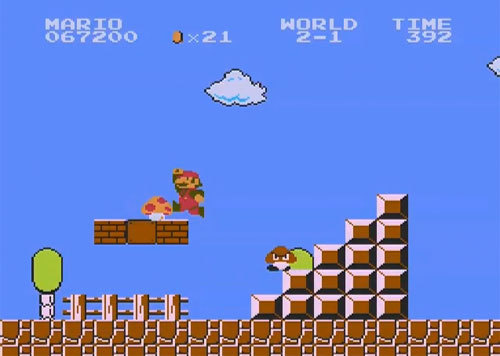

=========================
Extension 2.5: Mario
=========================

Authors:

* Nathan Vogt
* Elie Schramm
* Dotun Taiwo

`Mario <https://en.wikipedia.org/wiki/Mario_(franchise)>`_, created in 1981 by Nintendo, is a classic video game starring the fictional Italian character Mario. In the assignment,  loops printing hashtags will be used to build the block mountains as seen in the picture. 

* Find and open the Java class Mario in the ``nonexam.mario`` package.
* Your program must first prompt the user for two integer inputs using ``Scanner``. These must be requested in the following order:

	``size``: What is the size of the mountain? In the picture above, the mountain has size 5 because there are 5 levels of squares, and the widest part of the mountain, at its bottom, is also 5 squares. A mountain will always be a square structure containing size×size elements, some of which are hashtags (#) and some of which are blanks.
	
	``pattern``: We will use an integer in the range 1 to 4 to indicate which pattern your program should produce. In the picture above, pattern 1 is shown. The other patterns are explained below

* Your program then prints the mountain of the specified size and pattern.

1. Mario runs from left to right. Create a mountain that he would have to climb, as shown in the example for a size 5 mountain.

::

	    #
	   ##
	  ###
	 ####
	#####

2. Create a mountain that he would descend, as shown below for a size 3 mountain.

::

	#  
	## 
	###

3. Make a mountain that resembles pattern 1, but flipped upside-down. Below is shown a size 7 mountain for this pattern.

::

	#######
	 ######
	  #####
	   ####
	    ###
	     ##
	      #

4. Make a mountain that resembles pattern 2, but flipped upside down. Below is shown a size 4 mountain for this pattern.
	
::

	#### 
	###  
	##   
	#  

Try running your Mario class and test yourself using various sizes (say, 1 to 10) and patterns (always an integer from 1 to 4).

Note that this problem requires careful use of `whitespace <https://en.wikipedia.org/wiki/Whitespace_character>`_ which are the characters like tab, space, and newlines that don't show anything in the foreground color.  On a white background whitespace characters don't have a visible impact, but they do move the cursor to a new location. In particular:

* Avoid extra spaces at the beginning of lines

* Avoid using more ``ln`` s than needed.  For example, if the size is 5 there should be exactly 5 things that move to a new line (5 ``println`` s or 5 ``\n`` s or a mix of the two.)

