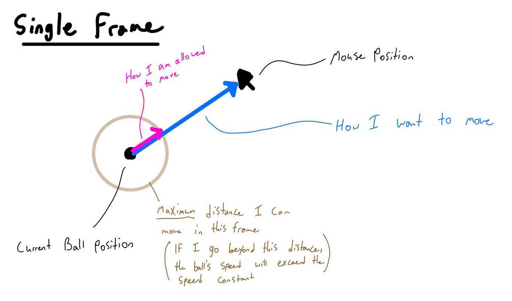

============
Extension 5.1: Chase, The Mouse (6 points)
============

Authors
============

* Arman Guerra
* `Dennis Cosgrove <http://www.cs.wustl.edu/~cosgroved/>`_

A Story
============

Chase, the Mouse, was standing still on the Standard Draw template one day, thinking about the meaning of life. All of a sudden, out of nowhere, a ball began to follow Chase. No matter where Chase went the ball would follow and pester Chase until he moved again. You will be writing the code for the ball.

Procedure
============

1. Open ``ChaseTheMouse.java`` in the ``mousechaser`` package in the src folder.  You will have to complete several methods for this extension. 

2. Note ``X`` and ``Y``.

::
	private static final int X = 0;
	private static final int Y = 1;

	Use these to index the X and Y coordinates of the points represented as double arrays of length 2 in this extension.

2. Complete ``getMousePosition()``.

	Return a created array of length 2 with the array item at the X index assigned to `StdDraw.mouseX() <https://introcs.cs.princeton.edu/java/stdlib/javadoc/StdDraw.html#mouseX-->`_ and the array item at the Y index assigned to `StdDraw.mouseY() <https://introcs.cs.princeton.edu/java/stdlib/javadoc/StdDraw.html#mouseY-->`_.

3. Run ``MousePositionDebugApp`` as a Java Application.

.. youtube:: UEen1LteE9E
	:align: center

4. Complete ``drawBall(location, radius)``

5. Run ``DrawBallDebugApp`` as a Java Application.

.. youtube:: a8z_2wBpA38
	:align: center

6. Complete ``square(v)``.

	**Question:** What is a simple way to implement squaring a number without calling ``Math.pow(x,y)``?

7. Run ``ChaseTheMouseTestSuite`` as a JUnit Test.

.. youtube:: M_vEO6g-S_w
	:align: center
	
	Make any necessary edits to square until the Square test cases have all passed.

8. Complete ``calculateMagnitude(xy)``.

	`Vector Magnitude on Wolfram MathWorld <https://mathworld.wolfram.com/VectorMagnitude.html>`_

	**Note:** vector ``xy`` only has 2 dimensions.

9. Run ``ChaseTheMouseTestSuite``.

	Make any necessary edits to calculateMagnitude until the CalculateMagnitude test cases have all passed.

10. Complete ``add(a, b)``.

	`Vector Addition on Wolfram MathWorld <https://mathworld.wolfram.com/VectorAddition.html>`_

	**Note:** vectors ``a`` and ``b`` only have 2 dimensions.

11. Run ``ChaseTheMouseTestSuite``.

	Make any necessary edits to add until the Add test cases have all passed.

12. Complete ``subtract(a, b)``.

	`Vector Subtraction on Wolfram MathWorld <https://mathworld.wolfram.com/VectorSubtraction.html>`_

	**Note:** vectors ``a`` and ``b`` only have 2 dimensions.

13. Run ``ChaseTheMouseTestSuite``.

	Make any necessary edits to subtract until the Subtract test cases have all passed.

14. Complete ``scalarMultiply(xy, scalar)``.

	`Scalar Multiplication on Wolfram MathWorld <https://mathworld.wolfram.com/ScalarMultiplication.html>`_

	`Scalar Multiplication on Wikipedia <https://en.wikipedia.org/wiki/Scalar_multiplication>`_

	**Note:** vector ``xy`` only has 2 dimensions.

15. Run ``ChaseTheMouseTestSuite``.

	Make any necessary edits to scalarMultiply until the ScalarMultiply test cases have all passed.

16. Watch this video on Real Time Animation

.. youtube:: nhDt5HVOzVM
	:align: center

17. Complete ``calculateNextPosition(currentBallPosition, mousePosition, speed, deltaTime)``.

	**Tip:** Use the utility methods you have writen above to implement this method.

	Rather than the speed of the animation being dependent on how fast our loop executes, we are going to keep track of our time to ensure that our ball always moves at a constant speed.

	Below are two different images which attempt to convey what is required:

18. Run ``ChaseTheMouseTestSuite``.

	``assertArrayEquals(contentsMessage, expected, actual, 0.0001);``

	Make any necessary edits to calculateNextPosition until the CalculateNextPosition test cases have all passed.

19. Run ``CalculateNextPositionDebugApp`` as a Java Application.

.. youtube:: WkbEaztb7W0
	:align: center

20. Complete ``chaseTheMouse()``

	**Tip:** Use ``Timing.getCurrentTimeInSeconds()`` to... well... get the current time in seconds.  Within your loop, keep track of the previous time to calculate the change in time since the previous iteration of the loop.

21. Run ``ChaseTheMouse`` as a Java Application