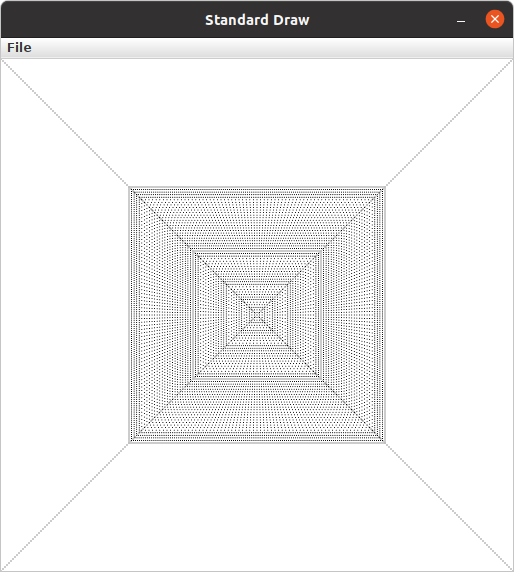

============
Extension 6.1: Divine Lines (4 points)
============

Authors
============

* `Ron K. Cytron <http://www.cs.wustl.edu/~cytron/>`_
* Ken Goldman

In the ``src`` folder, find and open the ``divinelines`` package and the ``Lines`` class contained therein.    The ``main`` method is provided, and it calls the method ``drawLine``, which you must complete.

Do not change the parameters or return type of the ``drawLine`` method!  You are welcome to define *other* methods in the ``Lines`` class if you wish, but the ``drawLine`` method's signature (the number and types of its parameters and its return type) must be preserved as you do your work.

Your task is to devise an algorithm for drawing a line from (x1,y1) to (x2,y2) using *recursion*. It may take you some time to think about how to do that, but once you see the recursive nature of drawing a line, you will probably need only a few lines of code to accomplish this task.

.. youtube:: 1qW7dKsgzIQ
	:align: center

Please take note of the following guidelines, as you will not receive credit unless your solution follows the rules of this assignment:

* The code given to you will perform a test of your ``drawLine`` when you run it as a Java Application.
* If you want to draw lines interactively using your solution, then run the ``InteractiveLines`` class as a Java Application.
* Do not use ``StdDraw.line`` to do any of your work!
* The only methods you are allowed to use from ``StdDraw`` are ``point``, ``setPenRadius``, and ``setPenColor``.  A pen radius of 0.002 works well (looks solid and isn't too slow).

	> This means you must draw your line one point at a time.

* Some students approach this problem by computing the slope of the line and then incrementally trying to draw pieces of it using recursion. That approach comes to grief for vertical lines, which have infinite slope.  There is a much easier and satisfying way to solve this problem, but you have to think about it.

	Do **not** compute or use the slope of the line in your approach.  We will not count the extension if you do that.  Instead, think recursively about how a line is constructed.

 When you are done it should look like this:
 

