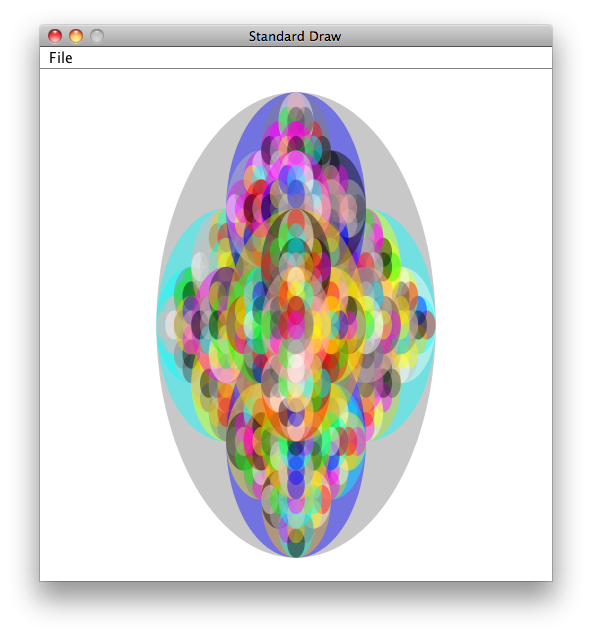

============
Extension 6.3: Flower Power (4 points)
============

Authors
============

* `Ron K. Cytron <http://www.cs.wustl.edu/~cytron/>`_
* Ken Goldman

A video demonstrating my solution can be found `here <6.03/flower.mp4>`_.

In the ``extensions`` folder open the ``recursivepatterns`` package.  The following classes found there, and described in greater detail below, must be completed for this extension:

* ``TransparentColor`` 

* ``Flower``

The ultimate goal is to complete the ``flower`` method of the ``Flower`` class so that it draws an image similar to the one shown below:

The colors shown in the above image are somewhat *transparent*, so that the color of an ellipse is allowed to bleed through the ellipse above it.

You can proceed by working on either class first.  However, if you postpone ``TransparentColor``, you will see solid colors in your flower until you have completed that class.

Representing Color in Java
------------------

Opaque `Color <https://docs.oracle.com/en/java/javase/13/docs/api/java.desktop/java/awt/Color.html>`_s in Java are made up of 3 components: red, green, and blue (hence the term *RGB*). The color of a pixel is made up of a combination of the *intensities* of each of red, green, and blue components. In computing it's common for intensities range from 0 (meaning none of that color is present) to 255 (meaning as much as possible of that color is present). (The reason for 255 is the maximum is because computer use binary numbers. The "why" isn't important not, but keep in mind that color values go from 0 to 255)

You create a new color for a pixel with the code:

``new Color(redValue, greenValue, blueValue)``

where ``redValue`` is the intensity (an integer between 0 and 255) of red, ``greenValue`` is the intensity of green, and ``blueValue`` is the intensity of blue.

For example, you get the color black with ``new Color (0,0,0)`` (0 intensity for all colors). You get red with ``new Color (255,0,0)`` (highest intensity for red, 0 intensity for green and blue).

As is the case with most color models, Java's `Color <https://docs.oracle.com/en/java/javase/13/docs/api/java.desktop/java/awt/Color.html>`_ objects are allowed to have a degree of transparency.

The ``transparentColor`` method, as provided to you, ignores the ``alpha`` parameter and returns the color provided as input.

You must change this behavior so that the color returned as the same red, green, and blue components as the provided color, but with the specified transparency.

Java makes this easy, because there is a constructor for `Color <https://docs.oracle.com/en/java/javase/13/docs/api/java.desktop/java/awt/Color.html#%3Cinit%3E(int,int,int,int)>`_  
that does the job. This task is given to you primarily to acquaint you with the process of looking through JavaDoc documentation to find a class or method you need.

The 4 components of a `Color <https://docs.oracle.com/en/java/javase/13/docs/api/java.desktop/java/awt/Color.html>`_instance can be accessed via these methods:
 - color.`getRed() <https://docs.oracle.com/en/java/javase/13/docs/api/java.desktop/java/awt/Color.html#getRed()>`_
 - color.`getGreen() <https://docs.oracle.com/en/java/javase/13/docs/api/java.desktop/java/awt/Color.html#getGreen()>`_
 - color.`getBlue() <https://docs.oracle.com/en/java/javase/13/docs/api/java.desktop/java/awt/Color.html#getBlue()>`_
 - color.`getAlpha() <https://docs.oracle.com/en/java/javase/13/docs/api/java.desktop/java/awt/Color.html#getAlpha()>`_

Follow the instructions provided in the ``TransparentColor`` source code.

Before moving on, test your code by running ``TransparentColor`` as a Java Application.  You should see the colors solid at the upper right of the drawing window, and blended (more transparent) at the lower left.

``Flower`` : Your task here is to complete the ``flower`` method, whose parameters are described in the JavaDoc for the method.  Some useful guildines follow:

* The ``StdDraw`` class offers a ``filledEllipse`` method, but you must set the color before calling it.
* You should choose a random color for each ellipse you draw, and you are provided a ``palette`` of ``Color`` objects as input to your ``flower`` method.

If necessary, review the material in the text and slides that discusses how to pick a random integer.  You would use that integer to index the ``palette`` array.

* You must find the substructure in the flower pattern.  To help with this, the following diagram shows the locations of each ellipse within a given level of recursion:

* Analyze the above diagrams to infer the area taken up by each sub-ellipse that you must draw.

* Remember that the ``StdDraw`` coordinate system has (0,0) at the  lower-left, and (1,1) at the upper right.

* Remember that ``StdDraw`` shapes take a center as their primary coordinate, and use half-widths and half-lengths for dimensions.
