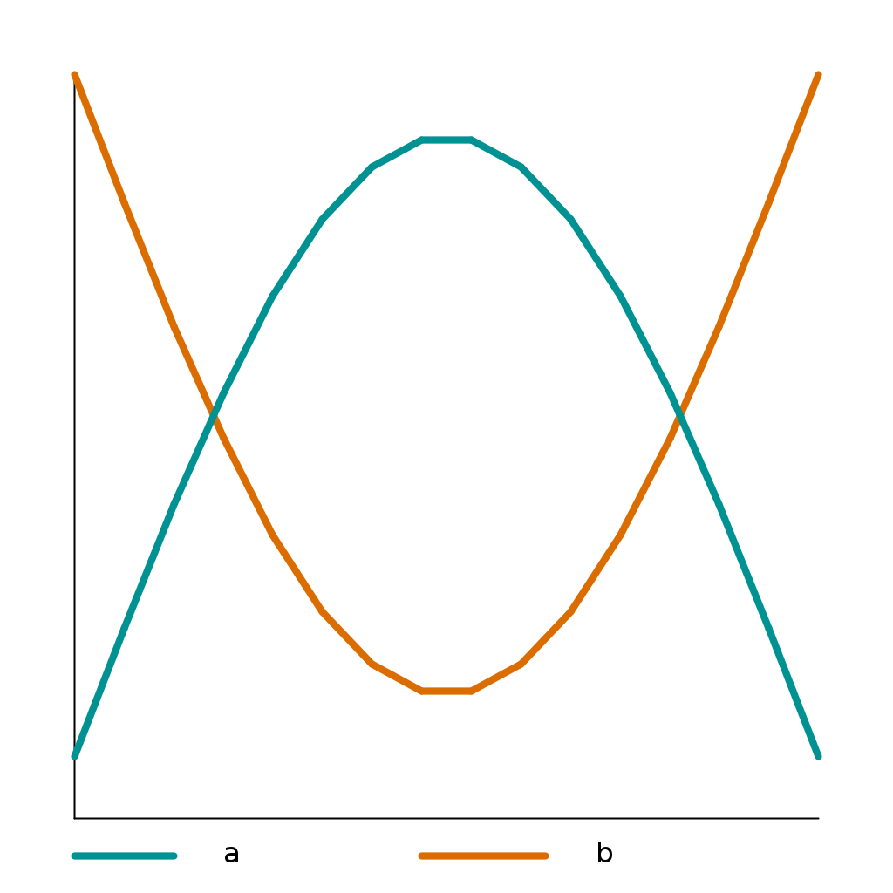
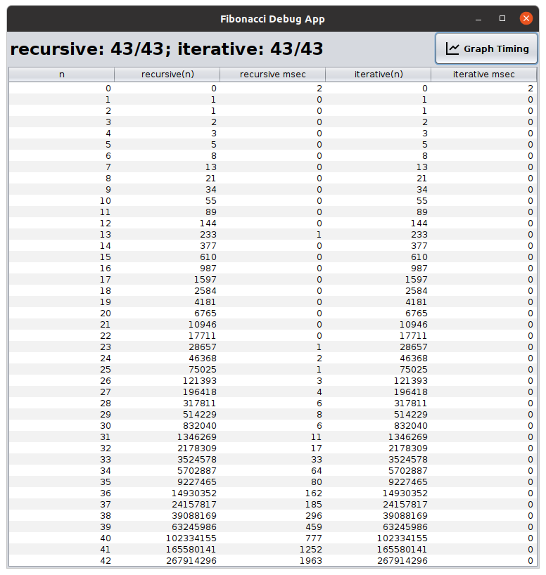
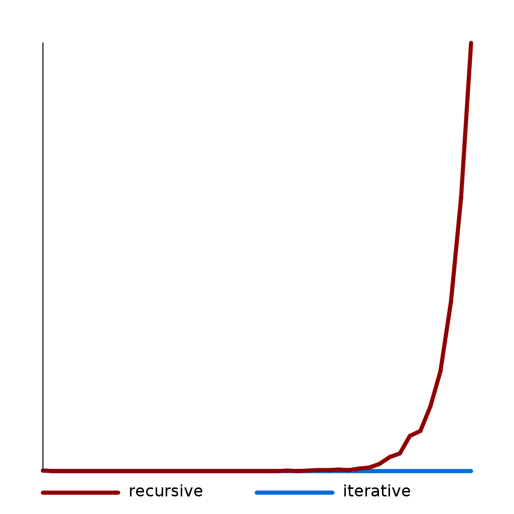

============
Extension 6.4: Fibonacci Recursively and Iteratively (3 points)
============

Authors
============

* `Ron K. Cytron <http://www.cs.wustl.edu/~cytron/>`_
* `Dennis Cosgrove <http://www.cs.wustl.edu/~cosgroved/>`_

Background
============

The `Fibonacci Sequence <http://en.wikipedia.org/wiki/Fibonacci_number>`_ is an interesting pattern of numbers that occurs in a lot of unusual places. The first number in the sequence is 0, the second number is 1, the third is also 1, the fourth is 2, the fifth is 3, the sixth is 5, ....   

Each new number in this sequence is just the sum of the previous two numbers.  This can be expressed via a recursive equation, like:

.. math:: fib(n) = \begin{cases}
      0, & \text{if}\ n=0 \\
      1, & \text{if}\ n=1, \\
      fib(n-1)+ fib(n-2), & \text{otherwise}
    \end{cases}

Since this formula is recursive, it can easily be represented in recursive computer code. 

In this extension, you will compare the running time of that recursive formulation with an iterative formulation of the same function.

Why Fibonacci?
------------------

.. youtube:: SjSHVDfXHQ4
	:align: center

Procedure
============

You should see a ``fibonacci`` package in the ``src`` folder.  You will modify ``Graph.java`` and ``Fibonacci.java``.  They are both already in the respository.

Graph
------------------

- Complete ``graphLine(ys)`` in ``Graph``.

  **Note:** You should assume that StdDraw's x and y scales are configured to allow the index of the array to map to the x-coordinate and the value at that index to be the y-coordinate.

.. youtube:: 9psWz0hAhmw

- Run ``Graph`` as a Java Application.

Fibonacci
------------------

1. You will complete two methods in the ``Fibonacci`` class: ``recursive(n)`` and ``iterative(n)``.  You will complete ``graphLine(ys)`` in the ``Graph`` class. 

2. Complete the ``recursive`` method in ``Fibonacci`` so that it returns the *n* :sup:`th` fibonacci number using recursion.  (You can base it on the recursive equation provided above.)

3. Run ``FibonacciTestSuite`` until you have passed all of the recursive portion.

4. Complete the ``iterative`` method in ``Fibonacci`` so that it computes the same function, but iteratively.
	As a hint, you will need two variables that represent the  *(n-1)* :sup:th and *(n-2)* :sup:`th` values of the sequence.  Adding those together produces the *n* :sup:`th`term.  The variables' values are then shifted prior to the next iteration.

5. Run ``FibonacciTestSuite`` until you have passed all of the tests.

Testing
============

To run the suite of unit tests, right (control) click on ``FibonacciTestSuite`` and choose ``Run as...`` then ``JUnit Test``.  

Timing
============

Run ``FibonacciDebugApp`` to get timing information on your algorithms.

.. youtube:: qJ3EBKyOsoQ

Press the **Graph Timing** button to see your ``graphLine(ys)`` method draw the timing data.

