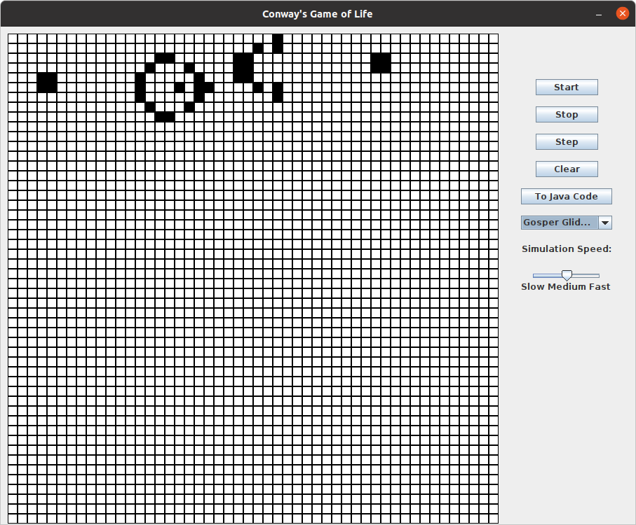

============
Extension 7.1: Conways Game of Life (6 points)
============

Authors
============

* Arman Guerra
* `Dennis Cosgrove <http://www.cs.wustl.edu/~cosgroved/>`_

`Conway's Game of Life <http://en.wikipedia.org/wiki/Conway%27s_Game_of_Life>`_ is a biology simulation that was developed by British mathematician John Horton Conway in 1970. It is designed to simulate cellular automation by creating an initial configuration of living and dead cells and observing how they evolve. Many interesting patterns have developed from the origins of the original simulation --- producing patterns that pulsate, exist into infinity, and even glide like spaceships.

The rules of Conway's Game of life are as follows:

* If a living cell has fewer than two living neighbors, it dies of loneliness
* If a living cell has more than three living neighbors it dies of overcrowding
* If a living cell has two or three neighbors, it continues to live
* If a dead cell has exactly three living neighbors, it is resurrected by friendship

This set of rules can end up making some very interesting patterns. Below we have drawn out some of the patterns that are made by cells in Conway\'s game of life. Dead cells are represented by white squares, living cells are represented by black squares.

Sample Patterns
============

Block 
------------------

.. image:: http://upload.wikimedia.org/wikipedia/commons/thumb/9/96/Game_of_life_block_with_border.svg/200px-Game_of_life_block_with_border.svg.png

Beehive
------------------

.. image:: http://upload.wikimedia.org/wikipedia/commons/thumb/6/67/Game_of_life_beehive.svg/200px-Game_of_life_beehive.svg.png)

Loaf
------------------

.. image:: http://upload.wikimedia.org/wikipedia/commons/thumb/f/f4/Game_of_life_loaf.svg/200px-Game_of_life_loaf.svg.png)

Boat 
------------------

.. image:: http://upload.wikimedia.org/wikipedia/commons/thumb/7/7f/Game_of_life_boat.svg/200px-Game_of_life_boat.svg.png)

Blinker 
------------------

.. image:: http://upload.wikimedia.org/wikipedia/commons/9/95/Game_of_life_blinker.gif)

Toad
------------------

.. image:: http://upload.wikimedia.org/wikipedia/commons/1/12/Game_of_life_toad.gif)

Beacon 
------------------

.. image:: http://upload.wikimedia.org/wikipedia/commons/1/1c/Game_of_life_beacon.gif)

Pulsar
------------------

.. image:: http://upload.wikimedia.org/wikipedia/commons/0/07/Game_of_life_pulsar.gif)

Glider 
------------------

.. image:: http://upload.wikimedia.org/wikipedia/commons/f/f2/Game_of_life_animated_glider.gif)

Lightweight Spaceship
------------------

.. image:: http://upload.wikimedia.org/wikipedia/commons/3/37/Game_of_life_animated_LWSS.gif)

Gosper Glider Gun
------------------

.. image:: http://upload.wikimedia.org/wikipedia/commons/thumb/e/e0/Game_of_life_glider_gun.svg/500px-Game_of_life_glider_gun.svg.png)

Block-Laying Switch Engine
------------------

.. image:: http://upload.wikimedia.org/wikipedia/commons/thumb/7/72/Game_of_life_infinite1.svg/200px-Game_of_life_infinite1.svg.png)

Directions
============

In this extension you will be responsible for building the simulator portion of Conway's Game of Life (henceforth known as Conway, or Life). You can then run the game on your own patterns or on patterns that we provide.

The code for this work can be found ``conway`` package. The ``Conway`` class is where you will be doing all of your work. ``ConwayTestSuite`` is the tester for ``Conway`` and ``ConwayApp`` is what you will run when your code is finished to actually see your work happen. The ``ConwayApp`` class creates a GUI, `Graphical User Interface <http://en.wikipedia.org/wiki/Graphical_user_interface>`_, which allows you to see cells dying and coming back to life. Open ``Conway``. You will complete the following methods:

1. A ``public Conway(int rows, int cols)`` constructor that specifies the dimensions of the Conway board.

2. A ``public int getRows()`` method, that is an accessor.

3. A ``public int getColumns()`` method, that is an accessor 

4. A ``public void setAlive(boolean isAlive, int row, int col)`` method that takes in a row and a column, and whether that cell should be currently alive or dead

	> You must come up with a data type that stores values in rows an columns to represent all of the cells. There are multiple ways to store this information, but think carefully about which one you choose. Some choices will make remaining work easier than others. (Hint: This method's signature may suggest an appropriate representation)

5. An ``public boolean isAlive(int row, int col)`` method, which returns whether the cell at that specific row and column is alive or dead. If the row and column are out of the bounds of that Conway object, then return ``false``.

	> Run ``ConwayTestSuite``.  Your code should now pass the ``AliveTestSuite`` portion of the ``ConwayTestSuite``.

6. A ``public void clear()`` method, which sets every cell in the Conway object to dead.

	> Run ``ConwayTestSuite``.  Your code should now pass the ``ClearTestSuite`` portion of the ``ConwayTestSuite``.

7. A ``public int countLivingNeighbors(int row, int col)`` method, which considers the cell at a certain row and column, and returns the number of living neighbors that it has.

	The neighbors of a certain cell are considered to be the eight cells that are surrounding it. Your ``isAlive()`` should help you with this.

	> Run ``ConwayTestSuite``.  Your code should now pass the ``CountTestSuite`` portion of the ``ConwayTestSuite``.

8. A ``public void step()`` method, which executes a generation of life (one step of the simulation of life). Take all of the current cells and determine whether or not they will be alive in the next generation using the rules given above.

	> You need to be careful how you update.  The updates should not impact the outcome of another update.  For example, when you figure out if the cell in row 0 and column 0 will be alive, this new value should not impact the computation for the surrounding rows.  They should be based on the original value of row 0 column 0 before it's next value was computed.   (Hint: It may be helpful to use an additional array or an entirely new ``Conway`` object)
	
	> For instance, say cell A and cell B both alive and are neighbors. If you determine that A will be dead in the next generation, and you kill it, when you go to count the number of living neighbors of B, it will have fewer living neighbors now than it should. 

	> Run ``ConwayTestSuite``.  Your code should now pass the ``StepTestSuite`` portion of the ``ConwayTestSuite``.

9. Once you have completed all the methods, you can run ``ConwayDebugApp.java`` to run a simulation.  
    1.  You'll want to select an item to simulate from the drop down menu on the right of the window.
    2.  Then click on ``Start`` to run a simulation. (Notice that each item in the menu corresponds to methods that were done for you already or that you haven't finished, like ``blinker()`` and ``yourDesignOne()``.  You can explore this more in another Extension) 

**Note:** you can click on the cells to change the state of the board in the ``ConwayDebugApp`` to create interesting patterns.

Hint: If you need to debug your code the visual interface allows you to take one step at a time. If the game is not working, use the debugger or print information helpful to diagnosing the problems you see.

10. You will be working with "code generation" that will create code that could be pasted into the ``yourDesignOne()`` and ``yourDesignTwo()`` methods in ``Patterns.java``. This approach allows you to stop a particularly interesting simulation and "save" the values at the instant you stopped the simulation.  You can then use this "saved" data to restore the simulation and run it from that point. 

For example, the ``Toad`` code is captured already:

.. image:: http://upload.wikimedia.org/wikipedia/commons/1/12/Game_of_life_toad.gif

but if you were to generate code for it using ``toJavaCode()`` the result would look something like this:

::
		conway.clear();
		conway.setAlive(true, 2, 2);
		conway.setAlive(true, 2, 3);
		conway.setAlive(true, 2, 4);
		conway.setAlive(true, 3, 1);
		conway.setAlive(true, 3, 2);
		conway.setAlive(true, 3, 3);

When you run ``ConwayDebugApp.java`` and click on the ``To Java Code`` button the ``JavaCodeUtils.toJavaCode(conway)`` method will be called.  You will need to implement this method.  You should return a String with enough data to represent the method calls needed to re-build the current board.

**Note:** the contents of the String returned from ``toJavaCode(conway)`` will both be printed to the console and placed on the system clipboard for easy pasting into ``myDesignOne()`` or ``myDesignTwo()``.

The code text you return can then be pasted into either ``myDesignOne()`` or ``myDesignTwo()`` in ``Patterns.java``.  When you re-run ``ConwayDebugApp.java`` and select the corresponding item from the drop-down menu (for example: ``Your Design One``) it should reproduce the board as it looked when generated and pasted the code previously. 

Once you have ``toJavaCode()`` working, use this new tool to capture your own Conway patterns in ``myDesignOne()`` and ``myDesignTwo()``.  For credit for this extension, these patterns should be both intriguing and potentially time-consuming to generate by hand.  When done, ``toJavaCode(conway)`` should work and both ``myDesignOne()`` and ``myDesignTwo()`` should create interesting patterns.

Testing
============

``ConwayTestSuite``

To Demo
============

Your code must pass all of the unit tests, and the GUI should work, and be able to display cells interacting with each other.