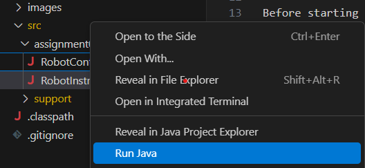

=====================
Assignment 0: Robot
=====================

Objective
================

The assignment is intended to make sure that you've completed the setup materials necessary for the course, and get you some practice with writing code.

Assignment Setup
================

Before starting this assignment it is expected that you have completed the `software setup <software.html>`_ for the course as well as `Studio 0 <studio.html>`_

To create your repository `go here <https://classroom.github.com/a/lpurJI29>`_.  Then follow the same accept/import process described in `the setup instructions <software.html>`_.

Using Java to Control a Robot
================

Your project should now be open in VS Code. You should the files and folders on the left side of the screen (if not, click the "Explorer" button in the top left corner).

2. Expand the ``src`` folder.
3. Expand the ``assignment0`` folder and click on the `RobotInstructions.java` file. You should see the code open in a new tab.
4. Run the **other** file, the ``RobotController.java``, by **right-clicking on it**, and selecting ``Run Java``:



5. A new window should now open. Click on the ``Go`` button and you'll see a simulated robot draw on the screen.  It's merely following the instructions that are being given in the ``RobotInstructions.java`` that you opened.
6. Close the robot simulation window (*not* VS Code).
7. Review the contents of ``RobotInstructions.java``, which should be shown in VS Code. Make some changes:

   1. Change the ``robot.forward(60);`` to ```robot.forward(120);``.  What do you think the robot will do differently?  
   2. Run the robot simulator again.
   3. Did the robot do what you expected?  
   4. What if you removed the line that now says ``robot.forward(120);`` and replaced it with two lines that each say ``robot.forward(60);``?  Before making any change be sure to close the simulator. Then make your changes and hit the `Play` button to see their impact.
   5. Try removing a semi-colon (``;``).  VS Code should add red indicators in several places indicating there are errors with the file.  These are helpful cues that you should pay attention to in larger programs.
   6. Try running the program with errors.  What other indicators do you see that there is a problem with the code? 
   7. Put the semi-colon back in and correct the errors.
   8. Add a new, empty line after a ``robot.forward`` line.  Type ``robot`` then ``.``.  Notice that when you hit the ``.`` a window appears with a list of options.  VS Code is letting you know the choice available to you here.  This is one benefit of using an IDE like VS Code.
   9.  Experiment with changing / adding other commands.

Working With Code
-----------------

Now that you understand how to use VS Code to modify and run the program, spend some time making the robot draw a picture of a flower or a tree (maybe a leaf?). Be creative!

2. Commit and push your work
================

Follow the instructions from `studio 0 <studio.html>`_ to commit and push your work.

After doing `Commit and Push` always check your work on GitHub.  Go to `the course page on GitHub <https://github.com/wustlcse131sp23>`_, select the respository for the assignment, and then review the individual files.  

3. Course Information
================

Review the course site on `Canvas <https://wustl.instructure.com/courses/158279>`_.  Make sure you review:

1. `Course Policies <https://wustl.instructure.com/courses/158279/pages/course-policies>`_
2. Know where to go to find `Office Hours <https://wustl.instructure.com/courses/158279/pages/office-hours>`_, which will be posted by the second week of class.
3. Know how to `browse the content and prepare for modules <https://wustl.instructure.com/courses/158279>`_.