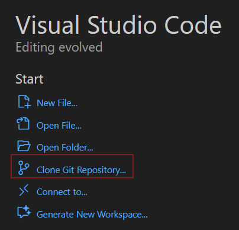
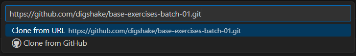
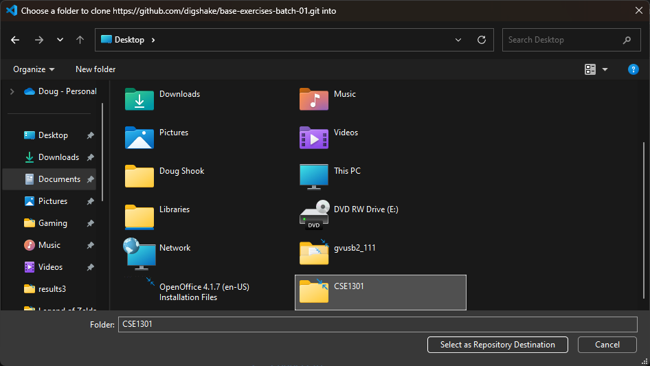
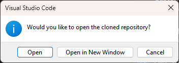
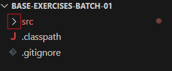
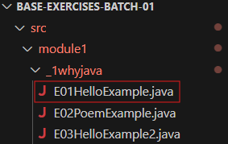
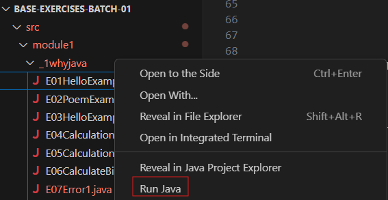
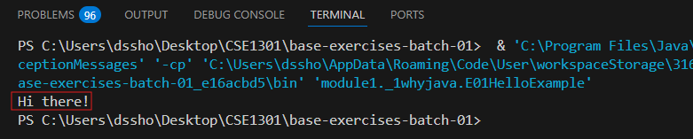

=====================
Software Installation and Setup
=====================

This page will walk you through installing the software that you will need for the course. We'll do the following:

1. Install software we'll be using for the class.
2. Create  an account on `GitHub <https://github.com>`_, which is a cloud service we use to distribute and collect your work. That account, or one you already have, must be tied to your WUSTL email address.
3. "Accept" a repository for "Exercises." You will use this repository throughout the first part of the semester.
4. Add the assignment to VS Code, which is the `IDE <https://code.visualstudio.com/docs/java/java-tutorial>`_ we use for this course.
5. Use VS Code, which you installed in the first step, on the code in the repository, which you got in the third and fourth steps.

1. Installing Software
=====================

We will be using a language called `Java <https://en.wikipedia.org/wiki/Java_(programming_language)>`_ to create and run code on our computers. Before you can execute Java code, you need to install two pieces of software:

* Professional software developers use an `Integrated Development Environment (IDE) <http://en.wikipedia.org/wiki/Integrated_development_environment>`_.  As the name describes, it's used to develop computer programs and it integrates several different useful features:
   
   * It includes a smart editor that helps you create and work with computer code.
   * It can work with other programs called `compilers <http://en.wikipedia.org/wiki/Compiler>`_. Compilers translate the program you write into something the computer can run.  The JDK that you installed included a compiler.
   * Other handy features, like support for `debugging assistance <http://en.wikipedia.org/wiki/Debugger>`_.

   We'll be using `VS Code with Java Estensions <https://code.visualstudio.com/docs/java/java-tutorial>`_, a popular IDE that supports programming in Java that can be used with many languages and will be used in many other computer science courses. Do not feel as though you need to complete the entire tutorial (though doing it later would be great practice!). The most important thing for you to do right now is to install the appropriate coding pack for your computer:

   .. image:: resources/lab0/Install_Coding_Pack.png

2. Create a GitHub Account
=====================

We will be using software called `Git <http://git-scm.com/>`_ for "version control".  `Version control systems (VCS) <https://en.wikipedia.org/wiki/Version_control>`_ are a way of life in the modern software-development industry.  They track how team members have changed a project, and they are particularly useful for collaborative projects, where multiple developers work concurrently on the same body of code.

We use the site `GitHub <https://github.com>`_ to distribute and collect course work.  GitHub is a place that hosts git repositories.  You need to create a (free) account.  Please visit `GitHub <https://github.com>`_ and sign up for an account.  Please use your WUSTL email address, although you can add multiple e-mail addresses.  If you already have an account, please be sure to add your WUSTL email. `These directions <https://help.github.com/en/github/setting-up-and-managing-your-github-user-account/adding-an-email-address-to-your-github-account>`_ describe how to add additional email addresses.

3. Accepting the exercises
=====================

For each major type of course work you will need to generate a repository on GitHub.  You'll do so by clicking on a link and "accepting" an assignment.  Click `HERE <https://classroom.github.com/a/dy-e5SbT>`_ to accept the repository containing the first batch of course exercises ***and follow along with the instructions below***.

2. Select the button to accept the exercises:

.. image:: resources/lab0/GHClassroom_2_AcceptAssignment.png

3. After accepting the exercises, a copy of the exercise materials, called a repository, will be made for you.  Click on the link to view the repository:

.. image:: resources/lab0/GHClassroom_3_AssignmentLink.png

4. Finally, click on `Code` and then click the  "Copy to Clipboard" button to make a copy of the URI shown.

.. image:: resources/lab0/GHClassroom_4_CloneLink.png

You've now created an exercises repository and have the URI.  You'll need to do steps 2-4 many times this semester.

4. Add the exercises to VS Code
=====================

1. Open or go to VS Code.
2. From the Welcome tab, select "Clone git repository..."

If you do not see the Welcome tab, go to ``Help -> Welcome``.

3. Paste the git URI into the box and hit return:

4. The following screen asks where you would like to store the files on your computer. It is **highly recommended** to create a new folder for all of your work in this class. The process for doing this differs between Windows and Mac, so please ask if you need help. Once you have created a folder, select it and click the "Select as Repository Destination" button, as shown:

5. The next window asks if you want to open the project. If you wish to have multiple projects open at once, you can select "Open in new Window", otherwise just select "Open."

5. Using VS Code on the exercises
=====================

To verify that your installation worked correctly, use VS Code to complete the following steps and run a simple program:

1. Expand the ``src`` folder by clicking the ">".

2. Expand the ``module1`` folder.
3. Expand the ``_1whyjava`` folder and double click on the ``E01HelloExample.java`` file:

   You should see the code for a simple Java program that prints out a greeting appear in a new tab.

4. Run the file by **right-clicking on it**, and selecting ``Run Java``:

5. Once the program has finished running you should see a simple welcome message in the terminal at the bottom of the window, this indicates that the installation was successful!

   Do not worry if your terminal looks a bit different from the one pictured above or the person sitting next to you. The important thing is that the message was displayed.

6. Cloning only needs to happen once per assignment!
====================================

You will need to complete the cloning process once per studio or assignment. After it has been cloned, you can revisit that assignment at any time by going to ``File -> Open Folder...`` in VS Code, and then navigating to the folder that contains the assignment you wish to work on (which is hopefully in the folder that you created specifically for this class!).