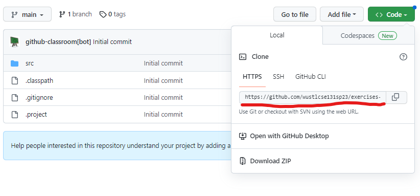
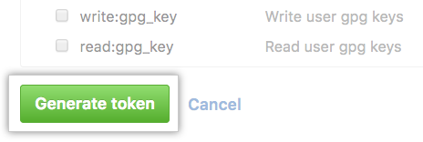
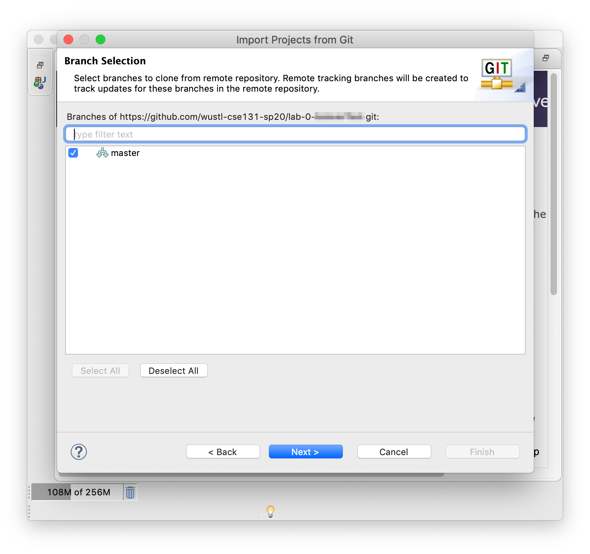

=====================
Software Installation and Setup
=====================

This page will walk you through installing the software that you will need for the course. We'll do the following:

1. Install software we'll be using for the class.
2. Create  an account on `GitHub <https://github.com>`_, which is a cloud service we use to distribute and collect your work. That account, or one you already have, must be tied to your WUSTL email address.
3. "Accept" a repository for "Exercises." You will use this repository throughout the semester.
4. Add the assignment to Eclipse, which is the `IDE <https://eclipse.org>`_ we use for this course.
5. Use Eclipse, which you installed in the first step, on the code in the repository, which you got in the third and fourth steps.

1. Installing Software
=====================

We will be using a language called `Java <https://en.wikipedia.org/wiki/Java_(programming_language)>`_ to create and run code on our computers. Before you can execute Java code, you need to install two pieces of software:
1. The `Java Development Kit (JDK) <https://www.oracle.com/technetwork/java/javase/downloads/>`_. The JDK includes a whole bunch of Java tools that are used to assist in the creation and execution of Java programs. Visit the link above to download the JDK and install it on your computer.
2. Professional software developers use an `Integrated Development Environment (IDE) <http://en.wikipedia.org/wiki/Integrated_development_environment>`_.  As the name describes, it's used to develop computer programs and it integrates several different useful features:
   * It includes a smart editor that helps you create and work with computer code.
   * It can work with other programs called `compilers <http://en.wikipedia.org/wiki/Compiler>`_. Compilers translate the program you write into something the computer can run.  The JDK that you installed included a compiler.
   * Other handy features, like support for `debugging assistance <http://en.wikipedia.org/wiki/Debugger>`_.
We'll be using `Eclipse <https://www.eclipse.org/downloads/>`_, a popular IDE that supports programming in Java.  

2. Create a GitHub Account
=====================

We will be using software called `Git <http://git-scm.com/>`_ for "version control".  `Version control systems (VCS) <https://en.wikipedia.org/wiki/Version_control>`_ are a way of life in the modern software-development industry.  They track how team members have changed a project, and they are particularly useful for collaborative projects, where multiple developers work concurrently on the same body of code.

We use the site `GitHub <https://github.com>`_ to distribute and collect course work.  GitHub is a place that hosts git repositories.  You need to create a (free) account.  Please visit `GitHub <https://github.com>`_ and sign up for an account.  Please use your WUSTL email address, although you can add multiple e-mail addresses.  If you already have an account, please be sure to add your WUSTL email. `These directions <https://help.github.com/en/github/setting-up-and-managing-your-github-user-account/adding-an-email-address-to-your-github-account>`_ describe how to add additional email addresses.

3. Accepting the exercises
=====================

For each major type of course work you will need to generate a repository on GitHub.  You'll do so by clicking on a link and "accepting" an assignment.  Click `HERE <https://classroom.github.com/a/QVNyoZKd>`_ to accept the repository containing the first batch of course exercises ***and follow along with the instructions below***.

2. Select the button to accept the exercises:

.. image:: resources/lab0/GHClassroom_2_AcceptAssignment.png

3. After accepting the exercises, a copy of the exercise materials, called a repository, will be made for you.  Click on the link to view the repository:

4. Finally, 1) click on `Clone or Download` and then 2) click the  "Copy to Clipboard" button to make a copy of the URI shown.

You've now created an exercises repository and have the URI.  You'll need to do steps 2-4 many times this semester.

4. Add the exercises to Eclipse
=====================

1. Open or go to Eclipse.
2. Go to the ``File`` menu and select ``Import``

3. Expand the ``Git`` options and select ``Projects from Git``

4. Select ``Clone URI`` and then hit ``Next``

5. The URI you copied when you created the assignment should automatically be used (if not, go back to GitHub, copy the full URI for cloning the repository, and paste it in here).  Hit ``Next``

6. Before you enter your username and password, you need to create a personal access token. To do this, click `here <https://github.com/settings/tokens/new>`_ to be taken back to the GitHub page for creating tokens.
7. For the note, enter what this token will be used for

8. Make sure the expiration is set to "never". 

.. image:: resources/lab0/GHToken_7_expiration.png

9. Select the `repo` checkbox. The other checkboxes can be left unchecked

10. Click the ``Generate token`` button

11. Returning to Eclipse, enter your **GitHub** username and the token you just generated as the password.  *Do not use your GitHub password.* (You should select ``Store in Secure Store`` so that you don't have to re-enter your password every time you accept an assignment). Select ``Log in`` when ready

12. Select ``Next`` on the Branch Selection window.

13. Select ``Next`` on the Local Destination window.

14. Select ``Import existing Eclipse Project`` and select ``Next`` on the Project Wizard.

15. Select ``Finish``.

5. Using Eclipse on the exercises
=====================

To verify that your installation worked correctly, use eclipse to complete the following steps and run a simple program:

1. Expand the ``exercises`` folder.
2. Expand the ``src`` folder.
3. Expand the ``module1._whyjava`` folder and double click on the ``HelloExample.java`` file.

4. Run the file by **right-clicking on it**, selecting ``Run As``, and then selecting ``Java Application``, like:

5. Once the program has finished running you should see a simple welcome message at the bottom of the window, this indicates that the installation was successful!

