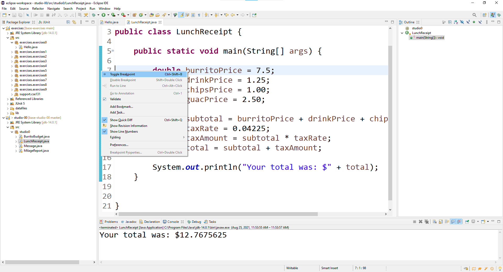
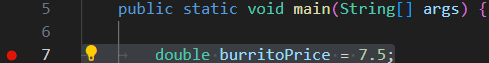
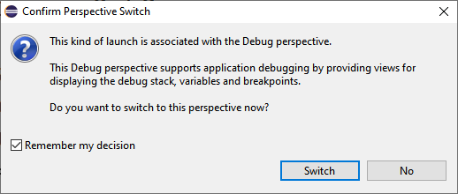
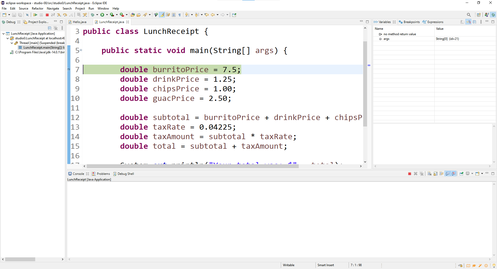
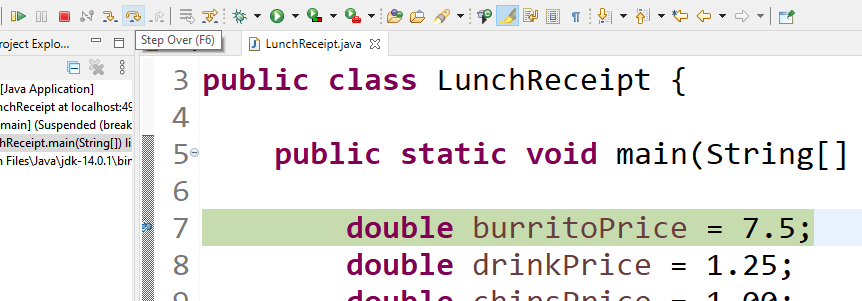
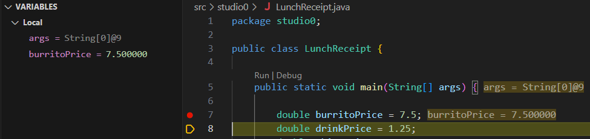
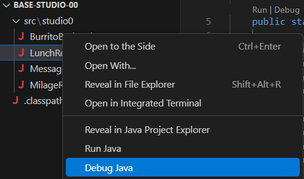
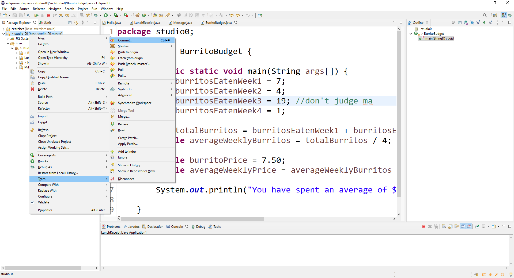
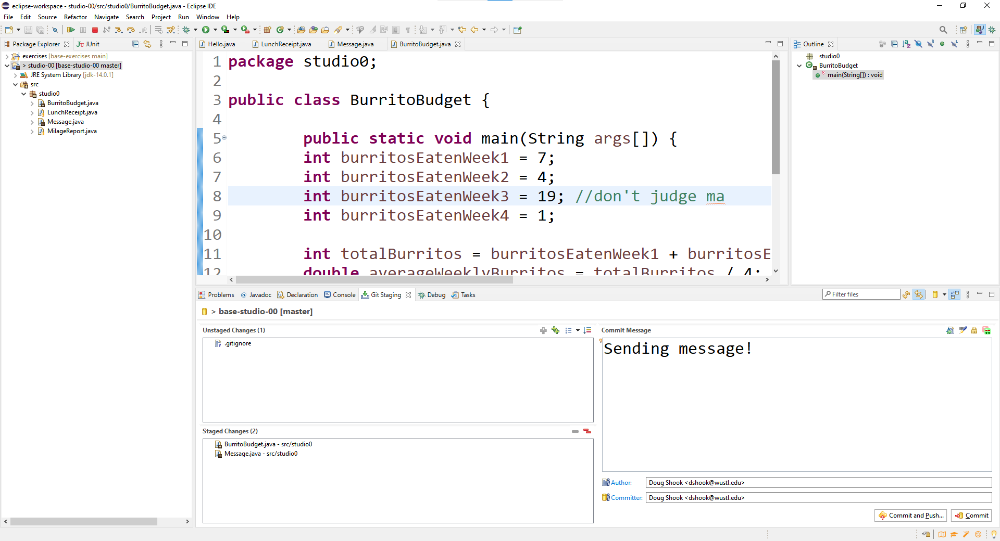
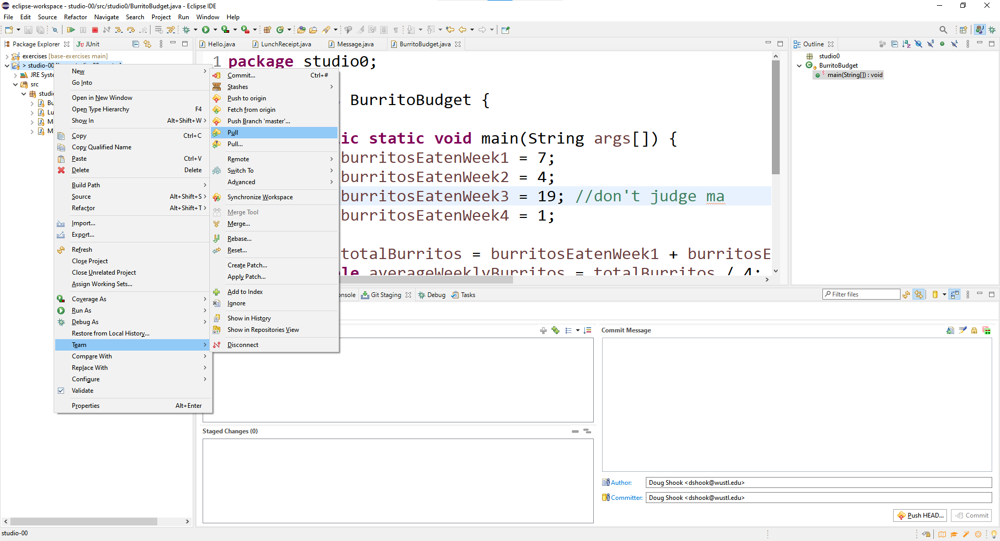

=====================
Studio 0: Getting Started
=====================

**Studio activities should not be started before class!  Come to the session and work on the activity with other students!**  

Studio Sessions Overview
=====================

Studios are a chance to work with other students to learn course material by actively trying to solve problems.  

1. Form a group of 2-3 students and find a TA or instructor to work with (TAs/instructors may be working with 2-3 groups at a time)
2. Credit is based on good faith participation:
   * The goal is to explore the module's course topics by working on the given activity.  Credit is not based on any specific solution nor do you even need to complete the activity.
   * Credit is given based on your active participation in the activity. If you arrive late (more than 15 minutes) or don't actively contribute to the work, you will not be given credit.
   * Be a constructive member of group:
     * Prepare in advance by completing the prep materials.
     * Ask questions and discuss topics.  Try to make sure your entire group completely understands the topics being used.
     * Be polite and respectful of your group members!
     * Each member of your team is responsible for ensuring that all members completely understand your work and the topics being used.

Studio Setup and Procedure
=====================

* You'll need to complete the `software setup <software.html>`_ before you can work on this Studio, so do that first if you haven't already.
* All but one member of your group should have this web page open so you can follow along and see the instructions as you work.
* Plan to have one computer at which your team does its work (usually using Eclipse). Initially, one of you will be in charge of typing at that computer.
* Throughout the studio you should trade who is in charge of the keyboard.

**READ THE FOLLOWING FULLY BEFORE PROCEEDING**

1. Have **one person** in your group create a new team by clicking `here <https://classroom.github.com/a/lyKiz6hi>`_ and going to the `OR Create a new team` box at the bottom of the page.
   1. The team name should include the last names of all your group members.  For example, if Xia and Smith are working together, the team name should be something like "XiaSmith".
2. **After the team is created**, all *other* members of your team should click on the same link and follow the instructions to join the team.  
   1. **Be careful to join the right team!**  You won't be able to change teams yourself and will have to contact instructors if there's a problem.
   2. **Be sure everyone else joins the team!**  If grades don't get entered correctly we will use the team to help verify credit for a particular studio.  
3. Finally, one person should import the studio repository into Eclipse, as described in `the software setup <setup.html>`_
   * All team members will have access to the work pushed to GitHub.  Be sure to `Commit and Push` at the end of the day so everyone can refer back to the work later as needed.

Studio 0: Some Helpful Tools
=====================

* You will examine a series of simple Java programs, and run each program
to ensure it performs its task correctly.
* The files for this program are in the ``src/studio0`` package of the repository you loaded.
* To run a program just open the file in a tab and click on the green "Play" button on the menu.  The program in the active/open tab will run.

``LunchReceipt``
--------------

Take a look at the supplied program. It tells a story about an event that took place. Go through the story with your group and make sure that you understand what is going on.

Run the program and notice the output. How do we know that this output is correct?

One way we could verify the output is to get out some paper or a calculator and crunch the numbers ourselves. For simple computations this works well but when things get complicated, we'd really like a way to verify that each step of the computation is correct.

Fortunately, Eclipse provides a way for us to walk through the code in this way, using a process called  **debugging**.

To start debugging we first need to set a **breakpoint**. A breakpoint is the point in our code where we want the computer to stop and show us what's going on. For now, go ahead and set a breakpoint on the first line of the program, line 7. You can do this by double clicking the side of the text editor and selecting **Toggle Breakpoint**:

Once the breakpoint is set you should see a blue circle next to the line:

Instead of clicking the green circle to run the program, this time click the button with the little green bug (it is right next to the green circle). This is how you run a program in debug mode. You will see a window like this pop-up:

Make sure the checkbox is checked and select **Switch**. You'll see the window change into a new configuration that looks something like this:

This is called the **debug perspective**. The program is currently paused on line 7, where the breakpoint was set. We can see this by the fact that the line is highlighted in green.

The other big change is that on the right side of the screen there is a window called **variables**. It is mostly empty, but eventually we'd like it to be able to show us what's going on with our program as it runs.

In order to proceed, click the **Step Over** button at the top of the window:

Notice what happened: the next line is now highlighted and a new entry appeared in the variables window in the top right:

Line 7 of the program was executed and we can now see the results. The variable was created and we can see its value in the variables window. Continue pressing the step over button to walk through the program, paying attention as the values appear.

Some other tips:

* If you ever wish to stop running or debugging a program, click the red square button at the top.
* If you wish to ignore the breakpoints and run the entire program, you can click the green circle. Breakpoints and debugging will only work if you start the program with the little bug button.

Once you feel as though you are comfortable navigating through the program, you'll want to return Eclipse back to its original perspective (called the **Java** perspective). You can do this by clicking the **Java** button in the top right corner:

``MileageReport``
--------------

**Switch who is "entering code"; Everyone should have equal time entering code**

Open this file and run the program (if you can't find the file, remember to switch back to the **Java Perspective**).

Hmm...something doesn't seem quite right about this one. There's a mistake somewhere in this code. You might be able to find the error by simple inspection (it is not a particularly complicated mistake), however take the time to set a breakpoint and walk through the code. Can you use the debugger to see exactly when the mistake happens? How does this mistake affect the lines of code that are executed afterwards?

Once you have found the mistake, see if you can fix it before moving on to the next problem.

``BurritoBudget``
--------------

**Switch who is "entering code"; Everyone should have equal time entering code**

Open the file and run the program. Uh oh, looks like there might be another error here. Again, use the debugger to see if you can figure out where the problem occurs and do what you can to fix it.

``Message``
--------------

**For this part of the studio you will need at least two computers with the repository loaded. Have every group member load the studio repository into Eclipse using the above instructions before proceeding.**

As mentioned in `the software setup <setup.html>`_, we'll be using Git this semester. Git is a common tool that allows programmers to collaborate more effectively. You'll need to use git on every assignment in this course to submit your work, so the next part of the studio aims to show you how to do some basic Git operations.

First, select one person and have them type a message to your group mates in the `Message.java` file. In order for this message to be made available to the other group members, it must first be **pushed** to the GitHub website. To do this, right click the project then select **Team -> Commit..**

A **Git Staging** tab will show up on the bottom of the screen. Make sure that the files you want to send to your team mates are in the "Staged Changes" area, and type a message into the box that explains what you are doing. Once you are ready, click the **Commit and Push...** button.

Press the **Preview** button then the push button. You should hopefully see a window that looks like this, which indicates success:

.. image:: resources/lab0/Eclipse_Pushed.png

At this point you should visit the GitHub page for your repository (that you created in the very beginning of the studio). If you navigate to the Message.java file, you should see the changes that you made. The other members of your group still don't have the message on their computers though, so let's take care of that next.

In order to receive the message on their computers, the other group members will have to perfom a **pull**. To do this, right click the project then select **Team -> Pull**

Once the pull operation has completed, you should see the message that was sent!

Have each team member take turns sending messages to the others using the above process. **Be careful** about multiple people sending messages at the same time. If two people try to send a message at the same time it is possible to end up with a **conflict**. While conflicts sound scary they are pretty common and easy to resolve. If you run into one be sure to flag down an instructor or a TA so we can walk you through it.

Demo (get credit for your) your work:
=====================

**Commit and Push** your work.  Be sure that any file you worked on is updated on `GitHub <https://github.com/>`_.

To get participation credit for your work talk to the TA you've been working with and complete the demo/review process. Be prepared to show them the work that you have done and answer their questions about it!