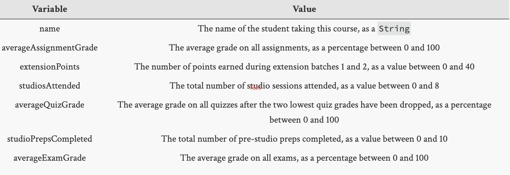

=====================
Assignment 1: Grade Calculator
=====================

Assignment Setup
================

To create your repository `go here <https://classroom.github.com/a/82JQvlTV>`_. Then follow the same accept/import process described in `the setup instructions <../Module0-Introduction/software.html>`_.

Grade Calculator
================

In this assignment you develop a tool that can help you compute your final course grade. By completing this assignment you demonstrate that you can:

* Create a Java class on your own

* Arrange for the class to take inputs of interest

* Compute output values of interest

* Produce meaningful output based on your computations

* Work with Java expressions

Procedure
================

1. Create a ``GradeCalculator`` Java class in the ``assignment01`` package (``assignment01`` is in the ``src`` folder).

   1. The ``assignment01`` package is currently empty, but don’t let that bother you. Right (control) click on ``assignment01`` and create a new class.

   2. Type the name ``GradeCalculator`` in the ``Name:`` field (please use ``GradeCalculator``, capitalized and spelled correctly)

   3. Click the box that says ``public static void main(String[] args)``

   4. Click the ``Finish`` button, which will create the new file

2. Arrange for your program to accept the following inputs:

You should be thinking about the data types you would use to represent each of the above items. We tell you that the **name** is a ``String``, but what about the other inputs? Use the range of values given to inspire your thinking. To accept the inputs use the same code we used in studio.

Just after the ``main`` method declaration, you should have the line:

``Scanner in = new Scanner(System.in);``

It shows an error that can be fixed via the approach described in Studio 1.

After that, you should initialize your inputs using code modeled after the code you read and wrote in studio — see the section on ``Average.``

Eclipse will help you out here: If you have typed ``in``. and Eclipse will show you the possible ways of continuing. For example, ``nextInt()`` is one way to keep going. That call will accept an integer that the user types in. It is probably a good idea to print out a prompt first so that your users will know what to type.

3. Arrange for your program to produce output such as the following:

``CSE131 Grade for: Doug Shook``

``Average assignment grade: 85.4%``

``Weighted assignment grade (out of 30): 25.62%``

``Number of extension points: 37``

``Weighted extension grade (out of 10): 9.25%``

``Number of studios attended: 7``

``Weighted studio grade (out of 10): 8.75%``

``Average quiz grade: 97.3%``

``Weighted quiz grade (out of 2): 1.95%``

``Studio preps completed: 10``

``Weighted studio prep grade (out of 2): 2.0%``

``Average exam grade: 93.5%``

``Weighted exam grade (out of 45): 42.07%``
	
``Completed course review: false``

``Total Grade: 90.64%``

.. _Notes:

Notes
================

* This point may seem obscure, but on a computer, multiplying by 0.1 is not the same result as dividing by 10.0. The reason is that 10.0 can be represented exactly, but 0.1, not so well. You may get mathematical surprises if you multiply by 0.1 instead of dividing by 10.0.

* Don’t try to write this all at once. Instead, build one piece at a time and test it. This will make it easier to figure out what’s going wrong when your program doesn’t work as you expect. (This is called `incremental development <https://en.wikipedia.org/wiki/Incremental_build_model>`_ and this approach will serve you well all semester).

* You’ll need the weights for each course component, which can be found on the `course policies page <https://wustl.instructure.com/courses/69918/pages/course-policies>`_.

* Pay close attention to how you compute the final grade in the course. Rounded numbers look better when printed, but which values will lead to a more accurate result?

* For this program you can assume that your users will always type in values within ranges given in the tables above, but in reality there’s nothing stopping someone from typing in values that don’t make sense. In the next module we’ll see how we can address this problem.

* Note that we allow you to miss two studios without penalty. So while there are 10 studios in total, attending more than 8 studios does not have an effect on the overall course grade. Or another way to think about it: two studios are dropped, leading to a maximum studio score of 8.

* The percentages shown for the weighted grades have at most two digits of precision after the decimal point. You should print percentages in exactly this format. You do not have to round any values that are entered through ``ArgsProcessor`` even though they may appear rounded in our example. It’ll take some thought, but it can be done using things that have been covered: ``int`` operations, ``double`` operations, casting, and ``Math.round(..)``. (You are not allowed to use ``printf`` or other functions you may find that would accomplish this task. You have to figure out how to do it using what you have learned in this module.)

* Review how the the random-number generator, ``Math.random()`` works. Define a ``boolean courseReview`` and assign its value by comparing a random number with ``0.5``.

* Your strings can include the character sequences ``\t`` and ``\n,`` within the double quotes, which have the effect of inserting a tab and a newline, respectively. A *tab* will cause the output to shift right to a predetermined position. A *newline* will end the current line of output and begin a new line.

Prepare for demoing your work by trying out various combinations of grade values and making sure that your program computes them correctly.

Submitting your work
================

To submit your work come to office hours or class on an “Assignment day” and sign up for a demo via `wustl-cse.help <https://wustl-cse.help/>`_.