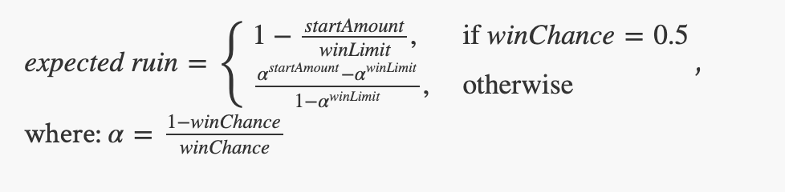

===============================
Studio 2: Gambler's Ruin and Pi
===============================

**Studio activities should not be started before class! Come to the session and work on the activity with other students!**

Studio Setup and Procedure
==========================

1. Form a group of 2-3 students. Make sure you know who your TA is.
2. Choose one group member to open VS Code. They will be in charge of typing code for the first part of the studio. You will rotate this responsibility throughout the studio, but the initial person will have to be comfortable with others typing on their computer.
3. Everyone else, open the studio instructions on your own computer.
4. Choose one group member to complete the following instructions:

	1. Click `here <https://classroom.github.com/a/M_MiWHxw>`_
	2. Go to the bottom of the page, where it says `OR Create a new team`.
	3. Enter your group's last names and "Studio2" into the text field. Ex: "XiaSmith-Studio2"
	4. Click the button to create the team.
5. After the team is created, all other members of your team should complete the following instructions:

	1. Click `here <https://classroom.github.com/a/M_MiWHxw>`_
	2. Find the team your groupmate created.
	3. Join the team. 
	
	* If you join the wrong team, you will need to contact one of the instructors or Head TAs to fix it.
6. VS Code person: import the studio repository as described in `the software setup <setup.html>`_

Problem 1: Gambler's Ruin
=========================

In this assignment you’ll simulate a version of `Gambler’s Ruin <https://en.wikipedia.org/wiki/Gambler%27s_ruin>`_ problem. The problem is:

* You’re a gambler and you’ll be visiting a casino.

* You start the day with some money (a start amount).

* Over the course of the day you repeatedly play a game, which has known odds of winning called the “win chance”.

  * Each time you play, you win or lose $1 based on the “win chance”. So the money you have increases or decreases by 1 after each game.

* If the amount of money you have ever hits a “win limit,” you stop gambling and leave the casino for the day. It was a successful day!

* If you lose all of your money you also stop gambling. The day was a ruin!

As a professional gambler, you’ll actually think about doing this every day. You know that some days will be a success and some days you’ll ruin. You also have observed a lot of games at a lot of casinos and will know the “win chance” of each. You still have some difficult questions you eventually want to answer:

* What “win limit” should you pick?

* What percentage of time will you “ruin”?

There are two major ways to solve these questions:

1. By simulating many gambling sessions and using the results to estimate the probability of “ruin” for a particular combination of “win limit” and “win chance”

2. By using a mathematical formula that computes the “expected” answer. This is the value you should find if you ran your simulation an infinite number of times.

In this assignment you’ll do both (and compare the simulated value to the expected one)

Procedure
---------

1. With your repository open create a new class in the ``studio2`` package:

   * Right click on the package name in which you want to define the new class. In this case, use ``studio2``.

   * Select ``New Java File -> Class``

   * Pick the name ``Ruin`` for this class. Java style dictates that its classes should begin with a capital letter!

   * Add in the code for main: ``public static void main(String[] args)`` 

2. Have your program accept the following inputs (If you don’t remember how to do this look at code from a previous studio):

.. csv-table:: 
   :header: "VariableName", "Concept"
   :widths: 20, 40

   "startAmount", "The amount of money that you start with"
   "winChance", "The win probability, or the probability that you win a single play"
   "winLimit", "If you reach this amount of money you had a successful day and leave"

3. Start by simulating a single day. Write code that will repeatedly play until “success” or “ruin”

   * Include ``println`` statements showing each win or loss. You’ll remove these soon, but they help you verify that your code is working (*Remember this trick!*)

4. Test your work! Incremental testing is vital to your success in this course. Coming up with creative ways to test your work will be immensely helpful.

   *  Brainstorm ways to ensure successful days or ruined days. For example, can you pick values that ensure you win all plays and leave the casino after 5 plays? What about values that ensure you lose after 8 plays? If your code doesn’t behave as expected, carefully review it and ask for help if you can’t find the cause of the problem.

   * How would you expect it to behave if you started with $500, will stop at when you have $1000 (or ruin), and the game has a 50% (0.5) chance of winning?

5. Conceptual checkpoint 1: How is the syntax different between a for loop and a while loop? When can you use a for loop but can't use a while loop?

6. Choose a new group member to type.

7. Now we want to answer the question posed earlier: If you play every day, what percentage of time will you “ruin”? Start in adding and prompting for a new variable:

.. csv-table:: 
   :header: "VariableName", "Concept"
   :widths: 20, 40

   "totalSimulations", "The number of day's you'll simulate"

8. Then use this value to repeatedly play an entire day’s casino visit (the work you’ve already done) until you succeed or ruin (``totalSimulations`` times).

9. Remove any ``println()`` statements for individual plays and instead print:

   1. The simulation (day) number

   2. the number of plays that took place that day, and

   3. whether the day ended in success or ruin

**(Get this part working before proceeding: See the examples values and corresponding sample output below. It should look somewhat like this, but since you’re using random values the results may not be identical.)**

10. Conceptual checkpoint 2: Do you need an else statement whenever you write an if statement?

11. Choose a new group member to type.

12. Compute an estimate of the “ruin rate” (percentage of simulations resulting in ruin) and print it after all the rounds of simulation.

13. Finally, calculate and print the “expected ruin rate” in your program using the following formula:

Example Run
=====================

Here’s an example run. You should try to match this format. 

Given:

.. csv-table:: 
   :header: "VariableName", "Concept"
   :widths: 20, 40

   "startAmount", "2"
   "winChance", ".7"
   "winLimit", "10"
   "totalSimulations", "500"

Example Output
=====================

``Simulation 1: 16 LOSE``

``Simulation 2: 10 WIN``

``Simulation 3: 6 LOSE``

``Simulation 4: 8 WIN``

``...``

``Simulation 499: 28 WIN``

``Simulation 500: 18 WIN``

``Losses: 90 Simulations: 500``

``Ruin Rate from Simulation: 0.18 Expected Ruin Rate: 0.18350278772959913``

Final Testing & Review
======================

* Come up with creative ways to test your code until you’re confident it’s working as expected. Talk to your TA/instructor and try to justify that all you calculations are correct.

* Review the development process. The order of your work was chosen carefully to increase the likelihood you’d be successful. Review the steps and try to identify strategies that may help you be successful in other course work. Again, share with your TA/instructor.

Problem 2:Computing Pi by throwing darts
========================================

Computer scientists often use `simulation <http://en.wikipedia.org/wiki/Simulation>`_ as a means of modeling, understanding, and predicting real-world phenomena.

Your group is auditioning for the show `Survivor <http://en.wikipedia.org/wiki/Survivor_%28TV_series%29>`_ by proving your group’s ability to compute `Pi <http://en.wikipedia.org/wiki/Pi>`_ using only the materials at hand, as follows:

* A unit-square dart board (1 meter by 1 meter). Unit-square dart boards are astoundingly resilient in plane crashes and yours is nicely intact.

* Some darts, suitable for throwing at the dart board.

* A 1 meter string and a stylus, suitable for inscribing an arc of a circle in your unit-square dartboard. That is, you can pin the string to a corner of the dartboard and use the stylus with the other end to draw an arc of a circle on the dartboard.

* A dart-throwing expert. However, since the plane crash, the expert is left with the (uncanny) ability to throw darts that always land somewhere, uniformly and randomly, within the unit-square dart board. While the thrower never misses the unit square, the darts sometimes land within the inscribed circle, sometimes not.

As a group, develop an approach for computing `Pi <http://en.wikipedia.org/wiki/Pi>`_ based on the above materials.

Hint: Think about the chances of where a dart lands. Can you develop a formula for it? How could you estimate this chance via a simulation?

1. Create a new class called ``Pi`` in your ``studio2`` package

2. Implement your approach using iteration:

   * You will need to simulate a random dart thrower. Think carefully about how you can use `Math.random() <https://docs.oracle.com/en/java/javase/13/docs/api/java.base/java/lang/Math.html#random()>`_ to generate a random dart throw.

   * You’ll need to know where the dart hit. You may find the  `Math.sqrt() <https://docs.oracle.com/en/java/javase/13/docs/api/java.base/java/lang/Math.html#sqrt(double)>`_ function helpful.

3. Investigate and discuss how well your technique computes `Pi`_.

4. As before, discuss ways to test and validate your work.

Further investigations
======================

If you have time, pick one or both of the following:

1. Investigate the fairness of the `Math.random() <https://docs.oracle.com/en/java/javase/13/docs/api/java.base/java/lang/Math.html#random()>`_ method.

   1. What properties should a random number possess?

   2. How can you measure the fairness of a random number generator?

   3. Implement some tests and discuss your results amongst yourselves and other groups.

2. There are other ways of `computing Pi <http://en.wikipedia.org/wiki/Pi>`_. Try some of these and study their effectiveness in terms of the number of iterations you use.

Demo (get credit for your work)
===============================

**Commit and Push your work.** Be sure that any file you worked on is updated on `GitHub <https://github.com/>`_. This way the other members of your team will be able to access the code that you worked on.

To get participation credit for your work talk to the TA you’ve been working with and complete the demo/review process. Be prepared to show them the work that you have done and answer their questions about it!
