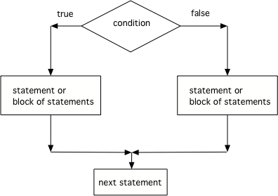

.. qnum::
   :prefix: 3-3-
   :start: 1
   
.. highlight:: java
   :linenothreshold: 4
   
   
.. |CodingEx| image:: ../../_static/codingExercise.png
    :width: 30px
    :align: middle
    :alt: coding exercise
    
    
.. |Exercise| image:: ../../_static/exercise.png
    :width: 35
    :align: middle
    :alt: exercise
    
    
.. |Groupwork| image:: ../../_static/groupwork.png
    :width: 35
    :align: middle
    :alt: groupwork
    
Two-way Selection: if-else Statements
======================================

What if you want to pick between two possibilities?  If you are trying to decide between a couple of things to do, you might flip a coin and do one thing if it lands as heads and another if it is tails.  In programming, you can use the **if** keyword followed by a statement or block of statements and then the **else** keyword also followed by a statement or block of statements.  

   
.. code-block:: java

    // A block if/else statement    
    if (boolean expression)  
    {
       statement1;
       statement2;
    }
    else 
    {
       do other statement;
       and another one;
    }

The following flowchart demonstrates that if the condition (the boolean expression) is true, one block of statements is executed, but if the condition is false, a different block of statements inside the else clause is executed.  

    Figure 1: The order that statements execute in a conditional with 2 options: if and else

.. note::

   The else will only execute if the condition is false.   

If/else statements can also be used with relational operators and numbers like below. If your code has an if/else statement, you need to test it with 2 test-cases to make sure that both parts of the code work.

|CodingEx| **Coding Exercise**

   
   Run the ``E01DriversTest`` program to see what it prints  when the variable age is set to the value 18. 
   Change the input value to 18 and then run it again to see the result of the print 
   statement in the else part. 
   Can you change the if-statement to indicate that you can get a license at age 16 instead of 18? 
   Use 2 test cases for the value of age to test your code to see the results of both print statements. 
  

Recall the ``E02TestMidterm`` program from the previous lesson that outputs a message based on whether you passed the midterm.  The program uses two separate ``if`` statements to decide what to print.
Notice the second condition is simply the negation of the first condition. Rewrite this code to use a single if-else rather than two separate if statements.
   

.. parsonsprob:: q3_3_2
   :numbered: left
   :practice: T
   :adaptive:
   :noindent:
   
   The following program should print out "x is even" if the remainder of x divided by 2 is 0 and "x is odd" otherwise, but the code is mixed up.   Drag the blocks from the left and place them in the correct order on the right.  Click on <i>Check Me</i> to see if you are right. 
   -----
   public class EvenOrOdd
   {
   =====
      public static void main(String[] args)
      {
      =====
        int x = 92;
        =====
        if (x % 2 == 0) 
        =====
        {
            System.out.println("x is even");
        }
            =====    
        else
        =====
        {
            System.out.println("x is odd");
        }
            =====
       }
       =====
    }

|CodingEx| **Coding Exercise**

   
   Try the ``E03ScoreTest`` program. Add an else statement to the if statement that prints out "Good job!" if the score is greater than 9. Change the value of score to test it. Can you change the boolean test to only print out "Good job" if the score is greater than 20?
  

Nested Ifs and Dangling Else
----------------------------

If statements can be nested inside other if statements. Sometimes with nested ifs we find a **dangling else** that could potentially belong to either if statement. The rule is that the else clause will always be a part of the closest if statement in the same block of code, regardless of indentation. 

.. code-block:: java

    // Nested if with dangling else
    if (boolean expression)
       if (boolean expression)
           statement1;
       else  // belongs to closest if
           statement2;
        
        
|CodingEx| **Coding Exercise**

   
   Try the ``E04DanglingElseTest`` program. Notice that the indentation does not matter. How could you get the else to belong to the first if statement?
  

You can use curly brackets { } to enclose a nested if and have the else clause belong to the the top level if clause like below:

.. code-block:: java

    // Nested if with dangling else
    if (boolean expression) 
    {
       if (boolean expression)
           statement1;
    }
    else  // belongs to first if
       statement2;

   
Summary
-------

- If statements can be followed by an associated **else** part to form a 2-way branch:

.. code-block:: java

    if (boolean expression) {
        Do statement;
    }
    else {
        Do other statement;
    }

- A two way selection (if/else) is written when there are two sets of statements: one to be executed when the Boolean condition is true, and another set for when the Boolean condition is false. 

- The body of the "if" statement is executed when the Boolean condition is true, and the body of the "else" is executed when the Boolean condition is false.

- Use 2 test-cases to find errors or validate results to try both branches of an if/else statement.

- The else statement attaches to the closest if statement. 