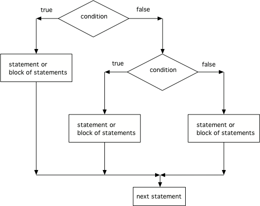

.. qnum::
   :prefix: 3-4-
   :start: 1
   
.. highlight:: java
   :linenothreshold: 4
   
   
.. |CodingEx| image:: ../../_static/codingExercise.png
    :width: 30px
    :align: middle
    :alt: coding exercise
    
    
.. |Exercise| image:: ../../_static/exercise.png
    :width: 35
    :align: middle
    :alt: exercise
    
    
.. |Groupwork| image:: ../../_static/groupwork.png
    :width: 35
    :align: middle
    :alt: groupwork
    
Multi-Selection: else-if Statements
===================================

Using if/else statements, you can even pick between 3 or more possibilites. Just add **else if** for each possibility after the first **if**, and **else** before the last possibility.  

.. code-block:: java

    // 3 way choice with else if
    if (boolean expression)
    {
       statement1;
    }
    else if (boolean expression)
    {
       statement2;
    }
    else  
    {
       statement3;
    }
    
|CodingEx| **Coding Exercise**

   
   Run the ``E01TestElseIf`` program and try changing the value of x to get each of the three possible lines in the conditional to print.
   
   
Here is a flowchart for a conditional with 3 options like in the code above. 

    Figure 1: The order that statements execute in a conditional with 3 options: if, else if, and else
    
.. note:: 

    Another way to handle 3 or more conditional cases is to use the ``switch`` and ``break`` 
    keywords.  For a tutorial on using switch see https://docs.oracle.com/javase/tutorial/java/nutsandbolts/switch.html.

|Exercise| **Check your understanding**

.. mchoice:: q3_4_1
   :practice: T
   :answer_a: x is negative
   :answer_b: x is zero
   :answer_c: x is positive
   :correct: a
   :feedback_a: When x is equal to -5 the condition of x < 0 is true. 
   :feedback_b: This will only print if x has been set to 0.  Has it?
   :feedback_c: This will only print if x is greater than zero.  Is it?

   What does the following code print when x has been set to -5?
   
   .. code-block:: java 

     if (x < 0) 
     {
        System.out.println("x is negative");
     }
     else if (x == 0) 
     {
        System.out.println("x is zero"); 
     }
     else
     {
        System.out.println("x is positive"); 
     }
     
.. mchoice:: q3_4_2
   :practice: T
   :answer_a: x is negative
   :answer_b: x is zero
   :answer_c: x is positive
   :correct: c
   :feedback_a: This will only print if x has been set to a number less than zero. Has it? 
   :feedback_b: This will only print if x has been set to 0.  Has it?
   :feedback_c: The first condition is false and x is not equal to zero so the else will execute.  

   What does the following code print when x has been set to 2000?
   
   .. code-block:: java 

     if (x < 0) 
     {
        System.out.println("x is negative");
     }
     else if (x == 0)
     {
        System.out.println("x is zero"); 
     }
     else
     {
        System.out.println("x is positive"); 
     }
     
.. mchoice:: q3_4_3
   :practice: T
   :answer_a: first quartile
   :answer_b: second quartile
   :answer_c: third quartile
   :answer_d: fourth quartile
   :correct: d
   :feedback_a: This will only print if x is less than 0.25.
   :feedback_b: This will only print if x is greater than or equal to 0.25 and less than 0.5.
   :feedback_c: The first only print if x is greater than or equal to 0.5 and less than 0.75.
   :feedback_d: This will print whenever x is greater than or equal to 0.75.

   What does the following code print when x has been set to .8?
   
   .. code-block:: java 

     if (x < .25) 
     {
         System.out.println("first quartile");
     }
     else if (x < .5) 
     {
         System.out.println("second quartile"); 
     }
     else if (x < .75) 
     {
         System.out.println("third quartile");
     }
     else 
     {
         System.out.println("fourth quartile");
     }
 
|CodingEx| **Coding Exercise**

   The else-if connection is necessary if you want to hook up conditionals together. In the ``E02IfDebug`` program, there are 4 separate if statements instead of the if-else-if pattern. Will this code print out the correct grade? First, trace through the code to see why it prints out the incorrect grade, using the debugger. Then, fix the code by adding in 3 else's to connect the if statements and see if it works.
  

     
  Finish the ``E03BatteryTest`` program so that it prints "Plug in your phone!" if the battery is below 50, "Unplug your phone!" if it is above 100, and "All okay!" otherwise. Change the battery value to test all 3 conditions.
 
   
Summary
--------

- A multi-way selection is written when there are a series of conditions with different statements for each condition. 

- Multi-way selection is performed using if-else-if statements such that exactly one section of code is executed based on the first condition that evaluates to true.

.. code-block:: java

    // 3 way choice with else if
    if (boolean expression)
    {
       statement1;
    }
    else if (boolean expression)
    { 
       statement2;
    }
    else  
    {
        statement3;
    }