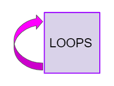
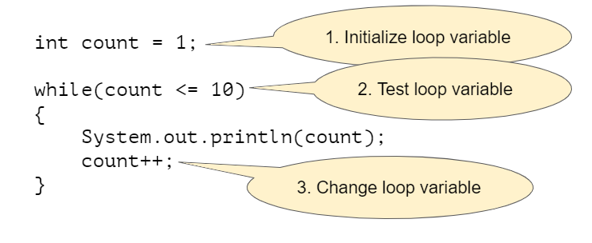

.. qnum::
   :prefix: 4-1-
   :start: 1 
   
.. |CodingEx| image:: ../../_static/codingExercise.png
    :width: 30px
    :align: middle
    :alt: coding exercise
    
    
.. |Exercise| image:: ../../_static/exercise.png
    :width: 35
    :align: middle
    :alt: exercise
    
    
.. |Groupwork| image:: ../../_static/groupwork.png
    :width: 35
    :align: middle
    :alt: groupwork

While Loops
============

..	index::
	single: loop
	single: looping
    single: iteration
	single: while
	pair: loop; while
	

    
When you play a song, you can set it to loop, which means that when it reaches the end it starts over at the beginning.  A **loop** in programming, also called **iteration** or **repetition**,  is a way to repeat one or more statements. If you didn't have loops to allow you to repeat code, your programs would get very long very quickly! Using a sequence of code, selection (ifs), and repetition (loops), the **control structures** in programming, you can construct an algorithm to solve almost any programming problem! 

A ``while`` loop executes the body of the loop as long as (or while) a Boolean condition is true.  When the condition is false, we exit the loop and continue with the statements that are after the body of the ``while`` loop.  If the condition is false the first time you check it, the body of the loop will not execute.  

Notice the ``while`` statement looks a lot like an ``if`` statement, but it runs more than once. The curly brackets { } are optional when there is just 1 statement following the condition, but required if there are more than 1 statement in the loop. Always using curly brackets is a good practice to follow.

.. code-block:: java

    // if statements just run once if the condition is true
    if (condition)
    {
        statements;
    }
    // while statements are repeated while the condition is true
    while (condition)
    {
      statements;
    }
    

Here's what the flow of control looks like in a Java while loop. 
Notice that while the condition is true, the loop body is repeated.

.. figure:: Figures/WhileLoopFlow.png
    :width: 250px
    :align: center
    :figclass: align-center

    Figure 1: Control Flow in a while Loop
    
The loop condition usually involves a **loop control variable** that controls when to stop the loop. The simplest loops are **counter-controlled loops** like below, where the loop variable is a counter that controls how many times to repeat the loop. There are 3 steps to writing a loop using this loop control variable as seen below in a loop that counts from 1 to 10.

    Figure 2: Three Steps of Writing a Loop

.. note:: 

    Remember these 3 steps to writing a loop:

    1. Initialize the loop variable (before the while loop)
    2. Test the loop variable (in the loop header)
    3. Change the loop variable (in the while loop body at the end)

|CodingEx| **Coding Exercise**

   
   The ``LoopTest1`` program contains a while loop that counts from 1 to 5 that demonstrates the 3 steps of writing a loop. 
   Use the debugger to step through the execution.
   Can you change it to count from 2 to 10? 
   
Java doesn't require your code to be correctly indented (code moved to the right a few spaces) to make it clear what statements are part of the body of the loop, but it is standard practice to do so.  

|Exercise| **Check your understanding**

.. mchoice:: q4_1_1
   :practice: T
   :answer_a: while (count == 10)
   :answer_b: while (count < 10)
   :answer_c: while (count <= 10)
   :answer_d: while (count > 10)
   :correct: c
   :feedback_a: This would not print out anything because count = 0 at the start of the loop, so it never equals 10.
   :feedback_b: This would print out 0 2 4 6 8. Try it in the Active Code window above.
   :feedback_c: Yes, try it in the Active Code window above.
   :feedback_d: This would not print out anything because count = 0 at the start of the loop, so it is not greater than 10.
  
   Consider the following code segment. Which of the following can be used as a replacement for the missing loop header so that the loop prints out "0 2 4 6 8 10"? 
   
   .. code-block:: java 

        int count = 0;
        /* missing loop header */
        {
            System.out.print(count + " ");
            count += 2;
        }

Tracing Loops
-------------
    
.. |video| raw:: html

   <a href="https://www.youtube.com/watch?v=TZss5ukwN8s" target="_blank">video</a>

A really important skill to develop is the ability to trace the values of variables and how they change during each iteration of a loop.  

You can create a tracing table that keeps track of the variable values each time through the loop as shown below.

    Figure 5: A trace table showing the values of all of the variables each time through the loop.  Iteration 0 means before the loop.
    
Watch the following |video| for a tracing demo. When you are tracing through code, pretend to be the computer running the code line by line, repeating the code in the loop, and keeping track of the variable values and output. 
   
.. youtube:: TZss5ukwN8s
    :width: 600
    :align: center
    
    
.. |visualizer| raw:: html

   <a href="http://www.pythontutor.com/visualize.html#code=public%20class%20TraceLoop%20%7B%0A%20%20%20%20public%20static%20void%20main%28String%5B%5D%20args%29%20%7B%0A%20%20%20%20%20%20int%20count%20%3D%201%3B%0A%20%20%20%20%20%20while%20%28count%20%3C%3D%2010%29%0A%20%20%20%20%20%20%7B%0A%20%20%20%20%20%20%20%20%20count%20*%3D%202%3B%0A%20%20%20%20%20%20%7D%0A%20%20%20%20%20%20count%20%3D%20count%20-%2010%3B%0A%20%20%20%20%7D%0A%7D&cumulative=false&curInstr=16&heapPrimitives=nevernest&mode=display&origin=opt-frontend.js&py=java&rawInputLstJSON=%5B%5D&textReferences=false" target="_blank">visualizer</a>    
    
    
|Exercise| **Check your understanding**

.. mchoice:: q4_1_2
   :practice: T
   :answer_a: 0
   :answer_b: 1
   :answer_c: 16
   :answer_d: 6
   :correct: d
   :feedback_a: Count is changed inside the loop and after the loop. 
   :feedback_b: Count is changed inside the loop and after the loop. 
   :feedback_c: Don't forget to subtract 10 from count after the loop.
   :feedback_d: Yes, the loop will keep multiplying count by 2 to get 2, 4, 8, 16 and then it subtracts 10 from 16 after the loop. 
  
   Consider the following code segment. What is count's value after running this code segment? (To trace through the code, keep track of the variable count and its value through each iteration of the loop.)
   
   .. code-block:: java 

     int count = 1;
     while (count <= 10)
     {
         count *= 2;
     }
     count = count - 10;

Step through the code above with the |visualizer|.

.. mchoice:: q4_1_3
   :practice: T
   :answer_a: 5 4 3 2 1
   :answer_b: -5 -4 -3 -2 -1
   :answer_c: -4 -3 -2 -1 0
   :correct: c
   :feedback_a: x is initialized (set) to -5 to start. 
   :feedback_b: x is incremented (x++) before the print statement executes.
   :feedback_c: x is set to -5 to start but then incremented by 1 so it first prints -4.

   What does the following code print? (To trace through the code, keep track of the variable x and its value, the iteration of the loop, and the output every time through the loop.)  
   
   .. code-block:: java 

     int x = -5;
     while (x < 0) 
     { 
        x++; 
        System.out.print(x + " ");
     }

Common Errors with Loops
------------------------

..	index::
	single: infinite loop
	pair: loop; infinite

One common error with loops is **infinite loops**.  An infinite loop is one that never stops (the condition is always true). 

.. code-block:: java 
  
   // an infinite loop
   while (true)
   {
      System.out.println("This is a loop that never ends");
   }
   
The infinite loop above is pretty obvious.  But, most infinite loops are accidental.  They usually occur because you forget to change the loop variable in the loop (step 3 of a loop).

Another common error with loops is an **off-by-one error** where the loop runs one too many or one too few times. This is usually a problem with step 2 the test condition and using the incorrect relational operator < or <=.

|CodingEx| **Coding Exercise**

   
   The while loop in ``LoopTest2`` should print out the numbers 1 to 8, but it has 2 errors that cause an infinite loop and an off-by-one error. Can you fix the errors? If you run an infinite loop, you may need to refresh the page to stop it (so make sure all active code windows on the page have been saved and click on Load History after refreshing).
  
   
Summary
-------------------

- Iteration statements (loops) change the flow of control by repeating a set of statements zero or more times until a condition is met.

- Loops often have a **loop control variable** that is used in the boolean condition of the loop. Remember the 3 steps of writing a loop:

  - Initialize the loop variable
  - Test the loop variable
  - Change the loop variable
  
- In loops, the Boolean expression is evaluated before each iteration of the loop body, including the first. When the expression evaluates to true, the loop body is executed. This continues until the expression evaluates to false which signals to exit the loop. If the Boolean expression evaluates to false initially, the loop body is not executed at all.

- A loop is an **infinite loop** when the Boolean expression always evaluates to true so that the loop never ends.

- **Off by one** errors occur when the iteration statement loops one time too many or one time too few.

- If the Boolean expression evaluates to false initially, the loop body is not executed at all.

- There are standard algorithms to compute a sum or average.

.. Here is an example ``while`` loop that just prints the numbers until 0 is reached. Can you modify it to print 0 too?
    
.. .. activecode:: code4_1_4
   :language: java
   
   public class Test
   {
      public static void main(String[] args)
      {
          int x = 3;
          while (x > 0)
          {
             System.out.println(x);
             x = x - 1;
          }
      }
   }
   
.. Here is an example ``for`` loop that just prints the numbers until 0 is reached. Can you modify it to print 0 too?
   
.. .. activecode:: code4_1_5
   :language: java
   
   public class Test
   {
      public static void main(String[] args)
      {
          for (int x = 3; x > 0; x--)
          {
             System.out.println(x);
          }
      }
   }
   
.. Which of the two loops above takes less code?  While you can write any loop with either a ``while`` or ``for``, programmers tend to use the ``while`` when they don't know how many times the loop will execute and the ``for`` when they know the number of times to execute the loop.  The problem with using a ``while`` loop to execute a loop a certain number of times is that you have to remember to update the variable in the loop.  The ``for`` loop allows you to specify all of the important things about a loop in one place (what value do variables start at, what is the condition to test, and how the loop variables change).  

.. **Check your understanding**

.. .. clickablearea:: click_while1
    :question: Click on all the statements that are part of the body of the while loop.  If you make a mistake you can click on the statement again to unhighlight it.
    :iscode:
    :feedback: Remember, the body of a loop is all the statements between the { and } after the while keyword or single statement following the while if there are no {}.
    
    :click-incorrect:int x = 5;:endclick:
    :click-incorrect:while (x > 0):endclick:
    :click-incorrect:{:endclick:
        :click-correct:System.out.println(x);:endclick:
        :click-correct:x = x - 1;:endclick:
    :click-incorrect:}:endclick:
        
.. .. clickablearea:: click_for1
    :question: Click on all the statements that are part of the body of the for loop.  If you make a mistake you can click on the statement again to unhighlight it.
    :iscode:
    :feedback: Remember, the body of a loop is all the statements between the { and } after the for declaration or a single statement following the for declaration if there are no {}.
    
    :click-incorrect:for (int x = 5; x > 0; x--):endclick:
        :click-correct:System.out.println(x);:endclick:
        
.. .. clickablearea:: click_for2
    :question: Click on all the statements that are part of the body of the for loop.  If you make a mistake you can click on the statement again to unhighlight it.
    :iscode:
    :feedback: Remember, the body of a loop is all the statements between the { and } after the for declaration or single statement following the for declaration if there are no {}.  Java doesn't require the body to be indented, but you should indent it to make it easier to see that the statements are part of the loop.
    
    :click-incorrect:String message1 = "I ";:endclick:
    :click-incorrect:String message2a = "love ";:endclick:
    :click-incorrect:String message3 = "you";:endclick:
    :click-incorrect:String message2b = "miss ";:endclick:
    :click-incorrect:for (int x = 1; x < 4; x++):endclick:
    :click-incorrect:{:endclick:
        :click-correct:System.out.println(message1 + message2a + message3);:endclick:
        :click-correct:System.out.println(message1 + message2b + message3);:endclick:
    :click-incorrect:}:endclick:
    
