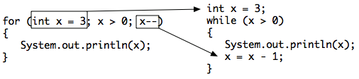

.. qnum::
   :prefix: 4-2-
   :start: 1

.. |CodingEx| image:: ../../_static/codingExercise.png
    :width: 30px
    :align: middle
    :alt: coding exercise
    
    
.. |Exercise| image:: ../../_static/exercise.png
    :width: 35
    :align: middle
    :alt: exercise
    
    
.. |Groupwork| image:: ../../_static/groupwork.png
    :width: 35
    :align: middle
    :alt: groupwork
    
.. |github| raw:: html

   <a href="https://github.com/bhoffman0/APCSA-2019/tree/master/_sources/Unit2-Using-Objects/TurtleJavaSwingCode.zip" target="_blank" style="text-decoration:underline">here</a>
    
For Loops
=========

..	index::
	single: for loop
	pair: loop; for

Another type of loop in Java is a **for loop**. This is usually used when you know how many times you want the loop to execute. It is often a simple **counter-controlled loop** to do the loop body a set number of times.

Three Parts of a For Loop
--------------------------

A for-loop combines all 3 parts of writing a loop in one line to initialize, test, and change the loop control variable.  The 3 parts are separated by semicolons (``;``).  Each of the three parts of a ``for`` loop declaration is optional (initialization, condition, and change), but the semicolons are not optional.  

.. code-block:: java

  for (initialize; test condition; change) {
     loop body
  }
  
The for-loop is almost a shortcut way to write a while loop with all three steps that you need in one line. One of the strange things about a ``for`` loop is that the code doesn't actually execute where you see it in the declaration.  The code in the initialization area is executed only one time before the loop begins, the test condition is checked each time through the loop and the loop continues as long as the condition is true, and the loop control variable change is done at the end of each execution of the body of the loop, just like a while loop.  When the loop condition is false, execution will continue at the next statement after the body of the loop.

    Figure 2: Control flow in a for loop
    
    
You can compare a ``while`` loop to a ``for`` loop to understand that a ``for`` loop actually executes like a ``while`` loop does if you use the ``while`` loop to repeat the body of the loop a specific number of times. 

    Figure 3: Showing how a for loop maps to a while loop
    
|CodingEx| **Coding Exercise**
   
   The ``E01ForLoop`` program contains a for loop that counts from 1 to 5. Can you change it to count from 2 to 10? 
  

   
   The ``E02ForLoopFromWhile`` program contains a while loop that counts from 5 to 10. Run it and see what it does. Can you change it to a for-loop? Run your for-loop. Does it do the same thing?
  

.. note::
   
   Two common patterns in for-loops are to count from 0 up to an number (using <) or count from 1 to the number including the number (using <=). Remember that if you start at 0 use <, and if you start at 1, use <=. The two loops below using these two patterns both run 10 times. The variable i (for index) is often used as a counter in for-loops.
   
   .. code-block:: java 
   
      // These loops both run 10 times
      // If you start at 0, use <
      for(int i = 0; i < 10; i++) {
         System.out.println(i);
      }
      // If you start at 1, use <=
      for(int i = 1; i <= 10; i++) {
         System.out.println(i);
      }
  

|Exercise| **Check your understanding**

.. mchoice:: q4_2_1
   :practice: T
   :answer_a: 3 4 5 6 7 8
   :answer_b: 0 1 2 3 4 5 6 7 8 
   :answer_c: 8 8 8 8 8 
   :answer_d: 3 4 5 6 7 
   :correct: d
   :feedback_a: This loop starts with i equal to 3 but ends when i is equal to 8.  
   :feedback_b: What is i set to in the initialization area?
   :feedback_c: This would be true if the for loop was missing the change part <code>(int i = 3; i < 8; )</code> but it does increment i in the change part <code>(int i = 3; i < 8; i++)</code>.
   :feedback_d: The value of i is set to 3 before the loop executes and the loop stops when i is equal to 8.  So the last time through the loop i is equal to 7.  

   What does the following code print?
   
   .. code-block:: java 

     for (int i = 3; i < 8; i++) {  
        System.out.print(i + " ");
     }
     
.. mchoice:: q4_2_2
   :practice: T
   :answer_a: 3 4 5 6 7 8
   :answer_b: 0 1 2 3 4 5 6 7 8 9 
   :answer_c: 1 2 3 4 5 6 7 8 9 10
   :answer_d: 1 3 5 7 9
   :correct: c
   :feedback_a: What is i set to in the initialization area? 
   :feedback_b: What is i set to in the initialization area? 
   :feedback_c: The value of i starts at 1 and this loop will execute until i equals 11.  The last time through the loop the value of i is 10.  
   :feedback_d: This loop changes i by 1 each time in the change area.  

   What does the following code print?
   
   .. code-block:: java 

     for (int i = 1; i <= 10; i++) {  
        System.out.print(i + " ");
     }
     
.. mchoice:: q4_2_3
   :practice: T
   :answer_a: 10
   :answer_b: 6
   :answer_c: 7
   :answer_d: 9
   :correct: c
   :feedback_a: This would be true if i started at 0 and ended at 9.  Does it?
   :feedback_b: Since i starts at 3 and the last time through the loop it is 9 the loop executes 7 times (9 - 3 + 1 = 7)
   :feedback_c: How many numbers are between 3 and 9 (including 3 and 9)?   
   :feedback_d: This would be true if i started at 0 and the value of i the last time through the loop it was 8.   

   How many times does the following method print a ``*``?  
   
   .. code-block:: java 

     for (int i = 3; i <= 9; i++) {  
        System.out.print("*"); 
     }
     
     

.. parsonsprob:: q4_2_4
   :numbered: left
   :practice: T
   :adaptive:

   The following method has the correct code to print out all the even values from 0 to the value of 10, but the code is mixed up.  Drag the blocks from the left into the correct order on the right and indent them correctly.  Even though Java doesn't require indention it is a good habit to get into. You will be told if any of the blocks are in the wrong order or not indented correctly when you click the "Check Me" button.
   -----
   public static void printEvens() {
   =====
      for (int i = 0; 
           i <= 10; 
           i+=2) {
   =====
         System.out.println(i);
   =====
      } // end for
   =====
   } // end method
   

Decrementing Loops
-------------------
   
You can also count backwards in a loop starting from the last number and decrementing down to 0 or 1. All 3 parts of the loop must change to count backwards including the test of when to stop. For example, "for (int i=5; i > 0; i--)`` counts from 5 down to 1.

|CodingEx| **Coding Exercise**

   
   What do you think will happen when you run the ``E03SongTest`` program?  How would it change if you changed line 11 to initialize i's value to 3? Try using the debugger to trace through this code.
  
  
The program prints the words to a song.  It initializes the value of the variable i equal to 5 and then checks if i is greater than 0.  Since 5 is greater than 0, the body of the loop executes.  Before the condition is checked again, i is decreased by 1.  When the value in i is equal to 0 the loop stops executing.  

   
   Can you make the loop in ``E04ForLoopBackwards`` count by 2s backwards? It should print out 5 3 1? 
   Remember to change all 3 parts of the for loop.
  
   
Summary
-------

- There are three parts in a for loop header: the initialization, the test condition (a Boolean expression), and an increment or decrement statement to change the loop control variable.

- In a for loop, the initialization statement is only executed once before the evaluation of the test Boolean expression. The variable being initialized is referred to as a **loop control variable**.

- In each iteration of a for loop, the increment or decrement statement is executed after the entire loop body is executed and before the Boolean expression is evaluated again.

- A for loop can be rewritten into an equivalent while loop and vice versa.

