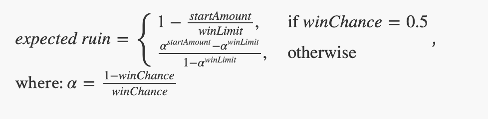

=====================
Module 2
=====================

.. Here is were you specify the content and order of your new book.

.. Each section heading (e.g. "SECTION 1: A Random Section") will be
   a heading in the table of contents. Source files that should be
   generated and included in that section should be placed on individual
   lines, with one line separating the first source filename and the
   :maxdepth: line.

.. Sources can also be included from subfolders of this directory.
   (e.g. "DataStructures/queues.rst").

Exercise : 2.25. Computing the max of two inputs
:::::::::::::::::::::::::::::::::::::::::::::::::::

* Find and open the ``Max`` Java program in the ``exercises2`` package.

* Add code as directed there to prompt the user for integer values for x and y.

* Use conditional execution to print the larger of the two values.

Exercise : 2.42. A bad swap
:::::::::::::::::::::::::::::::::::::::

* Find and open the ``BadSwap`` Java program in the ``exercises2`` package.

* Run the code if you like, providing various values for the inputs.

* Fill in the comments to explain why the provided code does not swap the values of x and y.

Exercise : 2.44. Heads or tails?
:::::::::::::::::::::::::::::::::::::::

* Find and open the ``CoinFlip`` Java program in the ``exercises2`` package.

* Complete the code so that it prints **heads** or **tails** on each run of the program, with equal probability.

Exercise : 2.45. Inches to feet
:::::::::::::::::::::::::::::::::::::::

* Find and open the ``FeetInches`` Java program in the ``exercises2`` package.

* Prompt the user for some number of inches.

* Produce output that corresponds the number of feet and any leftover inches when converted from the specified input.

* Be sure your output:

  * Uses the word **feet** for plural and **foot** for singular number of feet.
  * Uses the word **inches** for plural and **inch** for singular number of feet.

For example:

* 13 inches will produce: 1 foot and 1 inch

* 17 inches will produce: 1 foot and 5 inches

* 28 inches will produce: 2 feet and 4 inches

Exercise : 2.46. Divide two numbers carefully
::::::::::::::::::::::::::::::::::::::::::::::::::::::

* Find and open the ``CarefulDivide Java program`` in the ``exercises2`` package.

* Prompt the user for an integer numerator and denominator

* Compute the integer quotient of the inputs.

* However, if the denominator is 0, do not print the quotient. Instead, produce a suitable message about the result being undefined.

Exercise : 2.47. A random die
::::::::::::::::::::::::::::::::::::::::::::::::::::::

* Find and open the ``die`` in the ``exercises2`` package.

* As directed in the comments, write code so that your program prints an integer between 1 and 6, inclusively, with equal likelihood of each possible result.

Exercise : 2.52. Average of random values
::::::::::::::::::::::::::::::::::::::::::::::::::::::

* Find and open the ``RandomAverages`` in the ``exercises2`` package.

* As directed in the comments, write code so that your program computes the average of 1, 2, 3, …, 1000 values.

* Some questions are posed in comments. Write your answers in comments below those questions.

* However, if the denominator is 0, do not print the quotient. Instead, produce a suitable message about the result being undefined.

Exercise : 2.54. Average of random values
::::::::::::::::::::::::::::::::::::::::::::::::::::::

* Find and open the ``Loops`` in the ``exercises2`` package.

* As directed in the comments, write code so that your program computes the average of 1, 2, 3, …, 1000 values.

* Follow the comments to write loops that produce the specified outputs.

* If you get stuck, watch enough of the solution video to see how to accomplish one task, and then try the next task on your own.

Exercise : 2.65. 100 runs of the 10 heads problem
::::::::::::::::::::::::::::::::::::::::::::::::::::::

* Find and open the ``Heads` in the ``exercises2`` package.

* Using a ``for``-loop, run the experiment already in the Heads program 100 times.

Exercise : 2.66. N runs of the 10 heads problem
::::::::::::::::::::::::::::::::::::::::::::::::::::::

* Continue modifying the ``Heads`` Java program in the ``exercises2 package``.

* Instead of running the experiment 100 times, prompt the user for a value ``N`` and run the experiment ``N`` times.

Exercise : 2.67. Average flips to get 10 heads 
::::::::::::::::::::::::::::::::::::::::::::::::::::::

* Continue modifying the ``Heads`` Java program in the ``exercises2 package``.

* With the experiment running ``N`` times, modify your program so that, at the end, it prints the average number of coin flips required to achieve 10 heads.

Studio 2: Problem 1, Gambler's Ruin and Pi
::::::::::::::::::::::::::::::::::::::::::::::::::::::::::::::::

* `Studio Setup and Procedure`_

* `Problem 1:Gambler's Ruin`_

  * Background_

  * Procedure_

  * `Example Run`_

    * `Example Output`_

  * `Final Testing & Review`_

* `Problem 2:Computing Pi by throwing darts`_

* `Further investigations`_

* Demo_

Studio activities should not be started before class! Come to the session and work on the activity with other students!

.. _Studio Setup and Procedure:

**Studio Setup and Procedure**

* Form a group of 2-3 students and find a TA or instructor to work with.

* All but one member of your group should have this web page open so you can follow along and see the instructions as you work.

* Plan to work on one computer (using Eclipse).

  * Initially, one of you will be in charge of typing at that computer.

  * Throughout the studio you should trade who is in charge of the keyboard.

**READ THE FOLLOWING FULLY BEFORE PROCEEDING**

1. Have **one person** in your group create a new team by `Logo <https://classroom.github.com/g/n3TfYnGC>`_ here and going to the ``OR Create a new team`` box at the bottom of the page. The team name should include the last names of all your group members. For example, if Xia and Smith are working together, the team name should be something like “XiaSmith”.

2. **After the team is created**, all other members of your team should click on the same link and follow the instructions to join the team.

   1. **Be careful to join the right team!** You won’t be able to change teams yourself and will have to contact instructors if there’s a problem.

   2. **Be sure everyone else joins the team!** If grades don’t get entered correctly we will use the team to help verify credit for a particular studio.

3. Finally, one person should import the studio repository into Eclipse, as described in `Assignment 0’s Add the assignment to Eclipse <https://classes.engineering.wustl.edu/2021/fall/cse131//modules/0/assignment#4-add-the-assignment-to-eclipse>`_

   * All team members will have access to the work pushed to GitHub. Be sure to ``Commit and Push`` at the end of the day so everyone can refer back to the work later as needed.

.. _Problem 1:Gambler's Ruin:

**Problem 1:Gambler's Ruin**

.. _Background:

**Background**

In this assignment you’ll simulate a version of `Gambler’s Ruin <https://en.wikipedia.org/wiki/Gambler%27s_ruin>`_ problem. The problem is:

* You’re a gambler and you’ll be visiting a casino.

* You start the day with some money (a start amount).

* Over the course of the day you repeatedly play a game, which has known odds of winning called the “win chance”.

  * Each time you play you either win or lose $1 based on the “win chance”. So the total amount of money you have on-hand either increases or decreases by 1 after each game.

* If the total amount of money you have ever hits a “win limit” you stop gambling and leave the casino for the day. It was a successful day!

* If you lose all of your money you also stop gambling. The day was a ruin!

As a professional gambler, you’ll actually think about doing this every day. You know that some days will be a success and some days you’ll ruin. You also have observed a lot of games at a lot of casinos and will know the “win chance” of each. You still have some difficult questions you eventually want to answer:

* What “win limit” should you pick?

* What percentage of time will you “ruin”?

There are two major ways to solve these questions:

1. By simulating many gambling sessions and using the results to estimate the probability of “ruin” for a particular combination of “win limit” and “win chance”

2. By using a mathematical formula that computes the “expected” answer. This is the value you should find if you ran your simulation an infinite number of times.

In this assignment you’ll do both (and compare the simulated value to the expected one)

.. _Procedure:

1. With your repository open create a new class in the ``studio2`` package:

   * Right click Right-click on the package name in which you want to define the new class. In this case, use ``studio2``.

   * Click ``New ...``

   * Choose ``Class``

   * Pick the name ``Ruin`` for this class. Java style dictates that its classes should begin with a capital letter!

   * Click the check box for ``public static void main(String[] args)`` to have Eclipse automatically create the ``main()`` method for you.

2. Have your program accept the following inputs (If you don’t remember how to do this look at code from a previous studio):

.. csv-table:: 
   :header: "VariableName", "Concept"
   :widths: 20, 40

   "startAmount", "The amount of money that you start with"
   "winChance", "The win probability, or the probability that you win a single play"
   "winLimit", "If you reach this amount of money you had a successful day and leave"

3. Start by simulating a single day. Write code that will repeatedly play until “success” or “ruin”

   * Include ``println`` statements showing each win or loss. You’ll remove these soon, but they help you verify that your code is working (*Remember this trick!*)

4. Test your work! Incremental testing is vital to your success in this course. Coming up with creative ways to test your work will be immensely helpful.

   *  Brainstorm ways to ensure successful days or ruined days. For example, can you pick values that ensure you win all plays and leave the casino after 5 plays? What about values that ensure you lose after 8 plays? If your code doesn’t behave as expected, carefully review it and ask for help if you can’t find the cause of the problem.

   * How would you expect it to behave if you started with $500, will stop at when you have $1000 (or ruin), and the game has a 50% (0.5) chance of winning?

5. Now we want to answer the question posed earlier: If you play every day, what percentage of time will you “ruin”? Start in adding and prompting for a new variable:

.. csv-table:: 
   :header: "VariableName", "Concept"
   :widths: 20, 40

   "totalSimulations", "The number of day's you'll simulate"

6. Then use this value to repeatedly play an entire day’s casino visit (the work you’ve already done) until you succeed or ruin (``totalSimulations`` times).

7. Remove any ``println()`` statements for individual plays and instead print:

   1. The simulation (day) number

   2. the number of plays that took place that day, and

   3. whether the day ended in success or ruin

**(Get this part working before proceeding: See the examples values and corresponding sample output below. It should look somewhat like this, but since you’re using random values the results may not be identical.)**

8. Compute an estimate of the “ruin rate” (percentage of simulations resulting in ruin) and print it after all the rounds of simulation.

9. Finally, calculate and print the “expected ruin rate” in your program using the following formula:

.. _Example Run:

**Example Run**

Here’s an example run. You should try to match this format. 

Given:

.. csv-table:: 
   :header: "VariableName", "Concept"
   :widths: 20, 40

   "startAmount", "2"
   "winChance", ".7"
   "winLimit", "10"
   "totalSimulations", "500"

.. _Example Output:

**Example Output**

``Simulation 1: 16 LOSE``

``Simulation 2: 10 WIN``

``Simulation 3: 6 LOSE``

``Simulation 4: 8 WIN``

``...``

``Simulation 499: 28 WIN``

``Simulation 500: 18 WIN``

``Losses: 90 Simulations: 500``

``Ruin Rate from Simulation: 0.18 Expected Ruin Rate: 0.18350278772959913``

.. _Final Testing & Review:

**Final Testing & Review**

* Come up with creative ways to test your code until you’re confident it’s working as expected. Talk to your TA/instructor and try to justify that all you calculations are correct.

* Review the development process. The order of your work was chosen carefully to increase the likelihood you’d be successful. Review the steps and try to identify strategies that may help you be successful in other course work. Again, share with your TA/instructor.

.. _Problem 2:Computing Pi by throwing darts:

**Problem 2:Computing Pi by throwing darts**

Computer scientists often use `simulation <http://en.wikipedia.org/wiki/Simulation>`_ as a means of modeling, understanding, and predicting real-world phenomena.

Your group is auditioning for `survivor <http://en.wikipedia.org/wiki/Survivor_%28TV_series%29>`_ by proving your group’s ability to compute `Pi <http://en.wikipedia.org/wiki/Pi>`_ using only the materials at hand, as follows:

* A unit-square dart board (1 meter by 1 meter). Unit-square dart boards are astoundingly resilient in plane crashes and yours is nicely intact.

* Some darts, suitable for throwing at the dart board.

* A 1 meter string and a stylus, suitable for inscribing an arc of a circle in your unit-square dartboard. That is, you can pin the string to a corner of the dartboard and use the stylus with the other end to draw an arc of a circle on the dartboard.

* A dart-throwing expert. However, since the plane crash, the expert is left with the (uncanny) ability to throw darts that always land somewhere, uniformly and randomly, within the unit-square dart board. While the thrower never misses the unit square, the darts sometimes land within the inscribed circle, sometimes not.

As a group, develop an approach for computing `Pi <http://en.wikipedia.org/wiki/Pi>`_ based on the above materials.

Hint:

**Think about the chances of where a dart lands. Can you develop a forumla for it? How could you estimate this chance via a simulation?**

1. Create a new class called ``Pi`` in your ``studio2`` package

2. Implement your approach using iteration:

   * You will need to simulate a random dart thrower. Think carefully about how you can use `Math.random() <https://docs.oracle.com/en/java/javase/13/docs/api/java.base/java/lang/Math.html#random()>`_ to generate a random dart throw.

   * You’ll need to know where the dart hit. You may find the  `Math.sqrt() <https://docs.oracle.com/en/java/javase/13/docs/api/java.base/java/lang/Math.html#sqrt(double)>`_ function helpful.

3. Investigate and discuss how well your technique computes `Pi`_.

4. As before, discuss ways to test and validate your work.

.. _Further investigations:

**Further investigations**

If you have time, pick one or both of the following:

1. Investigate the fairness of the `Math.random() <https://docs.oracle.com/en/java/javase/13/docs/api/java.base/java/lang/Math.html#random()>`_ method.

   1. What properties should a random number possess?

   2. How can you measure the fairness of a random number generator?

   3. Implement some tests and discuss your results amongst yourselves and other groups.

2. There are other ways of `computing Pi <http://en.wikipedia.org/wiki/Pi>`_. Try some of these and study their effectiveness in terms of the number of iterations you use.

.. _Demo:

**Demo (get credit for your work)**

**Commit and Push** your work. Be sure that any file you worked on is updated on `GitHub <https://github.com/>`_.

To get participation credit for your work talk to the TA you’ve been working with and complete the demo/review process. Be prepared to show them the work that you have done and answer their questions about it!

*Before leaving check that everyone in your group has a grade recorded in Canvas!*

Assignment 2: Game of Nim
::::::::::::::::::::::::::::::::::::::::::::::::::::::::::::::::

* `Assignment Setup`_

* `Game of Nim`_

  * `Example`_

  * Notes_

* `Submitting your work`_

.. _Assignment Setup:

**Assignment Setup**

To create your repository go `here <https://classroom.github.com/a/vDG5z2OJ>`_. Then follow the same accept/import process described in `Assignment 0 <https://classes.engineering.wustl.edu/2021/fall/cse131//modules/0/assignment>`_.

.. _Game of Nim:

**Game of Nim**

`Nim <https://en.wikipedia.org/wiki/Nim>`_ is a `game of strategy <https://en.wikipedia.org/wiki/Strategy_game>`_ in which two players take turns removing sticks from a common pile. There are many variations of Nim but we will stick with a simple version. On each turn a player must remove either 1 or 2 sticks from the pile. The goal of the game is to be the player who removes the last stick.

You will design a game in which one human player is competing against a computer. To simplify your work the person will always take the first turn.

While there is a winning strategy for this game, you are only required to create a computer player that makes random, but valid, moves.

.. _Example:

**Example**

``Round 0: 7 at start human takes 2, so 5 remain``

``Round 1: 5 at start computer takes 2, so 3 remain``

``Round 2: 3 at start human takes 2, so 1 remain``

``Round 3: 1 at start computer takes 1, so 0 remain``

``The computer wins / you lose!``

.. _Notes:

**Notes**

* Begin by prompting the user for the initial number of sticks. In the example above, it appears that 7 sticks were used in the game.

* The human (as always in this assignment) made the first move.

* Clearly, the human could have played better in the above game.

* The computer randomly removes 1 or 2 sticks, but cannot remove more sticks than are left.

* The human is prompted at each turn for how many sticks to remove.

Be careful! A human might enter 5 if 5 sticks are left, and if you are not careful, the human could win by “ `playing <https://en.wikipedia.org/wiki/Cheating>`_ ” in that way. Don’t accept the user’s input if it is illegal. You may assume that they will only enter integers, but you should continue prompting until you get a valid value.

* Start your work by creating a ``Nim`` class in the ``assignment2`` package.

* Use ``ArgsProcessor`` to prompt for inputs.

* Your program must continue play until somebody (computer or human) wins.

* Your output should resemble the sample output shown above. It should clearly show if the computer or the human wins.

* When it’s time to demo be prepared to discuss how you would implement a “smarter” strategy for the computer player.

.. _Submitting your work:

**Submitting your work**

To submit your work come to office hours or class on an “Assignment day” and sign up for a demo via wustl-cse.help.