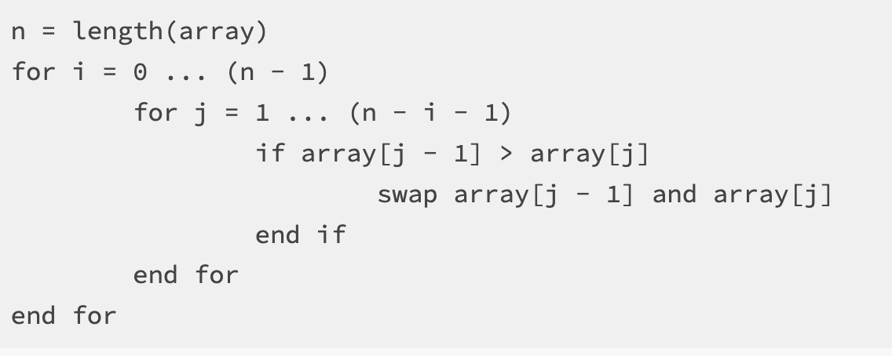
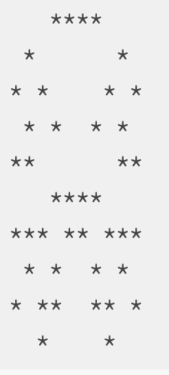

=====================
Assignment 3: Array Puzzles 
=====================

Assignment Setup
=====================

To create your repository go `here <https://classroom.github.com/a/9ClrUQIj>`_. Then follow the same accept/import process described in `the setup instructions <../Module0-Introduction/software.html>`_.

Array Puzzles
=====================

You are given three problems to complete below. For each problem we supply you examples of what the output could look like.

Questions to ask if you get stuck
=================================

Like all problems, these can be tricky. Here are some common questions that we get from students regarding this assignment. Use these questions to gauge your own understanding of what we are asking you to do. Please ask these questions to a TA or an instructor if you are feeling stuck on a certain part of the assignment.

* How do nested for loops work in Java, and how do I know when I need nested loops?

* How do I create an array in Java?

* How do I insert data into an array in Java?

* How do I print an array in Java?

* How are 2-D arrays different from regular arrays in Java, and when should I use a 2-D array?

* How does a for-each loop work compared to a for loop in Java and when should I use one?

Bubble Sort
=====================

`Bubble Sort <https://en.wikipedia.org/wiki/Bubble_sort>`__ is a simple, well known, algorithm that can be used to sort an array. Implementing a simple sorting algorithm such as bubble sort is often seen as a rite of passage for the novice computer scientist.

The way that bubble sort works is by “bubbling” the larger values up. If a value is larger than its neighbor it will be swapped until all of the larger values make their way to the end of the array and the smaller values end up at the beginning of the array.

Your task is to create a program called ``BubbleSort.java`` in the ``assignment3`` package. This program should first use ``Scanner`` to ask the user how big they would like the array to be. It will then prompt the user to enter that many integer values, which get stored into the array.

You should then sort this array in ascending order using the bubble sort algorithm. To assist you, take a look at this `pseudocode <https://en.wikipedia.org/wiki/Pseudocode>`_ implementation of the sorting algorithm:

Notice that the above code does not look like Java code that we have seen before. If you were to put this into VS Code, it would not work. This “pseudocode” captures the essence of the task at hand, which a programmer (in this case, you!) can translate into a more specific computer language like Java or python (or even a human language like Spanish or Chinese….what’s the difference between human language and computer language, anyway?).

For a visualization of how this algorithm works, take a look at `this <https://clementmihailescu.github.io/Sorting-Visualizer/>`_.

You should print out the original array as well as the sorted array so that the results can be easily verified.

Note that the rubric requests that you step through bubble sort in the debugger as part of the demo process. You are highly encouraged to practice this before you demo!

Example Output:

``Given values:  8 6 7 5 3 0 9``

``Sorted values: 0 3 5 6 7 8 9``

Frequency Table
=====================

Make a program called ``FrequencyTable.java`` in the ``assignment3`` package. This program will simulate a number of dice rolls, with the number of dice to use supplied by the user through ``Scanner``.

Your program should roll the given number of dice 10000 times, and count the number of times that each possible value is rolled. You should use an array as a frequency table to track this information. Think carefully about how you can use an array for this purpose. How big should our array be? Can we define a relationship between the random values that are generated by "rolling" the dice and how we count them in the array?

Once the 10000 rolls have been simulated, your program should print out the frequency table, showing how often each value was rolled.

Some iterative development tips:

* Try making your array before you write the code for generating random numbers. Try using the array to print out information with the same structure as the example below (even though the frequencies will all be 0).
* You should use normal 6 sided dice for the purposes of this problem.
* Try using the number you generated as your index in the array and increase that count by one. Is there an index out of bounds error? Why might that be happening, and how could you fix it?

Example Output:

``How many dice? 4``

``Times each value was rolled with 4 dice over 10000 rolls``

``4: 6``
``5: 36``
``6: 69``
``7: 149``
``8: 254``
``9: 442``
``10: 601``
``11: 889``
``12: 933``
``13: 1053``
``14: 1157``
``15: 1042``
``16: 972``
``17: 817``
``18: 590``
``19: 416``
``20: 267``
``21: 176``
``22: 87``
``23: 39``
``24: 5``

Symmetrical Image
=====================

Create a program ``SymmetricalImage.java``. This program should create an ``n`` x ``m`` array where ``n`` and ``m`` are values supplied by the user through ``Scanner``.

We wish to use this array to create some randomly generated vertically symmetrical images. To do this, first select a random point within the 2D array. You will then need to compute the “mirrored” point on the other side of the array. Both of these array positions should be marked.

For example, if the size of the array is 10x10 and the point that I have randomly selected is at position (2, 3), then the corresponding “mirrored” point would be at position (2, 6) and both of these positions would be marked in the array. Note that if (2, 6) was the randomly generated point that (2, 3) is still its mirrored point - your code should work in both situations. If you’re having trouble understanding how this works then sketch out a simple example on paper and make sure you understand it before moving on!

You should generate ``n * m / 4`` random points. It is OK if you randomly select the same point more than once, this will just add to the random flavor of the resulting images.

Finally, you should print out the image by going through the entire array and printing a ``*`` if the value in the given position is marked and a blank space otherwise.

Example output:

``A randomly generated, symmetrical 10 x 10 image:``

Submitting your work
=====================

Assignments are not graded, however a rubric is presented on Canvas which shows the skills that we hope students to learn by completing this assignment. Please consider discussing your work with an instructor or TA, the exams and quizzes are written based on the concepts presented in the homework assignments and assume that students are practicing these skills by completing the homework.