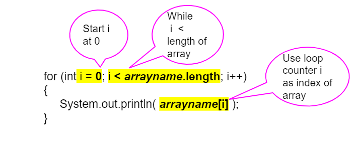

.. qnum::
   :prefix: 7-2-
   :start: 1

.. |CodingEx| image:: ../../_static/codingExercise.png
    :width: 30px
    :align: middle
    :alt: coding exercise
    
    
.. |Exercise| image:: ../../_static/exercise.png
    :width: 35
    :align: middle
    :alt: exercise
    
    
.. |Groupwork| image:: ../../_static/groupwork.png
    :width: 35
    :align: middle
    :alt: groupwork
    

Traversing Arrays with For Loops
==========================================

Index Variables
-----------------------

In the last lesson, we mentioned that you can use a variable for the index of an array. 
You can even do math with that index and have an arithmetic expression inside the [], like below.

.. code-block:: java 
 
  // highScores array declaration
  int[] highScores = { 10, 9, 8, 8};
  // use a variable for the index
  int index = 3;
  // modify array value at index
  highScores[index] = 11;
  // print array value at index
  System.out.println(  highScores[index] );
  System.out.println(  highScores[index - 1] );

.. |visualizer| raw:: html

   <a href="http://www.pythontutor.com/visualize.html#code=public%20class%20ArrayWithIndexVar%20%7B%0A%20%20%20%20public%20static%20void%20main%28String%5B%5D%20args%29%20%7B%0A%20%20%20%20%20%20//%20highScores%20array%20declaration%0A%20%20%20%20%20%20int%5B%5D%20highScores%20%3D%20%7B%2010,%209,%208,%208%7D%3B%0A%20%20%20%20%20%20//%20use%20a%20variable%20for%20the%20index%0A%20%20%20%20%20%20int%20index%20%3D%203%3B%0A%20%20%20%20%20%20//%20modify%20array%20value%20at%20index%0A%20%20%20%20%20%20highScores%5Bindex%5D%20%3D%2011%3B%0A%20%20%20%20%20%20//%20print%20array%20value%20at%20index%0A%20%20%20%20%20%20System.out.println%28%20%20highScores%5Bindex%5D%20%29%3B%0A%20%20%20%20%20%20System.out.println%28%20%20highScores%5Bindex%20-%201%5D%20%29%3B%0A%20%20%20%20%7D%0A%7D&cumulative=false&curInstr=0&heapPrimitives=nevernest&mode=display&origin=opt-frontend.js&py=java&rawInputLstJSON=%5B%5D&textReferences=false" target="_blank"  style="text-decoration:underline">visualizer</a>
    
What does the code above print out? You can follow the code in this |visualizer| and look at the image depicting the array below.

    Figure 1: Array with index variable

.. |visualizer2| raw:: html

   <a href="http://www.pythontutor.com/visualize.html#code=%20public%20class%20Test1%0A%20%20%20%7B%0A%20%20%20%20%20%20public%20static%20void%20main%28String%5B%5D%20args%29%0A%20%20%20%20%20%20%7B%0A%20%20%20%20%20%20%20%20String%5B%20%5D%20names%20%3D%20%7B%22Jamal%22,%20%22Emily%22,%20%22Destiny%22,%20%22Mateo%22,%20%22Sofia%22%7D%3B%20%0A%20%20%20%20%20%20%20%20%0A%20%20%20%20%20%20%20%20int%20index%20%3D%201%3B%0A%20%20%20%20%20%20%20%20System.out.println%28names%5Bindex%20-%201%5D%29%3B%0A%20%20%20%20%20%20%20%20index%2B%2B%3B%0A%20%20%20%20%20%20%20%20System.out.println%28names%5Bindex%5D%29%3B%0A%20%20%20%20%20%20%20%20System.out.println%28names%5Bindex/2%5D%29%3B%0A%20%20%20%20%20%20%20%20names%5Bindex%5D%20%3D%20%22Rafi%22%3B%0A%20%20%20%20%20%20%20%20index--%3B%0A%20%20%20%20%20%20%20%20System.out.println%28names%5Bindex%2B1%5D%29%3B%0A%20%20%20%20%20%20%7D%0A%20%20%20%7D%0A%20%20%20&cumulative=false&curInstr=0&heapPrimitives=nevernest&mode=display&origin=opt-frontend.js&py=java&rawInputLstJSON=%5B%5D&textReferences=false" target="_blank"  style="text-decoration:underline">visualizer</a>
   
|CodingEx| **Coding Exercise**

   
   What do you think the ``Test1`` program will print out? First trace through it on paper keeping track of the array and the index variable. Then, run it to see if you were right. 
   
   

For Loop to Traverse Arrays
---------------------------

..	index::
    single: for loop
	pair: loop; from front to back
    
We can use iteration with a **for loop** to visit each element of an array.  This is called **traversing** the array. Just start the index at **0** and loop while the index is less than the **length** of the array. Note that the variable **i** (short for index) is often used in loops as the loop counter variable and is used here to access each element of an array with its index. 

    Figure 2: For Loop Traversing Array

For example, here is a loop traversing the highScores array to print every score. Follow the code below in the |visualizer3|.

.. |visualizer3| raw:: html

   <a href="http://www.pythontutor.com/visualize.html#code=public%20class%20ArrayLoop%0A%7B%0A%20%20%20%20public%20static%20void%20main%28String%5B%5D%20args%29%20%0A%20%20%20%20%7B%0A%0A%20%20%20%20%20%20%20%20int%5B%5D%20highScores%20%3D%20%7B%2010,%209,%208,%208%7D%3B%0A%20%20%20%20%20%20%20%20for%20%28int%20i%20%3D%200%3B%20i%20%3C%20highScores.length%3B%20i%2B%2B%29%0A%20%20%20%20%20%20%20%20%7B%0A%20%20%20%20%20%20%20%20%20%20%20%20System.out.println%28%20%20highScores%5Bi%5D%20%29%3B%0A%20%20%20%20%20%20%20%20%7D%20%0A%20%20%20%20%7D%0A%7D&cumulative=false&curInstr=0&heapPrimitives=nevernest&mode=display&origin=opt-frontend.js&py=java&rawInputLstJSON=%5B%5D&textReferences=false" target="_blank"  style="text-decoration:underline">visualizer</a>
   
.. code-block:: java 
 
  int[] highScores = { 10, 9, 8, 11};
  for (int i = 0; i < highScores.length; i++)
  {
      System.out.println(  highScores[i] );
  } 

.. note::

    Using a variable as the index is a powerful **data abstraction** feature because it allows us to use loops with arrays where the loop counter variable is the index of the array! This allows our code to generalize to work for the whole array.
    
|CodingEx| **Coding Exercise**

      
   What do you think the ``Test2`` program will print out? First trace through it on paper keeping track of the array and the index variable. Then, run it to see if you were right. Then, try adding your name and a friend's name to the array names and run the code again. Did the code work without changing the loop?
   

Common Errors When Looping Through an Array
-------------------------------------------------

When processing all array elements, be careful to start at the first index which is ``0`` and end at the last index. Usually loops are written so that the index starts at 0 and continues while the index is less than ``arrayName.length`` since (arrayName.length - 1) is the index for the last element in the array. Make sure you do not use <= instead of <! If the index is less than 0 or greater than (arrayName.length - 1), an **ArrayIndexOutOfBoundsException** will be  thrown.  **Off by one** errors, where you go off the array by 1 element, are easy to make when traversing an array which result in an **ArrayIndexOutOfBoundsException** being thrown. 

|Exercise| **Check Your Understanding**

.. mchoice:: q7_2_8
   :practice: T

   Which of the following loop headers will cause an ArrayIndexOutOfBounds error while traversing the array scores?
   
   
   - for (int i = 0; i < scores.length; i++)
   
     - This loop will traverse the complete array.
     
   - for (int i = 1; i < scores.length; i++)
   
     - This loop will not cause an error even though it will not visit the element at index 0. 
   
   - for (int i = 0; i <= scores.length; i++)
   
     + The index cannot be equal to scores.length, since (scores.length - 1) is the index of the last element.
     
   - for (int i = 0; scores.length > i; i++)
   
     - Although the ending condition looks strange, (scores.length > i) is equivalent to (i < scores.length).
     
   - for (int i = scores.length - 1; i >= 0; i++)
    
     + This will cause an error because i++ will continue to increment the index past the end of the array. It should be replaced with i-- to avoid this error. 

|CodingEx| **Coding Exercise**

   
   The ``OffByone`` program has an ArrayIndexOutOfBoundsException. It has 2 common off-by-one errors in the loop. Can you fix it and make the loop print out all the scores?
  
 
Summary
-------

- Iteration (loops) can be used to access all the elements in an array, **traversing the array**.

- Traversing an array with an indexed for loop or while loop requires elements to be accessed using their indices.

- Since the index for an array starts at 0 and end at the number of elements − 1, "off by one" errors are easy to make when traversing an array, resulting in an **ArrayIndexOutOfBoundsException** being thrown.

