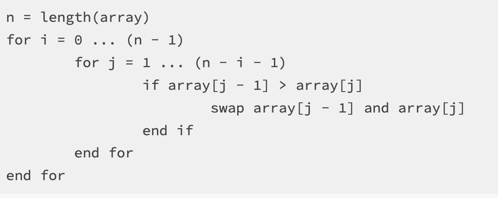
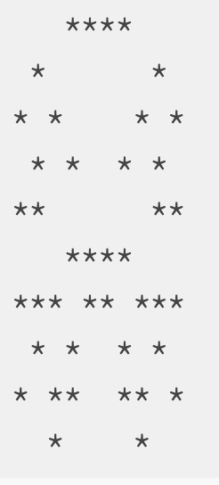

=====================
Module 3
=====================

.. Here is were you specify the content and order of your new book.

.. Each section heading (e.g. "SECTION 1: A Random Section") will be
   a heading in the table of contents. Source files that should be
   generated and included in that section should be placed on individual
   lines, with one line separating the first source filename and the
   :maxdepth: line.

.. Sources can also be included from subfolders of this directory.
   (e.g. "DataStructures/queues.rst").

!*

Assignment 3: Array Puzzles 
::::::::::::::::::::::::::::::::::::::::::::::::::::::::::::::::

* `Arrays Bonus Video`_

* `Assignment Setup`_

* `Array Puzzles`_

  * `Bubble Sort`_

  * `Frequency Table`_

  * `Symmetrical Image`_

* `Submitting your work`_

.. _Arrays Bonus Video:

**Arrays Bonus Vieo**

.. youtube:: jKZ0rF1KHM4

Still a confused about arrays? Watch this bonus demonstration by former 131 TA Amanda Hua on how to create, write to, read from, and get the length of arrays.

.. _Assignment Setup:

**Assignment Setup**

To create your repository go `here <https://classroom.github.com/a/BjAINj1I>`_. Then follow the same accept/import process described in `Assignment 0 <https://classes.engineering.wustl.edu/2021/fall/cse131//modules/0/assignment>`__.

.. _Array Puzzels:

**Array Puzzles**

You are given three problems to complete below. For each problem we supply you examples of what the output could look like.

.. _Bubble Sort:

**Bubble Sort**

`Bubble Sort <https://en.wikipedia.org/wiki/Bubble_sort>`__ is a simple, well known, algorithm that can be used to sort an array. Implementing a simple sorting algorithm such as bubble sort is often seen as a rite of passage for the novice computer scientist.

The way that bubble sort works is by “bubbling” the larger values up. If a value is larger than its neighbor it will be swapped until all of the larger values make their way to the end of the array and the smaller values end up at the beginning of the array.

Your task is to create a program called ``BubbleSort.java`` in the ``assignment3`` package. This program should first use ``ArgsProcessor`` to ask the user how big they would like the array to be. It will then prompt the user to enter that many integer values, which get stored into the array.

You should then sort this array in ascending order using the bubble sort algorithm. To assist you, take a look at this `pseudocode <https://en.wikipedia.org/wiki/Pseudocode>`_ implementation of the sorting algorithm:

Notice that the above code does not look like Java code that we have seen before. If you were to put this into Eclipse, it would not work. This “pseudocode” captures the essence of the task at hand, which a programmer (in this case, you!) can translate into a more specific computer language like Java or python (or even a human language like Spanish or Chinese….what’s the difference between human language and computer language, anyway?).

For a visualization of how this algorithm works, take a look at `this <https://clementmihailescu.github.io/Sorting-Visualizer/>`_.

You should print out the original array as well as the sorted array so that the results can be easily verified.

Note that the rubric requests that you step through bubble sort in the debugger as part of the demo process. You are highly encouraged to practice this before you demo!

Example Output:

``Given values:  8 6 7 5 3 0 9``

``Sorted values: 0 3 5 6 7 8 9``

.. _Frequency Table:

**Frequency Table**

Make a program called ``FrequencyTable.java`` in the ``assignment3`` package. This program will generate ``x`` integers between 1 and ``n`` where ``x`` and ``n`` are values supplied by the user through ``ArgsProcessor``.

Your program should create a frequency table, counting the number of times that each number is randomly generated. Think carefully about how you can use an array for this purpose. How big should our array be? Can we define a relationship between the random values that are generated and how we count them in the array?

Example Output:

``Frequencies for 100 randomly generated values between 1 and 10``

``1: 10``

``2: 9``

``3: 10``

``4: 9``

``5: 10``

``6: 6``

``7: 15``

``8: 15``

``9: 8``

``10: 8``

.. _Symmetrical Image:

**Symmetrical Image**

Create a program ``SymmetricalImage.java``. This program should create an ``n`` x ``m`` array where ``n`` and ``m`` are values supplied by the user through ``ArgsProcessor``.

We wish to use this array to create some randomly generated vertically symmetrical images. To do this, first select a random point within the 2D array. You will then need to compute the “mirrored” point on the other side of the array. Both of these array positions should be marked.

For example, if the size of the array is 10x10 and the point that I have randomly selected is at position (2, 3), then the corresponding “mirrored” point would be at position (2, 6) and both of these positions would be marked in the array. Note that if (2, 6) was the randomly generated point that (2, 3) is still its mirrored point - your code should work in both situations. If you’re having trouble understanding how this works then sketch out a simple example on paper and make sure you understand it before moving on!

You should generate ``n * m / 4`` random points. It is OK if you randomly select the same point more than once, this will just add to the random flavor of the resulting images.

Finally, you should print out the image by going through the entire array and printing a ``*`` if the value in the given position is marked and a blank space otherwise.

Example output:

``A randomly generated, symmetrical 10 x 10 image:``

.. _Submitting your work:

**Submitting your work**

To submit your work come to office hours or class on an “Assignment day” and sign up for a demo via wustl-cse.help.