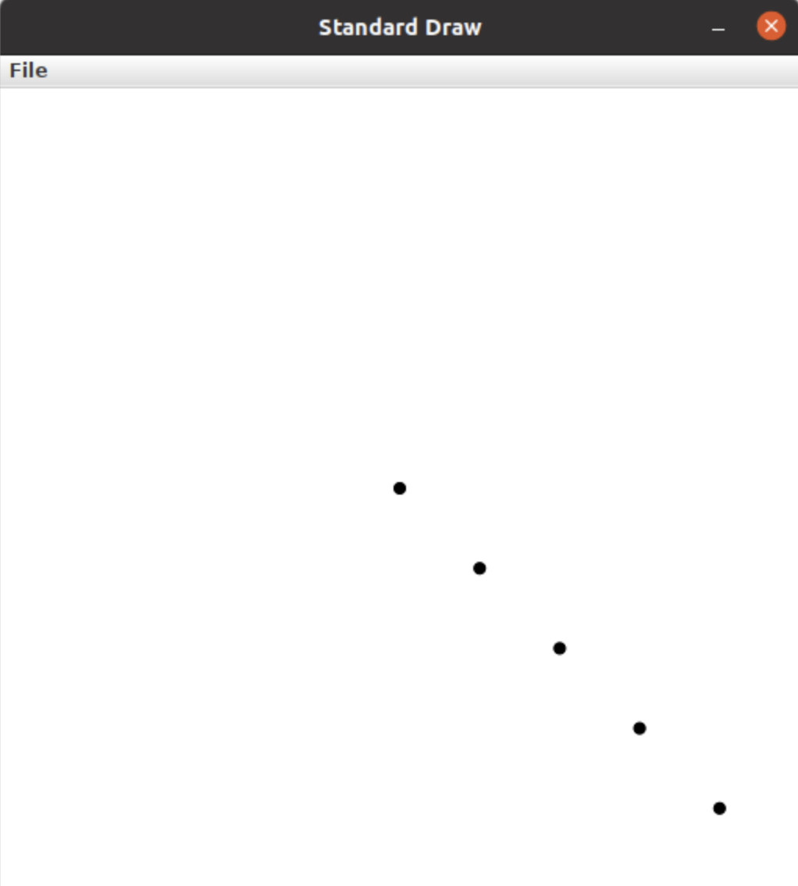
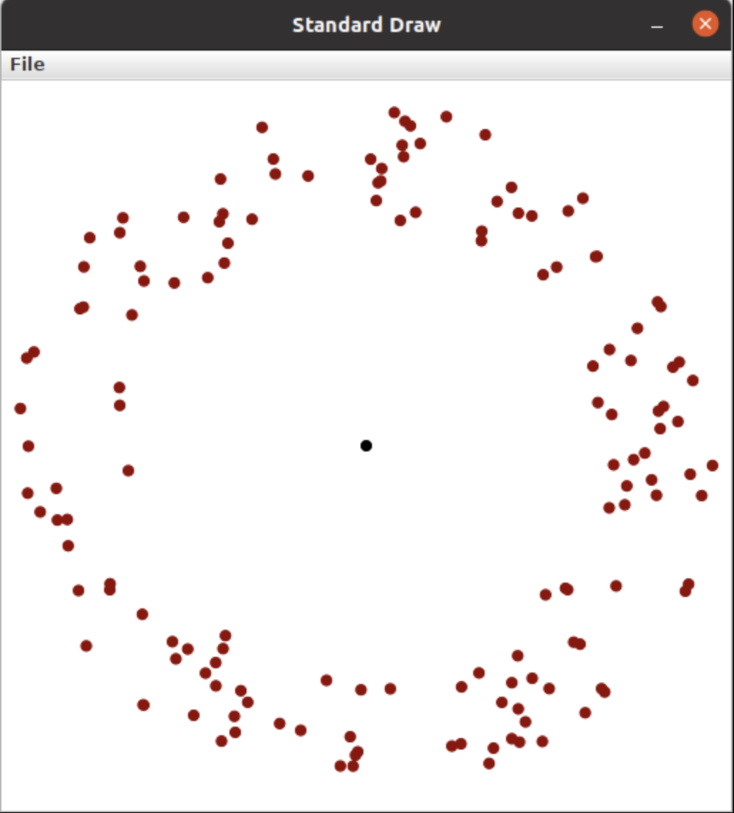

=====================
Assignment 4: APIsolutely About Zombies
=====================

Assignment Setup
=====================

To create your repository go `here <https://classroom.github.com/a/gTm-BRH1>`_. Then follow the same accept/import process described in `the setup instructions <../Module0-Introduction/software.html>`_.

Zombies
=====================

This assignment is the first step in a sequence of assignments that will simulate `zombies <https://en.wikipedia.org/wiki/Zombie>`_! In this part you will prepare the simulation data and display the entities being simulated (the zombies and non-zombies/humans). In the next part (Assignment 5) we will actually simulate the interaction between the two.

There are a few reasons for this choice of subject matter:

* These assignments show a real-world application of computing. The structure we will create is used in many simulations and games, and computer scientists often do similar work to visualize data and understand natural phenomena.

  * Games and simulations often have a loop that simulates time steps. The typical flow of this loop is:

  1. Check if the game/simulation should continue (part of Assignment 5)

  2. Update all the items being simulated for the current time step (part of Assignment 5)
 
  3. Show or record any progress (we’ll do this here in Assignment 4)

* Simulating biological systems can be fascinating but complex. Using zombies allows us to simplify the rules of the system, which means shorter assignments more focused on the CS concepts we want you to learn.

Information Needed 
=====================

In order to simulate how a zombie infection can spread, we will simulate:

* Zombies, which have a 2D location. The x and y values can range from 0.0 to 1.0.

* Non-Zombies, which also have a 2D location with values ranging from 0.0 to 1.0.

In other words, for every entity (zombie or non-zombie), we will want to keep track of the entity’s current coordinates and whether the entity is a zombie. We can use a boolean for the entity type, with true to indicate a zombie and false to indicate a non-zombie.

Data Management
=====================

There are several ways to manage information like this. For this assignment, we’ll use an approach sometimes called `parallel arrays <https://en.wikipedia.org/wiki/Parallel_array>`_. The basic idea is that we will have three arrays to keep track of ``N`` entities:

1. An array of length ``N`` that contains whether or not each entity is a zombie. Call this the ``areZombies`` array.

2. An array of length ``N`` that contains the x coordinates of all the entities. Call this the ``xs`` array.

Each thing being simulated will be associated with an index. For example, ``areZombies[0]``, ``xs[0]``, and ``ys[0]`` represent the type and coordinates of a single entity in our simulation. In a sense you can think about ``areZombies``, ``xs``, and ``ys`` as being columns in a table. Each individual row of the table represents a specific thing being simulated. The three arrays are considered “in parallel” since the i-th items in each array represent different aspects of a single composite thing.

Data Encoding
=====================

The initial locations of zombies and non-zombies will be provided in a file. The file will have a very specific format:

* The first line of the file will indicate how many entities are in the file (``N``)

* The next ``N`` lines will each contain information for a single entity:

  * Each line will start with a ``String``. ``"Zombie"`` indicates a zombie and ``"Nonzombie"`` indicates a non-zombie.

  * Second will be a real number (``double``) indicating the initial x position of the entity.

  * Third will be another real number (``double``) indicating the initial y position of the entity.

We’ve included several example files. When you run the program, you will see a file dialog box that will allow you to pick a ``.sim`` file. This is the file that your code will read from (click to enlargen examples below).

* 1_nonzombie.sim: 

|

.. image:: 1_nonzombie.png
  :alt: 1_nonzombie
  :width: 300
  :height: 200
  :align: center

|

* 1_on_1.sim: 

|

.. image:: 1_on_1.png
  :alt: 1_on_1
  :width: 300
  :height: 200
  :align: center

| 

* 1_zombie.sim: 

|

.. image:: 1_zombie.png
  :alt: 1_zombie
  :width: 300
  :height: 200
  :align: center

|

* 5_nonzombies.sim: 

|

|

* 5_zombies.sim: 

|

.. image:: 5_zombies.png
  :alt: 5_zombies
  :width: 300
  :height: 200
  :align: center

|

* all_alone.sim: 

|

|

* bubbles.sim: 

|

|

* contagion.sim: 

|

|

* cse131_vs_zombies.sim: 

|

.. image:: cse131_vs_zombies.png
  :alt: cse131_vs_zombies
  :width: 300
  :height: 200
  :align: center

|

* in_the_house.sim: 

|

|

* surrounded.sim: 

|

|

A Note About Strings
=====================

Although the files will contain a String for each entity type, we will want to represent the type as a boolean value in our areZombies array.

Unlike primitive data types (``int``, ``double``, ``boolean``, etc.), comparing the value of two Strings requires using ``.equals()`` instead of ``==``. Using ``==`` on Strings checks if the two Strings are the exact same object while ``.equals()`` checks if the Strings contain the same characters. Here is an example of the difference between the two approaches:

.. youtube:: uM19VWfas10

APIs
=====================

This assignment will utilize two different APIs:

* ``ArgsProcessor``: This allows us to read data from a file. We’ll get the type and location of all entities from a file. This is slightly different from how we have used ArgsProcessor in the past, as we will not be prompting the user for input values.

* ``StdDraw``: This will allow us to display the location of the zombies and non-zombies as our simulation progresses.

Using ArgsProcessor to read from a file
---------------------------------------

* When ArgsProcessor is connected to a file, ``ap.nextDouble()``, will get the next value in the selected file if it’s a double. If the next value is not a double, it will ask the user for a double instead.

* Each time you call ``ap.nextDouble()``, ArgsProcessor will process that value, and the next call to ``ap.nextDouble()`` will return the next double in the file, whether it’s on the same line or the next.

* Make sure you use the method that asks for the data type that corresponds to the next value in the file. For example, if the next value in the file is a double, make sure to call ``ap.nextDouble()``, not ``ap.nextString()``. If a user input popup comes up, you are not calling methods in the right order.

Assignment Requirements
=====================

Your work needs to:

1. Read all the information from the selected file and store it in parallel arrays. Use ``ArgsProcessor`` methods as described above.

2. Display all the elements in the simulation using Sedgewick’s ``StdDraw``.

* For full credit you *must* read in all entities and store them in arrays *before displaying anything*. (This structure will make future assignments easier.)

* Zombies should be displayed with filled red circles with a radius of ``0.008``.

* Non-Zombies should be displayed with filled black circles with a radius of ``0.008``.

3. Use ``StdDraw`` to display the ratio of Non-Zombies to total entities in the corner of the window (choose whatever corner you like). For example, in a simulation that has 3 Non-Zombies and 4 Zombies, this would look like “``3/7``”. Make sure that this display is readable.

Assignment Procedure
=====================

* Open the ``ZombieData`` in the ``assignment4`` package. One line has already been done for you. The remaining work is summarized with ``TODO`` comments.

* Use code to read in the first line of the file (the ``N``).

* Create arrays of appropriate size (for the “parallel data”).

* Read in each additional piece of data. Remember the file format: ``String``, ``double``, ``double``.

* Display all the entities using ``StdDraw``.

* Display the ratio of Non-Zombies to total entities in a corner of the canvas using ``StdDraw``.

When running the program:

* Select the file you wish to read from the file dialog box.

Submitting your work
=====================

To submit your work come to office hours or class on an “Assignment day” and sign up for a demo via wustl-cse.help.