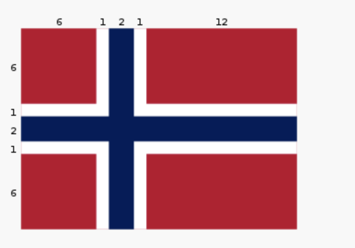
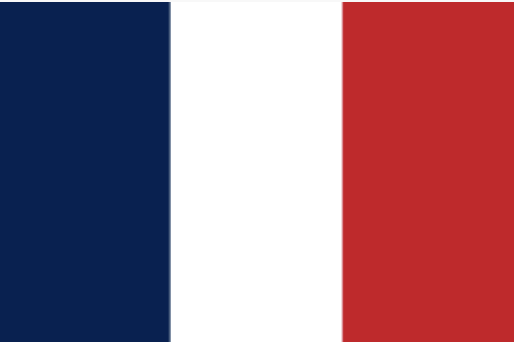
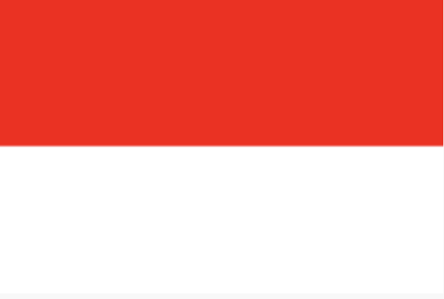
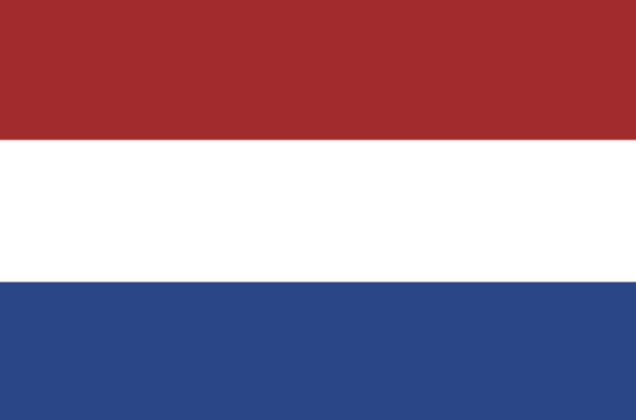
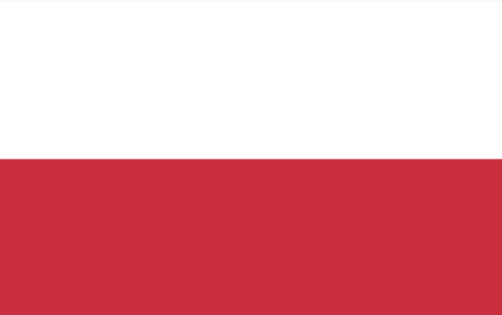
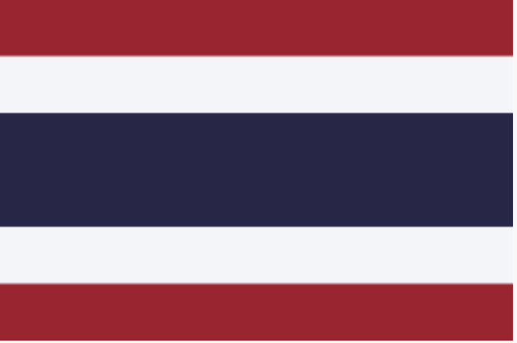
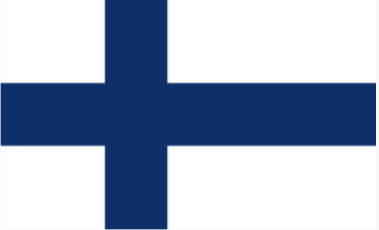

=====================
Studio 4: Flag Day 
=====================

**Studio activities should not be started before class! Come to the session and work on the activity with other students!**

Studio Setup and Procedure
==========================

You know the drill by now! 2–3 students per group. Here's `the Github link <https://classroom.github.com/a/Iu9Pnjlw>`_.

Overview
=====================

* Understanding how to draw things using ``StdDraw``

* Practice reading data in from a file

* Experiencing *design at the intersection of human beings and computers*

Design is largely all about communicating your intentions in a way that other people can understand. Human-centered design, a critical concept in computing, means you’re always thinking about the people who will be using or seeing your work. In this case it’s also important to think about technical limitations and restraints on what you can easily draw.

Reading shape data from a file
=====================

Your first task is to use ``Scanner`` and ``StdDraw`` to draw shapes based on data from a file. Do not spend more than 40 minutes on this part before moving on to designing and drawing your own flag!

* Open up ``InterpretDrawingFile.Java.`` When the code is run, it will prompt you to select a ``.txt`` file from a pop-up window.

* In order to get an idea of what is in these ``.txt`` files, open up the ``resources`` folder and take a look.

These files are specifications for given shapes, and contain the following information in this exact order:

``String shapeType, int redComponent, int greenComponent, int blueComponent, boolean isFilled, double parameterOne, double parameterTwo, double parameterThree ...``

The ``double`` values at the end depend on the shape type (more on that below).

You will be creating code in the method that will read the data from the file you select in the dropdown and will draw the given shape.

* To read from the file, you can use ``Scanner`` methods like ``next()`` and ``nextInt()``. The ``in`` variable is already set up for you to take from the file instead of prompting for user input.

* Begin by just trying to create the rectangle. The final four parameters given in the file are ``double x, double y, double halfWidth, and double halfHeight``.

* Once you have read in the rectangle data, use ``StdDraw`` to draw the shape as specified in the file.

Once you are able to do this, test your code by editing the rectangle’s ``.txt`` file or creating a new ``.txt`` file!

* **If you have time**, generalize your code to work for ellipses and then triangles. Ellipses have the same final four parameters as rectangles while triangles are represented with ``double x1, double y1, double x2, double y2, double x3, double y3.``

* If you finish triangles and have time, discuss how you would need to change your code and the file format to work for any polygon.

Individual exercise, create your ideal country
=====================

Work *individually* on all of the following:

1. Take out paper and a pencil (or something to draw with)

2. Think about a couple words or phrases you would use to describe your ideal country. These should be concepts you’d want to communicate using a national flag. A couple questions to ask yourself are:

* What are the founding principles of your country?

* What does your country care about?

* What major exports do you envision for your country?

* What’s the landscape of your country?

* What kind of food does your country eat?

3. Write down some words or phrases that summarize your thoughts. Express at least three distinct concepts in a few words or phrases.

Individual exercise, create your country's flag
=====================

1. Continue to work ``individually``. Sketch out a design for a flag that captures the spirit of the significant words/phrases for your country. Keep in mind that you are creating something for the world to see.

You may want to review the `StdDraw API <http://introcs.cs.princeton.edu/java/stdlib/javadoc/StdDraw.html>`_ to get a sense of it’s capabilities (and limitations).

2. Consult with a TA for feedback about drawing your design with ``StdDraw``.

3. Come back together with your studio group. Take turns showing off your flags. Have other members of your group try to guess your values based on your flag design. After hearing the guesses from your teammates let them know about the values that influenced your design.

Create your group's flag
=====================

Now you’re going to create your group flag (drawing on paper) by taking your favorite features of each flag and designing a singular flag to represent the combination of the individual flags. Make sure a component of each flag is captured in the unified flag. Once again, keep in mind that you need to be communicating your ideas in a way that others can understand.

Interacting with other groups, Share Feedback!
=====================

A crucial component to the design process is getting feedback from others and incorporating that feedback into your work.

1. Find a group next to you and share your group flag with them. Do not tell them the words or principles you based your flag on and see if they can guess. Take note of what their guesses are! Are their guesses close to what you intended or are they way off? What does this say about your design and the way you communicate your ideas?

2. Take note of their guesses and feedback!

3. Tell the other group what your flag was actually based on and see if they have any suggestions on how to modify it to make it clearer to others.

4. Make sure to give feedback after receiving it!

5. Try to incorporate their feedback into your design! What do you need to change? Do you need to change a couple small things or the whole layout?

6. Don’t be afraid to completely redo it. We all make mistakes and part of the design process is realizing our mistakes and not being afraid to do something over! It’s all about iteration.

Draw your flag
=====================

Now that you have perfected your flag using the feedback provided it’s time to draw it using ``StdDraw``!

1. Open the ``Flag`` class in ``studio4`` package 

2. Add code that creates your group’s flag. Some things to note:

   * Most of the drawing methods use the coordinates for the center of an object

   * Often methods need additional detail about how to draw outward from the center, like a circle’s radius or or a half-width and half-height for rectangles.

   * Sedgewick library provides several pre-defined colors. If you start to type something like: ``StdDraw``. then VS Code will fill in possibilities after the . which will include the colors at the top of that list.

3. Frame your flag by surrounding it by a black rectangle of substantial thickness (an unfilled rectangle).

4. When you’re done share your work! Show your flag to your neighbors/TAs.

Norway, Mother of all Flags
=====================

There will almost certainly not be time for this during studio (improve your flag design first!), but it is here for those interested. In ``NorwayMotherOfAllFlags.java`` we will be using Norway’s flag to create upto six other flags found within it.

Whlie this task is seemingly just for fun, there is an important lesson to be found. Somtimes, when coding and otherwise, a small change to the problem setup can lead to a much simpler solution. Like when converting an integral to polar coordinates in math, the way the problem is framed can make a huge difference in how clean the work is and how much time it takes. For example, in implementing the ``norway()`` method, we could have calculated the correct rectangles in StdDraw’s default (0..1, 0..1) space. Why do that when the values are right there in the image in (0..22, 0..16)?

::

   private static void mother() {
      StdDraw.clear();
      StdDraw.setPenColor(255, 0, 0);
      StdDraw.filledRectangle(3, 3, 3, 3);
      StdDraw.filledRectangle(3, 13, 3, 3);
      StdDraw.filledRectangle(16, 3, 6, 3);
      StdDraw.filledRectangle(16, 13, 6, 3);
      StdDraw.setPenColor(0, 0, 127);
      StdDraw.filledRectangle(11, 8, 11, 1);
      StdDraw.filledRectangle(8, 8, 1, 8);
   }

   public static void norway() {
      StdDraw.setXscale(0, 22);
      StdDraw.setYscale(0, 16);c
      mother();
   }

Below are the steps for this task:

* Some code has been written for you in ``main()`` and under the methods ``mother()`` and ``norway()``. Run the program to see what it looks like to begin with.

* Investigate ``StdDraw.setXscale(min, max)`` and ``StdDraw.setYscale(min, max)``.

* Six other methods (labeled with ``// TODO``) remain to be completed. Can you figure out how to create these flags? Investigat the ``norway()`` method as an example to see how your code might look.

|

* France

|

|

* Indonesia (note: the bottom half of this flag is white)

|

|

* Netherlands

|

|

* Poland (note: the top half of this flag is white)

|

|

* Thailand 

|

|

* Finland

|

Demo
=====================

**Commit and Push your work.** Be sure that any file you worked on is updated on `GitHub <https://github.com/>`_. This way the other members of your team will be able to access the code that you worked on.

To get participation credit for your work talk to the TA you’ve been working with and complete the demo/review process. Be prepared to show them the work that you have done and answer their questions about it!

