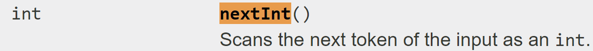

.. qnum::
   :prefix: 5-1-
   :start: 1
   
.. |CodingEx| image:: ../../_static/codingExercise.png
    :width: 30px
    :align: middle
    :alt: coding exercise
    
    
.. |Exercise| image:: ../../_static/exercise.png
    :width: 35
    :align: middle
    :alt: exercise
    
    
.. |Groupwork| image:: ../../_static/groupwork.png
    :width: 35
    :align: middle
    :alt: groupwork

..	index::    
	single: method 
    single: return
    single: parameter
    single: argument
    single: abstraction
    pair: method; parameter
    pair: method; argument
    pair: method; return 

Input and Output
=================

To get the exercises repository for modules 4-6, click `here <https://classroom.github.com/a/tq4oIpoF>`_.

In this unit we will learn how to write code such that we can better interact with our users. 
Computers are very different from humans, especially in the way that they communication information. The 
study of how humans and computers interface with each other is called `Human Computer Interaction <https://en.wikipedia.org/wiki/Human%E2%80%93computer_interaction>`_, a major area 
of study within the field of computer science.

In this module, we will use an `application programming interface <https://en.wikipedia.org/wiki/API>`_ to produce output that is more friendly to humans, 
specifically we will be drawing pictures and animations which can be used to convey all kinds of fun ideas to our 
fellow humans (but remain rather boring blocks of code to our helpful computer friends). Application programming interfaces 
are useful because they allow us to focus on the big picture and ignore details that we don't necessarily need to know or care about. 

Before we take a look at a graphics API, let's look at an API that we are already familiar with for reading text: ``Scanner``.

Scanner: A Text API
----------------------

You are already familiar with using ``Scanner`` to read in values from the keyboard, it is one of the first things you 
were shown in the first module. You have probably also noticed that there are lots of other things that Scanner can do 
that we haven't used yet.

Take a look at the `API <https://docs.oracle.com/javase/7/docs/api/java/util/Scanner.html>`_ for ``Scanner``. This is the official Java documentation and lists everything that Scanner can do. In particular, take a look 
at the list of methods. You'll see some familiar methods on there like `nextInt()`. You'll see some other methods on there that may look new and confusing. 
You can click on one to be taken to a more detailed description, but don't worry about it if you don't understand everything that you're looking at, that isn't 
really the point. 

The idea behind using an API is that we can find some code that helps us perform some action and use that code without necessarily needing to understand how it works. 
For example, when you use `nextInt()` there's a lot going on to retrieve the integer that user typed in, but all we really care about is getting that integer into our code. 
Let's take a look at the API section for nextInt():

This part of the API shows us what input the method requires to run (in this case nothing, since there's nothing in the parentheses), as well as what the method will output or "return" 
to us (in this case an int, the one that was typed in by the user). This tells you, the programmer, that you could use it in a line of code like this:

``int sticks = in.nextInt();``

This is a very powerful idea: a very complex method can be described very simply in terms of its inputs and outputs, allowing code to be shared and used more widely and freely.

A Note about Files
------------------

The following exercise as well as many of the exercises and assignments coming up require you to read data from files. Just like ``Scanner``, there is a `File API <https://docs.oracle.com/javase/7/docs/api/java/io/File.html>`_ that can be used 
to interact with files on your computer. You'll see the first example of this in the following exercise.

Unlike ``Scanner``, **you are not responsible for knowing how to use Files or understanding how that code works for this course.** You're welcome to ignore it for now, though TAs and the instructor will be happy to answer any questions you may have about how the code works.

|CodingEx| **Coding Exercise**

Take a look at the ``Stats.java`` program. You'll notice that it first allows the user to select a file that contains doubles. It then reads in these doubles and prints them out one at a time. 

It does this using a new method, ``hasNextDouble()``. Using the provided code and the Scanner API, make sure you understand how this method is being used.

Modify the given code to find the maximum, minimum, average, and count of all of the values read in from the file.