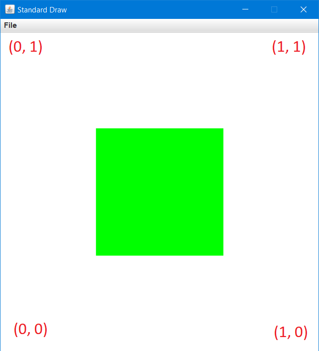

.. qnum::
   :prefix: 5-1-
   :start: 1
   
.. |CodingEx| image:: ../../_static/codingExercise.png
    :width: 30px
    :align: middle
    :alt: coding exercise
    
    
.. |Exercise| image:: ../../_static/exercise.png
    :width: 35
    :align: middle
    :alt: exercise
    
    
.. |Groupwork| image:: ../../_static/groupwork.png
    :width: 35
    :align: middle
    :alt: groupwork

..	index::    
	single: method 
    single: return
    single: parameter
    single: argument
    single: abstraction
    pair: method; parameter
    pair: method; argument
    pair: method; return 
    
A Graphics API: StdDraw
=======================

Using computers for artistic expression is not a new idea. Consider, however, that there is a lot of work involved in simply displaying an image onto a screen:

1. Read the image data in whatever format it comes in. This could be a program (like the ones you are about to see) or it could be a file like a PNG or GIF.

2. Convert that data into colors. Computers represent colors in a particular way, which you will soon see.

3. Determine the positioning of the image on the screen. Your computer screen has a coordinate system just like you've seen in your math classes.

To perform all of these tasks ourselves would be very complicated and take lots of time. Fortunately, a lot of these tasks such as displaying colors and positioning things on the screen are repetitve, well known tasks that have well known solutions. Instead of recreating them all ourselves, we will use an API to assist us. This API performs some of the more complicated tasks that we don't necessarily need to concern ourselves with so that we can focus on the more important things, like what colors and shapes we would like to have in the images that we are about to compose.

Read on to learn more about how to use the `StdDraw API <https://introcs.cs.princeton.edu/java/stdlib/javadoc/StdDraw.html>`_.

Color and Canvas
----------------

Before we can draw things it is important to understand how colors are represented on the computer. While there are many ways to consider colors on the computer, we will use the common `RGB <https://en.wikipedia.org/wiki/RGB_color_model>`_ color model.

In this model there are three values: Red, Green, and Blue. Each of these values are integers that can range from 0-255. So if I wished to make purple, which is a combination of Red and Blue, I could create it in my code as follows:

``Color purple = new Color(255, 0, 255);``

The ``purple`` variable could then be used wherever I would like to use that color. Of course there are also some built-in colors that you can access, such as ``Color.PURPLE``.

To see what kinds of colors can be created using this model, you can use `this tool <https://www.w3schools.com/colors/colors_rgb.asp>`_.

To start adding shapes to the screen, we will use the `StdDraw API <https://introcs.cs.princeton.edu/java/stdlib/javadoc/StdDraw.html>`_. Take a look at the API and notice that there are lots of different shapes mentioned as well as things like a canvas and a pen.

To draw something on the screen you would first set the pen color:

``StdDraw.setPenColor(Color.GREEN); //or use a custom color here!``

You can then use one of the API methods to draw something on the canvas:

``StdDraw.filledSquare(0.5, 0.5, 0.2);``

The resulting image would look something like this (the coordinates are added for reference and are not part of what was drawn by the code):

Using the information from the API and the image above, can you determine what the three values (0.5, 0.5, 0.2) represent? They are important!

In this example those values represent the x, y position of the center of the square as well as the "radius" of the square that gets drawn. Typically, this process works in the other direction: we wish to draw something on the screen and refer to the API to figure out how to do it!

|CodingEx| **Coding Exercise**

Open the ``E01GraphicsDemo`` program and examine the code that has been provided. It shows you how to use 
standard colors as well as custom colors of your choosing. Use the `StdDraw API <https://introcs.cs.princeton.edu/java/stdlib/javadoc/StdDraw.html>`_ to complete the exercises at the bottom of the program.

Mouse and Keyboard
------------------

We have already seen how to interact with the keyboard using ``Scanner`` in previous units. For "real-time" applications that require immediate feedback from the keyboard and mouse, Scanner doesn't really work.

The `StdDraw API <https://introcs.cs.princeton.edu/java/stdlib/javadoc/StdDraw.html>`_ also has methods that can be used to see if a particular key has been pressed or the position of the mouse, for example. Keep in mind these two important points when working with keyboard and mouse input:

1. Your users are unpredictable

2. The computer is VERY fast (faster than any human)

This means that we need to write code to have the computer wait for something to happen (such as a key press or button click) and then perform some desired action.

We see this represented at the very beginning of the ``E02KeyboardDemo`` program::

	while(!StdDraw.hasNextKeyTyped()) {
		StdDraw.pause(100);
	}

Without this loop, our computer would only check to see if a key was typed **one time** at the **beginning** of the program, and since the computer is so fast it is unlikely that we as humans will hit a key in that very small window. Including it as part of a loop means that the computer is continuously checking to see if a key has been pressed, with a short pause in between each check to allow the computer to do other things.

Once a key has been pressed, the loop exits. We can then get the key that was pressed as a ``char`` (not a ``String`` since it is a single character), which we can then check the value of. Notice that when comparing ``char`` values the letter being compared is in single quotes, as opposed to the double quotes we are used to using for ``Strings``.

For an example of how to use the mouse, inspect the ``E03MouseDemo`` program. This program shows how to use ``StdDraw`` to get the position of the mouse::

	double x = StdDraw.mouseX();
	double y = StdDraw.mouseY();
	
as well as whether the mouse button was pressed::

	boolean isPressed = StdDraw.mousePressed();
	
The program displays this information once per second. Play around with this short demo and make sure that you understand how it works. You can always refer to the `StdDraw API <https://introcs.cs.princeton.edu/java/stdlib/javadoc/StdDraw.html>`_ for more information about a particular method!

|CodingEx| **Coding Exercise**

Open the ``E04WaitPoint`` program. You should write code using the `StdDraw API <https://introcs.cs.princeton.edu/java/stdlib/javadoc/StdDraw.html>`_ to do the following:

* Waits until the mouse has been pressed

* Waits until the mouse has been released

* Draws a visible point at the spot where the mouse was released

* Waits until the user has typed a ``q``, ignoring all other keys

* Writes a goodbye message to the canvas

Be sure to write this code one step at a time, testing as you go.

Animation
---------

Animation consists of repeatedly drawing images (called frames) fast enough to fool the human brain into thinking that the images are moving or "animated." The repetitve nature of the animation allows use to use a standard **animation loop** in our code to produce whatever animations we would like. Each animation loop consists of three parts:

1. Clear the canvas, so that we can draw the next frame

2. Update the positions of anything that needs to move, then draw the entire frame (the whole thing, not just the moving parts!)

3. Pause briefly, to give the human brain enough time to process the frame that is being displayed before rendering the next frame

To see the animation loop in action, examine the ``E05MovingBall`` program. The first step of the loop is accomplished with a call to ``StdDraw.clear()``. 

Notice how the position of the ball is updated every frame before the ball is redrawn. Special logic is included to keep the ball in bounds once it reaches the edge of the canvas. This logic isn't very realistic, however. Could you change the code to make the ball "bounce" off the edge of the screen instead?

After updating the position of the ball and drawing it in step 2, a call to ``StdDraw.show()`` is used to accomplish step 3 of our animation loop.

Of these steps, step 2 is the one that can often get quite involved. If there are a lot of moving parts to your animation then it could potentially lead to a lot of work to update all of their positions and redraw everything. Keep in mind, however, that the general structure of the animation loop remains the same regardless of what is being animated.

|CodingEx| **Coding Exercise**

Open the ``E06MouseFollower`` program, which already contains a standard animation loop. 

Use the `StdDraw API <https://introcs.cs.princeton.edu/java/stdlib/javadoc/StdDraw.html>`_ to draw a point on the canvas that follows the mouse. To do this, you will need to acquire the coordinates of the mouse, then draw something at that point.

Once you get it working, experiment with the timings to see if you can get the image to "lag" behind the mouse.
