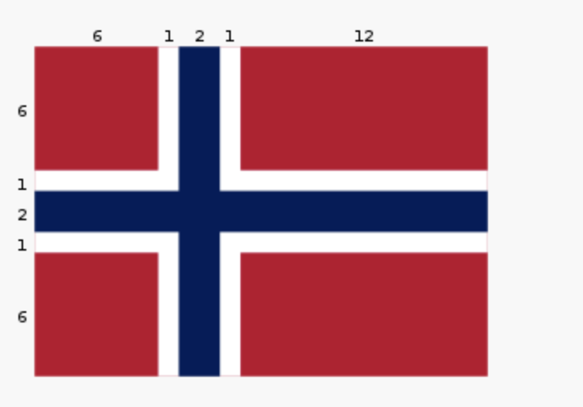
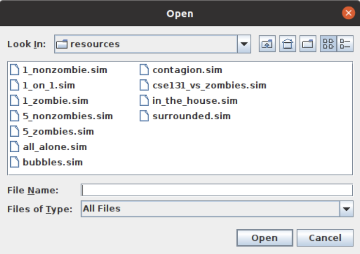
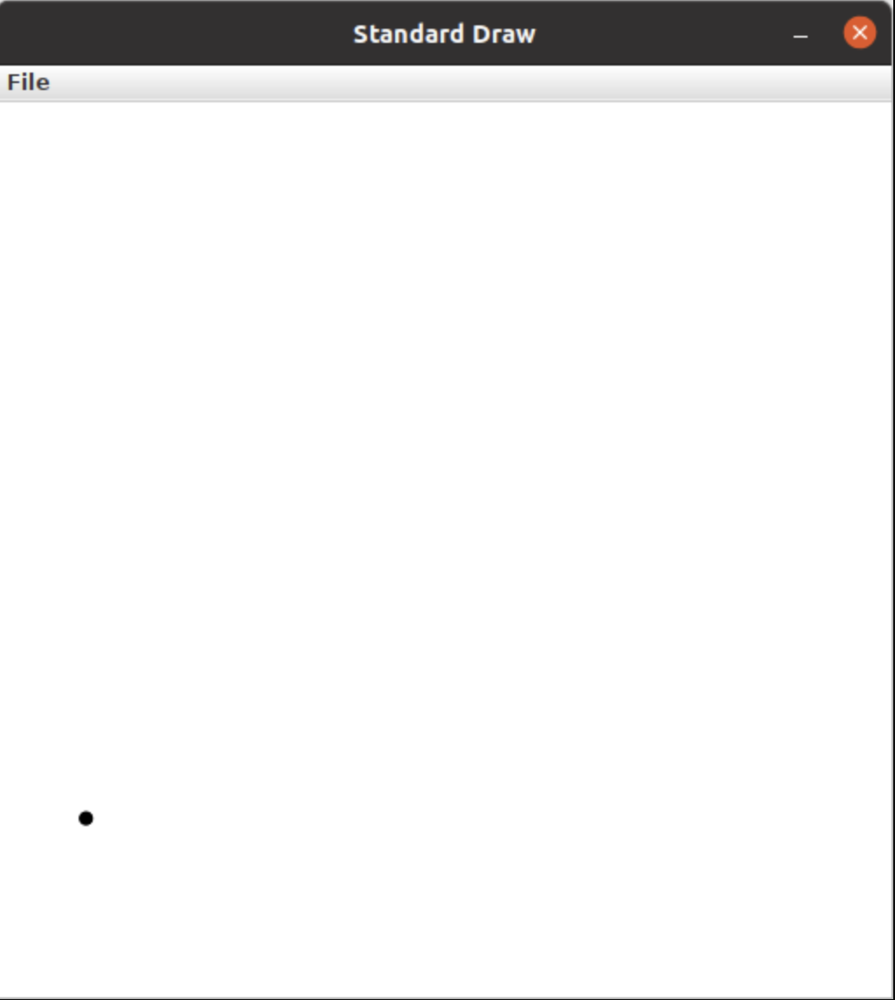
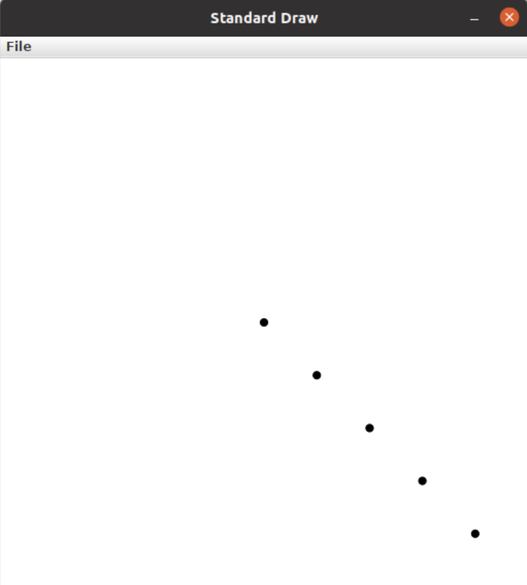
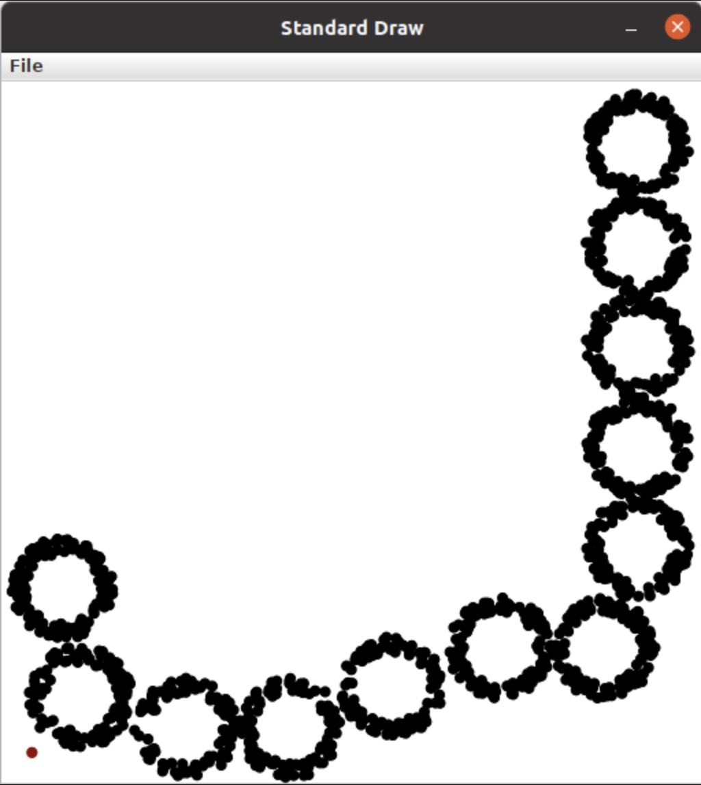
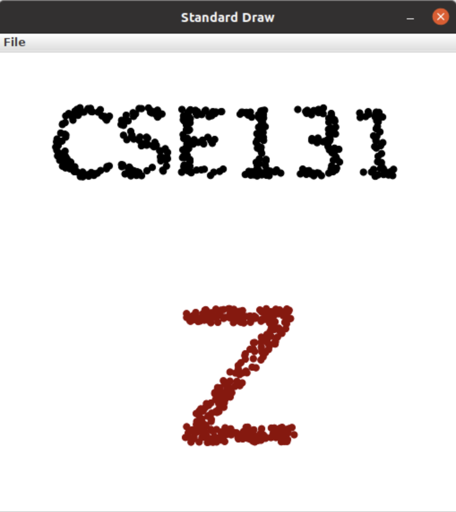
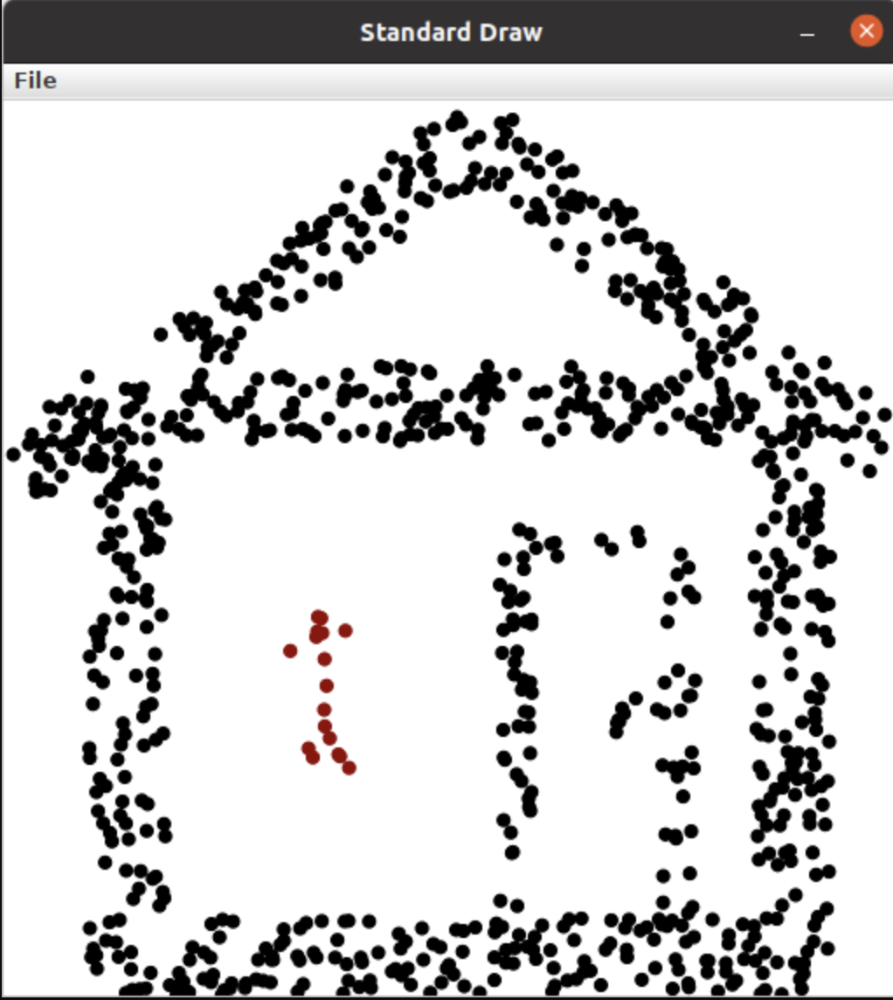
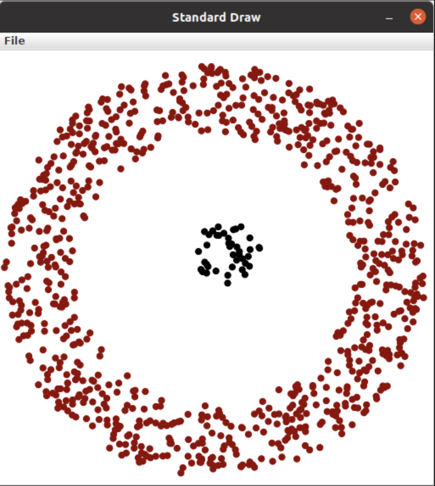

=====================
Module 4
=====================

.. Here is were you specify the content and order of your new book.

.. Each section heading (e.g. "SECTION 1: A Random Section") will be
   a heading in the table of contents. Source files that should be
   generated and included in that section should be placed on individual
   lines, with one line separating the first source filename and the
   :maxdepth: line.

.. Sources can also be included from subfolders of this directory.
   (e.g. "DataStructures/queues.rst").

Exercise : 4.3.0 Statistics for a list of numbers 
:::::::::::::::::::::::::::::::::::::::::::::::::::

* Find and open the ``Stats`` Java program in the ``exercises4`` package of the ``exercises`` source folder.

* Write code as directed to compute the specified statistics for the numbers that you read in.

  * Compute the sum

  * Compute the average

  * Compute the count (i.e., how many numbers are in the file)

  * Find the maximum value 

  * Find the minimum value

Exercise : 4.50. Permuting an array
:::::::::::::::::::::::::::::::::::::::::::::::::::

* Find and open the ``WaitPoint`` Java program in the ``exercises4`` package of the ``exercises`` source folder.

* Write code that does the following:

  * Waits until the mouse has been pressed

  * Waits until the mouse has been released

  * Draws a visible point at the spot where the mouse was released

  * Waits until the user has typed a ``q`` (all other keys are ignored)

  * Writes text on the graphic screen that says goodbye

   Do this a step at a time, testing your code. Look at the solution video intermittently as necessary.

Exercise : 4.60. Example of animation
:::::::::::::::::::::::::::::::::::::::::::::::::::

* Find and open the ``MouseFollower`` Java program in the ``exercises4`` package of the ``exercises`` source folder.

* That code already contains the standard animation loop:

  * ``StdDraw.clear()`` at the beginning, to wipe the graphics display clean

  * Your code will then paint one frame of the animation

  * ``StdDraw.show(10)`` produces what you have drawn on the screen and waits 10 milliseconds before continuing. Eclipse may draw a line through the show(10) command and underline it in yellow. You can ignore this (it’s a warning that ``show(...)`` may not be available in future updates of the ``StdDraw`` functions. It’s being replaced with another approach).

By using ``show(..)``, the drawing you do is not actually ``shown`` between calls to show. Instead, the drawing is done in memory, off the screen, which is much faster.

When you call ``show()``, the work you have done off screen is put on screen all at once.

The program also pauses for the specified time, usually 10 to 50 milliseconds. Pausing allows your computer to do something else for a while, which will make your computer feel more responsive in the other applications that are running.

* First try to get a ball on the screen to follow your mouse. This consists of reading the mouse's coordinates, and painting a ball at that spot.

* When you have that working, try to think of how you could make the ball appear to lag in its mouse-following activities.

   As a hint, think about keeping some history of where the mouse has been. You can then have the ball go to locations in the mouse's past.

Studio 4: Flag Day 
::::::::::::::::::::::::::::::::::::::::::::::::::::::::::::::::

**Studio activities should not be started before class! Come to the session and work on the activity with other students!**

* `Studio Setup and Procedure`_

* `Overview`_

* `Studio Procedure`_

  * `Reading shape data from a file`_

  * `Individual exercise, create your ideal country`_

  * `Individual exercise, create your country's flag`_

  * `Create your group's flag`_

  * `Interacting with other groups, Share Feedback!`_

  * `Draw your flag`_
  
  * `Norway, Mother of all Flags`_

* `Demo`_

.. _Studio Setup and Procedure:

**Studio Setup and Procedure**

* Form a group of 2-3 students and find a TA or instructor to work with.

* All but one member of your group should have this web page open so you can follow along and see the instructions as you work.

* Plan to work on one computer (using Eclipse).

  * Initially, one of you will be in charge of typing at that computer.

  * Throughout the studio you should trade who is in charge of the keyboard.

**READ THE FOLLOWING FULLY BEFORE PROCEEDING**

1. Have **one person** in your group create a new team by `Logo <https://classroom.github.com/g/n3TfYnGC>`_ here and going to the ``OR Create a new team`` box at the bottom of the page. The team name should include the last names of all your group members. For example, if Xia and Smith are working together, the team name should be something like “XiaSmith”.

2. **After the team is created**, all other members of your team should click on the same link and follow the instructions to join the team.

   1. **Be careful to join the right team!** You won’t be able to change teams yourself and will have to contact instructors if there’s a problem.

   2. **Be sure everyone else joins the team!** If grades don’t get entered correctly we will use the team to help verify credit for a particular studio.

3. Finally, one person should import the studio repository into Eclipse, as described in `Assignment 0’s Add the assignment to Eclipse <https://classes.engineering.wustl.edu/2021/fall/cse131//modules/0/assignment#4-add-the-assignment-to-eclipse>`_

   * All team members will have access to the work pushed to GitHub. Be sure to ``Commit and Push`` at the end of the day so everyone can refer back to the work later as needed.

.. _Overview:

**Overview**

* Understanding how to draw things using ``StdDraw``

* Practice reading data in from a file

* Experiencing *design at the intersection of human beings and computers*

Design is largely all about communicating your intentions in a way that other people can understand. Human-centered design, a critical concept in computing, means you’re always thinking about the people who will be using or seeing your work. In this case it’s also important to think about technical limitations and restraints on what you can easily draw.

.. _Studio Procedure:

**Procedure**

.. _Reading shape data from a file:

**Reading shape data from a file**

Your first task is to use ``ArgsProcessor`` and ``StdDraw`` to draw shapes based on data from a file. Do not spend more than 40 minutes on this part before moving on to designing and drawing your own flag!

* Open up ``InterpretDrawingFile.Java.`` When the code is run, it will prompt you to select a ``.txt`` file from a pop-up window.

* In order to get an idea of what is in these ``.txt`` files, open up the folders ``support_src`` and ``studio4.resources`` and take a look.

These files are specifications for given shapes, and contain the following information in this exact order:

``String shapeType, int redComponent, int greenComponent, int blueComponent, boolean isFilled, double parameterOne, double parameterTwo, double parameterThree ...``

The ``double`` values at the end depend on the shape type (more on that below).

You will be creating code in the method ``readFileViaArgsProcessorAndDraw(ArgsProcessor ap)`` that will read the data from the file you select in the dropdown and will draw the given shape.

* To read from the file, you can use ``ArgsProcessor`` methods like ``ap.nextString()`` and ``ap.nextInt()``. The ``ap`` variable is already set up for you to take from the file instead of prompting for user input.

* Begin by just trying to create the rectangle. The final four parameters given in the file are ``double x, double y, double halfWidth, and double halfHeigh``.

* Once you have read in the rectangle data, use ``StdDraw`` to draw the shape as specified in the file.

Once you are able to do this, test your code by editing the rectangle’s ``.txt`` file or creating a new ``.txt`` file!

* **If you have time**, generalize your code to work for ellipses and then triangles. Ellipses have the same final four parameters as rectangles while triangles are represented with ``double x1, double y1, double x2, double y2, double x3, double y3.``

* If you finish triangles and have time, discuss how you would need to change your code and the file format to work for any polygon.

.. _Individual exercise, create your ideal country:

**Individual exercise, create your ideal country**

Work *individually* on all of the following:

1. Take out paper and a pencil (or something to draw with)

2. Think about a couple words or phrases you would use to describe your ideal country. These should be concepts you’d want to communicate using a national flag. A couple questions to ask yourself are:

* What are the founding principles of your country?

* What does your country care about?

* What major exports do you envision for your country?

* What’s the landscape of your country?

* What kind of food does your country eat?

3. Write down some words or phrases that summarize your thoughts. Express at least three distinct concepts in a few words or phrases.

.. _Individual exercise, create your country's flag:

**Individual exercise, create your country's flag**

1.Continue to work ``individually``. Sketch out a design for a flag that captures the spirit of the significant words/phrases for your country. Keep in mind that you are creating something for the world to see.

You may want to review the `StdDraw API <http://introcs.cs.princeton.edu/java/stdlib/javadoc/StdDraw.html>`_ to get a sense of it’s capabilities (and limitations).

2. Consult with a TA for feedback about drawing your design with ``StdDraw``.

3. Come back together with your studio group. Take turns showing off your flags. Have other members of your group try to guess your values based on your flag design. After hearing the guesses from your teammates let them know about the values that influenced your design.

.. _Create your group's flag:

**Create your group's flag**

Now you’re going to create your group flag (drawing on paper) by taking your favorite features of each flag and designing a singular flag to represent the combination of the individual flags. Make sure a component of each flag is captured in the unified flag. Once again, keep in mind that you need to be communicating your ideas in a way that others can understand.

.. _Interacting with other groups, Share Feedback!:

**Interacting with other groups, Share Feedback!**

A crucial component to the design process is getting feedback from others and incorporating that feedback into your work.

1.Find a group next to you and share your group flag with them. Do not tell them the words or principles you based your flag on and see if they can guess. Take note of what their guesses are! Are their guesses close to what you intended or are they way off? What does this say about your design and the way you communicate your ideas?

2. Take note of their guesses and feedback!

3. Tell the other group what your flag was actually based on and see if they have any suggestions on how to modify it to make it clearer to others.

4. Make sure to give feedback after receiving it!

5. Try to incorporate their feedback into your design! What do you need to change? Do you need to change a couple small things or the whole layout?

6. Don’t be afraid to completely redo it. We all make mistakes and part of the design process is realizing our mistakes and not being afraid to do something over! It’s all about iteration.

.. _Draw your flag:

**Draw your flag** 

Now that you have perfected your flag using the feedback provided it’s time to draw it using ``StdDraw``!

1. Open the ``Flag`` class in ``studio4`` package 

2. Add code that creates your group’s flag. Some things to note:

   * Most of the drawing methods use the coordinates for the center of an object

   * Often methods need additional detail about how to draw outward from the center, like a circle’s radius or or a half-width and half-height for rectangles.

   * Sedgewick library provides several pre-defined colors. If you start to type something like: ``StdDraw``. then eclipse will fill in possibilities after the . which will include the colors at the top of that list.

3. Frame your flag by surrounding it by a black rectangle of substantial thickness (an unfilled rectangle).

4. When you’re done share your work! Show your flag to your neighbors/TAs.

.. _Norway, Mother of all Flags:

**Norway, Mother of all Flags**

There will almost certainly not be time for this during studio (improve your flag design first!), but it is here for those interested. In ``NorwayMotherOfAllFlags.java`` we will be using Norway’s flag to create upto six other flags found within it.

Whlie this task is seemingly just for fun, there is an important lesson to be found. Somtimes, when coding and otherwise, a small change to the problem setup can lead to a much simpler solution. Like when converting an integral to polar coordinates in math, the way the problem is framed can make a huge difference in how clean the work is and how much time it takes. For example, in implementing the ``norway()`` method, we could have calculated the correct rectangles in StdDraw’s default (0..1, 0..1) space. Why do that when the values are right there in the image in (0..22, 0..16)?

::

   private static void mother() {
      StdDraw.clear();
      StdDraw.setPenColor(255, 0, 0);
      StdDraw.filledRectangle(3, 3, 3, 3);
      StdDraw.filledRectangle(3, 13, 3, 3);
      StdDraw.filledRectangle(16, 3, 6, 3);
      StdDraw.filledRectangle(16, 13, 6, 3);
      StdDraw.setPenColor(0, 0, 127);
      StdDraw.filledRectangle(11, 8, 11, 1);
      StdDraw.filledRectangle(8, 8, 1, 8);
   }

   public static void norway() {
      StdDraw.setXscale(0, 22);
      StdDraw.setYscale(0, 16);c
      mother();
   }

Below are the steps for this task:

* Some code has been written for you in ``main()`` and under the methods ``mother()`` and ``norway()``. Run the program to see what it looks like to begin with.

* Investigate ``StdDraw.setXscale(min, max)`` and ``StdDraw.setYscale(min, max)``.

* Six other methods (labeled with ``// TODO``) remain to be completed. Can you figure out how to create these flags? Investigat the ``norway()`` method as an example to see how your code might look.

|

* France

|

|

* Indonesia (note: the bottom half of this flag is white)

|

|

* Netherlands

|

|

* Poland (note: the top half of this flag is white)

|

|

* Thailand 

|

|

* Finland

|

.. _Demo:

**Demo**

**Commit and Push** your work. Be sure that any file you worked on is updated on `GitHub <https://github.com/>`_.

To get participation credit for your work talk to the TA you’ve been working with and complete the demo/review process. Be prepared to show them the work that you have done and answer their questions about it!

*Before leaving check that everyone in your group has a grade recorded in Canvas!*

Assignment 4: APIsolutely About Zombies
::::::::::::::::::::::::::::::::::::::::::::::::::::::::::::::::

* `Assignment Setup`_

* `Zombies`_

* `Information Needed`_

  * `Data Management`_

  * `Data Encoding`_ 

  * `A Note About Strings`_

* `APIs`_

  * `Using ArgsProcessor to read from a file`_

* `Assignment Requirements`_

* `Assignment Procedure`_

* `Submitting your work`_

.. _Assignment Setup:

**Assignment Setup**

To create your repository go `here <https://classroom.github.com/a/WW7vHns2>`__. Then follow the same accept/import process described in `Assignment 0 <https://classes.engineering.wustl.edu/2021/fall/cse131//modules/0/assignment>`_.

.. Zombies:

**Zombies**

This assignment is the first step in a sequence of assignments that will simulate `zombies <https://en.wikipedia.org/wiki/Zombie>`_! In this part you will prepare the simulation data and display the entities being simulated (the zombies and non-zombies/humans). In the next part (Assignment 5) we will actually simulate the interaction between the two.

There are a few reasons for this choice of subject matter:

* These assignments show a real-world application of computing. The structure we will create is used in many simulations and games, and computer scientists often do similar work to visualize data and understand natural phenomena.

  * Games and simulations often have a loop that simulates time steps. The typical flow of this loop is:

  1. Check if the game/simulation should continue (part of Assignment 5)

  2. Update all the items being simulated for the current time step (part of Assignment 5)
 
  3. Show or record any progress (we’ll do this here in Assignment 4)

* Simulating biological systems can be fascinating but complex. Using zombies allows us to simplify the rules of the system, which means shorter assignments more focused on the CS concepts we want you to learn.

.. _Information Needed:

**Information Needed** 

In order to simulate how a zombie infection can spread, we will simulate:

* Zombies, which have a 2D location. The x and y values can range from 0.0 to 1.0.

* Non-Zombies, which also have a 2D location with values ranging from 0.0 to 1.0.

In other words, for every entity (zombie or non-zombie), we will want to keep track of the entity’s current coordinates and whether the entity is a zombie. We can use a boolean for the entity type, with true to indicate a zombie and false to indicate a non-zombie.

.. _Data Management:

**Data Management**

There are several ways to manage information like this. For this assignment, we’ll use an approach sometimes called `parallel arrays <https://en.wikipedia.org/wiki/Parallel_array>`_. The basic idea is that we will have three arrays to keep track of ``N`` entities:

1. An array of length ``N`` that contains whether or not each entity is a zombie. Call this the ``areZombies`` array.

2. An array of length ``N`` that contains the x coordinates of all the entities. Call this the ``xs`` array.

Each thing being simulated will be associated with an index. For example, ``areZombies[0]``, ``xs[0]``, and ``ys[0]`` represent the type and coordinates of a single entity in our simulation. In a sense you can think about ``areZombies``, ``xs``, and ``ys`` as being columns in a table. Each individual row of the table represents a specific thing being simulated. The three arrays are considered “in parallel” since the i-th items in each array represent different aspects of a single composite thing.

.. _Data Encoding:

The initial locations of zombies and non-zombies will be provided in a file. The file will have a very specific format:

* The first line of the file will indicate how many entities are in the file (``N``)

* The next ``N`` lines will each contain information for a single entity:

  * Each line will start with a ``String``. ``"Zombie"`` indicates a zombie and ``"Nonzombie"`` indicates a non-zombie.

  * Second will be a real number (``double``) indicating the initial x position of the entity.

  * Third will be another real number (``double``) indicating the initial y position of the entity.

We’ve included several example files. When you run the program, you will see a file dialog box that will allow you to pick a ``.sim`` file. This is the file that your code will read from (click to enlargen examples below).

* 1_nonzombie.sim: 

|

|

* 1_on_1.sim: 

|

.. image:: 1_on_1.png
  :alt: 1_on_1
  :width: 300
  :height: 200
  :align: center

| 

* 1_zombie.sim: 

|

.. image:: 1_zombie.png
  :alt: 1_zombie
  :width: 300
  :height: 200
  :align: center

|

* 5_nonzombies.sim: 

|

|

* 5_zombies.sim: 

|

.. image:: 5_zombies.png
  :alt: 5_zombies
  :width: 300
  :height: 200
  :align: center

|

* all_alone.sim: 

|

.. image:: all_alone.png
  :alt: all_alone
  :width: 300
  :height: 200
  :align: center

|

* bubbles.sim: 

|

|

* contagion.sim: 

|

.. image:: contagion.png
  :alt: contagion
  :width: 300
  :height: 200
  :align: center

|

* cse131_vs_zombies.sim: 

|

|

* in_the_house.sim: 

|

|

* surrounded.sim: 

|

|

.. _A Note About Strings:

**A Note About Strings**

Although the files will contain a String for each entity type, we will want to represent the type as a boolean value in our areZombies array.

Unlike primitive data types (``int``, ``double``, ``boolean``, etc.), comparing the value of two Strings requires using ``.equals()`` instead of ``==``. Using ``==`` on Strings checks if the two Strings are the exact same object while ``.equals()`` checks if the Strings contain the same characters. Here is an example of the difference between the two approaches:

.. youtube:: uM19VWfas10

.. _APIs:

**APIs**

This assignment will utilize two different APIs:

* ``ArgsProcessor``: This allows us to read data from a file. We’ll get the type and location of all entities from a file. This is slightly different from how we have used ArgsProcessor in the past, as we will not be prompting the user for input values.

* ``StdDraw``: This will allow us to display the location of the zombies and non-zombies as our simulation progresses.

.. _Using ArgsProcessor to read from a file:

* When ArgsProcessor is connected to a file, ``ap.nextDouble()``, will get the next value in the selected file if it’s a double. If the next value is not a double, it will ask the user for a double instead.

* Each time you call ``ap.nextDouble()``, ArgsProcessor will process that value, and the next call to ``ap.nextDouble()`` will return the next double in the file, whether it’s on the same line or the next.

* Make sure you use the method that asks for the data type that corresponds to the next value in the file. For example, if the next value in the file is a double, make sure to call ``ap.nextDouble()``, not ``ap.nextString()``. If a user input popup comes up, you are not calling methods in the right order.

.. _Assignment Requirements:

**Assignment Requirements**

Your work needs to:

1. Read all the information from the selected file and store it in parallel arrays. Use ``ArgsProcessor`` methods as described above.

2. Display all the elements in the simulation using Sedgewick’s ``StdDraw``.

* For full credit you *must* read in all entities and store them in arrays *before displaying anything*. (This structure will make future assignments easier.)

* Zombies should be displayed with filled red circles with a radius of ``0.008``.

* Non-Zombies should be displayed with filled black circles with a radius of ``0.008``.

3. Use ``StdDraw`` to display the ratio of Non-Zombies to total entities in the corner of the window (choose whatever corner you like). For example, in a simulation that has 3 Non-Zombies and 4 Zombies, this would look like “``3/7``”. Make sure that this display is readable.

.. _Assignment Procedure:

* Open the ``ZombieData`` in the ``assignment4`` package. One line has already been done for you. The remaining work is summarized with ``TODO`` comments.

* Use code to read in the first line of the file (the ``N``).

* Create arrays of appropriate size (for the “parallel data”).

* Read in each additional piece of data. Remember the file format: ``String``, ``double``, ``double``.

* Display all the entities using ``StdDraw``.

* Display the ratio of Non-Zombies to total entities in a corner of the canvas using ``StdDraw``.

When running the program:

* Select the file you wish to read from the file dialog box.

.. _Submitting your work:

**Submitting your work**

To submit your work come to office hours or class on an “Assignment day” and sign up for a demo via wustl-cse.help.