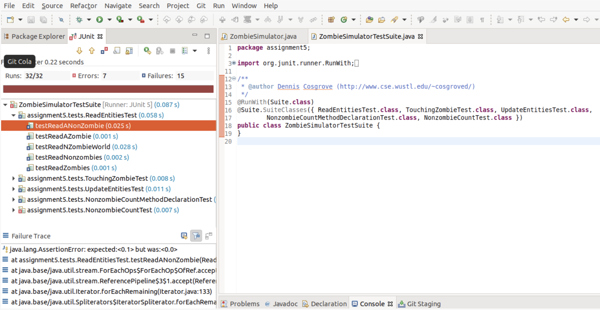
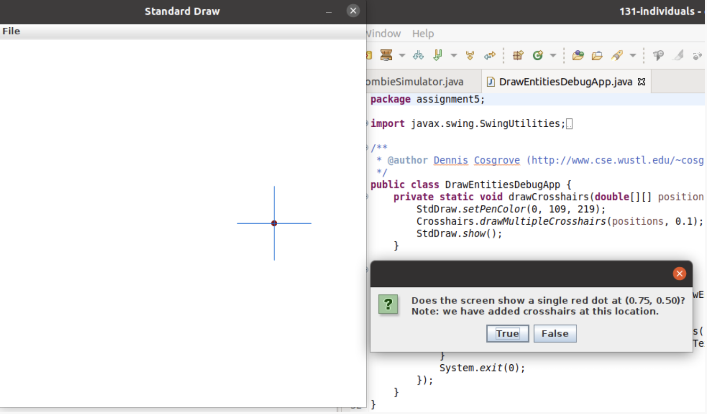

=====================
Assignment 5: Zombies: A METHOD to their Madness
=====================

Assignment Setup
=====================

To create your repository go `here <https://classroom.github.com/a/ASseqEoo>`_. Then follow the same accept/import process described in `the setup instructions <../Module0-Introduction/software.html>`_.

More Zombies... There's a METHOD to their Madness!
=====================

This assignment is a follow-up to Assignment 4, where you wrote code that could read a data file and display entities being simulated. Here you’ll build on Assignment 4 in two ways:

* Now that we have a new technique, methods, you’ll take your prior work and adjust it to use methods.

* You’ll extend it with additional methods and complete the basic zombie simulator.

New Techniques & Topics
=====================

Refactoring!
------------

`Refactoring <https://en.wikipedia.org/wiki/Code_refactoring>`__ is a technique used to refine computer code. The basic idea is to restructure code without changing overall behavior. Often refactoring is done because either:

* code is difficult to manage (too complex) and reorganizing it will make it easier to update/fix/understand or

* new techniques provide better ways of writing the code.

Part of your work here will be easier if you just refactor some of your work from Assignment 4.

Methods!
--------

Methods are a fundamental part of computing because:

* They allow us to break complex problems into smaller, more manageable parts. It makes it possible for a single person to write a complex program by working on one small part at a time and ensuring that the small parts can be combined together.

* They allow code to be re-used. In this case we will do some operations repeatedly and rather than copying/pasting code you can just write a method once (one copy of the code) and call it as-needed.

.. _2D Array For X,Y Positions. 1D Array For Boolean Zombie State.:

**2D Array For X,Y Positions. 1D Array For Boolean Zombie State.**

In this assignment, we will now use a two-dimensional array of ``doubles`` to store our coordinate data. Like before, each index (row index) will represent a single item. Rather than using different arrays for the x and y coordinates, we’ll instead use two columns of a two dimensional array. Column 0 will contain the x coordinate and column 1 will contain the y coordinate. We will still keep the zombie state in a ``boolean`` array, as it uses a separate data type.

"Magic" Numbers and Constants
-----------------------------

The term `Magic Number <https://en.wikipedia.org/wiki/Magic_number_(programming)>`_ is often used to represent a constant value whose significance isn’t clear from the value and its context. For example, we will be storing the entities’ y-coordinates in the second column of an array, so the number 1 indicates the column containing the y-coordinates. The number 1 would be considered a “magic number” because it’s an arbitrary choice and may not be clear to someone who reads your code.

In order to make our code more readable, we’ll use special variables for the indices rather than the “Magic Numbers”. The starter code provided in ``ZombieSimulator.java`` includes:

::

  static final int X = 0;
  static final int Y = 1;

These two lines declare variables that represent the column that will contain the x coordinate and the column that will contain the y coordinate. *Every time* a location in the 2D array is used, these variables should be used to make your code easier to read. For example, when someone reads:

::

  double v = positions[i][1];

it isn’t very clear that the ``1`` the Y coordinate (it is a magic number). The following is easier to read and less prone to errors:

::

  double v = positions[i][Y];   // More clearly conveys reading the Y coordinate.

Of course, using a better variable name makes it even more readable:

::

  double yCoordinate = positions[i][Y];

The lab assignment also includes:

::

  static final String ZOMBIE_TOKEN_VALUE = "Zombie";

You should prefer the use of ``ZOMBIE_TOKEN_VALUE`` over the String ``"Zombie"``. ``"Zombie"`` could be misspelled, for example, resulting in diffilcult to debug errors. If you misspell ``ZOMBIE_TOKEN_VALUE``, however, Eclipse and the Java Compiler will alert you to the problem, which makes it easier to debug.

The constants below will be used in ``drawEntities()``. You may change the values, but you should reference these identifiers in your code.

::

  static final Color ZOMBIE_COLOR = new Color(146, 0, 0);
  static final Color NONZOMBIE_COLOR = new Color(0, 0, 0);
  static final Color TEXT_COLOR = new Color(73, 0, 146);
  static final double ENTITY_RADIUS = 0.008;

Note: collision detection in ``touchingZombie()`` will also use ``ENTITY_RADIUS``.

Finally, ``updateEntities()`` will use ``RANDOM_DELTA_HALF_RANGE``:

::

  static final double RANDOM_DELTA_HALF_RANGE = 0.006;

Double Buffering
----------------

You may have noticed in Assignment 4 that it’s possible to see each individual entity being drawn. This is because drawing on the screen takes a little bit of time. When we’re running a simulation where entities are moving, however, seeing each entity being drawn will make the simulation will seem slow and jerky. Instead, we will use double buffering.

`Double Buffering is <https://en.wikipedia.org/wiki/Multiple_buffering>`_ a technique used to make animations look smooth. The basic idea is to have two different “frames” (the two buffers). At any given time, one frame is being shown on the screen. New drawings are placed on the other frame, which isn’t being shown. When these two frames are switched, it looks like a lot of changes have taken place simultaneously. A sequence of these changes can show an animation in the same way a `flip book works <https://en.wikipedia.org/wiki/Flip_book>`_ (`Sample Video on Wikipedia <https://en.wikipedia.org/wiki/File:Flip_Book_-_Messi_Example.webm>`_). Much like a flip book, all visible items are drawn in each frame, but the positions of items that are moving change a tiny bit from one frame to another.

``StdDraw`` supports double buffering by the following approach:

1. Prior to drawing anything (for example, when the the program first starts in ``main``) call ``StdDraw.enableDoubleBuffering()``

2. Whenever it is time to change frames:

::

  StdDraw.clear();  // Clear the non-shown frame
  // Draw *all* objects in their locations (which may have changed from the last frame)
  StdDraw.show();  // Swap the non-shown frame with the one being shown on screen.

Unit Testing
------------

`Unit testing <https://en.wikipedia.org/wiki/Unit_testing>`__ can help find problems and add confidence that certain aspects of your program are functioning correctly. As you complete each part of this assignment, you will test that part. If all the parts work in the intended way, there’s a greater chance that they will work when combined together.

**Special Note: Unit tests help developers make sure the code works, but they usually only test a relatively small number of possible conditions. NEVER assume that code that passes unit tests “must work”. The test only ensures that it did what those tests expected. The tests themselves could be flawed and they don’t test everything!**

If you fail any unit test cases, you should try to read through the test case and see what it’s testing. In this assignment, almost all tests cases are either looking for a particular value (via ``assertEquals()`` or ``assertNotEquals()`` ) or for a boolean condition (via ``assertTrue``() or ``assertFalse()``). Doubling clicking on a failing test will take you to the code for that test, where you can probably figure out what the test case is expecting and then try to identify why your code didn’t pass it. The comments in and above the test cases may also provide some guidance.

Procedure & Recommended Workflow
=====================

Below is a recommended work-flow. Many of the parts are independent. If you get stuck on one, you can leave it incomplete and move on to the next, but you may need to ensure there aren’t any errors in your code (no red lines) so the rest of your code works correctly.

1. Open the ``ZombieSimulator`` in the ``src`` folder. Some items have already been done for you. Most of the remaining work is labeled in the file with ``TODO`` or ``FIXME`` comments.

2. Complete the code for the ``readEntities()`` method. You can base it on your work from Assignment 4, however:

   * Given what we have covered so far in this course, we are compelled to create the arrays for you and pass them into readEntities() as the ``areZombies`` and ``positions`` parameters.

   * Do **NOT** attempt to create the ``areZombies`` and ``positions`` arrays. As previously stated, they have already been created (outside of your method) and passed in to your method.

   * Do **NOT** ask the Scanner for the initial nextInt() expecting it to be the length of the arrays. This call to nextInt() will have already been performed by the caller (in order to create and pass in arrays of the correct length). If you start off by calling nextInt() you will be attempting to read the first entity’s “Zombie” or “Nonzombie” state as the length of the arrays.

   * If you cannot ask the Scanner for the length of the arrays, how will you know what it is? Luckily, all created arrays know how long they are. In this method, both ``areZombies`` and positions will be the same length and can be accessed with the code ``areZombies.length`` and/or ``positions.length``.

   * Be sure that it uses the 2D ``positions`` array rather than parallel ``xs`` and ``ys`` arrays.

   * Use the ``X``, and ``Y`` variables when you want to refer to columns for the x and y coordinate respectively.

   * You will **mutate** (that is: change) the contents of the arrays which are passed in. We will learn a better way soon when we cover Objects.

3. Open ``ZombieSimulatorTestSuite.java`` and Run it as a JUnit Test.

4. Examine the results of the test cases.

   * Update your ``readEntities(``)`` method until it passes all of the ``ReadEntitiesTest`` cases.

5. Return to ``ZombieSimulator.java`` and complete ``drawEntities()``. Notice that part of it has already been done for you. Again, you can merge in code from Lab 4. Draw all the entities. Zombies are drawn as ``ZOMBIE_COLOR`` filled circles of radius ``ENTITY_RADIUS`` and non-zombies with filled ``NONZOMBIE_COLOR`` filled circles of radius ``ENTITY_RADIUS``.

   * **Note**: Using `StdDraw.filledCircle(x,y,radius) <https://introcs.cs.princeton.edu/java/stdlib/javadoc/StdDraw.html#filledCircle-double-double-double->`_ will produce the correct appearance. Using `StdDraw.setPenRadius(radius) <https://introcs.cs.princeton.edu/java/stdlib/javadoc/StdDraw.html#setPenRadius-double->`_ in combination with `StdDraw.point(x,y) <https://introcs.cs.princeton.edu/java/stdlib/javadoc/StdDraw.html#point-double-double->`_ will result in half sized entities. If you decide to go the filledCircle() route, you should be fine. If you decide to go the setPenRadius() paired with point() route, just multiply the pen radius by 2.0 to account for the error in StdDraw.

6. Open ``DrawEntitiesDebugApp.java`` and Run it as a Java Program.

   * This program will use your ``drawEntities()`` and prompt you for each case asking if the picture looks correct.

   * Update your ``drawEntities()`` method until it the drawings look correct.

7. Return to ``ZombieSimulator.java`` and compete the code for the ``touchingZombie()`` method. Again, notice that the comments above it give a brief description what it should do.

   * Hint: Consider entities to be touching if they overlap. Use the distance formula.

8. Open ``ZombieSimulatorTestSuite.java`` and Run it.

   * Update your ``touchingZombie()`` method until it passes all of the ``TouchingZombieTest`` cases.

9. Return to ``ZombieSimulator.java`` and complete the code in ``updateEntities()``. Follow the directions given in the comment.

   * Each entity should move randomly. We’ll keep it simple by using `Brownian Motion <https://en.wikipedia.org/wiki/Brownian_motion>`_. Change the x coordinate by a random value between ``-RANDOM_DELTA_HALF_RANGE`` and ``RANDOM_DELTA_HALF_RANGE``. Also change the y coordinate by a random value between ``-RANDOM_DELTA_HALF_RANGE`` and ``RANDOM_DELTA_HALF_RANGE``.

   * No entities should be able to leave the unit square. All coordinates should be ``>=0`` and ``<=1.0`` at all times. Consider this when updating the location of an entity.

   * If a non-zombie touches a zombie it will become a zombie.

10. Open ``ZombieSimulatorTestSuite.java`` and run it.

    * Update your ``updateEntities()`` method until it passes all of the ``UpdateEntitiesTest`` cases.

11. Open ``Circles.java`` in the ``practice5`` package and follow along with this video:

.. youtube:: 26ewfxQWMuQ

12. Return to ``ZombieSimulator.java``. You’ll need to complete a ``nonzombieCount()`` method. Search the file for ``nonzombieCount``. The file already contains the comment block, but the method itself is commented out because it is incomplete.

    * Change ``TodoReplaceWithCorrectReturnType`` to appropriate return type.

    * Change ``TodoReplaceWithCorrectParameterType`` to appropriate return type.

    * Change ``todoRenameMe`` to appropriate parameter name.

    * Hint: You can uncomment or comment multiple lines by highlighting them and then typing ``Control-/`` (on a PC) or ``Command-/`` on a Mac.

13. Complete the code for ``nonzombieCount()``

14. Open ``ZombieSimulatorTestSuite.java`` and Run it.

    * Update your ``nonzombieCount()`` method until it passes all of the ``NonzombieCountMethodDeclarationTest`` and ``NonzombieCountTest cases.``

15. Almost done! You just need to complete the actual simulation. Open ``ZombieSimulator.java`` and complete the ``TODO`` in the ``runSimulation()`` method. HINT: this should be short. It can be reasonably and cleanly done in ~10 lines of code.

    * uncomment the code to read the number of entities from the passed in ``Scanner in``, create the ``areZombies`` and ``positions`` arrays of the correct lengths, and read and draw the entries in their initial positions.

    * implement the zombie simulation

16. Run ``ZombieSimulator.java``. Try a few of the files that are provided (``cse131_vs_zombies.sim``, ``surrounded.sim``, ``in_the_house.sim``, ``bubbles.sim``, etc.)

17. Return to ``drawEntities()`` and use StdDraw to display the ratio of Non-Zombies to total entities in the corner of the window (choose whatever corner you like). For example, in a simulation that has 3 Non-Zombies and 4 Zombies, this would look like “3/7”. Make sure that this display is readable on the canvas.

18. Feel free to add in more features (For example, count how many “turns” (updates) are completed before all the nonzombies have turned into zombies).

19. *Review your work*! Make sure you understand what each method does. Review how the individual methods fit into the overall process of simulating the zombie world.

20. Search the file for any ``TODO`` or ``FIXME`` comments. If the items are completed, remove the comment (otherwise complete them).

21. As always check the rubric to make sure you haven’t missed anything you will be graded on.

Assignment Requirements
=====================

Partial credit is possible (check the rubric), but for full credit:

* **IN ADDITION TO PASSING ALL TESTS** the ``ZombieSimulator`` should run.

  * It should repeatedly update entities until only zombies remain (at which point it should stop updating)

  * It should show the results after each update

Here’s an example run (note: there is no audio):

.. youtube:: 2VSB_rjRZGA

.. _Submitting your work:

Submitting your work
=====================

To submit your work come to office hours or class on an “Assignment day” and sign up for a demo via `wustl-cse.help <https://wustl-cse.help/>`_.

