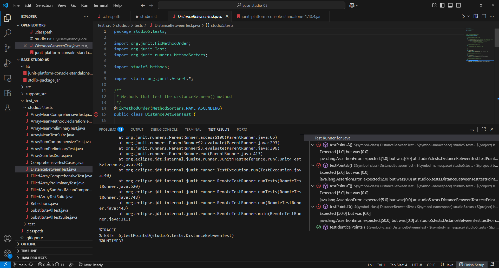

=====================
Assignment 5: Zombies: A METHOD to their Madness
=====================

Assignment Setup
=====================

To create your repository go `here <https://classroom.github.com/a/eQUj3s8V>`_. Then follow the same accept/import process described in `the setup instructions <../Module0-Introduction/software.html>`_.

Zombies
=====================

There are a few reasons for this choice of subject matter:

* These assignments show a real-world application of computing. The structure we will create is used in many simulations and games, and computer scientists often do similar work to visualize data and understand natural phenomena.

  * Games and simulations often have a loop that simulates time steps. The typical flow of this loop is:

  1. Check if the game/simulation should continue

  2. Update all the items being simulated for the current time step
 
  3. Show or record any progress

* Simulating biological systems can be fascinating but complex. Using zombies allows us to simplify the rules of the system, which means shorter assignments more focused on the CS concepts we want you to learn.

Questions to ask if you get stuck
=================================

Like all problems, this one can be tricky. Here are some common questions that we get from students regarding this assignment. Use these questions to gauge your own understanding of what we are asking you to do. Please ask these questions to a TA or an instructor if you are feeling stuck on a certain part of the assignment.

* In programming, what are “magic numbers” and why shouldn’t they be used?

* In Java, what does declaring and initializing constants using the ``final`` keyword do?

* What is double buffering?

* What are unit tests? How are they used?

* How are methods declared in Java?

* What are the parts of a method declaration in Java?

* What does it mean for a method to "return"?

* What does it mean to "call" a method? How is a method call performed?

* How can I debug programs that use many methods?

Information Needed 
=====================

In order to simulate how a zombie infection can spread, we will simulate:

* Zombies, which have a 2D location. The x and y values can range from 0.0 to 1.0.

* Non-Zombies, which also have a 2D location with values ranging from 0.0 to 1.0.

In other words, for every entity (zombie or non-zombie), we will want to keep track of the entity’s current coordinates and whether the entity is a zombie. We can use a boolean for the entity type, with true to indicate a zombie and false to indicate a non-zombie.

Data Management
=====================

There are several ways to manage information like this. For this assignment, we’ll use an approach sometimes called `parallel arrays <https://en.wikipedia.org/wiki/Parallel_array>`_. The basic idea is that we will have two arrays to keep track of ``N`` entities:

1. An array of length ``N`` that contains whether or not each entity is a zombie. Call this the ``areZombies`` array.

2. An array of length ``N`` that contains the x coordinates of all the entities. Call this the ``positions`` array.

Each thing being simulated will be associated with an index. For example, ``areZombies[0]``, ``positions[0]`` represent the type and coordinates of a single entity in our simulation. In a sense you can think about ``areZombies``, ``positions`` as being columns in a table. Each individual row of the table represents a specific thing being simulated. The three arrays are considered “in parallel” since the i-th items in each array represent different aspects of a single composite thing.

Data Encoding
=====================

The initial locations of zombies and non-zombies will be provided in a file. The file will have a very specific format:

* The first line of the file will indicate how many entities are in the file (``N``)

* The next ``N`` lines will each contain information for a single entity:

  * Each line will start with a ``String``. ``"Zombie"`` indicates a zombie and ``"Nonzombie"`` indicates a non-zombie.

  * Second will be a real number (``double``) indicating the initial x position of the entity.

  * Third will be another real number (``double``) indicating the initial y position of the entity.

We’ve included several example files. When you run the program, you will see a file dialog box that will allow you to pick a ``.sim`` file. This is the file that your code will read from (click to enlargen examples below).

* 1_nonzombie.sim: 

|

|

* 1_on_1.sim: 

|

.. image:: 1_on_1.png
  :alt: 1_on_1
  :width: 300
  :height: 200
  :align: center

| 

* 1_zombie.sim: 

|

|

* 5_nonzombies.sim: 

|

.. image:: 5_nonzombies.png
  :alt: 5_nonzombies
  :width: 300
  :height: 200
  :align: center

|

* 5_zombies.sim: 

|

|

* all_alone.sim: 

|

.. image:: all_alone.png
  :alt: all_alone
  :width: 300
  :height: 200
  :align: center

|

* bubbles.sim: 

|

.. image:: bubbles.png
  :alt: bubbles
  :width: 300
  :height: 200
  :align: center

|

* contagion.sim: 

|

.. image:: contagion.png
  :alt: contagion
  :width: 300
  :height: 200
  :align: center

|

* cse131_vs_zombies.sim: 

|

|

* in_the_house.sim: 

|

.. image:: in_the_house.png
  :alt: in_the_house
  :width: 300
  :height: 200
  :align: center

|

* surrounded.sim: 

|

.. image:: surrounded.png
  :alt: surrounded
  :width: 300
  :height: 200
  :align: center

|

New Techniques & Topics
=====================

APIs
------------

This assignment will utilize two different APIs:

* ``Scanner``: This allows us to read data from a file. We’ll get the type and location of all entities from a file. This is slightly different from how we have used Scanner in the past, as we will not be prompting the user for input values.

* ``StdDraw``: This will allow us to display the location of the zombies and non-zombies as our simulation progresses.

Using Scanner to read from a file
---------------------------------------

* When Scanner is connected to a file, ``nextDouble()``, will get the next value in the selected file if it’s a double. If the next value is not a double, it will ask the user for a double instead.

* Each time you call ``nextDouble()``, Scanner will process that value, and the next call to ``nextDouble()`` will return the next double in the file, whether it’s on the same line or the next.

* Make sure you use the method that asks for the data type that corresponds to the next value in the file. For example, if the next value in the file is a double, make sure to call ``nextDouble()``, not ``next()``. 

* Also be careful with ``next()`` and ``nextDouble()``. The first method reads in the next word, whereas the second reads in the entire next line. Both are useful, make sure you are choosing the correct one!

Methods!
--------

Methods are a fundamental part of computing because:

* They allow us to break complex problems into smaller, more manageable parts. It makes it possible for a single person to write a complex program by working on one small part at a time and ensuring that the small parts can be combined together.

* They allow code to be re-used. In this case we will do some operations repeatedly and rather than copying/pasting code you can just write a method once (one copy of the code) and call it as-needed.

"Magic" Numbers and Constants
-----------------------------

The term `Magic Number <https://en.wikipedia.org/wiki/Magic_number_(programming)>`_ is often used to represent a constant value whose significance isn’t clear from the value and its context. For example, we will be storing the entities’ y-coordinates in the second column of an array, so the number 1 indicates the column containing the y-coordinates. The number 1 would be considered a “magic number” because it’s an arbitrary choice and may not be clear to someone who reads your code.

In order to make our code more readable, we’ll use special variables for the indices rather than the “Magic Numbers”. The starter code provided in ``ZombieSimulator.java`` includes:

::

  static final int X = 0;
  static final int Y = 1;

These two lines declare variables that represent the column that will contain the x coordinate and the column that will contain the y coordinate. *Every time* a location in the 2D array is used, these variables should be used to make your code easier to read. For example, when someone reads:

::

  double v = positions[i][1];

it isn’t very clear that the ``1`` the Y coordinate (it is a magic number). The following is easier to read and less prone to errors:

::

  double v = positions[i][Y];   // More clearly conveys reading the Y coordinate.

Of course, using a better variable name makes it even more readable:

::

  double yCoordinate = positions[i][Y];

The lab assignment also includes:

::

  static final String ZOMBIE_TOKEN_VALUE = "Zombie";

You should prefer the use of ``ZOMBIE_TOKEN_VALUE`` over the String ``"Zombie"``. ``"Zombie"`` could be misspelled, for example, resulting in diffilcult to debug errors. If you misspell ``ZOMBIE_TOKEN_VALUE``, however, Eclipse and the Java Compiler will alert you to the problem, which makes it easier to debug.

The constants below will be used in ``drawEntities()``. You may change the values, but you should reference these identifiers in your code.

::

  static final Color ZOMBIE_COLOR = new Color(146, 0, 0);
  static final Color NONZOMBIE_COLOR = new Color(0, 0, 0);
  static final Color TEXT_COLOR = new Color(73, 0, 146);
  static final double ENTITY_RADIUS = 0.008;

Note: collision detection in ``touchingZombie()`` will also use ``ENTITY_RADIUS``.

Finally, ``updateEntities()`` will use ``RANDOM_DELTA_HALF_RANGE``:

::

  static final double RANDOM_DELTA_HALF_RANGE = 0.006;

Double Buffering
----------------

`Double Buffering is <https://en.wikipedia.org/wiki/Multiple_buffering>`_ a technique used to make animations look smooth. The basic idea is to have two different “frames” (the two buffers). At any given time, one frame is being shown on the screen. New drawings are placed on the other frame, which isn’t being shown. When these two frames are switched, it looks like a lot of changes have taken place simultaneously. A sequence of these changes can show an animation in the same way a `flip book works <https://en.wikipedia.org/wiki/Flip_book>`_ (`Sample Video on Wikipedia <https://en.wikipedia.org/wiki/File:Flip_Book_-_Messi_Example.webm>`_). Much like a flip book, all visible items are drawn in each frame, but the positions of items that are moving change a tiny bit from one frame to another.

``StdDraw`` supports double buffering by the following approach:

1. Prior to drawing anything (for example, when the the program first starts in ``main``) call ``StdDraw.enableDoubleBuffering()``

2. Whenever it is time to change frames:

::

  StdDraw.clear();  // Clear the non-shown frame
  // Draw *all* objects in their locations (which may have changed from the last frame)
  StdDraw.show();  // Swap the non-shown frame with the one being shown on screen.

Unit Testing
------------

`Unit testing <https://en.wikipedia.org/wiki/Unit_testing>`__ can help find problems and add confidence that certain aspects of your program are functioning correctly. As you complete each part of this assignment, you will test that part. If all the parts work in the intended way, there’s a greater chance that they will work when combined together.

**Special Note: Unit tests help developers make sure the code works, but they usually only test a relatively small number of possible conditions. NEVER assume that code that passes unit tests “must work”. The test only ensures that it did what those tests expected. The tests themselves could be flawed and they don’t test everything!**

If you fail any unit test cases, you should try to read through the test case and see what it’s testing. In this assignment, almost all tests cases are either looking for a particular value (via ``assertEquals()`` or ``assertNotEquals()`` ) or for a boolean condition (via ``assertTrue``() or ``assertFalse()``). Doubling clicking on a failing test will take you to the code for that test, where you can probably figure out what the test case is expecting and then try to identify why your code didn’t pass it. The comments in and above the test cases may also provide some guidance.

Procedure & Recommended Workflow
=====================

Below is a recommended work-flow. Many of the parts are independent. If you get stuck on one, you can leave it incomplete and move on to the next, but you may need to ensure there aren’t any errors in your code (no red lines) so the rest of your code works correctly.

1. Open the ``ZombieSimulator`` in the ``src`` folder. Some items have already been done for you. Most of the remaining work is labeled in the file with ``TODO`` or ``FIXME`` comments.

2. Complete the code for the ``readEntities()`` method. Pay attention to the following:

   * The arrays of data that you need to fill have already been created for you and passed into readEntities() as the ``areZombies`` and ``positions`` parameters.

   * Do **NOT** attempt to create the ``areZombies`` and ``positions`` arrays. As previously stated, they have already been created (outside of your method) and passed in to your method.

   * Do **NOT** ask the Scanner for the initial nextInt() expecting it to be the length of the arrays. This call to nextInt() will have already been performed by the caller (in order to create and pass in arrays of the correct length). If you start off by calling nextInt() you will be attempting to read the first entity’s “Zombie” or “Nonzombie” state as the length of the arrays. You can simply use the length of the arrays directly to get the total number of zombies.

   * If you cannot ask the Scanner for the length of the arrays, how will you know what it is? Luckily, all created arrays know how long they are. In this method, both ``areZombies`` and positions will be the same length and can be accessed with the code ``areZombies.length`` and/or ``positions.length``.

   * Use the ``X``, and ``Y`` variables when you want to refer to columns for the x and y coordinate respectively.

   * You will **mutate** (that is: change) the contents of the arrays which are passed in. We will learn a better way soon when we cover Objects.

3. Open ``ZombieSimulatorTestSuite.java`` and Run it as a JUnit Test.

4. Examine the results of the test cases.

   * Update your ``readEntities()`` method until it passes all of the ``ReadEntitiesTest`` cases.

5. Return to ``ZombieSimulator.java`` and complete ``drawEntities()``. Notice that part of it has already been done for you. Draw all the entities provided in the two arrays passed into this method. Entities that are Zombies should be drawn as filled circles with color ``ZOMBIE_COLOR`` and radius ``ENTITY_RADIUS``. Non-zombies should be ``NONZOMBIE_COLOR`` filled circles of radius ``ENTITY_RADIUS`` as well..

6. Open ``DrawEntitiesDebugApp.java`` and Run it as a Java Program.

   * This program will use your ``drawEntities()`` and prompt you for each case asking if the picture looks correct.

   * Update your ``drawEntities()`` method until it the drawings look correct.

7. Return to ``ZombieSimulator.java`` and compete the code for the ``touchingZombie()`` method. Again, notice that the comments above it give a brief description what it should do.

   * Hint: Consider entities to be touching if they overlap. Use the distance formula.

8. Open ``ZombieSimulatorTestSuite.java`` and Run it.

   * Update your ``touchingZombie()`` method until it passes all of the ``TouchingZombieTest`` cases.

9. Return to ``ZombieSimulator.java`` and complete the code in ``updateEntities()``. Follow the directions given in the comment.

   * Each entity should move randomly. We’ll keep it simple by using `Brownian Motion <https://en.wikipedia.org/wiki/Brownian_motion>`_. Change the x coordinate by a random value between ``-RANDOM_DELTA_HALF_RANGE`` and ``RANDOM_DELTA_HALF_RANGE``. Also change the y coordinate by a random value between ``-RANDOM_DELTA_HALF_RANGE`` and ``RANDOM_DELTA_HALF_RANGE``.

   * No entities should be able to leave the unit square. All coordinates should be ``>=0`` and ``<=1.0`` at all times. Consider this when updating the location of an entity.

   * If a non-zombie touches a zombie it will become a zombie.

10. Open ``ZombieSimulatorTestSuite.java`` and run it.

    * Update your ``updateEntities()`` method until it passes all of the ``UpdateEntitiesTest`` cases.

11. Return to ``ZombieSimulator.java``. You’ll need to complete a ``nonzombieCount()`` method. Search the file for ``nonzombieCount``. The file already contains the comment block, but the method itself is commented out because it is incomplete.

    * Change ``TodoReplaceWithCorrectReturnType`` to appropriate return type.

    * Change ``TodoReplaceWithCorrectParameterType`` to appropriate return type.

    * Change ``todoRenameMe`` to appropriate parameter name.

    * Hint: You can uncomment or comment multiple lines by highlighting them and then typing ``Control-/`` (on a PC) or ``Command-/`` on a Mac.

12. Complete the code for ``nonzombieCount()``

13. Open ``ZombieSimulatorTestSuite.java`` and Run it.

    * Update your ``nonzombieCount()`` method until it passes all of the ``NonzombieCountMethodDeclarationTest`` and ``NonzombieCountTest cases.``

14. Almost done! You just need to complete the actual simulation. Open ``ZombieSimulator.java`` and complete the ``TODO`` in the ``runSimulation()`` method. HINT: this should be short. It can be reasonably and cleanly done in ~10 lines of code.

    * uncomment the code to read the number of entities from the passed in ``Scanner in``, create the ``areZombies`` and ``positions`` arrays of the correct lengths, and read and draw the entries in their initial positions.

    * implement the zombie simulation

15. Run ``ZombieSimulator.java``. Try a few of the files that are provided (``cse131_vs_zombies.sim``, ``surrounded.sim``, ``in_the_house.sim``, ``bubbles.sim``, etc.)

16. Return to ``drawEntities()`` and use StdDraw to display the ratio of Non-Zombies to total entities in the corner of the window (choose whatever corner you like). For example, in a simulation that has 3 Non-Zombies and 4 Zombies, this would look like “3/7”. Make sure that this display is readable on the canvas.

17. Feel free to add in more features (For example, count how many “turns” (updates) are completed before all the nonzombies have turned into zombies).

18. *Review your work*! Make sure you understand what each method does. Review how the individual methods fit into the overall process of simulating the zombie world.

19. Search the file for any ``TODO`` or ``FIXME`` comments. If the items are completed, remove the comment (otherwise complete them).

20. As always check the rubric to make sure you haven’t missed anything you will be graded on.

Example Run
=====================

Here’s an example run (note: there is no audio):

.. youtube:: 2VSB_rjRZGA

Submitting your work
=====================

Get your assignment graded by bringing it to lab on Wednesday/Thursday or going to office hours and signing up for a demo via `wustl-cse.help <https://wustl-cse.help/>`_.

Confirm that your score is recorded in `Canvas <https://wustl.instructure.com/courses/133664>`_.  Mistakes can happen and you should always confirm credit is recorded before leaving class!

