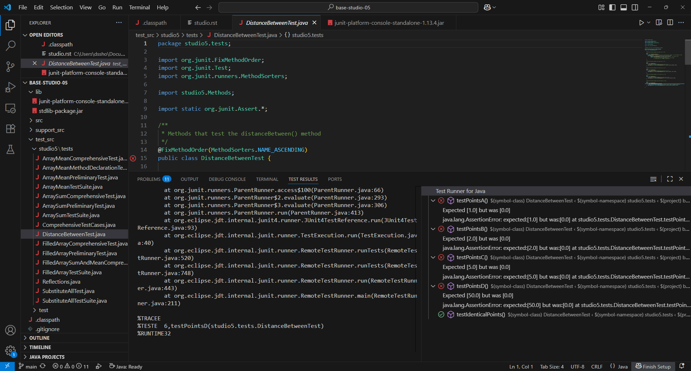
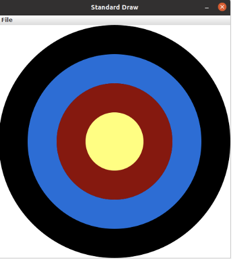

=====================
Studio 5: Writing and Testing Methods 
=====================

**Studio activities should not be started before class! Come to the session and work on the activity with other students!**

Studio Setup and Procedure
=====================

* Form a group of 2-3 students and find a TA or instructor to work with.

* All but one member of your group should have this web page open so you can follow along and see the instructions as you work.

* Plan to work on one computer (using Eclipse).

  * Initially, one of you will be in charge of typing at that computer.

  * Throughout the studio you should trade who is in charge of the keyboard.

**READ THE FOLLOWING FULLY BEFORE PROCEEDING**

1. Have **one person** in your group create a new team by `clicking here <https://classroom.github.com/a/bF-cv8xa>`_ and going to the ``OR Create a new team`` box at the bottom of the page. The team name should include the last names of all your group members. For example, if Xia and Smith are working together, the team name should be something like “XiaSmith”.

2. **After the team is created**, all other members of your team should click on the same link and follow the instructions to join the team.

   1. **Be careful to join the right team!** You won’t be able to change teams yourself and will have to contact instructors if there’s a problem.

   2. **Be sure everyone else joins the team!** If grades don’t get entered correctly we will use the team to help verify credit for a particular studio.

3. Finally, one person should import the studio repository into Eclipse, as described in `the setup instructions <../Module0-Introduction/software.html>`_.

   * All team members will have access to the work pushed to GitHub. Be sure to ``Commit and Push`` at the end of the day so everyone can refer back to the work later as needed.

Overview
=====================

In this studio you will explore the following two concepts:

* **Writing** methods that do interesting work

* **Testing** methods to develop assurance that the methods do what was expected. 

If necessary review the videos and material concerning methods before proceeding.

   **Important**! Today you must rotate who is doing the typing as you move from one method to the next. Every person in your group must have a chance to be the *lead* person at the keyboard for at least one method described below.

   All group members are encouraged to help the lead person at the keyboard.

In preparation for the exercises open the following files, found in the **studio5** source folder of your repository:

* ``Methods.java`` is a file in which you will type the methods described below.

* There are several separate files that will be used to test each method using a library called `JUnit <https://junit.org/junit4/>`__: ``MethodsTestSuite.java`` is colocated with ``Methods.java``. ``DistanceBetweenTest.java`` and other tests are located in the ``test_src`` folder’s ``studio5.tests`` package.

* ``BullsEyeDebugApp.java`` will be run to investigate the ``drawBullsEye()`` method.

Methods
=====================

In the work you see below you should be asking yourselves the following as you write code:

* What is the name of the method? If you have to create a method and you pick a name that doesn’t match the name being used in tests, the tests won’t be able to run. Every character of names must match. The name ``Sum`` is a different method to Java than the method named ``sum``.

  * Names should be descriptive. It’s best if the name gives a high-level idea of what the method does. Someone who reads where the method is being used should be able to make a reasonable guess about what it will do. For example, you can probably guess what ``double v = Math.sqrt(2)`` is doing based on the method’s name.

* What are the types of the input parameters and what order are they in? These must also agree with how the method is being used.

* What is the type of the return value, if any? This must also agree with how the method is being used.

.. _A function-like method, distanceBetween():

A function-like method, distanceBetween()
=====================

Review the ``distanceBetween`` method in ``Methods.java``. This method is a lot like a function from mathematics (the term “function” is often used for methods like this). It will be provided with four arguments and it will perform a computation to generate a result (compute a distance).

It’s mostly done for you. (*Don’t change it yet*) Read the description and make sure you understand the choices for:

* The name. Will someone be able to determine what the method does purely from the name?

* The return type. Why is ``double`` a good choice here?

* The parameters. Why are there 4 parameters? Do the types of each (``doubles``) make sense?

* Imagine a program will often need to compute distance between different points. Can use of this function make code easier to read or avoid duplicating code?

Running distanceBetween() tests
=====================

Open ``DistanceBetweenTest.java`` in ``test_src/studio5/tests``. This file contains several tests to help demonstrate that ``distanceBetween()`` works as expected. You can run all the tests in the file by right-clicking on the file name, selecting ``Run As > JUnit Test``.

Run it. You should see a new tab in Eclipse that should look something like:

|
   The tab may be near the ``Console`` tab or in the ``Package Explorer`` area

* The Blue Xs indicate test cases that failed. You can click on them to be taken to the code that failed.

* The Green checks indicate test cases that passed. *Notice that even incomplete code can sometimes pass tests!*

.. _Finishing the Code, distanceBetween():

**Finishing the Code, distanceBetween()**

Complete the code for ``distanceBetween()``. Use other methods, like ``Math.sqrt()``. (By the way, click on the link and note the format of each of the descriptions. This style is called JavaDoc. You’ll see it again soon.)

Finishing testing distanceBetween()
=====================

Re-run the test cases. Do they all pass? Probably not!

* Open ``DistanceBetweenTest.java`` and review ``testIdenticalPoints()``, which works correctly. Discuss among your group and a TA how you think the test works.

* If more than one test is failing review your code and update it. Make sure you’re using the correct formula for Euclidean distance.

* Once only one test case fails, double click on the name of the test that’s still failing (still blue). This is most likely the flawed test case. Review the test case carefully, fix the flaw, and re-run the test cases.

.. _Adding another test, distanceBetween():

Adding another test for distanceBetween()
=====================

Once all tests pass, add one more test named ``testPointsE()`` that will verify that the distance between (8,9) and (5,5) is 5.0.

Writing a void method, drawBullsEye()
=====================

  If working with a partner change who is at the keyboard

Imaging you plan to create a simple computer game that allows players to throw fruit at `bull’s eyes <https://en.wikipedia.org/wiki/Bullseye_(target)>`_. As the game progresses you’ll need to draw bull’s eyes at different locations on the screen and of varying sizes. That is, you will want to repeatedly draw bull’s eyes, but the specific details of how they are drawn will vary in predictable (computable) ways. This is a perfect place to use a method. The method will allow someone to draw a bull’s eye and customize the two details that will need customized: the location and size of the bull’s eye. A bull’s eye may look something like:

Finishing the code for drawBullsEye()
=====================

Review the partial code for ``drawBullsEye()`` in ``Methods.java``. Pay attention to the JavaDoc comment, return type, parameter types, and name. Do they all seem to be reasonable choices? **Notice that the return type is** ``void``. **This method is used to bundle together common work, but it doesn’t create a new piece of information like a mathematical function. The special word** ``void`` **is used to indicate that it doesn’t return anything**. The ``println()`` method you’ve been using all semester is an example of another ``void`` method. ``println`` has a side effect of placing text in the console window, but it doesn’t “return” a result.

Complete the code for ``drawBullsEye()``.

Testing drawBullsEye()
=====================

Open ``BullsEyeDebugApp.java`` and review the cases. In this case we need to confirm that drawings are correct. This app is used to make a repeatable way to ensure consistently. They require human intervention to confirm if the test was passed or not. (There are ways to truly automate tests like this, but it’s beyond the scope of this class.)

Run ``BullsEyeDebugApp``. If your code does not produce the correct pictures, update it until it does.

A method applicable to a future assignment, substituteAll()
=====================

We will need a method which substitutes characters in a String when we create a `fractal dragon curve <https://en.wikipedia.org/wiki/Dragon_curve>`_ in Assignment 6. It is often worth it to extract functionality into a method even if it is only used once. It is even more satisfying to be able to use the same method from different locations in the same application. Ultimately, generally useful methods can be used in many applications and String manipulation is a common operation.

Finishing the code for substituteAll()
=====================

Read the Javadoc and the starting code for the ``substituteAll(source, target, replacement)`` method, come up a plan, and execute that plan.

**Note**: The target parameter to substituteAll(source, target, replacement) is of type `char <https://docs.oracle.com/javase/tutorial/java/data/characters.html>`_ which is the primitive type for a Character. In Java, `String’s <https://docs.oracle.com/javase/8/docs/api/java/lang/String.html>`_ are made up of chars.

**Recall**: You can add a String with anything to produce a new `concatenated String <https://www.merriam-webster.com/dictionary/concatenate>`_. For example:

::

  String text = "hello";
  char ch = '!';
  String concatenatedText = text + ch;
  System.out.println(concatenatedText);

outputs:

::

  hello!

Some methods on String to investigate:

* `length() <https://docs.oracle.com/javase/8/docs/api/java/lang/String.html#length-->`_

* `charAt(i) <https://docs.oracle.com/javase/8/docs/api/java/lang/String.html#charAt-int->`

* `toCharArray() <https://docs.oracle.com/javase/8/docs/api/java/lang/String.html#toCharArray-->`_

Testing substituteAll()
=====================

Run the ``MethodsTestSuite`` as a JUnit Test and fix any errors in the ``SubstituteAllTestSuite``, if necessary.

**Discussion**: Now that it is passing the tests, are there ways to improve your code?

Expected???
=====================

Investigate ``SubstituteAllTest`` in the ``studio5.tests`` package in the ``test_src`` folder.

Note the use of `assertEquals(expected, actual) <https://junit.org/junit4/javadoc/latest/org/junit/Assert.html#assertEquals(java.lang.Object,%20java.lang.Object)>`_.

* Are any of the expected values unexpected?

* What is going on with the perhaps surprising result?

* What would be an approach to producing a result closer to the line from the `original poem <https://www.poetryfoundation.org/poems/44477/ode-on-a-grecian-urn>`_?

**Discussion**: Are the tests reasonably comprehensive? What tests could be added to better ensure your code is working in all cases?

Array's as parameters, arraySum()
=====================

  If working with a partner change who is at the keyboard

Arrays can be given as parameters to methods. Review the code for ``arraySum()`` in ``Methods.java``. As before, pay attention to the JavaDoc comment, return type, parameter types, and name. Do they all seem to be reasonable choices?

Finishing the code for arraySum()
=====================

Complete the code for arraySum().

Testing arraySum()
=====================

Run the ``MethodsTestSuite`` and note the ``ArraySumTestSuite`` within. Investigate the ``ArraySumPreliminaryTest.java`` within ``ArraySumTestSuite``.

Review the tests:

* Figure out how they work (they are slightly different than the tests for ``distanceBetween()``.

* Often the goal of testing is to be:

  * Complete: Test things that are likely to be flawed and a few general cases.

  * Concise: Developing and running tests shouldn’t take prohibitive time.

Do these tests appear “complete and concise”?

Finishing the code for arraySum() pt2
=====================

If your code didn’t pass all tests update it until it does. (These test don’t have an intentional flaw for you to fix.)

Returning arrays in filledArray()
=====================

  If working with a partner change who is at the keyboard

Arrays can also be returned from methods. Review the code for ``filledArray()`` in ``Methods.java``. As before, pay attention to the JavaDoc comment, return type, parameter types, and name. Do they all seem to be reasonable choices?

Finishing the code for filledArray()
=====================

Complete the code for ``filledArray()``.

Testing filledArray()
=====================

Run the ``MethodsTestSuite`` and note the ``FilledArrayTestSuite`` within. Investigate the ``FilledArrayPreliminaryTes``t within ``FilledArrayTestSuite``.

Notice that the ``testArrayLength0()`` case uses ``assertNotNull`` and ``assertArrayEquals`` in addition to ``assertEquals``.

Notice that ``testArrayLength2`` does two separate tests. **It has a flaw in the first thing it’s testing**. Run the tests and notice the error message printed when it fails. Double Click on the test case that failed in the JUnit tab and it will take you to the line of code where the failure was noticed. Update the test code (in ``testArrayLength2``) to remove the error. Don’t remove the line of code, just update it so it’s checking for the proper value. Also notice that the second part of the method uses a loop to check several items.

Finishing the code for filledArray() pt2
=====================

If your code didn't pass all tests update it until it does.

Writing methods from scratch & re-using methods in arrayMean()
=====================

  If working with a partner change who is at the keyboard

Return to ``Methods.java`` and search for ``arrayMean``. You should find the ``TODO`` comment. Create a method named ``arrayMean`` in place of the comment. It should:

* Be declared as ``public static``. Don’t forget to include them before the return type.

* Have an appropriate return type (Hint: Consider example problems, like the mean of {2,1} or {1,2,3,1})

* Have appropriate parameter name(s) and type(s).

* Return the mean (arithmetic average) of a set of integers.

  * For example,

::

  int[] values = {1,2,3};
  x = arrayMean(values); // x will be 2

**Hint this method can be done with just a single line of code in the body. Leverage your prior work on the studio!**

JavaDoc-style comment
=====================

After writing the code for the method create the JavaDoc style comment before it. Type ``/**`` above the method and hit return. It will automatically create a JavaDoc style comment block. Fill it in using the same style as used in the rest of the examples.

Testing arrayMean()
=====================

Run the ``MethodsTestSuite`` and note the ``ArrayMeanTestSuite`` within.

The first test in ``ArrayMeanTestSuite`` is ``ArrayMeanMethodDeclarationTest``. This test ensures that you have declared your ``arrayMean()`` method as we expect it. When you have passed the ``ArrayMeanMethodDeclarationTest`` investigate the ``ArrayMeanPreliminaryTest``.

If your code didn’t pass all tests update it until it does.

Notice that these tests don’t perform a test with an empty array. Take a few minutes to consider why such a test may not be appropriate here. Discuss with a TA/instructor.

Generating JavaDoc pages
=====================

  If working with a partner change who is at the keyboard

JavaDoc style comments are used to easily create documentation that goes along with code. If done correctly, the documentation will allow other people to use code without having to read through all the tedious details or having to guess about its behavior. Create JavaDoc pages for your work by selecting ``Generate JavaDoc...`` from the ``Project`` menu in Eclipse. Click ``Finish``. It will probably ask if you want to use the specificified directory, which should be a ``doc`` folder within your repository. You can select ``Yes to all``. When it’s done you may need to right-click on the repository and select ``Refresh`` to see the updated ``doc`` folder. It should include a ``studio5`` folder, which should include ``Methods.html`` (if it doesn’t include ``Methods.html`` generate them again by using the ``Generate JavaDoc...``). Double click on ``Methods.html`` to see the formatted documentation for your work. In particular look at the documentation that was created for your ``arrayMean()`` method. (*Note: There are multiple Methods.html files. Be sure you get the one immediately in the docs/studio5 directory*)

End of Studio Review
=====================

Major highlights from this studio:

* Methods are a technique used to combine common work into small, stand alone “sub programs”.

  * This can be used to avoid copying/pasting code. Just bundle it into a method and “call it” when it needs to be used.

  * It’s also used to break complex tasks into smaller, easier to read/write parts.

* Methods may have parameters (variables) that can be used to communicate information to the method.

  * Parameters allow the behavior of a method to be customized as needed. For example, to specify the points to use when computing distances or the location and size to draw a bull’s eye.

  * Parameters have a type.

    * Complex things like arrays can be used as parameters.

    * If there is more than one parameter, they are in a distinct order (and order matters).

* Methods can “return” information, which is usually used in an assignment statement, like ``double dist = distanceBetween(0,0, 15,8.4)``.

  * The returned “thing” can be a complex thing, like an array that contains several values.

* Methods don’t have to return information. They can just be used to bundle together work with a sensible name (like ``drawBullsEye(0.5, 0.25, .1)``).

* Testing can help ensure that methods work in the expected way. Passing tests only indicates the code did what those tests were expecting. Typically passing tests is *not proof* that code will always work. None the less, unit testing is a vital part of developing large, complex pieces of software. We try to verify that the individual parts work as expected and then combine them together.

* Testing often involves running code on a specific test cases and making sure it produces the expected results.

Demo
=====================

**Commit and Push** your work. Be sure that any file you worked on is updated on `GitHub <https://github.com/>`_.

To get participation credit for your work talk to the TA you’ve been working with and complete the demo/review process. Be prepared to show them the work that you have done and answer their questions about it!

*Before leaving check that everyone in your group has a grade recorded in Canvas!*
