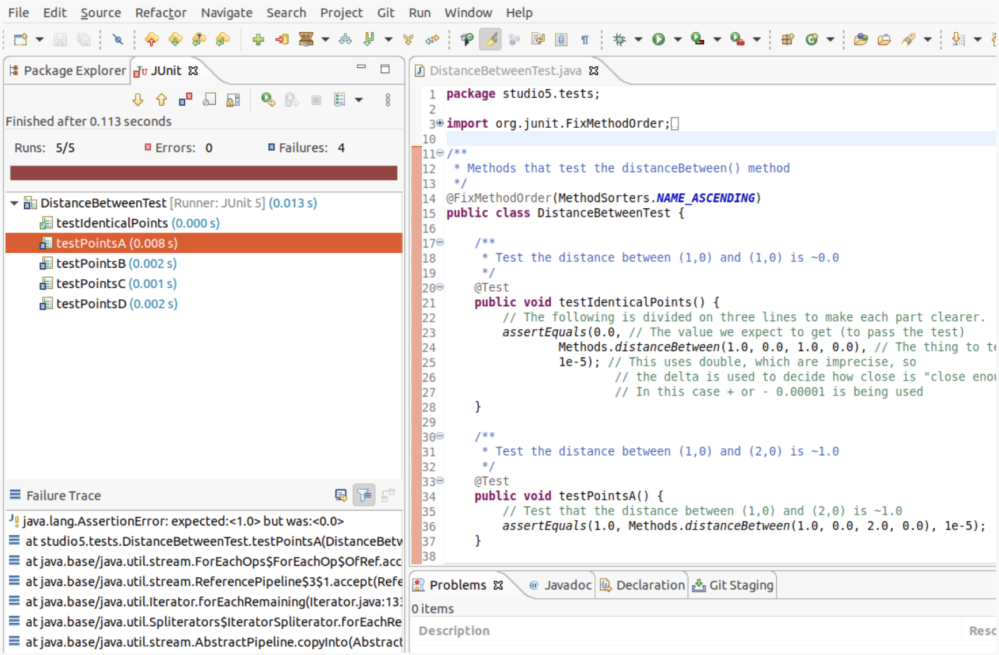
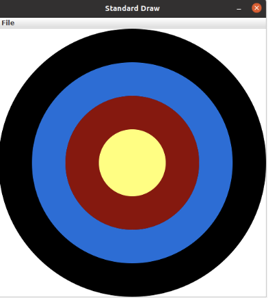
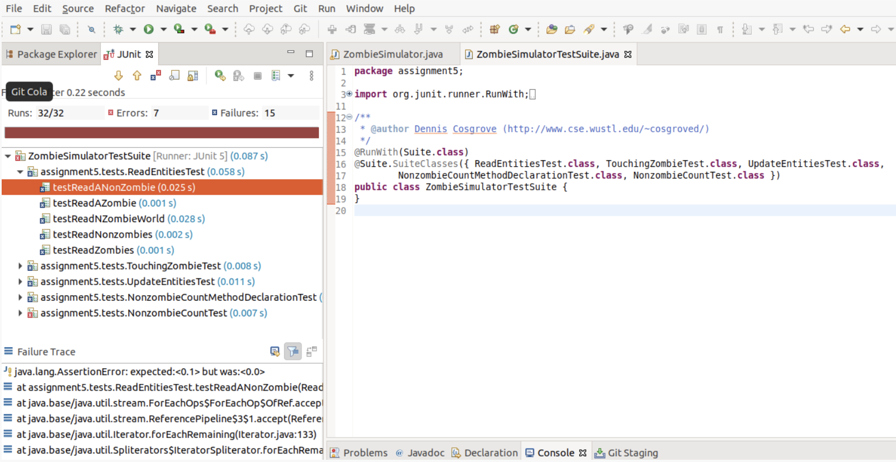
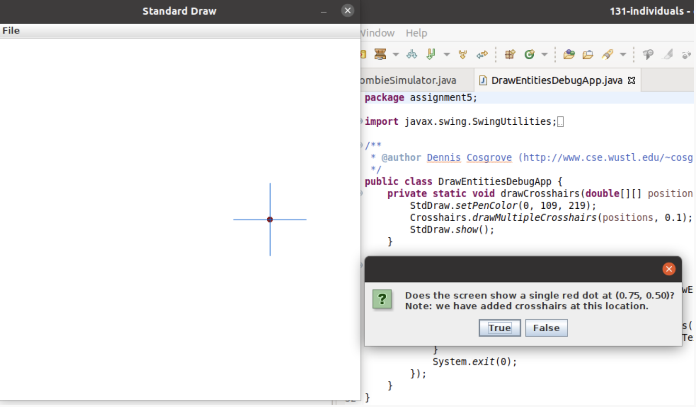

=====================
Module 5
=====================

.. Here is were you specify the content and order of your new book.

.. Each section heading (e.g. "SECTION 1: A Random Section") will be
   a heading in the table of contents. Source files that should be
   generated and included in that section should be placed on individual
   lines, with one line separating the first source filename and the
   :maxdepth: line.

.. Sources can also be included from subfolders of this directory.
   (e.g. "DataStructures/queues.rst").

Exercise : 5.25. Cooking abstractions 
:::::::::::::::::::::::::::::::::::::::::::::::::::

* Find and open the ``Recipe Java`` program in the ``exercises5`` package.

* For the work below, enter your work into that file.

In the introductory video for this exercise, you heard the following recipe excerpt:

* Heat 200 cc water to 100 degrees

* Stir in 5 grams of yeast

* Melt butter and stur in the vanilla with the butter

* After 5 minutes, combine yeast with butter, sugar, and flour

* Place the mixture in a 110 degree oven to rise for 45 minutes

* Divide the mixture into 10 equally sized portions and cook for 45 minutes at 350 degrees

Define abstractions present in the above recipe. Rephrase the recipe in terms of your abstractions.

Exercise : 5.45. Exercises
:::::::::::::::::::::::::::::::::::::::::::::::::::

* Find and open the ``StringMethods`` Java program in the ``exercises5`` package.

* Write the methods described below into the program.

* Call those methods from the ``main`` method and print out the results to check that your work is correct.

* The first method is completed for you already.

The methods you should write:

* A method that takes in a ``String`` and returns that string concatenated with itself. This one is completed for you.

* A method that takes in a ``String`` and an ``int`` *n*, and returns *n* copies of the string concatenated together

* Now go back and rewrite your first method by having it call the second one.

* Take a look at Java’s `split <https://docs.oracle.com/en/java/javase/13/docs/api/java.base/java/lang/String.html#split(java.lang.String)>`__ method, that splits a ``String`` into an array containing the parts split by the specified regular expression.

   Here, assume the regular expression is simply " ", so that the input ``String`` is split into words.

* Write a method ``join(String[] array, String joiner)`` that is the inverse of split: it returns a single ``String`` with a copy of the ``joiner`` string between each part.

* Rewrite your second method in terms of this last one. To do this, create an array that has *n* copies of a given ``String``, and then use your ``join`` method to concatenate them.

   Think about the string you want to appear between the copies, so that it appears the strings were concatenated together as before.

Studio 5: Writing and testing Methods 
::::::::::::::::::::::::::::::::::::::::::::::::::::::::::::::::

**Studio activities should not be started before class! Come to the session and work on the activity with other students!**

* `Studio Setup and Procedure`_

* `Overview`_

* `Methods`_

* `A function-like method, distanceBetween()`_

  * `Running Tests, distanceBetween()`_

  * `Finishing the Code, distanceBetween()`_

  * `Finishing Testing, distanceBetween()`_

  * `Adding another test, distanceBetween()`_

* `void methods, drawBullsEye()`_

  * `Finishing the Code, drawBullsEye()`_
  
  * `Testing, drawBullsEye()`_

* `A method applicable to a future assignment, substitueAll()`_

  * `Finishing the Code, substitueAll()`_
  
  * `Testing, substitueAll()`_

  * `Expected???`_

* `Array's as parameters, arraySum()`_

  * `Finishing the Code, arraySum()`_
  
  * `Testing, arraySum()`_

  * `Finishing the Code, arraySum() pt2`_

* `Array's as returned values, filledArray()`_

  * `Finishing the Code, filledArray()`_
  
  * `Testing, filledArray()`_

  * `Finishing the Code, filledArray() pt2`_

* `Methods from scratch & re-using methods, arrayMean()`_

  * `JavaDoc-style comment`_

  * `Testing, arrayMean()`_

* `Generate JavaDoc pages`_

* `End of Studio Review`_

* `Demo`_

.. _Studio Setup and Procedure:

**Studio Setup and Procedure**

* Form a group of 2-3 students and find a TA or instructor to work with.

* All but one member of your group should have this web page open so you can follow along and see the instructions as you work.

* Plan to work on one computer (using Eclipse).

  * Initially, one of you will be in charge of typing at that computer.

  * Throughout the studio you should trade who is in charge of the keyboard.

**READ THE FOLLOWING FULLY BEFORE PROCEEDING**

1. Have **one person** in your group create a new team by `Logo <https://classroom.github.com/g/n3TfYnGC>`_ here and going to the ``OR Create a new team`` box at the bottom of the page. The team name should include the last names of all your group members. For example, if Xia and Smith are working together, the team name should be something like “XiaSmith”.

2. **After the team is created**, all other members of your team should click on the same link and follow the instructions to join the team.

   1. **Be careful to join the right team!** You won’t be able to change teams yourself and will have to contact instructors if there’s a problem.

   2. **Be sure everyone else joins the team!** If grades don’t get entered correctly we will use the team to help verify credit for a particular studio.

3. Finally, one person should import the studio repository into Eclipse, as described in `Assignment 0’s Add the assignment to Eclipse <https://classes.engineering.wustl.edu/2021/fall/cse131//modules/0/assignment#4-add-the-assignment-to-eclipse>`_

   * All team members will have access to the work pushed to GitHub. Be sure to ``Commit and Push`` at the end of the day so everyone can refer back to the work later as needed.

.. _Overview:

**Overview**

In this studio you will explore the following two concepts:

* **Writing** methods that do interesting work

* **Testing** methods to develop assurance that the methods do what was expected. 

If necessary review the videos and material concerning methods before proceeding.

   **Important**! Today you must rotate who is doing the typing as you move from one method to the next. Every person in your group must have a chance to be the *lead* person at the keyboard for at least one method described below.

   All group members are encouraged to help the lead person at the keyboard.

In preparation for the exercises open the following files, found in the **studio5** source folder of your repository:

* ``Methods.java`` is a file in which you will type the methods described below.

* There are several separate files that will be used to test each method using a library called `JUnit <https://junit.org/junit4/>`__: ``MethodsTestSuite.java`` is colocated with ``Methods.java``. ``DistanceBetweenTest.java`` and other tests are located in the ``test_src`` folder’s ``studio5.tests`` package.

* ``BullsEyeDebugApp.java`` will be run to investigate the ``drawBullsEye()`` method.

.. _Methods:

**Methods**

In the work you see below you should be asking yourselves the following as you write code:

* What is the name of the method? If you have to create a method and you pick a name that doesn’t match the name being used in tests, the tests won’t be able to run. Every character of names must match. The name ``Sum`` is a different method to Java than the method named ``sum``.

  * Names should be descriptive. It’s best if the name gives a high-level idea of what the method does. Someone who reads where the method is being used should be able to make a reasonable guess about what it will do. For example, you can probably guess what ``double v = Math.sqrt(2)`` is doing based on the method’s name.

* What are the types of the input parameters and what order are they in? These must also agree with how the method is being used.

* What is the type of the return value, if any? This must also agree with how the method is being used.

.. _A function-like method, distanceBetween():

**A function-like method, distanceBetween()**

Review the ``distanceBetween`` method in ``Methods.java``. This method is a lot like a function from mathematics (the term “function” is often used for methods like this). It will be provided with four arguments and it will perform a computation to generate a result (compute a distance).

It’s mostly done for you. (*Don’t change it yet*) Read the description and make sure you understand the choices for:

* The name. Will someone be able to determine what the method does purely from the name?

* The return type. Why is ``double`` a good choice here?

* The parameters. Why are there 4 parameters? Do the types of each (``doubles``) make sense?

* Imagine a program will often need to compute distance between different points. Can use of this function make code easier to read or avoid duplicating code?

.. _Running Tests, distanceBetween():

**Running Tests, distanceBetween()**

Open ``DistanceBetweenTest.java`` in ``test_src/studio5/tests``. This file contains several tests to help demonstrate that ``distanceBetween()`` works as expected. You can run all the tests in the file by right-clicking on the file name, selecting ``Run As > JUnit Test``.

Run it. You should see a new tab in Eclipse that should look something like:

|
   The tab may be near the ``Console`` tab or in the ``Package Explorer`` area

* The Blue Xs indicate test cases that failed. You can click on them to be taken to the code that failed.

* The Green checks indicate test cases that passed. *Notice that even incomplete code can sometimes pass tests!*

.. _Finishing the Code, distanceBetween():

**Finishing the Code, distanceBetween()**

Complete the code for ``distanceBetween()``. Use other methods, like ``Math.sqrt()``. (By the way, click on the link and note the format of each of the descriptions. This style is called JavaDoc. You’ll see it again soon.)

.. _Finishing Testing, distanceBetween():

**Finishing Testing, distanceBetween()**

Re-run the test cases. Do they all pass? Probably not!

* Open ``DistanceBetweenTest.java`` and review ``testIdenticalPoints()``, which works correctly. Discuss among your group and a TA how you think the test works.

* If more than one test is failing review your code and update it. Make sure you’re using the correct formula for Euclidean distance.

* Once only one test case fails, double click on the name of the test that’s still failing (still blue). This is most likely the flawed test case. Review the test case carefully, fix the flaw, and re-run the test cases.

.. _Adding another test, distanceBetween():

**Adding another test, distanceBetween()**

Once all tests pass, add one more test named ``testPointsE()`` that will verify that the distance between (8,9) and (5,5) is 5.0.

.. _void methods, drawBullsEye():

**void methods, drawBullsEye()**

  If working with a partner change who is at the keyboard

Imaging you plan to create a simple computer game that allows players to throw fruit at `bull’s eyes <https://en.wikipedia.org/wiki/Bullseye_(target)>`_. As the game progresses you’ll need to draw bull’s eyes at different locations on the screen and of varying sizes. That is, you will want to repeatedly draw bull’s eyes, but the specific details of how they are drawn will vary in predictable (computable) ways. This is a perfect place to use a method. The method will allow someone to draw a bull’s eye and customize the two details that will need customized: the location and size of the bull’s eye. A bull’s eye may look something like:

.. _Finishing the Code, drawBullsEye():

**Finishing the Code, drawBullsEye()**

Review the partial code for ``drawBullsEye()`` in ``Methods.java``. Pay attention to the JavaDoc comment, return type, parameter types, and name. Do they all seem to be reasonable choices? **Notice that the return type is** ``void``. **This method is used to bundle together common work, but it doesn’t create a new piece of information like a mathematical function. The special word** ``void`` **is used to indicate that it doesn’t return anything**. The ``println()`` method you’ve been using all semester is an example of another ``void`` method. ``println`` has a side effect of placing text in the console window, but it doesn’t “return” a result.

Complete the code for ``drawBullsEye()``.

.. _Testing, drawBullsEye():

**Testing, drawBullsEye()**

Open ``BullsEyeDebugApp.java`` and review the cases. In this case we need to confirm that drawings are correct. This app is used to make a repeatable way to ensure consistently. They require human intervention to confirm if the test was passed or not. (There are ways to truly automate tests like this, but it’s beyond the scope of this class.)

Run ``BullsEyeDebugApp``. If your code does not produce the correct pictures, update it until it does.

.. _A method applicable to a future assignment, substitueAll():

**A method applicable to a future assignment, substitueAll()**

We will need a method which substitutes characters in a String when we create a `fractal dragon curve <https://en.wikipedia.org/wiki/Dragon_curve>`_ in Assignment 6. It is often worth it to extract functionality into a method even if it is only used once. It is even more satisfying to be able to use the same method from different locations in the same application. Ultimately, generally useful methods can be used in many applications and String manipulation is a common operation.

.. _Finishing the Code, substitueAll():

**Finishing the Code, substitueAll()**

Read the Javadoc and the starting code for the ``substituteAll(source, target, replacement)`` method, come up a plan, and execute that plan.

**Note**: The target parameter to substituteAll(source, target, replacement) is of type `char <https://docs.oracle.com/javase/tutorial/java/data/characters.html>`_ which is the primitive type for a Character. In Java, `String’s <https://docs.oracle.com/javase/8/docs/api/java/lang/String.html>`_ are made up of chars.

**Recall**: You can add a String with anything to produce a new `concatenated String <https://www.merriam-webster.com/dictionary/concatenate>`_. For example:

::

  String text = "hello";
  char ch = '!';
  String concatenatedText = text + ch;
  System.out.println(concatenatedText);

outputs:

::

  hello!

Some methods on String to investigate:

* `length() <https://docs.oracle.com/javase/8/docs/api/java/lang/String.html#length-->`_

* `charAt(i) <https://docs.oracle.com/javase/8/docs/api/java/lang/String.html#charAt-int->`

* `toCharArray() <https://docs.oracle.com/javase/8/docs/api/java/lang/String.html#toCharArray-->`_

.. _Testing, substitueAll():

**Testing, substitueAll()**

Run the ``MethodsTestSuite`` as a JUnit Test and fix any errors in the ``SubstituteAllTestSuite``, if necessary.

**Discussion**: Now that it is passing the tests, are there ways to improve your code?

.. _Expected???:

**Expected???**

Investigate ``SubstituteAllTest`` in the ``studio5.tests`` package in the ``test_src`` folder.

Note the use of `assertEquals(expected, actual) <https://junit.org/junit4/javadoc/latest/org/junit/Assert.html#assertEquals(java.lang.Object,%20java.lang.Object)>`_.

* Are any of the expected values unexpected?

* What is going on with the perhaps surprising result?

* What would be an approach to producing a result closer to the line from the `original poem <https://www.poetryfoundation.org/poems/44477/ode-on-a-grecian-urn>`_?

**Discussion**: Are the tests reasonably comprehensive? What tests could be added to better ensure your code is working in all cases?

.. _Array's as parameters, arraySum():

**Array's as parameters, arraySum()**

  If working with a partner change who is at the keyboard

Arrays can be given as parameters to methods. Review the code for ``arraySum()`` in ``Methods.java``. As before, pay attention to the JavaDoc comment, return type, parameter types, and name. Do they all seem to be reasonable choices?

.. _Finishing the Code, arraySum():

**Finishing the Code, arraySum()**

Complete the code for arraySum().

.. _Testing, arraySum():

**Testing, arraySum()**

Run the ``MethodsTestSuite`` and note the ``ArraySumTestSuite`` within. Investigate the ``ArraySumPreliminaryTest.java`` within ``ArraySumTestSuite``.

Review the tests:

* Figure out how they work (they are slightly different than the tests for ``distanceBetween()``.

* Often the goal of testing is to be:

  * Complete: Test things that are likely to be flawed and a few general cases.

  * Concise: Developing and running tests shouldn’t take prohibitive time.

Do these tests appear “complete and concise”?

.. _Finishing the code, arraySum() pt2:

**Finishing the code, arraySum() pt2**

If your code didn’t pass all tests update it until it does. (These test don’t have an intentional flaw for you to fix.)

.. _Array's as returned values, filledArray():

**Array's as returned values, filledArray()**

  If working with a partner change who is at the keyboard

Arrays can also be returned from methods. Review the code for ``filledArray()`` in ``Methods.java``. As before, pay attention to the JavaDoc comment, return type, parameter types, and name. Do they all seem to be reasonable choices?

.. _Finishing the Code, filledArray():

**Finishing the Code, filledArray()**

Complete the code for ``filledArray()``.

.. _Testing, filledArray():

**Testing, filledArray()**

Run the ``MethodsTestSuite`` and note the ``FilledArrayTestSuite`` within. Investigate the ``FilledArrayPreliminaryTes``t within ``FilledArrayTestSuite``.

Notice that the ``testArrayLength0()`` case uses ``assertNotNull`` and ``assertArrayEquals`` in addition to ``assertEquals``.

Notice that ``testArrayLength2`` does two separate tests. **It has a flaw in the first thing it’s testing**. Run the tests and notice the error message printed when it fails. Double Click on the test case that failed in the JUnit tab and it will take you to the line of code where the failure was noticed. Update the test code (in ``testArrayLength2``) to remove the error. Don’t remove the line of code, just update it so it’s checking for the proper value. Also notice that the second part of the method uses a loop to check several items.

.. _Finishing the Code, filledArray() pt2:

**Finishing the Code, filledArray() pt2**

If your code didn't pass all tests update it until it does.

.. _Methods from scratch & re-using methods, arrayMean():

**Methods from scratch & re-using methods, arrayMean()**

  If working with a partner change who is at the keyboard

Return to ``Methods.java`` and search for ``arrayMean``. You should find the ``TODO`` comment. Create a method named ``arrayMean`` in place of the comment. It should:

* Be declared as ``public static``. Don’t forget to include them before the return type.

* Have an appropriate return type (Hint: Consider example problems, like the mean of {2,1} or {1,2,3,1})

* Have appropriate parameter name(s) and type(s).

* Return the mean (arithmetic average) of a set of integers.

  * For example,

::

  int[] values = {1,2,3};
  x = arrayMean(values); // x will be 2

**Hint this method can be done with just a single line of code in the body. Leverage your prior work on the studio!**

.. _JavaDoc-style comment:

**JavaDoc-style comment**

After writing the code for the method create the JavaDoc style comment before it. Type ``/**`` above the method and hit return. It will automatically create a JavaDoc style comment block. Fill it in using the same style as used in the rest of the examples.

.. _Testing, arrayMean():

**Testing, arrayMean()**

Run the ``MethodsTestSuite`` and note the ``ArrayMeanTestSuite`` within.

The first test in ``ArrayMeanTestSuite`` is ``ArrayMeanMethodDeclarationTest``. This test ensures that you have declared your ``arrayMean()`` method as we expect it. When you have passed the ``ArrayMeanMethodDeclarationTest`` investigate the ``ArrayMeanPreliminaryTest``.

If your code didn’t pass all tests update it until it does.

Notice that these tests don’t perform a test with an empty array. Take a few minutes to consider why such a test may not be appropriate here. Discuss with a TA/instructor.

.. _Generate JavaDoc pages:

**Generate JavaDoc pages**

  If working with a partner change who is at the keyboard

JavaDoc style comments are used to easily create documentation that goes along with code. If done correctly, the documentation will allow other people to use code without having to read through all the tedious details or having to guess about its behavior. Create JavaDoc pages for your work by selecting ``Generate JavaDoc...`` from the ``Project`` menu in Eclipse. Click ``Finish``. It will probably ask if you want to use the specificified directory, which should be a ``doc`` folder within your repository. You can select ``Yes to all``. When it’s done you may need to right-click on the repository and select ``Refresh`` to see the updated ``doc`` folder. It should include a ``studio5`` folder, which should include ``Methods.html`` (if it doesn’t include ``Methods.html`` generate them again by using the ``Generate JavaDoc...``). Double click on ``Methods.html`` to see the formatted documentation for your work. In particular look at the documentation that was created for your ``arrayMean()`` method. (*Note: There are multiple Methods.html files. Be sure you get the one immediately in the docs/studio5 directory*)

.. _End of Studio Review:

**End of Studio Review**

Major highlights from this studio:

* Methods are a technique used to combine common work into small, stand alone “sub programs”.

  * This can be used to avoid copying/pasting code. Just bundle it into a method and “call it” when it needs to be used.

  * It’s also used to break complex tasks into smaller, easier to read/write parts.

* Methods may have parameters (variables) that can be used to communicate information to the method.

  * Parameters allow the behavior of a method to be customized as needed. For example, to specify the points to use when computing distances or the location and size to draw a bull’s eye.

  * Parameters have a type.

    * Complex things like arrays can be used as parameters.

    * If there is more than one parameter, they are in a distinct order (and order matters).

* Methods can “return” information, which is usually used in an assignment statement, like ``double dist = distanceBetween(0,0, 15,8.4)``.

  * The returned “thing” can be a complex thing, like an array that contains several values.

* Methods don’t have to return information. They can just be used to bundle together work with a sensible name (like ``drawBullsEye(0.5, 0.25, .1)``).

* Testing can help ensure that methods work in the expected way. Passing tests only indicates the code did what those tests were expecting. Typically passing tests is *not proof* that code will always work. None the less, unit testing is a vital part of developing large, complex pieces of software. We try to verify that the individual parts work as expected and then combine them together.

* Testing often involves running code on a specific test cases and making sure it produces the expected results.

.. _Demo:

**Demo**

**Commit and Push** your work. Be sure that any file you worked on is updated on `GitHub <https://github.com/>`_.

To get participation credit for your work talk to the TA you’ve been working with and complete the demo/review process. Be prepared to show them the work that you have done and answer their questions about it!

*Before leaving check that everyone in your group has a grade recorded in Canvas!*

**Assignment: Zombies: A METHOD to their Madness**

* `Assignment Setup`_
  
* `More Zombies... There's a METHOD to their Madness!`_

* `New Techniques & Topics`_

  * `Refactoring!`_

  * `Methods!`_

  * `2D Array for X,Y Positions. 1D Array for Boolean Zombie State.`_

  * `"Magic" Numbers and Constants`_

  * `Double Buffering`_

  * `Unit Testing`_

* `Procedure & Recommended Workflow`_

* `Assignment Requirements`_

* `Submitting your work`_

.. _Assignment Setup:

**Assignment Setup**

To create your repository go `here <https://classroom.github.com/a/XMft8ceF>`__. Then follow the same accept/import process described in `Assignment 0 <https://classes.engineering.wustl.edu/2021/fall/cse131//modules/0/assignment>`_.

.. _More Zombies... There's a METHOD to their Madness!:

**More Zombies... There's a METHOD to their Madness!**

This assignment is a follow-up to Assignment 4, where you wrote code that could read a data file and display entities being simulated. Here you’ll build on Assignment 4 in two ways:

* Now that we have a new technique, methods, you’ll take your prior work and adjust it to use methods.

* You’ll extend it with additional methods and complete the basic zombie simulator.

.. _New Techniques & Topics:

**New Techniques & Topics**

.. _Refactoring!:

**Refactoring!**

`Refactoring <https://en.wikipedia.org/wiki/Code_refactoring>`__ is a technique used to refine computer code. The basic idea is to restructure code without changing overall behavior. Often refactoring is done because either:

* code is difficult to manage (too complex) and reorganizing it will make it easier to update/fix/understand or

* new techniques provide better ways of writing the code.

Part of your work here will be easier if you just refactor some of your work from Assignment 4.

.. _Methods!:

**Methods!**

Methods are a fundamental part of computing because:

* They allow us to break complex problems into smaller, more manageable parts. It makes it possible for a single person to write a complex program by working on one small part at a time and ensuring that the small parts can be combined together.

* They allow code to be re-used. In this case we will do some operations repeatedly and rather than copying/pasting code you can just write a method once (one copy of the code) and call it as-needed.

.. _2D Array For X,Y Positions. 1D Array For Boolean Zombie State.:

**2D Array For X,Y Positions. 1D Array For Boolean Zombie State.**

In this assignment, we will now use a two-dimensional array of ``doubles`` to store our coordinate data. Like before, each index (row index) will represent a single item. Rather than using different arrays for the x and y coordinates, we’ll instead use two columns of a two dimensional array. Column 0 will contain the x coordinate and column 1 will contain the y coordinate. We will still keep the zombie state in a ``boolean`` array, as it uses a separate data type.

.. _"Magic" Numbers and Constants:

**"Magic" Numbers and Constants**

The term `Magic Number <https://en.wikipedia.org/wiki/Magic_number_(programming)>`_ is often used to represent a constant value whose significance isn’t clear from the value and its context. For example, we will be storing the entities’ y-coordinates in the second column of an array, so the number 1 indicates the column containing the y-coordinates. The number 1 would be considered a “magic number” because it’s an arbitrary choice and may not be clear to someone who reads your code.

In order to make our code more readable, we’ll use special variables for the indices rather than the “Magic Numbers”. The starter code provided in ``ZombieSimulator.java`` includes:

::

  static final int X = 0;
  static final int Y = 1;

These two lines declare variables that represent the column that will contain the x coordinate and the column that will contain the y coordinate. *Every time* a location in the 2D array is used, these variables should be used to make your code easier to read. For example, when someone reads:

::

  double v = positions[i][1];

it isn’t very clear that the ``1`` the Y coordinate (it is a magic number). The following is easier to read and less prone to errors:

::

  double v = positions[i][Y];   // More clearly conveys reading the Y coordinate.

Of course, using a better variable name makes it even more readable:

::

  double yCoordinate = positions[i][Y];

The lab assignment also includes:

::

  static final String ZOMBIE_TOKEN_VALUE = "Zombie";

You should prefer the use of ``ZOMBIE_TOKEN_VALUE`` over the String ``"Zombie"``. ``"Zombie"`` could be misspelled, for example, resulting in diffilcult to debug errors. If you misspell ``ZOMBIE_TOKEN_VALUE``, however, Eclipse and the Java Compiler will alert you to the problem, which makes it easier to debug.

The constants below will be used in ``drawEntities()``. You may change the values, but you should reference these identifiers in your code.

::

  static final Color ZOMBIE_COLOR = new Color(146, 0, 0);
  static final Color NONZOMBIE_COLOR = new Color(0, 0, 0);
  static final Color TEXT_COLOR = new Color(73, 0, 146);
  static final double ENTITY_RADIUS = 0.008;

Note: collision detection in ``touchingZombie()`` will also use ``ENTITY_RADIUS``.

Finally, ``updateEntities()`` will use ``RANDOM_DELTA_HALF_RANGE``:

::

  static final double RANDOM_DELTA_HALF_RANGE = 0.006;

.. _Double Buffering:

**Double Buffering**

You may have noticed in Assignment 4 that it’s possible to see each individual entity being drawn. This is because drawing on the screen takes a little bit of time. When we’re running a simulation where entities are moving, however, seeing each entity being drawn will make the simulation will seem slow and jerky. Instead, we will use double buffering.

`Double Buffering is <https://en.wikipedia.org/wiki/Multiple_buffering>`_ a technique used to make animations look smooth. The basic idea is to have two different “frames” (the two buffers). At any given time, one frame is being shown on the screen. New drawings are placed on the other frame, which isn’t being shown. When these two frames are switched, it looks like a lot of changes have taken place simultaneously. A sequence of these changes can show an animation in the same way a `flip book works <https://en.wikipedia.org/wiki/Flip_book>`_ (`Sample Video on Wikipedia <https://en.wikipedia.org/wiki/File:Flip_Book_-_Messi_Example.webm>`_). Much like a flip book, all visible items are drawn in each frame, but the positions of items that are moving change a tiny bit from one frame to another.

``StdDraw`` supports double buffering by the following approach:

1. Prior to drawing anything (for example, when the the program first starts in ``main``) call ``StdDraw.enableDoubleBuffering()``

2. Whenever it is time to change frames:

::

  StdDraw.clear();  // Clear the non-shown frame
  // Draw *all* objects in their locations (which may have changed from the last frame)
  StdDraw.show();  // Swap the non-shown frame with the one being shown on screen.

.. _Unit Testing:

**Unit Testing**

`Unit testing <https://en.wikipedia.org/wiki/Unit_testing>`__ can help find problems and add confidence that certain aspects of your program are functioning correctly. As you complete each part of this assignment, you will test that part. If all the parts work in the intended way, there’s a greater chance that they will work when combined together.

**Special Note: Unit tests help developers make sure the code works, but they usually only test a relatively small number of possible conditions. NEVER assume that code that passes unit tests “must work”. The test only ensures that it did what those tests expected. The tests themselves could be flawed and they don’t test everything!**

If you fail any unit test cases, you should try to read through the test case and see what it’s testing. In this assignment, almost all tests cases are either looking for a particular value (via ``assertEquals()`` or ``assertNotEquals()`` ) or for a boolean condition (via ``assertTrue``() or ``assertFalse()``). Doubling clicking on a failing test will take you to the code for that test, where you can probably figure out what the test case is expecting and then try to identify why your code didn’t pass it. The comments in and above the test cases may also provide some guidance.

.. _Procedure & Recommended Workflow:

**Procedure & Recommended Workflow**

Below is a recommended work-flow. Many of the parts are independent. If you get stuck on one, you can leave it incomplete and move on to the next, but you may need to ensure there aren’t any errors in your code (no red lines) so the rest of your code works correctly.

1. Open the ``ZombieSimulator`` in the ``src`` folder. Some items have already been done for you. Most of the remaining work is labeled in the file with ``TODO`` or ``FIXME`` comments.

2. Complete the code for the ``readEntities()`` method. You can base it on your work from Assignment 4, however:

   * Given what we have covered so far in this course, we are compelled to create the arrays for you and pass them into readEntities() as the ``areZombies`` and ``positions`` parameters.

   * Do **NOT** attempt to create the ``areZombies`` and ``positions`` arrays. As previously stated, they have already been created (outside of your method) and passed in to your method.

   * Do **NOT** ask the ArgsProcessor for the initial nextInt() expecting it to be the length of the arrays. This call to nextInt() will have already been performed by the caller (in order to create and pass in arrays of the correct length). If you start off by calling nextInt() you will be attempting to read the first entity’s “Zombie” or “Nonzombie” state as the length of the arrays.

   * If you cannot ask the ArgsProcessor for the length of the arrays, how will you know what it is? Luckily, all created arrays know how long they are. In this method, both ``areZombies`` and positions will be the same length and can be accessed with the code ``areZombies.length`` and/or ``positions.length``.

   * Be sure that it uses the 2D ``positions`` array rather than parallel ``xs`` and ``ys`` arrays.

   * Use the ``X``, and ``Y`` variables when you want to refer to columns for the x and y coordinate respectively.

   * You will **mutate** (that is: change) the contents of the arrays which are passed in. We will learn a better way soon when we cover Objects.

3. Open ``ZombieSimulatorTestSuite.java`` and Run it as a JUnit Test.

4. Examine the results of the test cases.

   * Update your ``readEntities(``)`` method until it passes all of the ``ReadEntitiesTest`` cases.

5. Return to ``ZombieSimulator.java`` and complete ``drawEntities()``. Notice that part of it has already been done for you. Again, you can merge in code from Lab 4. Draw all the entities. Zombies are drawn as ``ZOMBIE_COLOR`` filled circles of radius ``ENTITY_RADIUS`` and non-zombies with filled ``NONZOMBIE_COLOR`` filled circles of radius ``ENTITY_RADIUS``.

   * **Note**: Using `StdDraw.filledCircle(x,y,radius) <https://introcs.cs.princeton.edu/java/stdlib/javadoc/StdDraw.html#filledCircle-double-double-double->`_ will produce the correct appearance. Using `StdDraw.setPenRadius(radius) <https://introcs.cs.princeton.edu/java/stdlib/javadoc/StdDraw.html#setPenRadius-double->`_ in combination with `StdDraw.point(x,y) <https://introcs.cs.princeton.edu/java/stdlib/javadoc/StdDraw.html#point-double-double->`_ will result in half sized entities. If you decide to go the filledCircle() route, you should be fine. If you decide to go the setPenRadius() paired with point() route, just multiply the pen radius by 2.0 to account for the error in StdDraw.

6. Open ``DrawEntitiesDebugApp.java`` and Run it as a Java Program.

   * This program will use your ``drawEntities()`` and prompt you for each case asking if the picture looks correct.

   * Update your ``drawEntities()`` method until it the drawings look correct.

7. Return to ``ZombieSimulator.java`` and compete the code for the ``touchingZombie()`` method. Again, notice that the comments above it give a brief description what it should do.

   * Hint: Consider entities to be touching if they overlap. Use the distance formula.

8. Open ``ZombieSimulatorTestSuite.java`` and Run it.

   * Update your ``touchingZombie()`` method until it passes all of the ``TouchingZombieTest`` cases.

9. Return to ``ZombieSimulator.java`` and complete the code in ``updateEntities()``. Follow the directions given in the comment.

   * Each entity should move randomly. We’ll keep it simple by using `Brownian Motion <https://en.wikipedia.org/wiki/Brownian_motion>`_. Change the x coordinate by a random value between ``-RANDOM_DELTA_HALF_RANGE`` and ``RANDOM_DELTA_HALF_RANGE``. Also change the y coordinate by a random value between ``-RANDOM_DELTA_HALF_RANGE`` and ``RANDOM_DELTA_HALF_RANGE``.

   * No entities should be able to leave the unit square. All coordinates should be ``>=0`` and ``<=1.0`` at all times. Consider this when updating the location of an entity.

   * If a non-zombie touches a zombie it will become a zombie.

10. Open ``ZombieSimulatorTestSuite.java`` and run it.

    * Update your ``updateEntities()`` method until it passes all of the ``UpdateEntitiesTest`` cases.

11. Open ``Circles.java`` in the ``practice5`` package and follow along with this video:

.. youtube:: 26ewfxQWMuQ

12. Return to ``ZombieSimulator.java``. You’ll need to complete a ``nonzombieCount()`` method. Search the file for ``nonzombieCount``. The file already contains the comment block, but the method itself is commented out because it is incomplete.

    * Change ``TodoReplaceWithCorrectReturnType`` to appropriate return type.

    * Change ``TodoReplaceWithCorrectParameterType`` to appropriate return type.

    * Change ``todoRenameMe`` to appropriate parameter name.

    * Hint: You can uncomment or comment multiple lines by highlighting them and then typing ``Control-/`` (on a PC) or ``Command-/`` on a Mac.

13. Complete the code for ``nonzombieCount()``

14. Open ``ZombieSimulatorTestSuite.java`` and Run it.

    * Update your ``nonzombieCount()`` method until it passes all of the ``NonzombieCountMethodDeclarationTest`` and ``NonzombieCountTest cases.``

15. Almost done! You just need to complete the actual simulation. Open ``ZombieSimulator.java`` and complete the ``TODO`` in the ``runSimulation()`` method. HINT: this should be short. It can be reasonably and cleanly done in ~10 lines of code.

    * uncomment the code to read the number of entities from the passed in ``ArgsProcessor ap``, create the ``areZombies`` and ``positions`` arrays of the correct lengths, and read and draw the entries in their initial positions.

    * implement the zombie simulation

16. Run ``ZombieSimulator.java``. Try a few of the files that are provided (``cse131_vs_zombies.sim``, ``surrounded.sim``, ``in_the_house.sim``, ``bubbles.sim``, etc.)

17. Return to ``drawEntities()`` and use StdDraw to display the ratio of Non-Zombies to total entities in the corner of the window (choose whatever corner you like). For example, in a simulation that has 3 Non-Zombies and 4 Zombies, this would look like “3/7”. Make sure that this display is readable on the canvas.

18. Feel free to add in more features (For example, count how many “turns” (updates) are completed before all the nonzombies have turned into zombies).

19. *Review your work*! Make sure you understand what each method does. Review how the individual methods fit into the overall process of simulating the zombie world.

20. Search the file for any ``TODO`` or ``FIXME`` comments. If the items are completed, remove the comment (otherwise complete them).

21. As always check the rubric to make sure you haven’t missed anything you will be graded on.

.. _Assignment Requirements:

**Assignment Requirements**

Partial credit is possible (check the rubric), but for full credit:

* **IN ADDITION TO PASSING ALL TESTS** the ``ZombieSimulator`` should run.

  * It should repeatedly update entities until only zombies remain (at which point it should stop updating)

  * It should show the results after each update

Here’s an example run (note: there is no audio):

.. youtube:: 2VSB_rjRZGA

.. _Submitting your work:

**Submitting your work**

To submit your work come to office hours or class on an “Assignment day” and sign up for a demo via `wustl-cse.help <https://wustl-cse.help/>`_.

