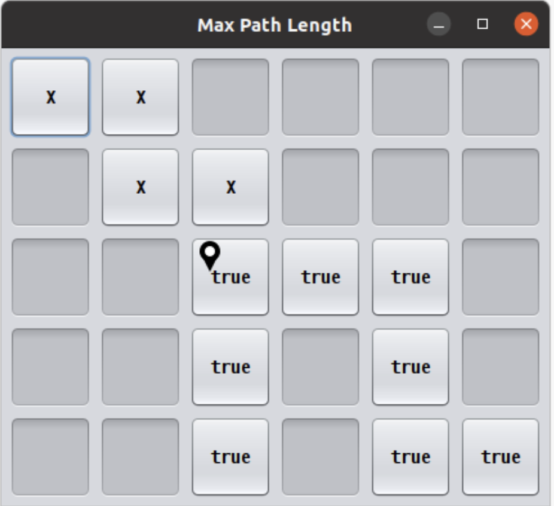

=====================
Assignment 6: More Recursive Puzzles
=====================

Assignment Setup
=====================

To create your repository go `here <https://classroom.github.com/a/N4L9juDj>`_. Then follow the same accept/import process described in `the setup instructions <../Module0-Introduction/software.html>`_.

More Recursive Puzzles
=====================

In this assignment you’ll be tasked with writing a few recursive methods. These recursive methods will rely on the concepts covered in the prep work and studio including:

* Identifying the base case and recursive substructure of a problem

* Tracing recursive execution

* Comparing recursion with iteration

* Using helper methods with recursion

* Using recursion to divide and conquer

Some of the tasks below require you to sketch some things out using paper and pencil. Be sure to take note of these parts of the assignment, as you will be asked to show your work when you are ready to demo.

All of the methods that you are asked to complete can be found in the ``RecursiveMethods.java file``. If you add any additional methods to this file, you are expected to add appropriate JavaDoc comments to these methods.

Since this lab is meant to reinforce the concepts relating to recursion, **no loops are allowed for any reason**. If you use a loop to solve a particular problem you will not receive any credit for that problem.

Questions to ask if you get stuck
=================================

Like all problems, these can be tricky. Here are some common questions that we get from students regarding this assignment. Use these questions to gauge your own understanding of what we are asking you to do. Please ask these questions to a TA or an instructor if you are feeling stuck on a certain part of the assignment.

* What is recursion? When should it be used?

* What is a base case?

* How do you trace the execution of a recursive program?

* How do you debug a recursive program?

* What is a helper method? When should a helper method be used?

Exponents
=====================

Your next task is to complete a method ``exponent(int base, int exp)`` that recursively computes base ^ exp. Your code should work for positive and negative bases as well as positive and negative exponents (Hint: You may want to review the relationship between positive and negative exponents. Khan Academy has a great `Negative exponents review <https://www.khanacademy.org/math/pre-algebra/pre-algebra-exponents-radicals/pre-algebra-negative-exponents/a/negative-exponents-review>`_). Unit tests have been provided in the ``ExponentsTests.java`` file that can be used to check your work.

Once you have completed your method, you should sketch out the execution of ``exponent(3, 4)``. Show every method call that is made and be sure to include every step that is involved in computing the final result. More detail is better!

Tips for completing Exponents
-----------------------------

* A helper method isn’t strictly required, but it may help you here.

* Usage of ``Math.pow()`` or any other method to compute exponents besides recursion is not allowed for this problem.

Submittting Exponents
-----------------------------

When you submit this method you will be asked the following:

* Does the provided ``ExponentTestSuite`` portion of the ``RecursiveMethodsTestSuite`` pass?

* Did you create JavaDoc for your helper method (if you used one)?

* Can you identify the base case(s) in your code?

* Can you identify the recursive step(s) in your code?

* Show and explain your work for the execution of ``exponent(3, 4)``

Array Sum
=========

Complete the method ``arraySum(int[] array)`` such that it computes and returns the sum of the given array. Unit tests have been provided in the ``ArraySumTests.java`` file that can be used to check your work.

Once you have completed your method, you should sketch out the execution of ``arraySum`` using the array ``[1, 3, 9, 7]``. Show every method call that is made and be sure to include every step that is involved in computing the final result. More detail is better!

Tips for Array Sum
-----------------------------

* This is not the first time you have seen this method, as ``arraySum`` was also part of Studio 5 . It is likely that you used iteration during the studio, however your iterative solution may still help you figure out the recursive solution. Note that the unit tests provided to you here are the same as the ones provided to you in studio: the functionality of the two methods should be exactly the same.

* You should not need to create any arrays to solve this problem

* Usage of Arrays.stream(array).sum() or anything like it is not allowed for this problem.

* You will undoubtedly want a helper method. Think about what additional information the helper method should track.

Submitting Array Sum
-----------------------------

When you submit this method you will be asked the following:

* Does the provided ``ArraySumTestSuite`` portion of the ``RecursiveMethodsTestSuite`` pass?

* Can you identify the base case(s) in your code?

* Can you identify the recursive step(s) in your code?

* Can you explain why the helper method is necessary?

* Did you provide JavaDoc comments for your helper method?

* Show and explain your work for the execution of ``arraySum`` with the ``array [1, 3, 9, 7]``.

Dragon Curves
=============

Dragon curves are a type of `Fractal <https://en.wikipedia.org/wiki/Fractal>`_ created by drawing lines in a particular pattern. These lines can be specified using a string with the following characters:

* ``F`` or ``H`` represents forward motion in the current direction

* ``+`` represents a 90 degree counter-clockwise turn

* ``-`` represents a 90 degree clockwise turn

For example, the simplest dragon curve that can be represented is ``F-H`` which looks like this:

.. _dragon(0) = F-H:

**dragon(0) = F-H**

Further dragon curves can be generated by using the following rules:

* Substitute all ``F`` characters with ``F-H``

* Substitute all ``H`` characters with ``F+H``

If the F-H dragon curve above represents ``dragon(0)`` then further dragon curves would look like:

.. _dragon(1) = F-H-F+H:

**dragon(1) = F-H-F+H**

.. _dragon(2) = F-H-F+H-F-H+F+H:

**dragon(2) = F-H-F+H-F-H+F+H**

.. _dragon(3) = F-H-F+H-F-H+F+H-F-H-F+H+F-H+F+H:

**dragon(3) = F-H-F+H-F-H+F+H-F-H-F+H+F-H+F+H**

.. _dragon(4) = F-H-F+H-F-H+F+H-F-H-F+H+F-H+F+H-F-H-F+H-F-H+F+H+F-H-F+H+F-H+F+H:

**dragon(4) = F-H-F+H-F-H+F+H-F-H-F+H+F-H+F+H-F-H-F+H-F-H+F+H+F-H-F+H+F-H+F+H**

.. _dragon(5) = F-H-F+H-F-H+F+H-F-H-F+H+F-H+F+H-F-H-F+H-F-H+F+H+F-H-F+H+F-H+F+H-F-H-F+H-F-H+F+H-F-H-F+H+F-H+F+H+F-H-F+H-F-H+F+H+F-H-F+H+F-H+F+H:

**dragon(5) = F-H-F+H-F-H+F+H-F-H-F+H+F-H+F+H-F-H-F+H-F-H+F+H+F-H-F+H+F-H+F+H-F-H-F+H-F-H+F+H-F-H-F+H+F-H+F+H+F-H-F+H-F-H+F+H+F-H-F+H+F-H+F+H**

Skipping ahead to 10…

.. _dragon(10):

**dragon(10)**

|

Tips for completing this method
-----------------------------

* To perform the substitutions, please use the `String.replace() method <https://docs.oracle.com/javase/8/docs/api/java/lang/String.html#replace-java.lang.CharSequence-java.lang.CharSequence->`_. 

* Be careful with how you perform the substitutions. The substitution for ``F`` will introduce more ``H`` characters into the string, but we only want to perform a substitution on the original ``H`` characters, not these new ones.

* Run ``DragonDebugApp.java`` to see how the first several dragons look (and if they are correct).

* Unit tests have been provided to you in the ``DragonTestSuite`` portion of the ``RecursiveMethodsTestSuite``. Use them to check your work.

Submitting this method
-----------------------------

When you submit this problem you will be asked the following:

* Does the provided ``DragonTestSuite`` portion of the ``RecursiveMethodsTestSuite`` pass?

* Do the first several cases in the provided ``DragonDebugApp`` look good?

* Can you identify the base case(s) in your code?

* Can you identify the recursive step(s) in your code?

Max Path Length
===============

As a break from studying, you decide to go for a walk in a very special park. This park has dangers, but you are provided a chart for the park in the form of a 2D array, such as the following:

Each ``true`` indicates a stepping stone in the park on which you can safely step without adverse consequences. On the other hand, each ``false`` can be thought of as a shaft of infinite depth, so that if step on it, you fall forever and never make it back.

In this scenario, the park has a single entrance where you will start your journey in the top left corner (indicated by the start icon).

In the movie *Indiana Jones and the Last Crusade*, the titular character must navigate such stepping stones to makes his way to the Holy Grail. A misstep (from which he recovers) as well as his eventual success is shown `here <https://en.wikipedia.org/wiki/Indiana_Jones_and_the_Last_Crusade>`_. In the above array, you can step safely on any ``true`` but stepping on any ``false`` will lead to a most unpleasant demise. Unlike Indiana, you will fall forever.

In spite of the dangers presented by this unusual park, you wish to take a stroll, beginning with the top left cell of the chart (which is safe only if it contains a ``true``), and continuing inside the park using only safe cells. Indiana Jones had `two prior movies <https://en.wikipedia.org/wiki/Indiana_Jones>`_, and so lots of experience, so that he could reasonably be asked to jump some distance over cells to find a safe path.

Your task is easier:

* You can move from one cell to another only using `cardinal directions <https://en.wikipedia.org/wiki/Cardinal_direction>`_ , namely up, down, left, or right. *You are not allowed to move diagonally*.

* You can only move one cell at a time: no skipping or jumping over cells!

* You must step only on safe (marked as ``true``) cells.

* Each interior cell can be bordered on each of its four cardinal sides by another safe cell. Thus there can be many paths one could take from the starting cell.

* The safe cells of the chart form no cycles. While the park can contain many paths, you will mark your path as you go to be sure to not to revisit a cell you have already used on your journey.

* You will explore as much of the park you can reach using the rules above and determine which is the longest single path. (Imagine someone was going to take a single path and was reasonably concerned with what the longest possible path you might take, so that they can take the right amount of food and water for your journey.)

How do we find the longest path in such a chart? Let’s continue with our example.

Looking at the chart you notice that the path is unique until a fork is reached at the circled location:

At this point you have a decision to make. There are two paths you could take:

Visually, in this example, it is fairly straightforward to determine which path is the longest by adding up the lengths of the two options:

* Option #1: Start path (5) + down path (2) = 7

* Option #2: Start path (5) + right-down-right path (5) = 10

The green branch is the one that you should select in this situation as it leads to the longest possible path length of 10.

While visually it seems simple to compute the longest path, it is worth looking at this example again with recursion in mind. Remember our task in finding a recursive solution is to discover the substructure of a problem.

Consider finding the longest path but starting from the circled cell below. As depicted, we arrived at the circled cell from the cell above it. Imagine further that we marked the cell above, along with all previous visited cells, as not to be revisited.

Let’s assume we have four messengers named by the direction they would pursue from the circled cell. So let’s call the four messengers ``up``, ``down``, ``left``, and ``right``. Each messenger will look into going its assigned direction, and report back the longest path found recursively from the appropriate neighboring cell. Let’s see how these messengers work in this example:

* The ``left`` messenger sees that it starts on a ``false`` cell, which is not safe, and so it immediately returns ``0`` as the longest path from that cell.

* The ``right`` messenger eventually returns ``5`` as the longest path it finds. It does this using more recursion, but we count on recursion to do the right thing no matter where we start, so we count on the ``right`` messenger returning the correct answer of ``5``.

* The ``down`` messenger returns ``2`` as the longest path from its starting point.

* The ``up`` messenger must not be dispatched in this example! It would consider the cell from which we arrived at the circled cell, and that’s not allowed: there are no cycles in the graph. We can avoid calling the ``up`` messenger in one of two ways:

  * We can be told we arrived at the circled cell from above, and thus know not to send the ``up`` messenger.

  * Before dispatching its four messengers, the cell above the circled cell can temporarily change its contents to ``false`` so that the ``up`` messenger from the circled cell will surely return 0 as the longest path from itself. Recall that’s what happened to the ``left`` messenger because it started with a ``0`` present in the chart initially. Any cell that temporarily changes its contents in this way must restore the ``false`` after its messengers return, prior to returning from its call.

In any case the ``up`` messenger in this example must report ``0`` as its longest path.

How does the circled cell compute the longest path from itself? It can take the information returned by the messengers, namely the longest path from each of those neighboring cells. The longest path from the circled cell is simply the max of the values returned by the messengers, plus ``1`` for the circled cell itself. In our example, this would be:

* the-maximum-of-[left, right, down, up] + 1 =

* the-maximum-of-[0, 5, 2, 0] + 1 =

* 5 + 1 =

* 6

**Note:** `Math.max(a,b) <https://docs.oracle.com/javase/8/docs/api/java/lang/Math.html#max-int-int->`_, although definitely useful, will only compute the maximum of two numbers. It will require a bit of creativity to calculate the maximum of 4 numbers.

That value is returned by any call to the circled cell as the maximum path starting at the circled cell.

The substructure for this problem is that the solution at the circled cell is ``1`` more than the max of the values returned by ``up``, ``down``, ``left``, and ``right``. Each of the four messengers is attacking a slightly smaller problem than the problem found at the circled cell.

Complete the ``maxPathLength(boolean[][] chart, int r, int c)`` method such that it computes and returns the longest path length that exists in the given array. For the sake of this problem you can assume the following:

* You start at the specified row ``r`` and column ``c``.

* You are only expected to travel in the four cardinal directions (north, south, east, west). You cannot move diagonally.

* The chart can be arbitrarily large in either dimension.

* Branching within the chart can be arbitrarily complex.

``MaxPathLengthDebugApp`` is provided to see what the test chart looks like and what answers your code provided versus the expected solution. Unit tests have been provided in the ``MaxPathLengthTestSuite`` portion of the ``RecursiveMethodsTestSuite`` so that can be used to check your work.

Testing and Debug App
-----------------------------

.. youtube:: J1QV9a5Ti_c

``MaxPathLengthDebugApp`` **Key**

Chose Correctly
-----------------------------

The ``MaxPathLengthDebugApp`` will look like the image below if you chose correctly.

.. image:: MaxPathLengthCorrect.png
  :alt: MaxPathLength debug when correct
  :width: 850
  :height: 400
  :align: center

.. _Chose Poorly:

Chose poorly
-----------------------------

The ``MaxPathLengthDebugApp`` could look somthing like the image below if you chose poorly.

Tips for this method
-----------------------------

* You’ll undoubtedly want some way to mark that you’ve already visited a spot on the chart. Feel free to change the values in the array for this purpose. In the example above, this involved temporarily changing a cell’s contents from ``true`` to ``false`` (and, critically, back again at some point).

* Take some time to think about what conditions make up the base case before you begin. Recall that a base case is a condition under which a method does not call itself recursively. It may be helpful to view cells outside of the defined chart as if they contained a ``false``.

* There will be multiple recursive calls in your method.

* Though this method is conceptually difficult, it does not require a large amount of code to complete. A clean and elegant solution is achievable in around 10 lines of code. **It is worthwhile thinking through how to solve this problem before coding!**

Submitting this method, Max Path Length
-----------------------------

When you submit this method you will be asked the following:

* Does everything in the ``MaxPathLengthDebugApp`` look good?

* Does the provided ``MaxPathLengthTestSuite`` portion of the ``RecursiveMethodsTestSuite`` pass?

* Can you identify the base case(s) in your code?

* Can you identify the recursive step(s) in your code?

Submitting your work
====================

Assignments are not graded, however a rubric is presented on Canvas which shows the skills that we hope students to learn by completing this assignment. Please consider discussing your work with an instructor or TA, the exams and quizzes are written based on the concepts presented in the homework assignments and assume that students are practicing these skills by completing the homework.
