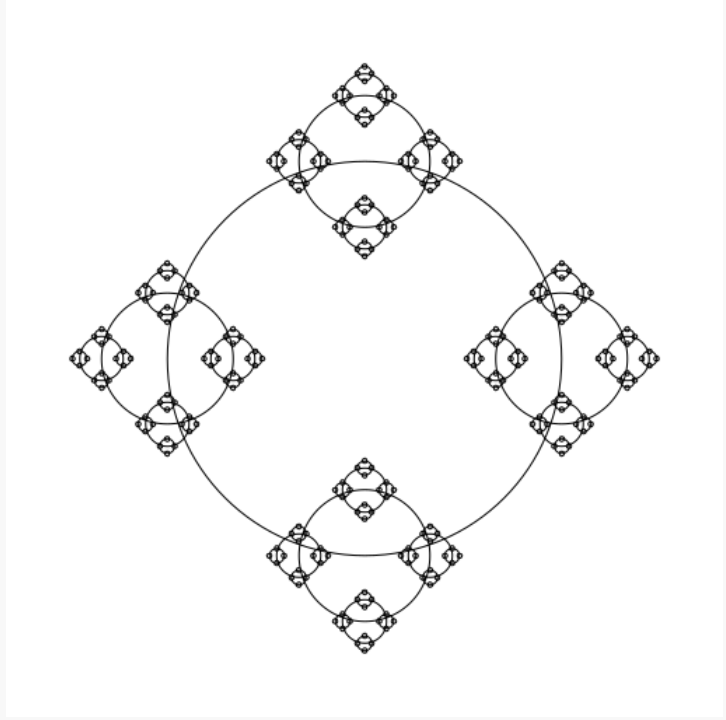
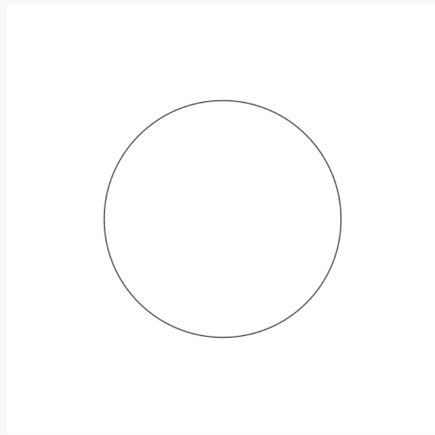
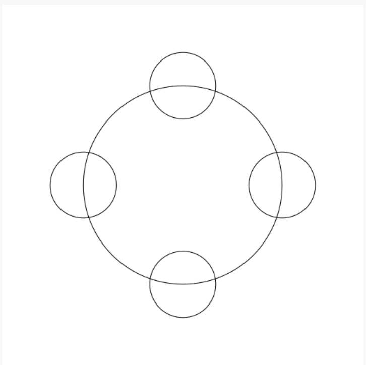
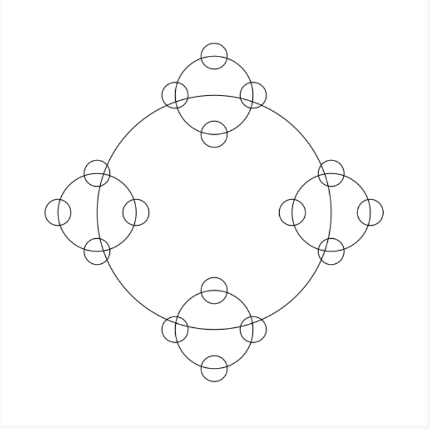
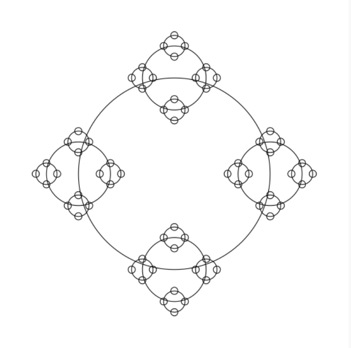

=====================
Studio 6: Recursive Puzzles 
=====================

**Studio activities should not be started before class! Come to the session and work on the activity with other students!**

Studio Setup and Procedure
=====================

* Form a group of 2-3 students and find a TA or instructor to work with.

* All but one member of your group should have this web page open so you can follow along and see the instructions as you work.

* Plan to work on one computer (using Eclipse).

  * Initially, one of you will be in charge of typing at that computer.

  * Throughout the studio you should trade who is in charge of the keyboard.

**READ THE FOLLOWING FULLY BEFORE PROCEEDING**

1. Have **one person** in your group create a new team by `clicking here <https://classroom.github.com/a/BMNU_Hor>`_ and going to the ``OR Create a new team`` box at the bottom of the page. The team name should include the last names of all your group members. For example, if Xia and Smith are working together, the team name should be something like “XiaSmith”.

2. **After the team is created**, all other members of your team should click on the same link and follow the instructions to join the team.

   1. **Be careful to join the right team!** You won’t be able to change teams yourself and will have to contact instructors if there’s a problem.

   2. **Be sure everyone else joins the team!** If grades don’t get entered correctly we will use the team to help verify credit for a particular studio.

3. Finally, one person should import the studio repository into Eclipse, as described in `the setup instructions <../Module0-Introduction/software.html>`_.

   * All team members will have access to the work pushed to GitHub. Be sure to ``Commit and Push`` at the end of the day so everyone can refer back to the work later as needed.

Overview
=====================

In this studio you will explore recursion in various forms:

* Parts of a recursive method

* Recursion as it compares to iteration

* Recursion that utilizes a helper method

* Recursion that is used to divide and conquer

You will also spend time analyzing recursive methods and identifying:

* The base case
* The recursive substructure

   **Important!** Today you must rotate who is doing the typing as you move from one method to the next. Every person in your group must have a chance to be the *lead* person at the keyboard for at least one method described below.

   All group members are encouraged to help the lead person at the keyboard.

In preparation for the exercises open the following files, found in the **studio6** package in the **src** folder of your repository:

* ``IterativeMethods`` is a file in which you will investigate the provided iterative solutions to the first three problems.

* ``RecursiveMethods`` is a file in which you will implement recursive solutions to the four problems described below.

* Run ``MethodsTestSuite`` as a JUnit Test to partially test ``geometricSum(n)``, ``gcd(p, q)``, and ``reverse(array)``.

* Run ``CirclesDemoApp`` as a Java Program to see if ``circlesUponCircles(xCenter, yCenter, radius)`` is drawing correctly.

.. _Ensure The Iterative Solution Passes Its Tests:

**Ensure The Iterative Solution Passes Its Tests**

Run ``MethodsTestSuite`` as a JUnit Test to ensuring it passes the ``IterativeTestSuite`` portion. If it fails any of the tests within ``IterativeTestSuite`` then there is an unintended error and you should check with your TA on how to fix it.

**Important!** You are only writing new code in ``RecursiveMethods.java`` - ``IterativeMethods.java`` provides the iterative solution to each of the problems.

Investigate IterativeMethods.geometricSum(n)
=====================

Discuss with your group what the provided iterative solution is doing.

Implement RecursiveMethods.geometricSum(n)
=====================

Recall from the prep work that all recursive methods have two main features: a base case and a recursive call. But how do we determine what those pieces should be for a given problem?

Let’s examine the case of a geometric sum. A geometric sum can be computed as follows:

1/2 + 1/4 + 1/8 + 1/16...

Now say that we wish to compute the geometric sum for the first N terms, where 1/2 is the 1st term, 1/4 is the 2nd term, etc. Take a moment to reformulate the equation in terms of N (you’ll probably want to get out some paper and a pencil for this).

Within this formulation of a geometric sum is a recursive structure and a base case. Consider the following questions:

* If I am computing the first N geometric terms, when should I stop? Notice that for any value of N, the first term in the series will always be the same: 1/2. 

* What is the recursive substructure here? In order to answer this question we need to find a way to define the problem in *terms of itself*. In other words, can I define ``geometricSum(N)`` that includes another call to ``geometricSum()``? The recursive call to ``geometricSum()`` here must be chosen carefully…we must use a value other than ``N``. In fact we will likely want to choose a value *based on the current value of N*, modifying N in such a way that it moves closer to the base case. You can examine the first few computations to help you with this part:

geometricSum(0)=0

geometricSum(1)=1/2

geometricSum(2)=1/2+1/4

geometricSum(3)=1/2+1/4+1/8

geometricSum(N)= ...

After thinking about these questions, see if you can code up a recursive method called geometricSum that takes in a value for ``N`` and returns the ``geometric sum`` for the first ``N`` terms. Test your work by running ``MethodsTestSuite`` and ensuring it passes the ``RecursiveGeometricSumTestSuite portion``. Continue to update your code until it passes these tests and your group is happy with its clarity.

Be prepared to discuss the base case and recursive substructure with the instructor or TA when demoing this studio.

Recursive Drawing, Circles Upon Circles
=====================

Imagine writing a method to draw the image below:

It would be cumbersome, to say the least, to attempt to draw this iteratively. Nicely, a simple yet clever recursive algorithm will get the job done.

**Discuss with your group**: “What is the recursive substructure?” “What is the base case?”

**Note**: if your group answered that the base case is when the radius gets small enough, then you hit on the solution we were expecting. We have passed (admittedly somewhat unexpectedly) the threshold for what is small enough to stop drawing as ``radiusMinimumDrawingThreshold``. This parameter exists in an attempt to help expose the recursive substructure when running ``CirclesDemoApp``.

**Note**: you should never change the radiusMinimumDrawingThreshold parameter and simply pass it on to all recursive calls.

**Note**: to create this image, we divided the radius by 3.0 at every level.

Run ``CirclesDemoApp`` as a Java Program.

.. youtube:: 1_XvqIAN-gU

For the examples below, the StdDraw world boundaries are set from (-5,-5) to (5,5).

::

   double bound = 5.0;
   StdDraw.setXscale(-bound, bound);
   StdDraw.setYscale(-bound, bound);

.. _Draw 1 Level Deep:

**Draw 1 Level Deep**

If we set the threshold just below the radius, we ensure (with a correct solution to ``circlesUponCircles``) that the drawing will stop after only 1 level, producing the picture below.

``RecursiveMethods.circlesUponCircles(0.0, 0.0, 1.1, 1.0);``

.. _Draw 2 Levels Deep:

**Draw 2 Levels Deep**

If we set the threshold just below 1.0/3.0 the radius, we ensure (with a correct solution to ``circlesUponCircles``) that the drawing will stop after 2 levels, producing the picture below.

``RecursiveMethods.circlesUponCircles(0.0, 0.0, 1.1, 1.0/3.0);``

.. _Draw 3 Levels Deep:

**Draw 3 Levels Deep**

If we set the threshold just below 1.0/9.0 the radius, we ensure (with a correct solution to ``circlesUponCircles``) that the drawing will stop after 2 levels, producing the picture below.

``RecursiveMethods.circlesUponCircles(0.0, 0.0, 1.1, 1.0/9.0);``

.. _Draw 4 Levels Deep:

**Draw 4 Levels Deep**

And so on…

``RecursiveMethods.circlesUponCircles(0.0, 0.0, 1.1, 1.0/27.0);``

.. _Draw 5 Levels Deep:

**Draw 5 Levels Deep**

And so on…

``RecursiveMethods.circlesUponCircles(0.0, 0.0, 1.1, 1.0/81.0);``

Investigate IterativeMethods.reverse(array)
=====================

Discuss with your group what the provided iterative solution is doing.

Implement RecursiveMethods.reverse(array)
=====================

In the previous section we saw how recursion and iteration share some similarities. An important similarity is that recursive methods will repeat, just like iterations through a loop. This repetition is useful, but like iteration there may be things that we don’t want to repeat. With iteration we would put this non-repetitive code outside of the loop, but where can it go with recursion?

The solution to this problem is to use something called a helper method. The idea here is that instead of putting all of our repetitive and non-repetitive code into one method, we can move the recursive part of our method to a helper method. This keeps the recursive, repetitive part of our code in the helper method and the non-repetitive, non-recursive part of our code in a separate method. This separate method will typically be the method that is called first and after performing any tasks that it needs to perform it will call the recursive helper method.

Another nice advantage of this approach is that because the helper method is a “bonus” method, we can construct this method however we want. We might decide that this method should have some additional input parameters to make the recursive work a bit easier to manage.

Your next task is to develop a recursive solution to reversing the contents of an array. You should complete ``reverse(int[] array)``, which will return an array with the same elements as the original but in reverse order. In order to do this you will need a helper method. Your helper method will need additional parameters to assist with the recursion (hint: how can we keep track of where we are currently at in the array?). The non-helper method can then simply call the helper method and return the result. The non-helper method can also handle special cases (what if the length of the array is zero or one?) that don’t require any repetition. Note that for this problem you are not allowed to use loops. You should only need to create a single copy of the array in the reverse(array) method to be passed to your helper method which should update its contents. Beyond that you need not create any additional arrays.

Test your work by running ``MethodsTestSuite`` and ensuring it passes the ``RecursiveToReversedTestSuite`` portion. Continue to update your code until it passes these tests and your group is happy with its clarity.

Investigate IterativeMethods.gcd(p, q)
=====================

Discuss with your group what the provided iterative solution is doing.

Implement RecursiveMethods.gcd(p, q)
=====================

Recursion and iteration (loops) share some similarities. In fact, a solution that uses iteration can be rewritten using recursion. For this part, you are tasked with writing a method that computes the greatest common divisor in two different ways: iteratively and recursively.

The greatest common divisor of two integers is the largest integer that evenly divides both integers. So, for example the greatest common divisor of 27 and 36 is 9. The greatest common divisor of 48 and 14 is 2.

The computation of greatest common divisor can take many forms, but one of the most common ways that it is computed is by applying the following rule:

The greatest common divisor of two numbers, ``p`` and ``q`` is equal to ``q`` if ``p % q`` is equal to zero. Otherwise it is equal to the greatest common divisor of ``q`` and ``p % q``.

Using the above definition, your task is now to implement the recursive version of computing the greatest common divisor. Test your work by running ``MethodsTestSuite`` and ensuring it passes the ``RecursiveGCDTestSuite`` portion. Continue to update your code until it passes these tests and your group is happy with its clarity.

Take a look at your two implementations: do you see similarities between them? Can you match up pieces from the iterative and recursive solutions to see how they are essentially computing the result in the same way just with a different structure?

Walk through the recursive execution of ``gcdRecursive(48, 14)``. How many recursive calls does it take to get to the answer? Use the debugger to work through this particular problem and verify your answer and be prepared to discuss this when you demo the studio.

Demo
=====================

**Commit and Push** your work. Be sure that any file you worked on is updated on `GitHub <https://github.com/>`_.

To get participation credit for your work talk to the TA you’ve been working with and complete the demo/review process. Be prepared to show them the work that you have done and answer their questions about it!

* Explain what a base case is (concept) and show specific base cases in your work.
  
* Explain what the recursive step(s)?

* Explain any diagrams you created

*Before leaving check that everyone in your group has a grade recorded in Canvas!*
