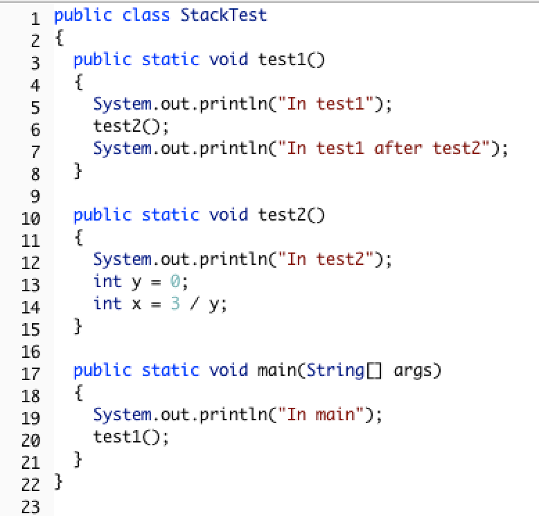
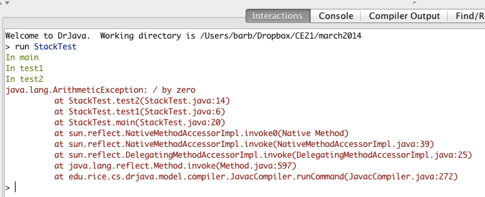
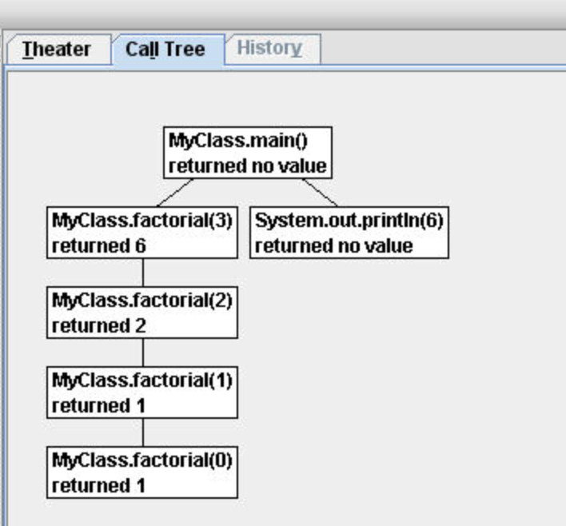

.. qnum::
   :prefix: 11-1-
   :start: 1

.. highlight:: java
   :linenothreshold: 4

.. |CodingEx| image:: ../../_static/codingExercise.png
    :width: 30px
    :align: middle
    :alt: coding exercise
    
    
.. |Exercise| image:: ../../_static/exercise.png
    :width: 35
    :align: middle
    :alt: exercise
    
    
.. |Groupwork| image:: ../../_static/groupwork.png
    :width: 35
    :align: middle
    :alt: groupwork

What is Recursion? 
===============================

..	index::
    single: recursion
    pair: recursion; defintion

**Recursion** is when a method calls itself. See the example method below.

.. code-block:: java
  :linenos:

  public static void neverEnd()
  {
    System.out.println("This is the method that never ends!");
    neverEnd();
  }

..	index::
    single: infinite recursion
    pair: recursion; infinite

This method will print out "This is the method that never ends!" and then call itself, which will print out the message again, and then call itself, and so on.  This is called **infinite recursion**, which is a recursion that never ends.  Of course, this particular method is not very useful.

|Exercise| **Check your Understanding**

.. fillintheblank:: recurb1fill

   Which line in the method neverEnd (shown above) contains the recursive call (the call to the same method)?

   -    :4$: Correct.  This line contains a call to the same method, which makes it a recursive method.
        :.*: Look for a call to the same method name

.. mchoice:: qrb_1
   :practice: T
   :answer_a: Yes
   :answer_b: No
   :correct: b
   :feedback_a: Where is the call to the same method?
   :feedback_b: There is no call to the same method, so this can not be a recursive method. It uses iteration instead.

	Is the following method recursive?

    .. code-block:: java
      :linenos:

      public static int mystery()
      {
         int total = 0;
         for (int i=10; i>0; i--)
         {
            total = total + i;
         }
         return total;
      }

.. mchoice:: qrb_2
   :practice: T
   :answer_a: Yes
   :answer_b: No
   :correct: a
   :feedback_a: Yes, any method that contains at least one call to the same method is recursive.
   :feedback_b: Look again.  Check if the method contains a call to itself.

   Is the following method recursive?

    .. code-block:: java
      :linenos:

      public static int mystery2(int x)
      {
         if (x == 1) return 1;
         else return x + mystery2(x-1);
      }

Why use Recursion?
==================

..	index::
    single: fractal
    pair: recursion; purpose

Recursion is most useful when it is used to solve problems where the structure of the problem repeats.  For example, what if you wanted to find out how much space a folder on your computers uses?  You could add up the sizes of all the files in that folder, but folders can also contain subfolders.  So you will have to repeat the procedure (method) for each subfolder.  Each subfolder can also contain subfolders.

Recursion can also be used to create fractals.  A simple example is Sierpinski's triangle in which you subdivide a triangle into 4 new triangles as shown below.  You can then do the some procedure with each new triangle except the center one.

.. figure:: Figures/triangleSub.png
    :width: 452px
    :align: center
    :figclass: align-center

    Figure 1: A sequence of Sierpinski's triangles

Recursion can also be used to traverse String, array, and ArrayList objects, much like a loop. In fact, any recursive solution could be written with iteration (loops) instead. 

Factorial Method
=================

.. the video is Recursion.mov

The following video is also on YouTube at https://youtu.be/V2S_8E_ubBY.  It introduces the concept of recursion and tracing recursion with the factorial method.

.. youtube:: V2S_8E_ubBY
    :width: 800
    :align: center
    
..	index::
    single: factorial

See the method `factorial` below that calculates the **factorial** of a number.  The **factorial** of a number is defined as 1 for 0 and n * factorial (n-1) for any other number.

.. code-block:: java
   :linenos:

   public static int factorial(int n)
   {
       if (n == 0)
           return 1;
       else
           return n * factorial(n-1);
   }

|Exercise| **Check your understanding**

.. fillintheblank:: recurb2fill

   Which line in the method factorial contains the recursive call (the call to the same method)?

   -    :6$: Correct.  This line contains a call to the same method, which makes it a recursive method.
        :.*: Look for a call to the same method name

|CodingEx| **Coding Exercise**

Run the ``FactorialTest`` program to test the factorial method. What's the factorial of 6? Add another test to print out the factorial of 6. What's the factorial of 1? Add another test to print out the factorial of 1.
   

Base Case
==========

..	index::
    single: base case
    pair: recursion; base case

Every recursive method must have at least one **base case** which halts the recursion. This is usually an if statement that causes the recursion to stop by just giving an answer without needing a recursive method call. You could also think of it as the simplest case where you can give the answer right away. The factorial method has a way to stop the recursion (not call itself).  It stops when n is equal to 0, since it just returns 1. This is the base case.

.. note::

   The thing that stops a recursive method from calling itself is called the **base case**.  A method can have more than one **base case** (way to stop the recursion).

|Exercise| **Check your understanding**

.. clickablearea:: rec_base1
    :question: Click on the line or lines that contain the test for the base case
    :iscode:
    :feedback: When a base case test is true a value is returned and the recursion stops.

    :click-incorrect:public static int factorial(int n):endclick:
    :click-incorrect:{:endclick:
        :click-correct:if (n == 0):endclick:
            :click-incorrect:return 1;:endclick:
        :click-incorrect:else:endclick:
            :click-incorrect:return n * factorial(n-1);:endclick:
    :click-incorrect:}:endclick:
    
.. mchoice:: qrb_3
   :practice: T
   :answer_a: 0
   :answer_b: 1
   :answer_c: 2
   :correct: b
   :feedback_a: Look again.  What is the value of n when this method returns a value, without doing a recursive call?
   :feedback_b: This method stops calling itself when n equals 1 (line 3).
   :feedback_c: Look for a return with a number after it.  When is this code executed?

   What is the value of n when this method stops calling itself (when it reaches the base case)?

    .. code-block:: java
      :linenos:

      public static int product(int n)
      {
         if(n == 1)
            return 1;
         else
            return n * product(n - 2);
      }

.. mchoice:: qrb_4
   :practice: T
   :answer_a: 0
   :answer_b: 1
   :answer_c: Both 0 and 1
   :correct: c
   :feedback_a: This method also stops for another value of n.
   :feedback_b: This method also stops for another value of n.
   :feedback_c: This method stops calling itself when n is either 0 or 1.

   What is/are the values of the variable bunnies when this method stops calling itself (when it reaches the base case)?

    .. code-block:: java
      :linenos:

      public static int bunnyEars(int bunnies)
      {
         if (bunnies == 0) return 0;
         else if (bunnies == 1) return 2;
         else return 2 + bunnyEars(bunnies - 1);
      }

.. mchoice:: qrb_5-new
   :practice: T
   :answer_a: yes
   :answer_b: no
   :correct: b
   :feedback_a: Where is the call to the same method?
   :feedback_b: There is no call to the same method, so it is not recursive. This uses iteration instead.

   Is the following method recursive?

    .. code-block:: java
      :linenos:

      public static int bunnyEars(int bunnies)
      {
         int total = 0;
         for (int i = 0; i < bunnies; i++)
         {
            total = total + 2;
         }
         return total;
      }
      
      
Tracing Recursive Methods 
===================================

..	index::
    single: call stack
    single: stack

In Java, the **call stack** keeps track of the methods that you have called since the main method executes.   A **stack** is a way of organizing data that adds and removes items only from the top of the stack.  An example is a stack of cups.  You can grap a cup from the top of the stack or add more cups at the top of the stack.

    Figure 2: Stacks of cups

When you are executing one method (method a) and it calls another method (method b) the method call is placed on the call stack along with information about where it was called from, which tells the run-time where to return to when the current method finishes executing.  When method b finishes executing the run-time pops the method b off of the call stack and returns execution to the next line to be executed in method a.

Consider the following class definition.

    Figure 3: Code with a divide by zero in a method.

The code above will cause a run-time error of division by zero when it runs.  The ``main`` method calls the method ``test1`` (at line 20) which calls the method ``test2`` (at line 6) which has the divide by zero error (line 14).  This can be seen in the call stack shown below which shows the call stack from the top (most recent method) to the bottom (first method call).

    Figure 4: A call stack in DrJava with a run-time error

When a method calls itself the new method call gets added to the top of the call stack. Execution of the current method pauses while the recursive call is being processed. Each recursive call on the stack has its own set of local variables, including the parameter variables. The parameter values progressively change in each recursive call until we reach the base case which stops the recursion.

|CodingEx| **Tracing Exercise**

Let's trace the execution of the factorial method defined below.

.. code-block:: java

  public static int factorial(int n)
  {
    if (n == 0)
      return 1;
    else
      return n * factorial(n-1);
  }

What happens when we call ``factorial(0)``?  It will return 1 (line 4) since n is equal to 0.  How about ``factorial(1)``?  It will return ``1 * factorial(0)``.  We already know that ``factorial(0)`` returns 1, but the computer won't *remember* that.  It will execute ``factorial(0)`` and return the result (1).   So  ``factorial(1)`` returns ``1 * 1 which is 1``.

How can you show what is happening in a recursive call?  Here is one way to do it.  The lines below show the call stack upside down (with the bottom of the stack, or the beginning at the top and the most recent call at the bottom) for a call to ``factorial(5)``.  This is a handy way to trace a recursive method on the exam and you will do much better on recursive problems if you practice doing it this way.

.. code-block:: java

  factorial(5) returns 5 * factorial(4)
  factorial(4) returns 4 * factorial(3)
  factorial(3) returns 3 * factorial(2)
  factorial(2) returns 2 * factorial(1)
  factorial(1) returns 1 * factorial(0)
  factorial(0) returns 1

Once factorial(0) executes and returns 1 that value can be substituted back into the previous method call, starting at the top of the stack (shown at the bottom here) and working our way back to the bottom of the stack (shown at the top here).

.. code-block:: java

  factorial(5) returns 5 * factorial(4) = 5 * 24 = 120
  factorial(4) returns 4 * factorial(3) = 4 * 6 = 24
  factorial(3) returns 3 * factorial(2) = 2 so 3 * 2 = 6
  factorial(2) returns 2 * factorial(1) = 1 so 2 * 1 = 2
  factorial(1) returns 1 * factorial(0) = 1 so 1 * 1 = 1
  factorial(0) returns 1

So ``factorial(5)`` returns 120.

.. broken link: and http://ice-web.cc.gatech.edu/dl/?q=node/729 for a step by step tutorial about how to use Jeliot).

    Figure 5: A call tree in Jeliot

|Exercise| **Check your understanding**

.. mchoice:: qrb_5-old
   :practice: T
   :answer_a: 1
   :answer_b: 120
   :answer_c: 720
   :answer_d: 30
   :correct: c
   :feedback_a: This would be correct if it was factorial(0), but don't forget the recursive calls.
   :feedback_b: This would be correct if it was factorial(5), but this is factorial(6).
   :feedback_c: If you remember that factorial(5) was 120 then this is just 6 * 120 = 720.
   :feedback_d: It doesn't return 6 * 5 it returns 6 * factorial(5).

	Given the method defined below what does the following return: factorial(6)?

    .. code-block:: java
     :linenos:

     public static int factorial(int n)
     {
        if (n == 0)
           return 1;
        else
           return n * factorial(n-1);
     }

.. mchoice:: qrb_6
   :practice: T
   :answer_a: 10
   :answer_b: 32
   :answer_c: 16
   :answer_d: 64
   :correct: b
   :feedback_a: This would be correct if it addition instead of multiplication.
   :feedback_b: This method calculates 2 raised to the nth power.
   :feedback_c: Check that you didn't miss one of the recursive calls.
   :feedback_d: This would be true if the call was mystery(6).

	Given the method defined below what does the following return: mystery(5)?

    .. code-block:: java
     :linenos:

     public static int mystery(int n)
     {
        if (n == 0)
           return 1;
        else
           return 2 * mystery (n - 1);
     }

.. mchoice:: qrb_7
   :practice: T
   :answer_a: 12
   :answer_b: 81
   :answer_c: 64
   :answer_d: 27
   :answer_e: 243
   :correct: b
   :feedback_a: This would be correct if it added instead of multiplied.
   :feedback_b: This calculates a to nth power.
   :feedback_c: This would be correct if it was 4 to the 3rd instead of 3 to the 4th power.
   :feedback_d: This would be correct if returned 1 instead of a in the base case.
   :feedback_e: This would be correct if it was 3 to the 5th.

	Given the method defined below what does the following print: mystery(4,3)?

    .. code-block:: java
     :linenos:

     public static int mystery(int n, int a)
     {
       if (n == 1) return a;
       return a * mystery(n-1,a);
     }

|CodingEx| **Tracing Exercise**

Let's trace the execution of the bunny ears method defined below.

.. code-block:: java
  :linenos:

  public static int bunnyEars(int bunnies)
  {
     if (bunnies == 0) return 0;
     else if (bunnies == 1) return 2;
     else return 2 + bunnyEars(bunnies - 1);
  }

What happens when we call ``bunnyEars(0)``?  It will return 0 since n is equal to 0 (line 3).  How about ``bunnyEars(1)``?  It will return 2 since n is equal to 1 (line 4). What about ``bunnyEars(5)``?

.. code-block:: java
  :linenos:

  bunnyEars(5) returns 2 + bunnyEars(4)
  bunnyEars(4) returns 2 + bunnyEars(3)
  bunnyEars(3) returns 2 + bunnyEars(2)
  bunnyEars(2) returns 2 + bunnyEars(1)
  bunnyEars(1) returns 2

This approach shows the call stack from bottom to top.  Once bunnyEars(1) executes and returns 2 that value can be substituted back into the previous method call, starting at the top and working our way back toward the bottom (or beginning) of the call stack.

.. code-block:: java
  :linenos:

  bunnyEars(5) returns 2 + bunnyEars(4) = 2 + 8 = 10
  bunnyEars(4) returns 2 + bunnyEars(3) = 2 + 6 = 8
  bunnyEars(3) returns 2 + bunnyEars(2) = 2 + 4 = 6
  bunnyEars(2) returns 2 + bunnyEars(1) = 2 + 2 = 4
  bunnyEars(1) returns 2

So ``bunnyEars(5)`` returns 10.  You can step through this code using the Java Visualizer by clicking on this link: `bunnyEars <http://cscircles.cemc.uwaterloo.ca/java_visualize/#code=public+class+Test+%7B%0A++public+static+int+bunnyEars(int+bunnies)+%0A++%7B%0A+++++if+(bunnies+%3D%3D+0)+return+0%3B%0A+++++else+if+(bunnies+%3D%3D+1)+return+2%3B%0A+++++else+return+2+%2B+bunnyEars(bunnies+-+1)%3B+%0A++%7D%0A+++%0A+++public+static+void+main(String%5B%5D+args)+%7B%0A++++++System.out.println(bunnyEars(5))%3B%0A++++++%0A+++%7D%0A%7D&mode=display&curInstr=0>`_.

|Exercise| **Check your understanding**

.. mchoice:: qrb_8
   :practice: T
   :answer_a: 12344321
   :answer_b: 1234
   :answer_c: 4321
   :answer_d: 43211234
   :answer_e: 32144123
   :correct: d
   :feedback_a: Remember that 1234 % 10 returns the rightmost digit.
   :feedback_b: There are two calls that print something in this method.
   :feedback_c: There are two calls that print something in this method.
   :feedback_d: This method prints the right most digit and then removes the rightmost digit for the recursive call.  It prints both before and after the recursive call.
   :feedback_e: Since 1234 % 10 returns the rightmost digit, the first thing printed is 4.

	Given the method defined below what does the following print: mystery(1234)?

    .. code-block:: java
     :linenos:

     public static void mystery (int x) {
        System.out.print(x % 10);

        if ((x / 10) != 0) {
           mystery(x / 10);
        }
        System.out.print(x % 10);
     }

You can step through the code above using the Java Visualizer by clicking on the following link: `Ex-11-3-4 <http://cscircles.cemc.uwaterloo.ca/java_visualize/#code=public+class+Test+%7B%0A+++%0A+++public+static+void+mystery+(int+x)+%0A+++%7B%0A++++++++System.out.print(x+%25+10)%3B+%0A%0A++++++++if+((x+/+10)+!%3D+0)+%7B%0A+++++++++++mystery(x+/+10)%3B+%0A++++++++%7D+%0A++++++++System.out.print(x+%25+10)%3B+%0A+++%7D%0A+++%0A+++public+static+void+main(String%5B%5D+args)+%7B%0A++++++mystery(1234)%3B%0A++++++%0A+++%7D%0A%7D&mode=display&curInstr=0>`_.

.. mchoice:: qrb_9
   :practice: T
   :answer_a: 7
   :answer_b: 2
   :answer_c: 1
   :answer_d: 3
   :answer_e: 0
   :correct: b
   :feedback_a: This would be correct if was counting the number of characters in the string, but that isn't what it is doing.
   :feedback_b: This method seems to be counting the number of y's in the string, but fails to check if a single character is a y.
   :feedback_c: Don't forget that there are recursive calls too.
   :feedback_d: This would be correct if the base case returned 1 if the single character was a y.
   :feedback_e: Don't forget about the recursive calls.

	Given the method defined below what does the following return: mystery("xyzxyxy")? Note that this recursive method traverses a String.

    .. code-block:: java
     :linenos:

     public static int mystery(String str)
     {
        if (str.length() == 1) return 0;
        else
        {
           if (str.substring(0,1).equals("y")) return 1 +
                                mystery(str.substring(1));
           else return mystery(str.substring(1));
        }
     }

Tracing Challenge : Recursion
===========================================

Trace through the following recursion problems.

Consider the following recursive method:

.. code-block:: java
   :linenos:

   public static int mystery(int n)
   {
       if (n == 0)
           return 1;
       else
           return 3 * mystery (n - 1);
   }

The trace of this code for mystery(4) is shown below.

.. code-block:: java

   mystery(4) returns 3 * mystery(3)
   mystery(3) returns 3 * mystery(2)
   mystery(2) returns 3 * mystery(1)
   mystery(1) returns 3 * mystery(0)
   mystery(0) returns A

.. fillintheblank:: recBase1

   What is the value of A in the trace above?

   -    :^1$: Correct!
        :.*: What is the value returned from mystery(0)?

Once mystery(0) returns 1 the value for each call to mystery can now be calculated and returned.

.. code-block:: java

   mystery(4) returns 3 * mystery(3) = 3 * X = Y
   mystery(3) returns 3 * mystery(2) = 3 * 9 = 27
   mystery(2) returns 3 * mystery(1) = 3 * 3 = 9
   mystery(1) returns 3 * mystery(0) = 3 * 1 = 3
   mystery(0) returns 1

.. fillintheblank:: recFBTracex1

   What is the value of X in the trace above?

   -    :^27$: Correct!
        :.*: What is the result of mystery(3)?

.. fillintheblank:: recFBTracey1

   What is the value of Y in the trace above?

   -    :^81$: Correct!
        :.*: What is the result of 3 * mystery(3)?

Consider the following recursive method:

.. code-block:: java
   :linenos:

   public static int strMethod(String str)
   {
      if (str.length() == 1) return 0;
      else
      {
         if (str.substring(0,1).equals("e")) return 1 +
                              strMethod(str.substring(1));
         else return strMethod(str.substring(1));
      }
   }

.. code-block:: java

   strMethod("every") returns 1 + strMethod("very")
   strMethod("very") returns strMethod("ery")
   strMethod("ery") returns 1 + strMethod("ry")
   strMethod("ry") returns strMethod("y")
   strMethod("y") returns B

.. fillintheblank:: recFBBase2

      What is the value of B in the trace above?

      -    :^0$: Correct!
           :.*: What is the value returned from strMethod("y")?

Once strMethod("y") returns, the value from each recursive call on the stack can be calculated and returned.

.. code-block:: java

   strMethod("every") returns 1 + strMethod("very") = Z
   strMethod("very") returns strMethod("ery") = Y
   strMethod("ery") returns 1 + strMethod("ry") = 1 + X
   strMethod("ry") returns strMethod("y") = 0
   strMethod("y") returns 0

.. fillintheblank:: recFBRetX2

   What is the value of X in the trace above?

   -    :^0$: Correct!
        :.*: What is the value returned from strMethod("ry")?

.. fillintheblank:: recFBRetY2

   What is the value of Y in the trace above?

   -    :^1$: Correct!
        :.*: What is the value returned from strMethod("ery")?

.. fillintheblank:: recFBRetZ2

   What is the value of Z in the trace above?

   -    :^2$: Correct!
        :.*: What is the value returned from strMethod("every")?

Summary
============

- A recursive method is a method that calls itself.

- Recursive methods contain at least one base case, which halts the recursion, and at least one recursive call.

- Each recursive call has its own set of local variables, including the formal parameters.

- Parameter values capture the progress of a recursive process, much like loop control variable values capture the progress of a loop.

- Any recursive solution can be replicated through the use of an iterative approach.

- Writing recursive program code is outside the scope of the course and AP Exam.

- Recursion can be used to traverse String, array, and ArrayList objects.