=====================
Module 6
=====================

.. Here is were you specify the content and order of your new book.

.. Each section heading (e.g. "SECTION 1: A Random Section") will be
   a heading in the table of contents. Source files that should be
   generated and included in that section should be placed on individual
   lines, with one line separating the first source filename and the
   :maxdepth: line.

.. Sources can also be included from subfolders of this directory.
   (e.g. "DataStructures/queues.rst").

Exercise : 6.25. Recursive factorial and sum
:::::::::::::::::::::::::::::::::::::::::::::::::::

* In the ``exercises6`` package of the ``exercises`` source folder, create

  * ``Sum.java`` as a Java class
  
  * ``SumTest.java`` as a JUnit test file
  
* Complete both so that sum is computed as defined by the explicitly recursive formula:

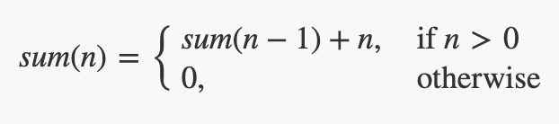

* Write some tests for ``sum()`` and run the unit test file to make sure your function works.

Remember that you have to have a ``@Test`` directive above any unit test method, as shown in the video.

Exercise : 6.27. Recursive addition
:::::::::::::::::::::::::::::::::::::::::::::::::::

* In the ``exercises6`` package of the ``exercises`` source folder, complete the

  * ``Add.java``

  * ``addTest.java``

* Complete both so that addition is computed as defined by the explicitly recursive formula:

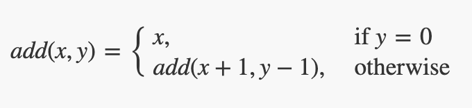

* Write some more tests for add and run the unit test file to make sure your function works.
  
* Remember that you have to have a ``@Test`` directive above any unit test method, as shown in the video.

* Under what conditions on x and y does your method operate correctly?

* How could you complete the ``addAll(x,y)`` method so it works for any ``x`` and ``y``?
  
See the code, as a hint is given there.

Exercise : 6.32. Base cases
:::::::::::::::::::::::::::::::::::::::::::::::::::

**Part 1**

In the video, one possible explanation for human reproduction was given, namely that a woman is born with all of the babies already inside her that she would ever deliver. This idea is attributed to `Anton von Leeuwenhoek <https://en.wikipedia.org/wiki/Antonie_van_Leeuwenhoek>`_ who, as a lens maker, greatly advanced the use of microscopes in studying biology. In terms of recursion and base cases, what is wrong with von Leeuwenhoek’s speculation?

**Part 2**

* In the ``exercises6`` package of the exercises source folder, find and open the ``FactorialNoBaseCase`` class.

* Run the class as a Java Application.

* What happens, and why?

Exercise : 6.55. Graph Paper
:::::::::::::::::::::::::::::::::::::::::::::::::::

* In the ``exercises6`` package of the ``exercises`` source folder, find and open the ``GraphPaper`` class.

* Complete the class so that it produces a grid on the screen

* Think about the recursive substructure of drawing a grid

* Think about the base case(s)

Studio 6: Recursive Puzzles 
::::::::::::::::::::::::::::::::::::::::::::::::::::::::::::::::

**Studio activities should not be started before class! Come to the session and work on the activity with other students!**

* `Studio Setup and Procedure`_

* `Overview`_

* `Ensure The Iterative Solution Passes Its Tests`_

* `Parts of a Recursive Method`_

  * `Investigate IterativeMethods.geometricSum(n)`_

  * `Implement RecursiveMethods.geometricSum(n)`_

* `Recursion vs. Iteration`_

  * `Investigate IterativeMethods.gcd(p, q)`_

  * `Implement RecursiveMethods.gcd(p, q)`_

* `Recursion with a Helper Method`_

  * `Investigate IterativeMethods.reverse(array)`_

  * `Investigate RecursiveMethods.(array)`_

* `Recursive Drawing, Circles Upon Circles`_

  *  `Draw 1 Level Deep`_

  *  `Draw 2 Levels Deep`_

  *  `Draw 3 Levels Deep`_

  *  `Draw 4 Levels Deep`_

  *  `Draw 5 Levels Deep`_

* `Demo`_

.. _Studio Setup and Procedure:

**Studio Setup and Procedure**

* Form a group of 2-3 students and find a TA or instructor to work with.

* All but one member of your group should have this web page open so you can follow along and see the instructions as you work.

* Plan to work on one computer (using Eclipse).

  * Initially, one of you will be in charge of typing at that computer.

  * Throughout the studio you should trade who is in charge of the keyboard.

**READ THE FOLLOWING FULLY BEFORE PROCEEDING**

1. Have **one person** in your group create a new team by `Logo <https://classroom.github.com/g/n3TfYnGC>`_ here and going to the ``OR Create a new team`` box at the bottom of the page. The team name should include the last names of all your group members. For example, if Xia and Smith are working together, the team name should be something like “XiaSmith”.

2. **After the team is created**, all other members of your team should click on the same link and follow the instructions to join the team.

   1. **Be careful to join the right team!** You won’t be able to change teams yourself and will have to contact instructors if there’s a problem.

   2. **Be sure everyone else joins the team!** If grades don’t get entered correctly we will use the team to help verify credit for a particular studio.

3. Finally, one person should import the studio repository into Eclipse, as described in `Assignment 0’s Add the assignment to Eclipse <https://classes.engineering.wustl.edu/2021/fall/cse131//modules/0/assignment#4-add-the-assignment-to-eclipse>`_

   * All team members will have access to the work pushed to GitHub. Be sure to ``Commit and Push`` at the end of the day so everyone can refer back to the work later as needed.

.. _Overview:

**Overview**

In this studio you will explore recursion in various forms:

* Parts of a recursive method

* Recursion as it compares to iteration

* Recursion that utilizes a helper method

* Recursion that is used to divide and conquer

You will also spend time analyzing recursive methods and identifying:

* The base case
* The recursive substructure

   **Important!** Today you must rotate who is doing the typing as you move from one method to the next. Every person in your group must have a chance to be the *lead* person at the keyboard for at least one method described below.

   All group members are encouraged to help the lead person at the keyboard.

In preparation for the exercises open the following files, found in the **studio6** package in the **src** folder of your repository:

* ``IterativeMethods`` is a file in which you will investigate the provided iterative solutions to the first three problems.

* ``RecursiveMethods`` is a file in which you will implement recursive solutions to the four problems described below.

* Run ``MethodsTestSuite`` as a JUnit Test to partially test ``geometricSum(n)``, ``gcd(p, q)``, and ``reverse(array)``.

* Run ``CirclesDemoApp`` as a Java Program to see if ``circlesUponCircles(xCenter, yCenter, radius)`` is drawing correctly.

.. _Ensure The Iterative Solution Passes Its Tests:

**Ensure The Iterative Solution Passes Its Tests**

Run ``MethodsTestSuite`` as a JUnit Test to ensuring it passes the ``IterativeTestSuite`` portion. If it fails any of the tests within ``IterativeTestSuite`` then there is an unintended error and you should check with your TA on how to fix it.

.. _Parts of a Recursive Method:

**Parts of a Recursive Method**

.. _Investigate IterativeMethods.geometricSum(n):

**Investigate IterativeMethods.geometricSum(n)**

Discuss with your group what the provided iterative solution is doing.

.. _Implement RecursiveMethods.geometricSum(n):

**Implement RecursiveMethods.geometricSum(n)**

Recall from the prep work that all recursive methods have two main features: a base case and a recursive call. But how do we determine what those pieces should be for a given problem?

Let’s examine the case of a geometric sum. A geometric sum can be computed as follows:

1/2 + 1/4 + 1/8 + 1/16...

Now say that we wish to compute the geometric sum for the first N terms, where 12 is the 1st term, 14 is the 2nd term, etc. Take a moment to reformulate the equation in terms of N (you’ll probably want to get out some paper and a pencil for this).

Within this formulation of a geometric sum is a recursive structure and a base case. Consider the following questions:

* If I am computing the first N geometric terms, when should I stop? Notice that for any value of N, the first term in the series will always be the same: 1/2. 

* What is the recursive substructure here? In order to answer this question we need to find a way to define the problem in *terms of itself*. In other words, can I define ``geometricSum(N)`` that includes another call to ``geometricSum()``? The recursive call to ``geometricSum()`` here must be chosen carefully…we must use a value other than ``N``. In fact we will likely want to choose a value *based on the current value of N*, modifying N in such a way that it moves closer to the base case. You can examine the first few computations to help you with this part:

geometricSum(0)=0

geometricSum(1)=1/2

geometricSum(2)=1/2+1/4

geometricSum(3)=1/2+1/4+1/8

geometricSum(N)= ...

After thinking about these questions, see if you can code up a recursive method called geometricSum that takes in a value for ``N`` and returns the ``geometric sum`` for the first ``N`` terms. Test your work by running ``MethodsTestSuite`` and ensuring it passes the ``RecursiveGeometricSumTestSuite portion``. Continue to update your code until it passes these tests and your group is happy with its clarity.

Be prepared to discuss the base case and recursive substructure with the instructor or TA when demoing this studio.

.. _Recursion vs. Iteration:

**Recursion vs. Iteration**

.. _Investigate IterativeMethods.gcd(p, q):

**Investigate IterativeMethods.gcd(p, q)**

Discuss with your group what the provided iterative solution is doing.

.. _Implement RecursiveMethods.gcd(p, q):

**Implement RecursiveMethods.gcd(p, q)**

Recursion and iteration (loops) share some similarities. In fact, a solution that uses iteration can be rewritten using recursion. For this part, you are tasked with writing a method that computes the greatest common divisor in two different ways: iteratively and recursively.

The greatest common divisor of two integers is the largest integer that evenly divides both integers. So, for example the greatest common divisor of 27 and 36 is 9. The greatest common divisor of 48 and 14 is 2.

The computation of greatest common divisor can take many forms, but one of the most common ways that it is computed is by applying the following rule:

The greatest common divisor of two numbers, ``p`` and ``q`` is equal to ``q`` if ``p % q`` is equal to zero. Otherwise it is equal to the greatest common divisor of ``q`` and ``p % q``.

Using the above definition, your task is now to implement the recursive version of computing the greatest common divisor. Test your work by running ``MethodsTestSuite`` and ensuring it passes the ``RecursiveGCDTestSuite`` portion. Continue to update your code until it passes these tests and your group is happy with its clarity.

Take a look at your two implementations: do you see similarities between them? Can you match up pieces from the iterative and recursive solutions to see how they are essentially computing the result in the same way just with a different structure?

Walk through the recursive execution of ``gcdRecursive(48, 14)``. How many recursive calls does it take to get to the answer? Use the debugger to work through this particular problem and verify your answer and be prepared to discuss this when you demo the studio.

.. _Recursion with a Helper Method:

**Recursion with a Helper Method**

.. _Investigate IterativeMethods.reverse(array):

**Investigate IterativeMethods.reverse(array)**

Discuss with your group what the provided iterative solution is doing.

.. _Implement RecursiveMethods.(array):

**Implement RecursiveMethods.(array)**

In the previous section we saw how recursion and iteration share some similarities. An important similarity is that recursive methods will repeat, just like iterations through a loop. This repetition is useful, but like iteration there may be things that we don’t want to repeat. With iteration we would put this non-repetitive code outside of the loop, but where can it go with recursion?

The solution to this problem is to use something called a helper method. The idea here is that instead of putting all of our repetitive and non-repetitive code into one method, we can move the recursive part of our method to a helper method. This keeps the recursive, repetitive part of our code in the helper method and the non-repetitive, non-recursive part of our code in a separate method. This separate method will typically be the method that is called first and after performing any tasks that it needs to perform it will call the recursive helper method.

Another nice advantage of this approach is that because the helper method is a “bonus” method, we can construct this method however we want. We might decide that this method should have some additional input parameters to make the recursive work a bit easier to manage.

Your next task is to develop a recursive solution to reversing the contents of an array. You should complete ``reverse(int[] array)``, which will return an array with the same elements as the original but in reverse order. In order to do this you will need a helper method. Your helper method will need additional parameters to assist with the recursion (hint: how can we keep track of where we are currently at in the array?). The non-helper method can then simply call the helper method and return the result. The non-helper method can also handle special cases (what if the length of the array is zero or one?) that don’t require any repetition. Note that for this problem you are not allowed to use loops. You should only need to create a single copy of the array in the reverse(array) method to be passed to your helper method which should update its contents. Beyond that you need not create any additional arrays.

Test your work by running ``MethodsTestSuite`` and ensuring it passes the ``RecursiveToReversedTestSuite`` portion. Continue to update your code until it passes these tests and your group is happy with its clarity.

.. _Recursive Drawing, Circles Upon Circles:

**Recursive Drawing, Circles Upon Circles**

Imagine writing a method to draw the image below:

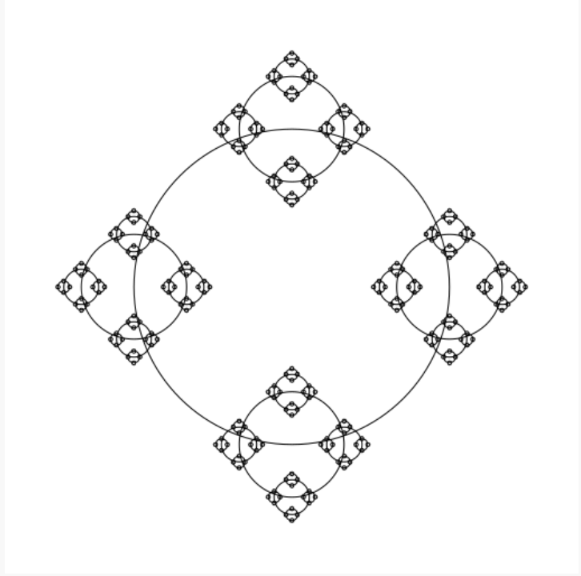

It would be cumbersome, to say the least, to attempt to draw this iteratively. Nicely, a simple yet clever recursive algorithm will get the job done.

**Discuss with your group**: “What is the recursive substructure?” “What is the base case?”

**Note**: if your group answered that the base case is when the radius gets small enough, then you hit on the solution we were expecting. We have passed (admittedly somewhat unexpectedly) the threshold for what is small enough to stop drawing as ``radiusMinimumDrawingThreshold``. This parameter exists in an attempt to help expose the recursive substructure when running ``CirclesDemoApp``.

**Note**: you should never change the radiusMinimumDrawingThreshold parameter and simply pass it on to all recursive calls.

**Note**: to create this image, we divided the radius by 3.0 at every level.

Run ``CirclesDemoApp`` as a Java Program.

.. youtube:: 1_XvqIAN-gU

For the examples below, the StdDraw world boundaries are set from (-5,-5) to (5,5).

::

   double bound = 5.0;
   StdDraw.setXscale(-bound, bound);
   StdDraw.setYscale(-bound, bound);

.. _Draw 1 Level Deep:

**Draw 1 Level Deep**

If we set the threshold just below the radius, we ensure (with a correct solution to ``circlesUponCircles``) that the drawing will stop after only 1 level, producing the picture below.

``RecursiveMethods.circlesUponCircles(0.0, 0.0, 1.1, 1.0);``

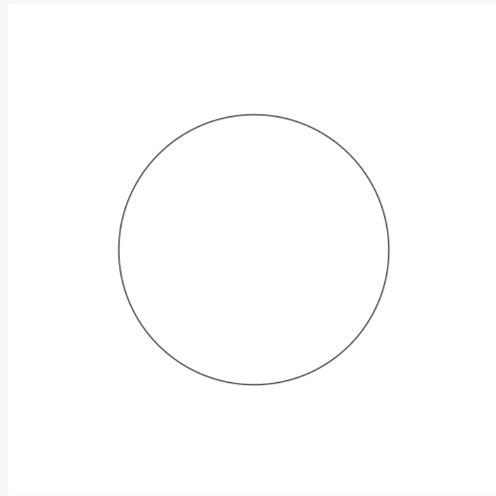

.. _Draw 2 Levels Deep:

**Draw 2 Levels Deep**

If we set the threshold just below 1.0/3.0 the radius, we ensure (with a correct solution to ``circlesUponCircles``) that the drawing will stop after 2 levels, producing the picture below.

``RecursiveMethods.circlesUponCircles(0.0, 0.0, 1.1, 1.0/3.0);``

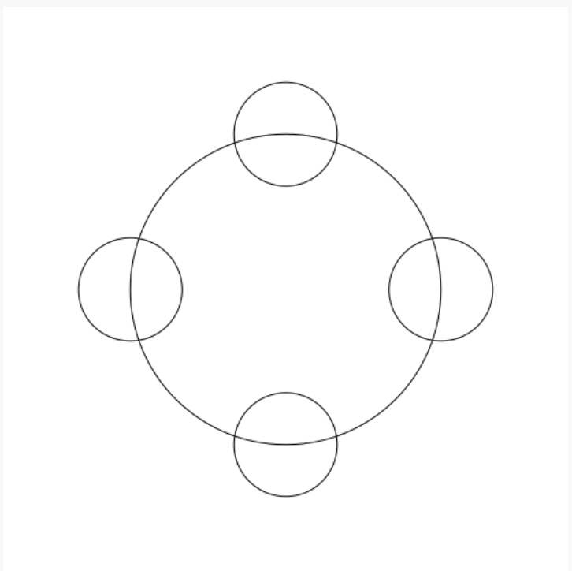

.. _Draw 3 Levels Deep:

**Draw 3 Levels Deep**

If we set the threshold just below 1.0/9.0 the radius, we ensure (with a correct solution to ``circlesUponCircles``) that the drawing will stop after 2 levels, producing the picture below.

``RecursiveMethods.circlesUponCircles(0.0, 0.0, 1.1, 1.0/9.0);``

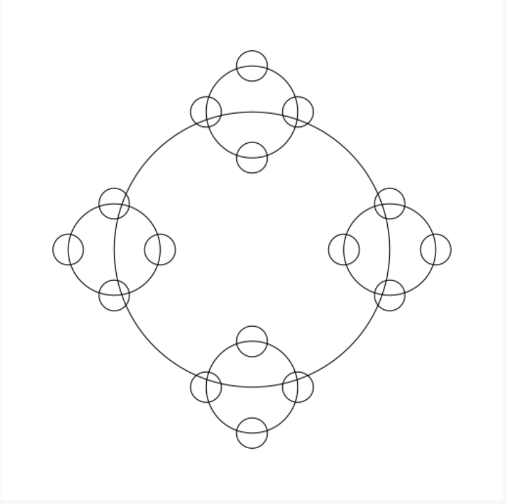

.. _Draw 4 Levels Deep:

**Draw 4 Levels Deep**

And so on…

``RecursiveMethods.circlesUponCircles(0.0, 0.0, 1.1, 1.0/27.0);``

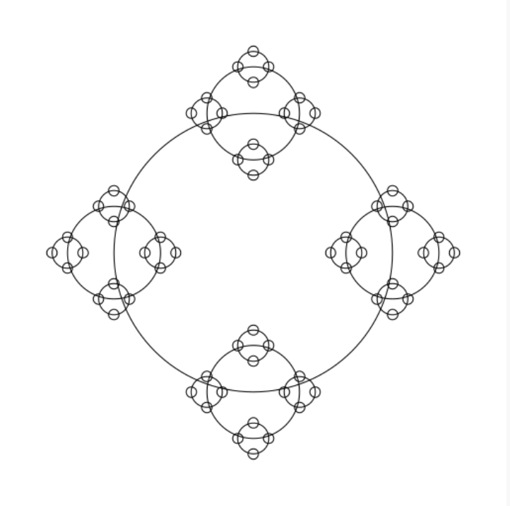

.. _Draw 5 Levels Deep:

**Draw 5 Levels Deep**

And so on…

``RecursiveMethods.circlesUponCircles(0.0, 0.0, 1.1, 1.0/81.0);``

.. _Demo:

**Demo**

**Commit and Push** your work. Be sure that any file you worked on is updated on `GitHub <https://github.com/>`_.

To get participation credit for your work talk to the TA you’ve been working with and complete the demo/review process. Be prepared to show them the work that you have done and answer their questions about it!

* Explain what a base case is (concept) and show specific base cases in your work.
  
* Explain what the recursive step(s)?

* Explain any diagrams you created

*Before leaving check that everyone in your group has a grade recorded in Canvas!*

Assignment 6: More Recursive Puzzles
:::::::::::::::::::::::::::::::::::::::::::::::::::

* `Assignment Setup`_
  
* `More Recursive Puzzles`_
  
* `Exponents`_
  
  * `Tips for completing Exponents`_
  
  * `Testing Exponents`_
  
  * `Submitting Exponents`_

* `Array Sum`_
  
  * `Tips for Array Sum`_

  * `Testing Array Sum`_

  * `Submitting Array Sum`_

* `Substitute All Practice`_

* `Dragon Curves`_

  * `dragon(0) = F-H`_

  * `dragon(1) = F-H-F+H`_

  * `dragon(2) = F-H-F+H-F-H+F+H`_

  * `dragon(3) = F-H-F+H-F-H+F+H-F-H-F+H+F-H+F+H`_

  * `dragon(4) = F-H-F+H-F-H+F+H-F-H-F+H+F-H+F+H-F-H-F+H-F-H+F+H+F-H-F+H+F-H+F+H`_

  * `dragon(5) = F-H-F+H-F-H+F+H-F-H-F+H+F-H+F+H-F-H-F+H-F-H+F+H+F-H-F+H+F-H+F+H-F-H-F+H-F-H+F+H-F-H-F+H+F-H+F+H+F-H-F+H-F-H+F+H+F-H-F+H+F-H+F+H`_

  * `dragon(10)`_

  * `Testing`_

  * `Tips for completing this method`_

  * `Submitting this method`_

* `Max Path Length`_

  * `Testing and Debug App`_

    * `Chose Correctly`_

    * `Chose Poorly`_

  * `Tips for this method`_

  * `Submitting this method, Max Path Length`_
  
* `Submitting your work`_

.. _Assignment Setup:

**Assignment Setup**

To create your repository go `here <https://classroom.github.com/a/DDL1ilgU>`__. Then follow the same accept/import process described in `Assignment 0 <https://classes.engineering.wustl.edu/2021/fall/cse131//modules/0/assignment>`_.

.. _More Recursive Puzzles:

**More Recursive Puzzles**

In this assignment you’ll be tasked with writing a few recursive methods. These recursive methods will rely on the concepts covered in the prep work and studio including:

* Identifying the base case and recursive substructure of a problem

* Tracing recursive execution

* Comparing recursion with iteration

* Using helper methods with recursion

* Using recursion to divide and conquer

Some of the tasks below require you to sketch some things out using paper and pencil. Be sure to take note of these parts of the assignment, as you will be asked to show your work when you are ready to demo.

All of the methods that you are asked to complete can be found in the ``RecursiveMethods.java file``. If you add any additional methods to this file, you are expected to add appropriate JavaDoc comments to these methods.

Since this lab is meant to reinforce the concepts relating to recursion, **no loops are allowed for any reason**. If you use a loop to solve a particular problem you will not receive any credit for that problem.

.. _Exponents:

**Exponents**

Your next task is to complete a method ``exponent(int base, int exp)`` that recursively computes base ^ exp. Your code should work for positive and negative bases as well as positive and negative exponents (Hint: You may want to review the relationship between positive and negative exponents. Khan Academy has a great `Negative exponents review <https://www.khanacademy.org/math/pre-algebra/pre-algebra-exponents-radicals/pre-algebra-negative-exponents/a/negative-exponents-review>`_). Unit tests have been provided in the ``ExponentsTests.java`` file that can be used to check your work.

Once you have completed your method, you should sketch out the execution of ``exponent(3, 4)``. Show every method call that is made and be sure to include every step that is involved in computing the final result. More detail is better!

.. _Tips for completing Exponents:

**Tips for completing Exponents**

* A helper method isn’t strictly required, but it may help you here.

* Usage of ``Math.pow()`` or any other method to compute exponents besides recursion is not allowed for this problem.

.. _Testing Exponents:

**Testing Exponents**

.. youtube::s8kOg6wDv3E

.. _Submitting Exponents:

**Submittting Exponents**

When you submit this method you will be asked the following:

* Does the provided ``ExponentTestSuite`` portion of the ``RecursiveMethodsTestSuite`` pass?

* Did you create JavaDoc for your helper method (if you used one)?

* Can you identify the base case(s) in your code?

* Can you identify the recursive step(s) in your code?

* Show and explain your work for the execution of ``exponent(3, 4)``

.. _Array Sum:

**Array Sum**

Complete the method ``arraySum(int[] array``) such that it computes and returns the sum of the given array. Unit tests have been provided in the ``ArraySumTests.java`` file that can be used to check your work.

Once you have completed your method, you should sketch out the execution of ``arraySum`` using the array ``[1, 3, 9, 7]``. Show every method call that is made and be sure to include every step that is involved in computing the final result. More detail is better!

.. _Tips for Array Sum:

**Tips for Array Sum**

* This is not the first time you have seen this method, as ``arraySum`` was also part of Studio 5 . It is likely that you used iteration during the studio, however your iterative solution may still help you figure out the recursive solution. Note that the unit tests provided to you here are the same as the ones provided to you in studio: the functionality of the two methods should be exactly the same.

* You should not need to create any arrays to solve this problem

* Usage of Arrays.stream(array).sum() or anything like it is not allowed for this problem.

* You will undoubtedly want a helper method. Think about what additional information the helper method should track.

.. _Testing Array Sum:

**Testing Array Sum**

.. youtube:: UBFmT90hRog

.. _Submitting Array Sum:

**Submitting Array Sum**

When you submit this method you will be asked the following:

* Does the provided ``ArraySumTestSuite`` portion of the ``RecursiveMethodsTestSuite`` pass?

* Can you identify the base case(s) in your code?

* Can you identify the recursive step(s) in your code?

* Can you explain why the helper method is necessary?

* Did you provide JavaDoc comments for your helper method?

* Show and explain your work for the execution of ``arraySum`` with the ``array [1, 3, 9, 7]``.

.. _Substitute All Practice:

**Substitute All Practice**

Before moving on to Dragon Curves, we strongly recommmend completing the ``substituteAll()`` practice problem outlined in the video below:

.. youtube:: GkCCxjTG-u4

You should be able to produce “LEGOLAS_GIMLI” from “L_G” by clever usages of ``substituteAll()``. Completing this practice task will pay off when you build ``dragon()``.

**Note**: If you run into a problem:

  The method substituteAll(String, char, String) in the type RecursiveMethods is not applicable for the arguments (String, String, String)

You have undoubtedly passed in a double quoted ``String`` instead of a single quoted ``char``.

For example, incorrectly typing:

  RecursiveMethods.substituteAll(text, “L”, “LEGOLAS”)

instead of the correct:

  RecursiveMethods.substituteAll(text, ‘L’, “LEGOLAS”)

Check out `this video <https://www.youtube.com/watch?v=UrmVV6-h8c8?rel=0>`_ for more details.

.. _Dragon Curves:

**Dragon Curves**

Dragon curves are a type of `Fractal <https://en.wikipedia.org/wiki/Fractal>`_ created by drawing lines in a particular pattern. These lines can be specified using a string with the following characters:

* ``F`` or ``H`` represents forward motion in the current direction

* ``+`` represents a 90 degree counter-clockwise turn

* ``-`` represents a 90 degree clockwise turn

For example, the simplest dragon curve that can be represented is ``F-H`` which looks like this:

.. _dragon(0) = F-H:

**dragon(0) = F-H**

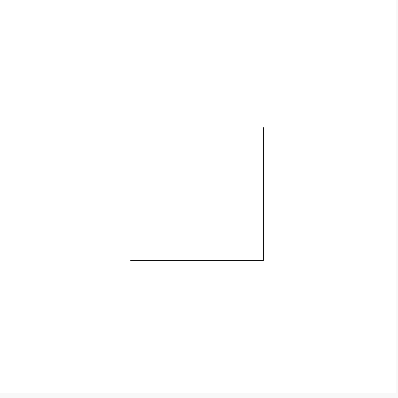

Further dragon curves can be generated by using the following rules:

* Substitute all ``F`` characters with ``F-H``

* Substitute all ``H`` characters with ``F+H``

If the F-H dragon curve above represents ``dragon(0)`` then further dragon curves would look like:

.. _dragon(1) = F-H-F+H:

**dragon(1) = F-H-F+H**

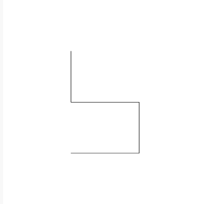

.. _dragon(2) = F-H-F+H-F-H+F+H:

**dragon(2) = F-H-F+H-F-H+F+H**

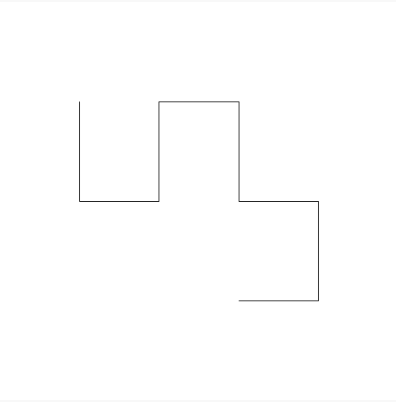

.. _dragon(3) = F-H-F+H-F-H+F+H-F-H-F+H+F-H+F+H:

**dragon(3) = F-H-F+H-F-H+F+H-F-H-F+H+F-H+F+H**

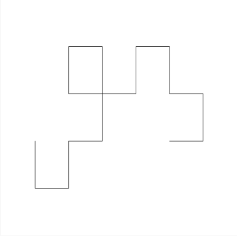

.. _dragon(4) = F-H-F+H-F-H+F+H-F-H-F+H+F-H+F+H-F-H-F+H-F-H+F+H+F-H-F+H+F-H+F+H:

**dragon(4) = F-H-F+H-F-H+F+H-F-H-F+H+F-H+F+H-F-H-F+H-F-H+F+H+F-H-F+H+F-H+F+H**

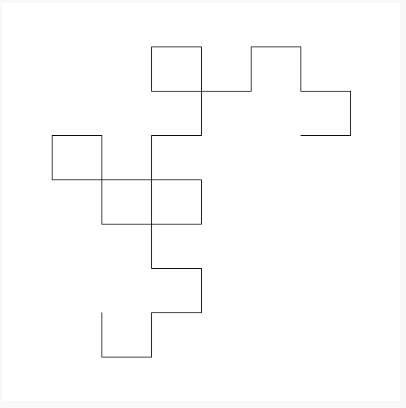

.. _dragon(5) = F-H-F+H-F-H+F+H-F-H-F+H+F-H+F+H-F-H-F+H-F-H+F+H+F-H-F+H+F-H+F+H-F-H-F+H-F-H+F+H-F-H-F+H+F-H+F+H+F-H-F+H-F-H+F+H+F-H-F+H+F-H+F+H:

**dragon(5) = F-H-F+H-F-H+F+H-F-H-F+H+F-H+F+H-F-H-F+H-F-H+F+H+F-H-F+H+F-H+F+H-F-H-F+H-F-H+F+H-F-H-F+H+F-H+F+H+F-H-F+H-F-H+F+H+F-H-F+H+F-H+F+H**

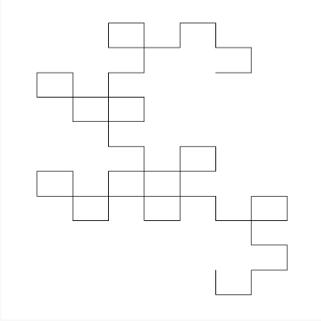

Skipping ahead to 10…

.. _dragon(10):

**dragon(10)**

|

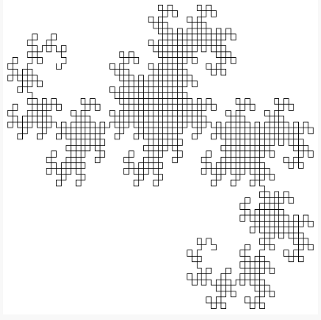

.. _Testing: 

**Testing**

.. youtube:: Uq1YJamAvwI

.. _Tips for completing this method:

**Tips for completing this method**

* We would suggest using the provided ``substituteAll(source, target, replacement)`` method from Studio 5.

  * An Example: ``substituteAll("This is a String", 'i', "HELLO")`` would result in ``"ThHELLOs HELLOs a StrHELLOng"``. Note: This example shows what is called a ``String`` literal (the ``"This is a String"``) as the first parameter, but a ``String`` parameter, variable, or return value could have been used instead.

* Be careful with how you perform the substitutions. The substitution for ``F`` will introduce more ``H`` characters into the string, but we only want to perform a substitution on the original ``H`` characters, not these new ones.

* Run ``DragonDebugApp.java`` to see how the first several dragons look (and if they are correct).

* Unit tests have been provided to you in the ``DragonTestSuite`` portion of the ``RecursiveMethodsTestSuite``. Use them to check your work.

.. _Submitting this method:

**Submitting this method**

When you submit this problem you will be asked the following:

* Does the provided ``DragonTestSuite`` portion of the ``RecursiveMethodsTestSuite`` pass?

* Do the first several cases in the provided ``DragonDebugApp`` look good?

* Can you identify the base case(s) in your code?

* Can you identify the recursive step(s) in your code?

.. _Max Path Length:

**Max Path Length**

As a break from studying, you decide to go for a walk in a very special park. This park has dangers, but you are provided a chart for the park in the form of a 2D array, such as the following:

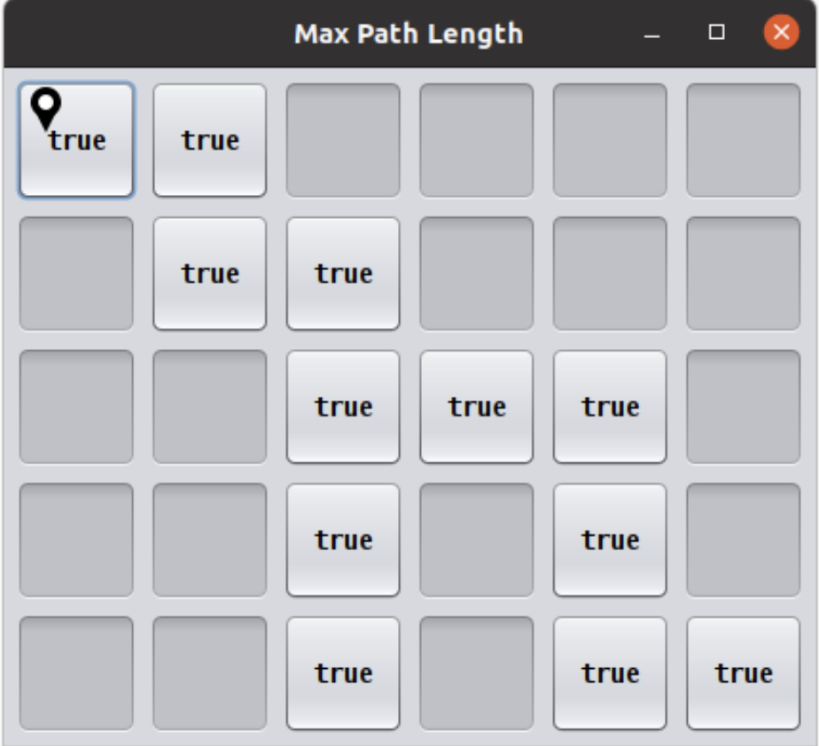

Each ``true`` indicates a stepping stone in the park on which you can safely step without adverse consequences. On the other hand, each ``false`` can be thought of as a shaft of infinite depth, so that if step on it, you fall forever and never make it back.

In this scenario, the park has a single entrance where you will start your journey in the top left corner (indicated by the start icon).

In the movie *Indiana Jones and the Last Crusade*, the titular character must navigate such stepping stones to makes his way to the Holy Grail. A misstep (from which he recovers) as well as his eventual success is shown `here <https://en.wikipedia.org/wiki/Indiana_Jones_and_the_Last_Crusade>`_. In the above array, you can step safely on any ``true`` but stepping on any ``false`` will lead to a most unpleasant demise. Unlike Indiana, you will fall forever.

In spite of the dangers presented by this unusual park, you wish to take a stroll, beginning with the top left cell of the chart (which is safe only if it contains a ``true``), and continuing inside the park using only safe cells. Indiana Jones had `two prior movies <https://en.wikipedia.org/wiki/Indiana_Jones>`_, and so lots of experience, so that he could reasonably be asked to jump some distance over cells to find a safe path.

Your task is easier:

* You can move from one cell to another only using `cardinal directions <https://en.wikipedia.org/wiki/Cardinal_direction>`_ , namely up, down, left, or right. *You are not allowed to move diagonally*.

* You can only move one cell at a time: no skipping or jumping over cells!

* You must step only on safe (marked as ``true``) cells.

* Each interior cell can be bordered on each of its four cardinal sides by another safe cell. Thus there can be many paths one could take from the starting cell.

* The safe cells of the chart form no cycles. While the park can contain many paths, you will mark your path as you go to be sure to not to revisit a cell you have already used on your journey.

* You will explore as much of the park you can reach using the rules above and determine which is the longest single path. (Imagine someone was going to take a single path and was reasonably concerned with what the longest possible path you might take, so that they can take the right amount of food and water for your journey.)

How do we find the longest path in such a chart? Let’s continue with our example.

Looking at the chart you notice that the path is unique until a fork is reached at the circled location:

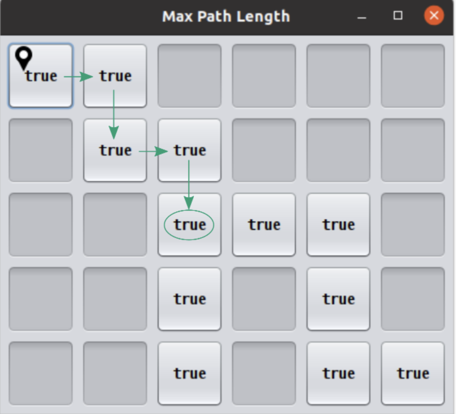

At this point you have a decision to make. There are two paths you could take:

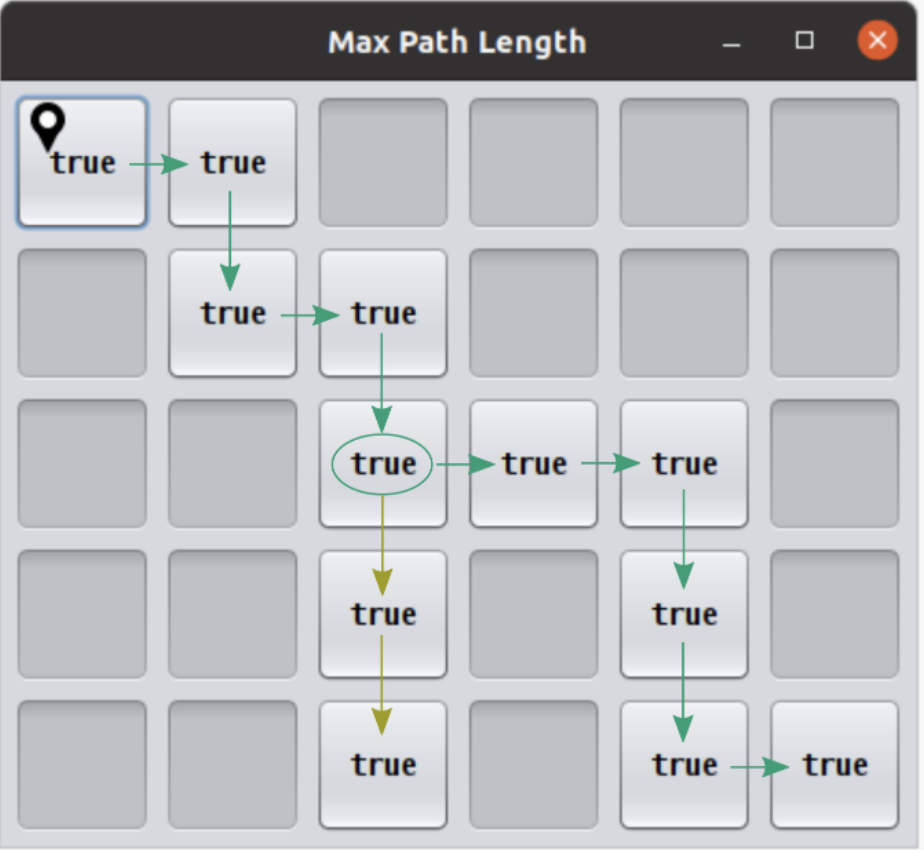

Visually, in this example, it is fairly straightforward to determine which path is the longest by adding up the lengths of the two options:

* Option #1: Start path (5) + down path (2) = 7

* Option #2: Start path (5) + right-down-right path (5) = 10

The green branch is the one that you should select in this situation as it leads to the longest possible path length of 10.

While visually it seems simple to compute the longest path, it is worth looking at this example again with recursion in mind. Remember our task in finding a recursive solution is to discover the substructure of a problem.

Consider finding the longest path but starting from the circled cell below. As depicted, we arrived at the circled cell from the cell above it. Imagine further that we marked the cell above, along with all previous visited cells, as not to be revisited.

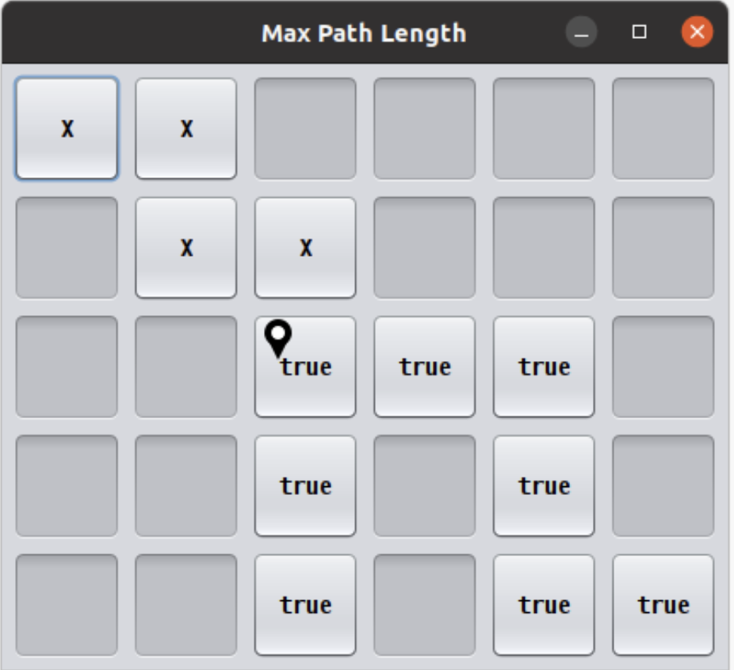

Let’s assume we have four messengers named by the direction they would pursue from the circled cell. So let’s call the four messengers ``up``, ``down``, ``left``, and ``right``. Each messenger will look into going its assigned direction, and report back the longest path found recursively from the appropriate neighboring cell. Let’s see how these messengers work in this example:

* The ``left`` messenger sees that it starts on a ``false`` cell, which is not safe, and so it immediately returns ``0`` as the longest path from that cell.

* The ``right`` messenger eventually returns ``5`` as the longest path it finds. It does this using more recursion, but we count on recursion to do the right thing no matter where we start, so we count on the ``right`` messenger returning the correct answer of ``5``.

* The ``down`` messenger returns ``2`` as the longest path from its starting point.

* The ``up`` messenger must not be dispatched in this example! It would consider the cell from which we arrived at the circled cell, and that’s not allowed: there are no cycles in the graph. We can avoid calling the ``up`` messenger in one of two ways:

  * We can be told we arrived at the circled cell from above, and thus know not to send the ``up`` messenger.

  * Before dispatching its four messengers, the cell above the circled cell can temporarily change its contents to ``false`` so that the ``up`` messenger from the circled cell will surely return 0 as the longest path from itself. Recall that’s what happened to the ``left`` messenger because it started with a ``0`` present in the chart initially. Any cell that temporarily changes its contents in this way must restore the ``false`` after its messengers return, prior to returning from its call.

In any case the ``up`` messenger in this example must report ``0`` as its longest path.

How does the circled cell compute the longest path from itself? It can take the information returned by the messengers, namely the longest path from each of those neighboring cells. The longest path from the circled cell is simply the max of the values returned by the messengers, plus ``1`` for the circled cell itself. In our example, this would be:

* the-maximum-of-[left, right, down, up] + 1 =

* the-maximum-of-[0, 5, 2, 0] + 1 =

* 5 + 1 =

* 6

**Note:** `Math.max(a,b) <https://docs.oracle.com/javase/8/docs/api/java/lang/Math.html#max-int-int->`_, although definitely useful, will only compute the maximum of two numbers. It will require a bit of creativity to calculate the maximum of 4 numbers.

That value is returned by any call to the circled cell as the maximum path starting at the circled cell.

The substructure for this problem is that the solution at the circled cell is ``1`` more than the max of the values returned by ``up``, ``down``, ``left``, and ``right``. Each of the four messengers is attacking a slightly smaller problem than the problem found at the circled cell.

Complete the ``maxPathLength(boolean[][] chart, int r, int c)`` method such that it computes and returns the longest path length that exists in the given array. For the sake of this problem you can assume the following:

* You start at the specified row ``r`` and column ``c``.

* You are only expected to travel in the four cardinal directions (north, south, east, west). You cannot move diagonally.

* The chart can be arbitrarily large in either dimension.

* Branching within the chart can be arbitrarily complex.

``MaxPathLengthDebugApp`` is provided to see what the test chart looks like and what answers your code provided versus the expected solution. Unit tests have been provided in the ``MaxPathLengthTestSuite`` portion of the ``RecursiveMethodsTestSuite`` so that can be used to check your work.

.. _Testing and Debug App:

**Testing and Debug App** 

.. youtube:: J1QV9a5Ti_c

``MaxPathLengthDebugApp`` **Key**

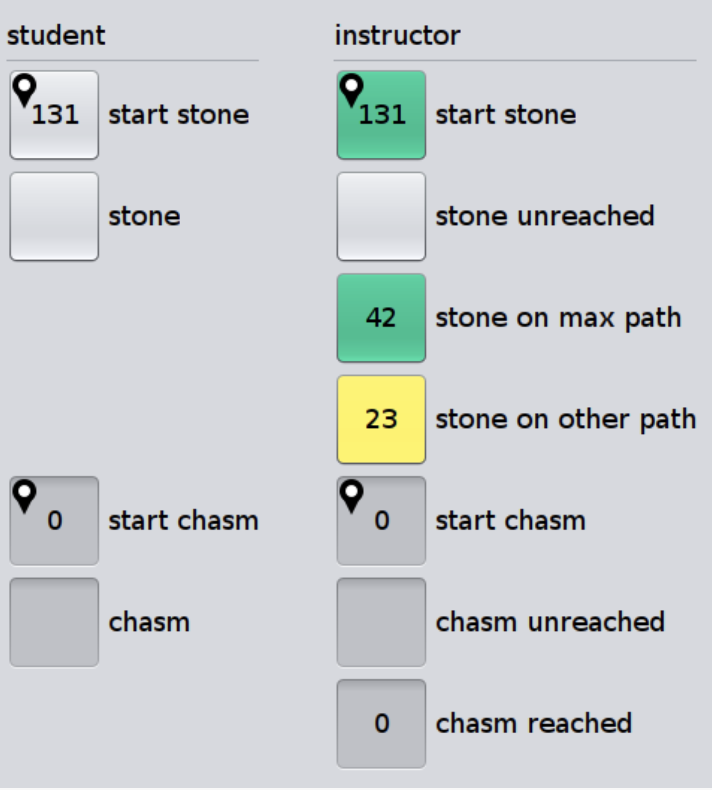

.. _Chose Correctly:

**Chose Correctly**

The ``MaxPathLengthDebugApp`` will look like the image below if you chose correctly.

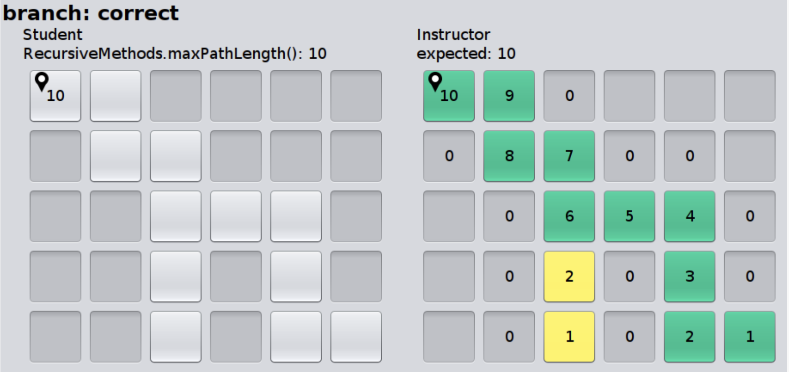

.. _Chose Poorly:

**Chose poorly**

The ``MaxPathLengthDebugApp`` will could look somthing like the image below if you chose poorly.

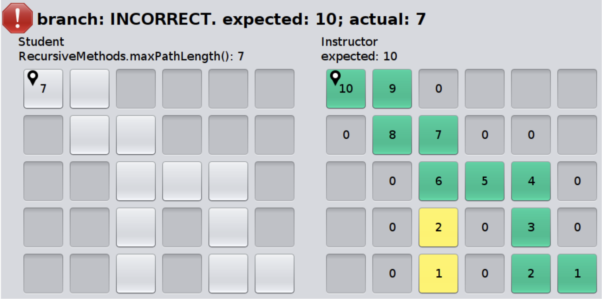

.. _Tips for this method:

**Tips for this method**

* You’ll undoubtedly want some way to mark that you’ve already visited a spot on the chart. Feel free to change the values in the array for this purpose. In the example above, this involved temporarily changing a cell’s contents from ``true`` to ``false`` (and, critically, back again at some point).

* Take some time to think about what conditions make up the base case before you begin. Recall that a base case is a condition under which a method does not call itself recursively. It may be helpful to view cells outside of the defined chart as if they contained a ``false``.

* There will be multiple recursive calls in your method.

* Though this method is conceptually difficult, it does not require a large amount of code to complete. A clean and elegant solution is achievable in around 10 lines of code. **It is worthwhile thinking through how to solve this problem before coding!**

.. _Submitting this method, Max Path Length:

**Submitting this method, Max Path Length**

When you submit this method you will be asked the following:

* Does everything in the ``MaxPathLengthDebugApp`` look good?

* Does the provided ``MaxPathLengthTestSuite`` portion of the ``RecursiveMethodsTestSuite`` pass?

* Can you identify the base case(s) in your code?

* Can you identify the recursive step(s) in your code?

.. _Submitting your work:

**Submitting your work**

To submit your work come to office hours or class on an “Assignment day” and sign up for a demo via `wustl-cse.help <https://wustl-cse.help/>`_. Be prepared to show them the work that you have done and answer their questions about it!

