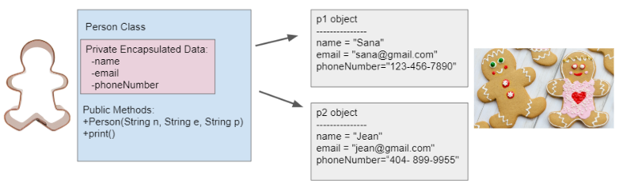

.. qnum::
   :prefix: 6-1-
   :start: 1
   
.. |CodingEx| image:: ../../_static/codingExercise.png
    :width: 30px
    :align: middle
    :alt: coding exercise
    
    
.. |Exercise| image:: ../../_static/exercise.png
    :width: 35
    :align: middle
    :alt: exercise
    
    
.. |Groupwork| image:: ../../_static/groupwork.png
    :width: 35
    :align: middle
    :alt: groupwork
    

Anatomy of a Java Class
=======================

Java is an **object-oriented programming** language.  In object-oriented programming, we group the 
data attributes and the behaviors/methods that use them together into objects.

**Objects** are created from a **class** definition in the code, and they are **instances** of a class. 

Creating a Class
------------------

A **class** in programming defines a new **abstract data type**. When you create **objects**, you create new variables or **instances** of that class data type. For example, we have used the Java String class to create different String variables, also called **object references**.

You can think of a **class** as a classification or blueprint. A class defines the data (attributes) and behavior (methods) of a set of objects.

To write your own class, you typically start a class declaration with ``public`` then ``class`` then the name of the class.  The body of the class is defined inside a ``{`` and a ``}``. For example, the class House below. Then, you can create objects of that new House type by using ``Classname objectname = new Classname();``

.. code-block:: java

    public class House {
       // define class here - a blueprint
    
    }
    
    House myHouse = new House();
    House neighborsHouse = new House();

Objects have attributes and behaviors. These correspond to **instance variables** and **methods** in the class definition.   Instance variables hold the data for objects where as the methods code the behaviors or the actions the object can do.   A class also has **constructors** which initialize the instance variables when the object is created, for example new House() above.  And a class can also have a **main method** which can be used to test the class.  

Let's create a class called Person. What would we want to know about a person?  What we want to know depends on what problem we are trying to solve.  In one situation, perhaps when creating an address book, we might want to know the person's name and phone number and email. Here's a possible Person class with instance variables, constructor, and methods.

Run the code in the ``Person`` class to see how it constructs 2 Person objects and fills in their data. We will explain all parts of this class in the next sections, but notice that execution always starts in the main method. When a method like the toString() method is called, we run the code in the toString method for that object. After a method is done, the control returns back to the next line of code in the main method.

Instance Variables
---------------------------

..	index::
	pair: class; instance variables

**Instance Variables** hold the data for an object.  They record what an object needs to know to do work in the program.  Instance variables are also called **attributes**, **fields**, or **properties**. 

Instance variables in general should be declared **private**.    
In this case ``private`` means that only the methods in this class can directly access the instance  variable values.

.. note::
 
   Instance variables are declared right after the class declaration.  They usually start with ``private`` then the *type* of the variable and then a *name* for the variable. Private means only the code in this class has access to it.

The ``Person`` class declares 3 private instance variables: name, email, and phoneNumber. These are things that you might want to know about a person.  They are declared at the top of the class and they exist inside the { } of the class. The methods of the class share the instance variables. They can access and use them. 

Once we have created a class like Person, we can have many objects declared of the class.  The class is like a blueprint or cookie cutter that defines the variables and methods for that class. Each object will have their own copies of the same instance variables but with possibly different values in them (as seen in the cookie decorations below). 

    Figure 2: Person Class and Objects

**Object-oriented Programming** stresses **data encapsulation** where  the data (instance variables) and the code acting on the data (methods) are wrapped together into a single unit and the implementation details are hidden. The data is protected from harm by being kept private. Anything outside the class can only interact with the public methods and cannot interact directly with the private instance variables (encapsulated in the pink box above).  

When designing a class, programmers make decisions about what data to make accessible and/or modifiable from an external class. The private access modifier is used to encapsulate and protect the data from external access. Private instance variables can only be accessed by methods within the class in which they are defined.

|Exercise| **Check Your Understanding**

.. clickablearea:: q6_1_1
    :question: Click on all the instance  variable declarations in the following class
    :iscode:
    :feedback: Remember, instance  variables are private and are declared after the class declaration.

    :click-incorrect:public class Name {:endclick:
    
        :click-correct:private String first;:endclick:
        :click-correct:private String last;:endclick:
        
        :click-incorrect:public Name(String theFirst, String theLast) {:endclick:
            :click-incorrect:first = theFirst;:endclick:
            :click-incorrect:last = theLast;:endclick:
         :click-incorrect:}:endclick:
         
         :click-incorrect:public void setFirst(String theFirst) {:endclick:
            :click-incorrect:first = theFirst;:endclick:
         :click-incorrect:}:endclick:
         
         :click-incorrect:public void setLast(String theLast) {:endclick:
            :click-incorrect:first = theLast;:endclick:
         :click-incorrect:}:endclick:
         
    :click-incorrect:}:endclick:      
        

  

Methods
-------

..	index::
	pair: class; method
	
**Methods** define what an object can do or the behavior of the object.   Most methods are ``public`` which means they can be accessed from outside the class. Some methods can be marked as``private`` if they are helper methods that are just used internally by other methods inside the same class. They will not be accessible outside of the class. The private and public keywords determine the external access and visibility of classes, data, constructors, and methods.

.. note::

   Methods define what the object can do.  They typically start with ``public`` then a type, then the name of the method followed by parentheses for optional parameters. Methods defined for an object can access and use its instance variables!  

The ``Person`` class above has a constructor called Person() which we will discuss in the next lesson,  a toString() method for output, and a main method which runs the whole program. We will also discuss **accessor** (also called getters) and **mutator** (also called setters or modifier) methods in the next lessons which allow get and set access to the instance variables.  

Here is an example of the toString() method that prints out all the data stored for a person object. Notice that it starts with public and then the return type.
The **void** return type is used to indicate that the method does not return anything. Then it has the method name followed by parentheses for possible parameters. The body of the method is in curly brackets. Notice that the method can access and use the instance variables in the class: name, email, and phoneNumber. The instance variables are shared by all the methods of the class.

.. code-block:: java
     
     public String toString() {
       String result = "Name: " + name + ", ";
       result += "Email: " + email + ", ";
       result += "Phone Number: " + phoneNumber;
       return result;
     }
     
To call a method to do its job, we create an object of the class and then use the dot (.) operator to call its public methods, for example p1.toString() means call p1's toString method.

.. code-block:: java

    // call the constructor to create a new person
    Person p1 = new Person("Sana", "sana@gmail.com", "123-456-7890");
    // call p1's print method
    String s = p1.toString();
        
        
|Exercise| Check Your Understanding

.. clickablearea:: q6_1_2
    :question: Click on all the lines of code that are part of a method in the following class.
    :iscode:
    :feedback: Methods follow the constructor.  They include a return type in case they returns something from the method.

    :click-incorrect:public class Name {:endclick:
    
        :click-incorrect:private String first;:endclick:
        :click-incorrect:private String last;:endclick:
        
        :click-incorrect:public Name(String theFirst, String theLast) {:endclick:
            :click-incorrect:first = theFirst;:endclick:
            :click-incorrect:last = theLast;:endclick:
         :click-incorrect:}:endclick:
         
         :click-correct:public void setFirst(String theFirst) {:endclick:
            :click-correct:first = theFirst;:endclick:
         :click-correct:}:endclick:
         
         :click-correct:public void setLast(String theLast) {:endclick:
            :click-correct:first = theLast;:endclick:
         :click-correct:}:endclick:
         
    :click-incorrect:}:endclick: 

|Groupwork| Programming Challenge : Riddle Class
----------------------------------------------------------

In this project, you will create a class that can tell riddles like the following:

- Riddle Question: Why did the chicken cross the playground?
- Riddle Answer: To get to the other slide!

1. First, brainstorm in pairs to do the **Object-Oriented Design** for a riddle asking program. What should we call this class? What data does it need to keep track of in instance variables? What is the data type for the instance variables? What methods do we need? 

2. Using the Person class as a guide, complete the given ``Riddle` class in the that has 2 instance variables for the riddle's question and answer, a constructor that initializes the riddle, and 2 methods to ask the riddle and answer the riddle. Hint:  Don't name your instance variables initQuestion and initAnswer -- we'll explain why shortly. If you came up with other instance variables and methods for this class, you can add those too! Don't forget to specify the private or public access modifier. You will learn how to write constructors and other methods in detail in the next lessons.

3. Complete the main method to construct at least 2 Riddle objects and call their printQuestion() and printAnswer() methods to ask and answer the riddle. You can look up some good riddles online.

Practice
------------

.. mchoice:: q6_1_5
        :practice: T
        :random:

        Consider the Cat class which will contain a String and an int attribute for a cat’s name and age and a constructor.

        .. code-block:: java
 
            public class Cat {
              /* missing code */
            }
    
            Which of the following replacements for /* missing code */ is the most appropriate 
            implementation of the class?

        - .. code-block:: java

            public String name;
            private int age;
            private Cat(String name, int age)
            { /* implementation not shown */ }

          - Instance variables should be private.

        - .. code-block:: java

            public String name;
            private int age;
            private Cat(String name, int age)
            { /* implementation not shown */ }

          - Instance variables should be private.

        - .. code-block:: java

            private String name;
            private int age;
            public Cat(String name, int age)
            { /* implementation not shown */ }

          + Correct! The instance variables are private and the constructor is public.

        - .. code-block:: java

            public String name;
            public int age;
            public Cat(String name, int age)
            { /* implementation not shown */ }

          - Instance variables should be private.

        - .. code-block:: java
	
            private String name;
            private int age;
            private Cat(String name, int age)
            { /* implementation not shown */ }

          - Constructor should be public.          

.. mchoice:: q6_1_6
    :practice: T

    Consider the Party class below which will contain three int attributes for numOfPeople, volumeOfMusic, and numOfBoxesOfPizza, a constructor, and a startParty method. The startParty method is intended to be accessed outside the class.
    
    .. code-block:: java

        public class Party {
        /* missing code */
        }

        Which of the following replacements for /* missing code */ is the most appropriate 
        implementation of the class?

    - .. code-block:: java
    
        private int numOfPeople;
        private int volumeOfMusic;
        private int numOfBoxesOfPizza;
        public Party()
        { /* implementation not shown */ }
        private void startParty()
        { /* implementation not shown */ }

      - Method startParty() should be public.
        
    - .. code-block:: java
    
        private int numOfPeople;
        private int volumeOfMusic;
        private int numOfBoxesOfPizza;
        public Party()
        { /* implementation not shown */ }
        public void startParty()
        { /* implementation not shown */ }

      + Correct, instance variables should be private and the methods should be public.
      
    - .. code-block:: java
    
        public int numOfPeople;
        public int volumeOfMusic;
        public int numOfBoxesOfPizza;
        public Party()
        { /* implementation not shown */ }
        public void startParty()
        { /* implementation not shown */ }

      - Instance variables should be private.
        
    - .. code-block:: java
    
        private int numOfPeople;
        private int volumeOfMusic;
        private int numOfBoxesOfPizza;
        private Party()
        { /* implementation not shown */ }
        private void startParty()
        { /* implementation not shown */ }

      - Methods should be public.

Summary
----------

- Programmers use code to represent a physical object or nonphysical concept, real or imagined, by defining a class based on the attributes and/or behaviors of the object or concept.

- **Instance Variables** define the attributes or data needed for objects, and **methods** define the behaviors or functions of the object.

- **Data encapsulation** is a technique in which the implementation details of a class are kept hidden from the user. The data is kept private with access only through the public methods that can act on the data in the class.

- The keywords **public** and **private** affect the access of classes, data, constructors, and methods.

- The keyword private restricts access to the declaring class, while the keyword public allows access from classes outside the declaring class.

- Instance variables are encapsulated by using the **private access modifier**.

- Methods can be public or private, but they are usually public.
