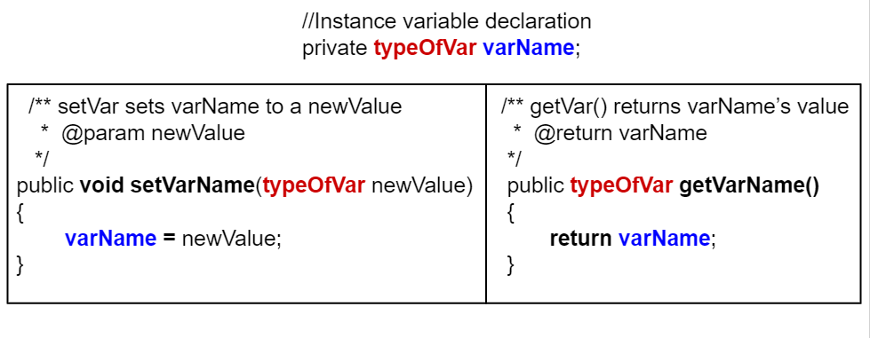

.. qnum::
   :prefix: 6-5-
   :start: 1

.. |CodingEx| image:: ../../_static/codingExercise.png
    :width: 30px
    :align: middle
    :alt: coding exercise
    
    
.. |Exercise| image:: ../../_static/exercise.png
    :width: 35
    :align: middle
    :alt: exercise
    
    
.. |Groupwork| image:: ../../_static/groupwork.png
    :width: 35
    :align: middle
    :alt: groupwork
    
    
Mutator Methods
=================

Corresponding to each get method, programmers also provide a public **set method** to change the value of a private instance variable in a class. These are called **mutator methods** (or settters or set or modifier methods). They are **void methods** meaning that they do not return a value, but they do take a **parameter**, the new value for the instance variable. Here are some examples of how to write a set method for an instance variable:

.. code-block:: java
     
     class ExampleTemplate {
 
         //Instance variable declaration
         private typeOfVar varName;

         // Mutator (setter) method template
         public void setVarName(typeOfVar newValue) {
            varName = newValue;
         }
     }
     
Here's an example of the Student class with a mutator method called setName():

.. code-block:: java

  class Student {
 
     //Instance variable name
     private String name;
     
     /** setName sets name to newName
      *  @param newName                */
     public void setName(String newName) {
        name = newName;
     }
     
     public static void main(String[] args) { 
        // To call a set method, use objectName.setVar(newValue)
        Student s = new Student();
        s.setName("Ayanna");  
     }
    }
     
Notice the difference between set (mutator) and get (accessor) methods in the following figure. Getters return an instance variable's value and have the same return type as this variable and no parameters. Setters have a void return type and take a new value as a parameter to change the value of the instance variable.

    Figure 1: Comparison of set and get methods
    
   
  
|Exercise| **Check your understanding**

.. mchoice:: q6_5_1
    :practice: T

    Consider the class Party which keeps track of the number of people at the party.
    
    .. code-block:: java

        public class Party {
            //number of people at the party
            private int numOfPeople; 

            /* Missing header of set method */ {
                numOfPeople = people;
            }
        }
    
    Which of the following method signatures could replace the missing header for the set method in the code above so that the method will work as intended?

    - public int getNum(int people)
   
      - The set method should not have a return value and is usually named set, not get.
     
    - public int setNum()
   
      - The set method should not have a return value and needs a parameter.
     
    - public int setNum(int people)
   
      - The set method should not have a return value.
     
    - public void setNum(int people)
   
      + Yes, the set method should take a parameter called people and have a void return value. The name of the set method is usually set followed by the full instance variable name, but it does not have to be an exact match.
     
    - public int setNumOfPeople(int p)
   
      - The parameter of this set method should be called people in order to match the code in the method body.
   
.. dragndrop:: q6_5_2
    :feedback: Review the vocabulary.
    :match_1: gets and returns the value of an instance variable|||accessor method
    :match_2: sets the instance variable to a value in its parameter|||mutator method
    :match_3: initializes the instance variables to values|||constructor 
    :match_4: accessible from outside the class|||public
    :match_5: accessible only inside the class|||private

    
    Drag the definition from the left and drop it on the correct word on the right.  Click the "Check Me" button to see if you are correct.

Mutator methods do not have to have a name with "set" in it, although most do. They can be any methods that change the value of an instance 
variable or a static variable in the class.     
    

|Groupwork| Programming Challenge : Class Pet Setters
-----------------------------------------------------

.. image:: Figures/animalclinic.png
    :width: 150
    :align: left
    :alt: Animal Clinic
    
1. Continue working with your pet class from the last lesson.
2. Add set methods for each of the 5 instance variables. Make sure you use good commenting!
3. Test each of the set methods in the main method.

Practice
------------

.. mchoice:: q6_5_3
    :practice: T

    Consider the following class definition.
    
    .. code-block:: java
    
        public class Liquid {
            private int currentTemp;

            public Liquid(int temp) {
                currentTemp = temp;
            }

            public void resetTemp() {
                currentTemp = newTemp;
            }
        }

    Which of the following best identifies the reason the class does not compile?
    
    - The constructor header does not have a return type.
        
      - The constructor should not have a return type.
      
    - The resetTemp method is missing a return type.
    
      - Mutator methods usually have a void return type.
      
    - The constructor should not have a parameter.
    
      - Constructors can have parameters.
      
    - The resetTemp method should have a parameter.
    
      + Correct! The resetTemp method should have a parameter for the newTemp value to set the currentTemp.
      
    - The instance variable currentTemp should be public instead of private.
    
      - Instance variables should be private variables.

.. mchoice:: q6_5_4
    :practice: T
    :answer_a: Replace line 11 with numOfPeople = additionalPeople;
    :answer_b: Replace line 11 with return additionalPeople;
    :answer_c: Replace line 11 with additionalPeople += 3;
    :answer_d: Replace line 10 with public addPeople (int additionalPeople)
    :answer_e: Replace line 10 with public void addPeople(int additionalPeople)
    :correct: e
    :feedback_a: This method should add additionalPeople to numOfPeople.
    :feedback_b: This method should add additionalPeople to numOfPeople.
    :feedback_c: This method should add additionalPeople to numOfPeople.
    :feedback_d: Mutator methods should have a void return type.
    :feedback_e: Mutator methods should have a void return type.

    In the Party class below, the addPeople method is intended to increase the value of the instance variable numOfPeople by the value of the parameter additionalPeople. The method does not work as intended.
    
    .. code-block:: java

        public class Party {
            private int numOfPeople;

            public Party(int n) {
                numOfPeople = n;
            }

            public int addPeople(int additionalPeople) { //line 10
                numOfPeople += additionalPeople; //line 11
            }
        }

    Which of the following changes should be made so that the class definition compiles without error and the method addPeople works as intended?

Summary
--------

- A void method does not return a value. Its header contains the keyword void before the method name.

- A **mutator method** is often a void method that changes the values of instance variables or static variables.
