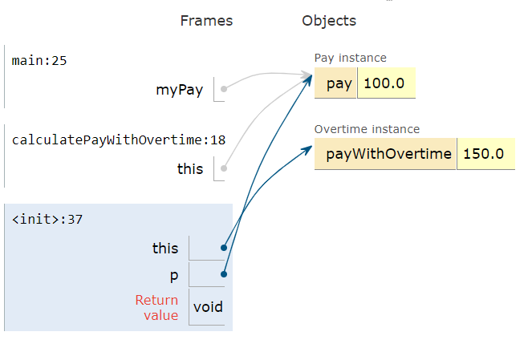

.. qnum::
   :prefix: 6-9-
   :start: 1

.. |CodingEx| image:: ../../_static/codingExercise.png
    :width: 30px
    :align: middle
    :alt: coding exercise
    
    
.. |Exercise| image:: ../../_static/exercise.png
    :width: 35
    :align: middle
    :alt: exercise
    
    
.. |Groupwork| image:: ../../_static/groupwork.png
    :width: 35
    :align: middle
    :alt: groupwork
    
    
this Keyword
=================

The keyword **this** can be used in a class to refer to the current calling object.  
 
For example, in the given class ``Person``, when we create an object p1 and call the constructor or p1.setEmail(), the word "this" refers to p1. And when we make the same method calls with object p2, "this" refers to p2.    

Observe the use of the keyword this in the given ``Person`` class.
  
.. code-block:: java

  public class Person 
  {
     // instance variables 
      private String name;
      private String email;
      private String phoneNumber;
     
     // constructor
     public Person(String theName)
     {
        this.name = theName;
     }
     
     // accessor methods - getters 
     public String getName() { return this.name;}
     public String getEmail() { return this.email;}
     public String getPhoneNumber() { return this.phoneNumber;}
     
     // mutator methods - setters
     public void setName(String theName) { this.name = theName;}
     public void setEmail(String theEmail) {this.email = theEmail;}
     public void setPhoneNumber(String thePhoneNumber) { this.phoneNumber = thePhoneNumber;}
     public String toString()
     {
        return this.name + " " + this.email + " " + this.phoneNumber;
     }
     
     // main method for testing
     public static void main(String[] args)
     {
        Person p1 = new Person("Sana");
        System.out.println(p1);
        Person p2 = new Person("Jean");
        p2.setEmail("jean@gmail.com");
        p2.setPhoneNumber("404 899-9955");
        System.out.println(p2);
     }
  }

.. note::

    Note that in the code above, this.name, this.email, and this.phoneNumber are equivalent to writing just name, email, and phoneNumber, but ``this.variable`` is a way to indicate that we are referring to the instance variables of this object instead of a local variable. 

Static methods cannot refer to this or instance variables because they are called with the classname, not an object, so there is no this object. 

The keyword this is sometimes used by programmers to distinguish between variables. Programmers can give the parameter variables the same names as the instance variables and this can distinguish them and avoid a naming conflict. For example, both the instance variable and the parameter variable are called name in the code below.

.. code-block:: java
 
     // instance variables 
     private String name;
     
     // constructor
     public Person(String name)
     {
        // Set this object's instance variable name to the parameter variable name
        this.name = name; 
     }

The **this** variable can be used anywhere you would use an object variable.  You can even pass it to another method as an argument. Consider the classes below, Pay and Overtime. The Pay class declares an Overtime object and passes in **this** (the current Pay object) to its constructor which computes the overtime with respect to that Pay object. Try this code in the |Java visualizer2|. Here is an image that shows how this and myPay and p all refer to the same object in memory.

What does the ``Pay`` program print out? Trace through the code. Notice how the this Pay object is passed to the Overtime constructor.

|Exercise| Check Your Understanding

.. mchoice:: q6_9_1
    :practice: T

    Consider the following class definitions.
    
    .. code-block:: java

       public class Pay
       {
        private double pay;

        public Pay(double p)
        {
            pay = p;
        }

        public double getPay()
        {
            return pay;
        }

        public void calculatePayWithOvertime()
        {
            // this Pay object is passed to the Overtime constructor
            Overtime ot = new Overtime(this);
            pay = ot.getOvertimePay();
        }
       }

       public class Overtime
       {
        private double payWithOvertime;

        public Overtime(Pay p)
        {
            payWithOvertime = p.getPay() * 1.5;
        }
        public double getOvertimePay()
        {
            return payWithOvertime;
        }
       }

    The following code segment appears in a class other than Pay or Overtime.
    
    .. code-block:: java

        Pay one = new Pay(20.0);
        one.calculatePayWithOvertime();
        System.out.println(one.getPay());

    What, if anything, is printed as a result of executing the code segment?
    
    - 10.0
    
      - The pay starts at 20 and then increases with overtime.
      
    - 15.0
        
      - If the pay started at 10, this would be the result.
        
    - 20.0
        
      - The pay starts at 20 and then increases with overtime.
      
    - 30.0
        
      + Correct! The pay starts at 20 and then increases with overtime by multiplying by 1.5.
      
    - Nothing is printed because the code will not compile.
      
      - Incorrect. The code will compile.

       

    

|Groupwork| Programming Challenge : Bank Account
------------------------------------------------------------

.. figure:: Figures/dollarSign.png
    :width: 100px
    :align: left
    
- Create a class called BankAccount that keeps track of the account holder's name, the account number, and the balance in the account. Make sure you use the appropriate data types for these. 

- Write 2 constructors for the class that initialize the instance variables to default values and to given parameters. For the parameters, use the same variable names as your instance variables. Use the **this** keyword to distinguish between the instance variables and the parameter variables.

- Write a toString() method for the class. Use the **this** keyword to return the instance variables.

- Write a withdraw(amount) and deposit(amount) for the class. Withdraw should subtract the amount from the balance as long as there is enough money in the account (the balance is larger than the amount). Deposit should add the amount to the balance.  Use the **this** keyword to refer to the balance.

- Test your class with a main method that creates a Bank Account object and calls its deposit and withdraw methods and prints out the object to test its toString() method. 

Create a class called BankAccount that keeps track of the account holder's name, the account number, and the balance in the account. Create 2 constructors, a toString() method, and withdraw(amount) and deposit(amount) methods. Test your class in a main method.

   

Practice
------------

.. mchoice:: q6_9_2
    :practice: T

    Consider the following class definitions.
    
    .. code-block:: java
 
        public class Liquid
        {
            private int currentTemp;

            public Liquid (int ct)
            {
                currentTemp = ct;
            }

            public int getCurrentTemp()
            {
                return currentTemp;
            }

            public void addToJar(LiquidJar j)
            {
                j.addLiquid(this);
            }
        }

        public class LiquidJar
        {
            private int totalTemp;

            public LiquidJar()
            {
              totalTemp = 0;
            }
            
            public void addLiquid(Liquid l)
            {
                totalTemp += l.getCurrentTemp();
            }

            public int getTotalTemp()
            {
                return totalTemp;
            }
            // Constructor not shown.
        }

    Consider the following code segment, which appears in a class other than Liquid or LiquidJar.
        
    .. code-block:: java

            Liquid water = new Liquid(50);
            Liquid milk = new Liquid(15);

            LiquidJar j = new LiquidJar();
            water.addToJar(j);
            milk.addToJar(j);
            System.out.println(j.getTotalTemp());

    What, if anything, is printed out after the execution of the code segment?

    - 50
        
      - The liquid water has a temperature of 50 but more is added to the jar.
          
    - 15
        
      - The liquid milk has a temperature of 15 but more is added to the jar.

    - 65
        
      + Correct! The liquid water with a temperature of 50 and then the liquid milk with a temperature of 15 are added to the jar.
          
    - Nothing, the code segment attempts to access the private variable currentTemp outside of its scope.
          
      - Incorrect. The currentTemp is never used outside its scope.
          
    - Nothing, the code segment attempts to access the private variable totalTemp outside of its scope.
        
      - Incorrect. The totalTemp is never used outside its scope.

Summary
--------

- Within a non-static method or a constructor, the keyword this is a reference to the current object, the object whose method or constructor is being called.

- this.instanceVariable can be used to distinguish between this object's instance variables and local parameter variables that may have the same variable names.

- Static methods do not have a this reference.

- The this variable can be used anywhere you would use an object variable, even to pass it to another method as an argument. 

