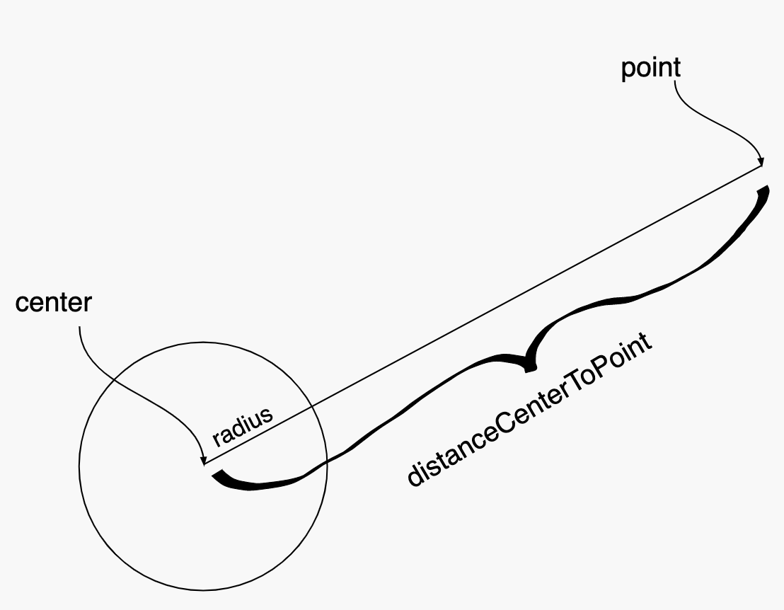
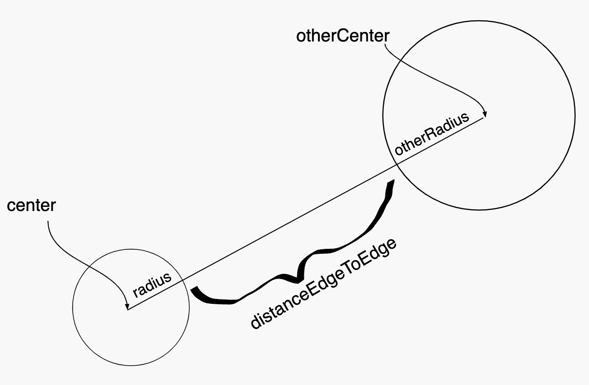

=====================
Assignment 8: Zombies: The Final OBJECTive
=====================

Assignment Setup
=====================

To create your repository go `here <https://classroom.github.com/a/PBqLvKZk>`__. Then follow the same accept/import process described in `the setup instructions <../Module0-Introduction/software.html>`_.

Zombies... The Final OBJECTive
=====================

In Assignment 4 we used the notion of “parallel arrays” to store details of the entities that we wanted to simulate. In Assignment 5 we created an actual simulation, but in order to make it manageable we refactored the work from Assignment 4 using Methods. Since we had ``boolean`` state (isZombie) and ``double`` state (x and y coordinates), we kept track of our entities in separate arrays. Further, since ,methods can only return a single value, we (somewhat awkwardly) were forced to create arrays and pass them into ``readEntities(ap, areZombies, positions)``. Now that we’ve seen the concept of an actual Abstract Data Type (ADT), it makes more sense to store the individual data in an ``Entity`` class. We can then forgo the arrays for a single ``List<Entity>`` stored in our ZombieSimulator.

In this installment of the zombie saga we will:

* Refactor our code to use an ``Entity`` class.

* Use a collection of ``Entity`` objects (a type of ``List`` rather than an array).

* Rather than having all entities move randomly, we’ll make our ``Zombies`` and ``Nonzombies`` behave somewhat intelligently.

* When a ``Nonzombie`` is touching a ``Zombie`` there’s a chance it will be consumed (one fewer entity) rather than always turn into a ``Zombie``.

Files
=====================

Your project includes a number of source files in the ``src`` folder:

* ``assignment8/DrawEntitiesDebugApp.java``: Rudimentary check on your Entity drawing.

* ``assignment8/Entity.java``: The ``Entity`` class. *You will need to complete this file*

* ``assignment8/EntityAndZombieSimulatorTestSuite.java``: Incomplete testing of your Entity and ZombieSimulator classes

* ``assignment8/ZombieSimulator.java``: The ``ZombieSimulator`` class. *You will need to complete this file*

Watch this video on Real Time Animation
=====================

.. youtube:: nhDt5HVOzVM

In the video above, Prof. Cosgrove explains how to build a real-time animation. Among the topics covered include the ``deltaTime`` parameter which you are often asked to use in your methods.

Procedure & Recommended Workflow
=====================

Below is a recommended work-flow. You should expect to have to revisit the implementation of some methods as you experiment with different strategies.

Entity
=====================

Constructor and Instance Variables
----------------------------------

Your Entity constructor is passed the initial values of for the zombie state (``isZombie``) and the x and y coordinates. You should store these values in instance variables for later use. You should also keep track of a radius for each entity. This is not specified as a parameter to the constructor. The initial radius value is left for you to choose.

**Note**: You should expect to revisit this step when different evasion and/or hunting stratgies call upon further state to be stored.

Is Zombie, X, and Y Accessors
----------------------------------

* Complete the ``isZombie()``, ``getX()``, and ``getY()`` methods.

* Run ``EntityAndZombieSimulatorTestSuite``. You should pass all cases in ``EntityConstructorTest`` before proceding.

Radius Accessor
----------------------------------

* Complete ``getRadius()`` method.

* Run ``EntityAndZombieSimulatorTestSuite``. You should pass all cases in ``EntityRadiusTest`` before proceding. **Note**: ``EntityRadiusTest`` is extremely lenient in what it deems passing. Since radius selection is left to you, it merely checks that ``getRadius()`` returns a number ``> 0.0``. As always, take passing unit tests `with a grain of salt <https://en.wikipedia.org/wiki/Grain_of_salt>`_. Especially on this assignment, where success is measured by a compelling simulation.

**Note**: if you are looking for a default radius value to start with, Assignment 5 used ``0.008``.

draw() description
----------------------------------

**Warning**: each instance of ``Entity`` will have its ``draw()`` method called from ``ZombieSimulator``. The ZombieSimulator will be responsible for calling ``StdDraw.clear()`` and ``StdDraw.show()``. Entities should **NOT** call StdDraw.clear() or StdDraw.show() from its draw() method. If an Entity were to StdDraw.clear() in its draw() method it would erase the previously drawn Entities! If an Entity were to StdDraw.show() in its draw() method it would unnecessarily slow things down.

* Entities should be able to draw themselves based on their state. Complete the ``draw()`` method in each class. You can start with how we have drawn them in the past: ``Zombies`` as red dots and ``Nonzombies`` as black dots. Feel free to come up with more creative presentations if you choose.

* Run ``DrawEntitiesDebugApp`` as a Java Program.

  * Feel free to temporarily increase your default radius so you can better check your ``draw()`` method.

  * At some point, ``DrawEntitiesDebugApp`` will prompt you if you want to “Continue to ZombieSimulator?” Expect to return to this debug app later when ``ZombieSimulator`` drawEntities() is completed.

.. youtube:: VvWh35Zj8nM

distanceCenterToPoint(xOther, yOther)
----------------------------------

* `Distance on Wolfram MathWorld <https://mathworld.wolfram.com/Distance.html>`_

* **Note**: the method ``distanceCenterToCenter(other)`` has been provided to you. It simply calls ``distanceCenterToPoint(xOther, yOther)`` with the center of the other Entity.

distanceEdgeToEdge(xOther, yOther, radiusOther)
----------------------------------

* **Question**: How can you leverage your implementation of ``distanceCenterToPoint(xOther, yOther)`` for this method?

* **Question**: How should you use the two radii (the this instance’s radius and the otherRadius) to calculate the edge-to-edge distance?

* **Note**: the method ``distanceEdgeToEdge(other)`` has been provided to you. It simply calls ``distanceEdgeToEdge(xOther, yOther, radiusOther)`` with the center and radius of the other Entity.

isTouching(xOther, yOther, radiusOther)
----------------------------------

* **Question**: How can you leverage your existing code to calculate if the circle centered at (``xOther``, ``yOther``) of ``radius`` overlaps with the bounding circle of this Entity?

* **Note**: the method ``isTouching(other)`` has been provided to you. It simply calls ``isTouching(xOther, yOther, radiusOther)`` with the center and radius of the other Entity.

moveToward(x, y, amount)
----------------------------------

* **Note**: This code is mostly provided to you. You should simply need to delete the Runtime exception and uncomment the lines which update the x and y coordinates of this Entity. If you named your instance variables something other than x and y, be sure to update them instead.

::

   public void moveToward(double xOther, double yOther, double amount) {
      double xVector = xOther - getX();
      double yVector = yOther - getY();
      double angle = Math.atan2(yVector, xVector);
      double xAmount = amount * Math.cos(angle);
      double yAmount = amount * Math.sin(angle);
      throw new RuntimeException(
         "\nRemove this RuntimeException and uncomment the lines below.\nIf you named your x and y coordinate instance variables something other than x and y, update the lines to use those instance variables.");
      // this.x += xAmount;
      // this.y += yAmount;
   }

.. youtube:: 5mkiddBiTxM

moveAwayFrom(x, y, amount)
----------------------------------

* **Question**: How can you implement this method leveraging ``moveToward(x, y, amount)``?

Investigate Find Closest
----------------------------------

* A few convenience methods have been provided to you for finding the closest entity (which is not this itself) to this Entity. Variations include finding the closest zombie, the closest nonzombie, and the closest entity (independent of its state of undeadedness). Investigate these so that you know how to utilize them in your ``update(entities, deltaTime)`` method.

**Warning**: each of the find closest methods will return null if no Entity meets the specified constriaints. For example, if there are no remaining nonzombies and findClosestNonzombie(entities) is called ``null`` will be returned. You will need to handle this case gracefully since if you try to call a method on ``null`` a ``NullPointerException`` will be thrown.

update(entities, deltaTime)
----------------------------------

**ALERT**: a detailed description of the requirements for this method are below in Revisit Entity update(entities, deltaTime)

* When ``update(entities, deltaTime)`` is called on a particular Entity (undoubtedly from the ``ZombieSimulator``), the ``Entity`` should simulate how it (that is: ``this``) fares in this round of the simulation based on its state (that is: the values of its instance variables).

* The ``entities`` parameter holds the other ``Entity`` instances (both zombies and nonzombies) and undoubtedly ``this``. Expect to pass this parameter to one or more of the findClosest methods when deciding how ``this`` should simulate.

* This should be the most compelling and challenging method to implement. To reasonably check its performance you will most likely need to complete ``ZombieSimulator`` first.

* Expect to return to this method when you have reached ``ZombieSimulator``’s ``update(deltaTime) method``.

**Repeated Warning**: each of the find closest methods will return ``null`` if no Entity meets the specified constraints. For example, if there are no remaining nonzombies and findClosestNonzombie(entities) is called ``null`` will be returned. You will need to handle this case gracefully since if you try to call a method on ``null`` a ``NullPointerException`` will be thrown.

**Warning**: remember to focus on the simulation of the ``this`` instance of ``Entity``. You should not concern yourself here with updating all of the ``entities``. You will undoubtedly inspect them via the findClosest methods, of course. However, keep in mind that it will be ``ZombieSimulator``’s responsibility to call update for each of its non-consumed entities.

**Spring 2021 Warning:** An exception to the “focus on the simulation of the ``this`` instance of ``Entity``” advice is that you will need to update the radius of another ``Entity`` instance if it consumes ``this`` instance.

**ALERT**: a detailed description of the requirements for this method are below in the Revisit Entity update(entities, deltaTime) section

Zombie Simulator
================

Constructor and Instance Variable(s)
----------------------------------

* The ZombieSimulator’s default constructor (a constructor with no given parameters) should initialize an instance variable with an empty List of Entities.

getEntities()
----------------------------------

* Returns the current list of entities.

readEntities(ap)
----------------------------------

* reads a complete zombie simulation file as described in Assignment 4. Each read Entity should be added to this instance’s List of entities.

getZombieCount()
----------------------------------

* Returns the number of Entities in the current list of entities which are zombies.

getNonzombieCount()
----------------------------------

* **Question**: How can you implement this method leveraging ``getZombieCount()``?

draw()
----------------------------------

* A bare bones implementation has been provided to you. Feel free to come up with more creative presentations if you choose.

* Run ``DrawEntitiesDebugApp`` as a Java Program.

  * Feel free to temporarily increase your default radius so you can better check your ``draw()`` method.

  * Both the Entity and Zombie Simulator draw methods should look good at this point.

update(deltaTime)
----------------------------------

* Updating a ZombieSimulator largely defers to its active (not yet consumed) Entities to each update. Put another way, each of the active entities should have its update method called. Each Entity will need the complete list of active entities passed to it, so that it can properly simulate its update. The ``deltaTime`` parameter should simply be passed along unchanged to each Entity.

* Calling ``update(entities, deltaTime)`` on an Entity will return whether it is to be active for the next round of the simulation (``true`` if active, ``false`` if consumed). While it is possible to `remove <https://docs.oracle.com/javase/8/docs/api/java/util/Iterator.html#remove-->`_ elements from a List while `iterating <https://docs.oracle.com/javase/8/docs/api/java/util/List.html#iterator-->`_ over it, it is more approachable to (and highly encouraged that you) simply create a new list of the not-consumed entities, and assign it to be the new active entities for the next round.

main(args)
----------------------------------

* A bare bones implementation of a real-time simulation has been provided to you. Investigate this method and make any changes you need to improve your ZombieSimulator.

Revisit Entity update(entities, deltaTime)
==========================================

**Repeated Warning**: each of the find closest methods will return ``null`` if no Entity meets the specified constriaints. For example, if there are no remaining nonzombies and findClosestNonzombie(entities) is called ``null`` will be returned. You will need to handle this case gracefully since if you try to call a method on ``null`` a ``NullPointerException`` will be thrown.

* After completing all the ``NotYetImplemented`` items in ``ZombieSimulator`` and ``Entity`` and passing all the unit tests you should be in a good position to build a compelling simulation. This will require that you program your entities to do something interesting.

* Perhaps, start with the random motion that you used in Lab 5.

* The method will be passed a list of all current entities (this allows an entity to try to make a rational decision based on all other entities, like running away from a zombie).

* The method should return ``true`` if this Entity should remain active (zombie or nonzombie) for the next round of the simulation, ``false`` if consumed.

* Now that we have a working simulation it’s time to make it more realistic. You should develop different, but rational strategies to update both zombies and nonzombies.

* Here are some requirements:

  * When a nonzombie touches a zombie it should there is a random chance that it will be consumed by the zombie.

    * 80% of the time the nonzombie should change its state to zombie at the same location and with the same size.

    * 20% of the time it is consumed by the zombie that is touching it (the closest if many are). The zombie that consumes it will increase in radius by 20% of the nonzombie’s radius up to a reasonable maximum size (e.g. 0.02).

  * Zombies are hungry. There should be circumstances where they intentionally (not randomly) move toward nonzombies.

  * Nonzombies don’t want to be infected. There should be circumstances where they move in a way that reduces their chance of becoming a zombie. They could move such that they try to avoid populated areas, or avoid zombies, or they could believe there’s safety in numbers and try to approach other nonzombies.

  * ``Entity`` movement should be fluid. They should never appear at unusual locations. (Moving an ``Entity`` by less than 1 radius usually achieves this effect)

  * You are encouraged to do more elaborate approaches or minor variations on the above to see how they impact the simulation (try to have fun running experiments).

Assignment Requirements
=======================

Partial credit is possible and will be based on the number of unit tests that are passed and the degree to which you complete the required update strategies. For full credit:

* All unit tests should pass

* The ``ZombieSimulator`` should run.

  * It should repeatedly update entities

  * Your zombies should move, try to consume nonzombies, and occasionally increase in size after consuming a nonzombie up to a maximum size.

  * Nonzombies should be consumed by zombies after about 20% of run-ins and turn into zombies the other 80% of the time.

  * Your nonzombies should move and have some reasonable approach to survival (not just random motion all the time)

  * Animation should be reasonably smooth (nothing should jump to new locations on the screen)

  * As before, all entities must stay within the visible window (the unit square from (0,0) to (1,1))

Here’s an example run of one approach. Here nonzombies flee from other nonzombies (they think they will be safe in isolated areas). Zombies can “smell” nonzombies and relentlessly pursue the closest one:

.. raw:: html

  

    <video controls src="zombieObjectives1.mp4"></video>
  

Submitting your work
====================

To submit your work come to office hours or class on an “Assignment day” and sign up for a demo via `wustl-cse.help <https://wustl-cse.help/>`_.

