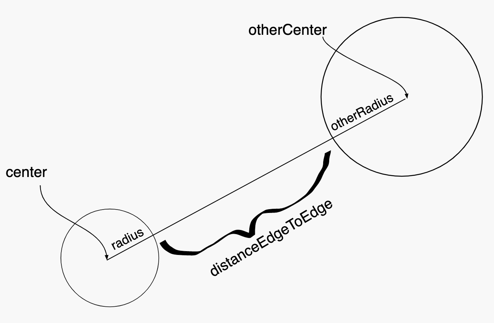

=====================
Assignment 8: Zombies: The Final OBJECTive
=====================

Assignment Setup
=====================

To create your repository go `here <https://classroom.github.com/a/O4Ack-0H>`_. Then follow the same accept/import process described in `the setup instructions <../Module0-Introduction/software.html>`_.

Zombies... The Final OBJECTive
=====================

In Assignment 4 we used the notion of “parallel arrays” to store details of the entities that we wanted to simulate. In Assignment 5 we created an actual simulation, but in order to make it manageable we refactored the work from Assignment 4 using Methods. Since we had ``boolean`` state (isZombie) and ``double`` state (x and y coordinates), we kept track of our entities in separate arrays. Further, since ,methods can only return a single value, we (somewhat awkwardly) were forced to create arrays and pass them into ``readEntities(in, areZombies, positions)``. Now that we’ve seen the concept of objects and inheritance, it makes more sense to store the individual data in an ``Entity`` base class. We can then forgo the arrays for a single array of entities stored in our ZombieSimulator.

In this installment of the zombie saga we will:

* Refactor our code to use an ``Entity`` base class with ``Zombie`` and ``Nonzombie`` subclasses.

* Use a collection of ``Entity`` objects - these can be either ``Zombies`` or ``Nonzombie`` objects, since both are ``Entity`` objects.

* Rather than having all entities move randomly, we’ll make our ``Zombies`` and ``Nonzombies`` behave somewhat intelligently.

* When a ``Nonzombie`` is touching a ``Zombie`` there’s a chance it will be consumed rather than always turn into a ``Zombie``.

Files
=====================

Your project includes a number of source files in the ``src`` folder:

* ``assignment8/DrawEntitiesDebugApp.java``: Rudimentary check on your Entity drawing.

* ``assignment8/Entity.java``: The ``Entity`` class. *You will need to complete this file*

* ``assignment8/EntityAndZombieSimulatorTestSuite.java``: Incomplete testing of your Entity and ZombieSimulator classes

* ``assignment8/Nonzombie.java``: The ``Nonzombie`` class. *You will need to complete this file*

* ``assignment8/Zombie.java``: The ``Zombie`` class. *You will need to complete this file*

* ``assignment8/ZombieSimulator.java``: The ``ZombieSimulator`` class. *You will need to complete this file*

Procedure & Recommended Workflow
=====================

Below is a recommended work-flow. You should expect to have to revisit the implementation of some methods as you experiment with different strategies.

Entity
=====================

Constructor and Instance Variables
----------------------------------

Your Entity constructor is passed the initial values of for the zombie state (``isZombie``), the speed, and the x and y coordinates. You should store these values in instance variables for later use. Some of these instance variables have already been created for you, you should create any additional instance variables that you need. You should also keep track of a radius for each entity. This is not specified as a parameter to the constructor. The initial radius value is left for you to choose. An Entity also needs to keep track of whether it is alive or not. Make sure that there is an instance variable for this purpose and also ensure that all Entities start out as alive when they are first constructed.

Is Zombie, X, and Y Accessors
----------------------------------

* Complete the ``isZombie()``, ``getX()``, and ``getY()`` methods.

* Run ``EntityAndZombieSimulatorTestSuite``. You should pass all cases in ``EntityConstructorTest`` before proceding.

Radius Getter and Setter
----------------------------------

* Complete ``getRadius()`` and ``setRadius(double d)`` methods.

* Run ``EntityAndZombieSimulatorTestSuite``. You should pass all cases in ``EntityRadiusTest`` before proceding. 

**Note**: if you are looking for a default radius value to start with, Assignment 5 used ``0.008``.

isAlive and wasConsumed
----------------------------------

* ``isAlive()`` is a getter that should return whether or not the current entity is alive

* ``wasConsumed()`` is a method that will be used to indicate that an ``Entity`` has been caught and eaten by a ``Zombie``. It should make it so that the ``Entity`` being consumed is no longer alive.

distanceCenterToPoint(xOther, yOther)
----------------------------------

* `Distance on Wolfram MathWorld <https://mathworld.wolfram.com/Distance.html>`_

* **Note**: the method ``distanceCenterToCenter(other)`` has been provided to you. It simply calls ``distanceCenterToPoint(xOther, yOther)`` with the center of the other Entity.

distanceEdgeToEdge(xOther, yOther, radiusOther)
----------------------------------

* **Question**: How can you leverage your implementation of ``distanceCenterToPoint(xOther, yOther)`` for this method?

* **Question**: How should you use the two radii (the this instance’s radius and the otherRadius) to calculate the edge-to-edge distance?

* **Note**: the method ``distanceEdgeToEdge(other)`` has been provided to you. It simply calls ``distanceEdgeToEdge(xOther, yOther, radiusOther)`` with the center and radius of the other Entity.

isTouching(xOther, yOther, radiusOther)
----------------------------------

* **Question**: How can you leverage your existing code to calculate if the circle centered at (``xOther``, ``yOther``) of ``radius`` overlaps with the bounding circle of this Entity?

* **Note**: the method ``isTouching(other)`` has been provided to you. It simply calls ``isTouching(xOther, yOther, radiusOther)`` with the center and radius of the other Entity.

moveAwayFrom(x, y, amount)
----------------------------------

* **Question**: How can you implement this method leveraging ``moveToward(x, y, amount)``?

Investigate Find Closest
----------------------------------

* A few convenience methods have been provided to you for finding the closest entity (which is not this itself) to this Entity. Variations include finding the closest zombie, the closest nonzombie, and the closest entity (independent of its state of undeadedness). Investigate these so that you know how to utilize them in your ``update(entities)`` method.

**Warning**: each of the find closest methods will return null if no Entity meets the specified constriaints. For example, if there are no remaining nonzombies and findClosestNonzombie(entities) is called ``null`` will be returned. You will need to handle this case gracefully since if you try to call a method on ``null`` a ``NullPointerException`` will be thrown.

checkBounds()
-------------

As we have seen in previous simulations, it is possible for entities to go off the edge of the screen. This method should check the x and y position of the entity and move them back onto the screen if they have gone off of the edge. You likely have code from a previous assignment that you can use for this part.

update(entities), draw()
----------------------------------

Notice that these methods don't do much - they aren't intended to be used, since these behaviors are different depending on whether the entity performing them is a ``Zombie`` or a ``Nonzombie``. Instead of using these methods, you will implement the specific behavior for Zombies and Nonzombies in their respective classes by overriding this method. In practice, since these methods are never used we would say that they are in fact **abstract**, a concept that will be covered in future CS courses (but not this one).

Zombie
=====================

Constructor and Instance Variables
----------------------------------

Since a ``Zombie`` is an ``Entity``, our main task here is to call the constructor of the base class using ``super()``. The ``Entity`` constructor has four parameters even though the ``Zombie`` constructor only has two - you will have to supply values for the missing two parameters. For the speed, you can use the given ``ZOMBIE_SPEED`` constant (which can be easily changed to adjust the speed of your nonzombies). 

consumeNonzombie()
------------------

This method will be used when ``this`` zombie has consumed an unfortunate human. The zombie's radius should increase to show that it is becoming bigger and stronger. Increase the zombie's radius by 20% every time this method is called, unless the zombie hits a maximum radius of 0.02.

draw()
------

This is the first method that you will overwrite from the ``Entity`` class. Instead of displaying everything in pink (as the base class specifies) include code here to display your zombies in a unique way so that you can distinguish them once the simulation is running.

**ALERT**: You should not use ``StdDraw.show()`` or StdDraw.clear()`` in this method, those methods are used to manage the overall animation in the ``ZombieSimulator`` class. This method is responsible for drawing a single zombie, and will likely involve setting the pen color and drawing a shape in the correct position.

update()
--------

**Repeated Warning**: each of the find closest methods will return ``null`` if no Entity meets the specified constriaints. For example, if there are no remaining nonzombies and findClosestNonzombie(entities) is called ``null`` will be returned. You will need to handle this case gracefully since if you try to call a method on ``null`` a ``NullPointerException`` will be thrown.

* The method will be passed a list of all current entities (this allows an entity to try to make a rational decision based on all other entities, like running away from a zombie).

* Zombies are hungry. They should intentionally (not randomly) move toward nonzombies.

* Make sure your zombies stay in bounds by using the ``checkBounds()`` method from the ``Entity`` class.

Remember to focus on the simulation of the ``this`` instance of ``Entity``. You should not concern yourself here with updating all of the ``entities``. You will undoubtedly inspect them via the findClosest methods, of course. However, keep in mind that it will be ``ZombieSimulator``’s responsibility to call update for each of its non-consumed entities.

Nonzombie
=====================
Constructor and Instance Variables
----------------------------------

Similar to what you did for ``Zombie``, call the super constructor with the appropriate parameters.

convert()
---------

When a nonzombie gets eaten, sometimes it may turn into a Zombie. This method should create and return a new ``Zombie`` object at the same position as ``this`` nonzombie to represent this conversion.

draw()
------

Place code here to specify how you want your nonzombies to be drawn.

update()
--------

**Repeated Warning**: each of the find closest methods will return ``null`` if no Entity meets the specified constriaints. For example, if there are no remaining nonzombies and findClosestNonzombie(entities) is called ``null`` will be returned. You will need to handle this case gracefully since if you try to call a method on ``null`` a ``NullPointerException`` will be thrown.

* Nonzombies don’t want to be infected. They should move in a way that reduces their chance of becoming a zombie. They could move such that they try to avoid populated areas, or avoid zombies, or they could believe there’s safety in numbers and try to approach other nonzombies.

* When a nonzombie touches a zombie it should there is a random chance that it will be consumed by the zombie.

    * 80% of the time the nonzombie should change its state to zombie at the same location and with the same size (recall the convert() method).

    * 20% of the time it is consumed by the zombie that is touching it (the closest if many are). The zombie that consumes it will increase in radius by 20% of the nonzombie’s radius up to a reasonable maximum size (e.g. 0.02). You should use the ``consume()`` method for this.
	
* The ``Entity`` that gets returned depends on the outcome: if the nonzombie remains untouched by zombies then you'll likely just return ``this`` however, in some cases you will need to return a ``Zombie`` instead.

Zombie Simulator
================

Constructor and Instance Variable(s)
----------------------------------

* The ZombieSimulator’s constructor should initialize an array of ``Entities`` for the given size.

getEntities()
----------------------------------

* Returns the current array of entities.

readEntities(ap)
----------------------------------

* reads a complete zombie simulation file as described in Assignment 4. Each read Entity should be added to this instance’s List of entities.

getZombieCount()
----------------------------------

* Returns the number of Entities in the current list of entities which are zombies.

getNonzombieCount()
----------------------------------

* **Question**: How can you implement this method leveraging ``getZombieCount()``?

draw()
----------------------------------

* A bare bones implementation has been provided to you. Feel free to come up with more creative presentations if you choose.

update()
----------------------------------

* Updating a ZombieSimulator largely defers to its Entities to each update. Put another way, each of the entities should have its update method called. Each Entity will need the complete list of active entities passed to it, so that it can properly simulate its update.

* Calling ``update(entities)`` on an Entity will return an ``Entity`` (which could be either a Zombie or Nonzombie) as a result of the update. Make sure that this ``Entity`` is properly stored in the array so that the simulation can continue.

main(args)
----------------------------------

* A bare bones implementation of a real-time simulation has been provided to you. Investigate this method and make any changes you need to improve your ZombieSimulator.

Assignment Requirements
=======================

Partial credit is possible and will be based on the number of unit tests that are passed and the degree to which you complete the required update strategies. For full credit:

* All unit tests should pass

* The ``ZombieSimulator`` should run.

  * It should repeatedly update entities

  * Your zombies should move, try to consume nonzombies, and occasionally increase in size after consuming a nonzombie up to a maximum size.

  * Nonzombies should be consumed by zombies after about 20% of run-ins and turn into zombies the other 80% of the time.

  * Your nonzombies should move and have some reasonable approach to survival (not just random motion all the time)

  * Animation should be reasonably smooth (nothing should jump to new locations on the screen)

  * As before, all entities must stay within the visible window (the unit square from (0,0) to (1,1))

Here’s an example run of one approach. Here nonzombies flee from other nonzombies (they think they will be safe in isolated areas). Zombies can “smell” nonzombies and relentlessly pursue the closest one:

.. raw:: html

  

    <video controls src="zombieObjectives1.mp4"></video>
  

Submitting your work
====================

To submit your work come to office hours or class on an “Assignment day” and sign up for a demo via `wustl-cse.help <https://wustl-cse.help/>`_.

