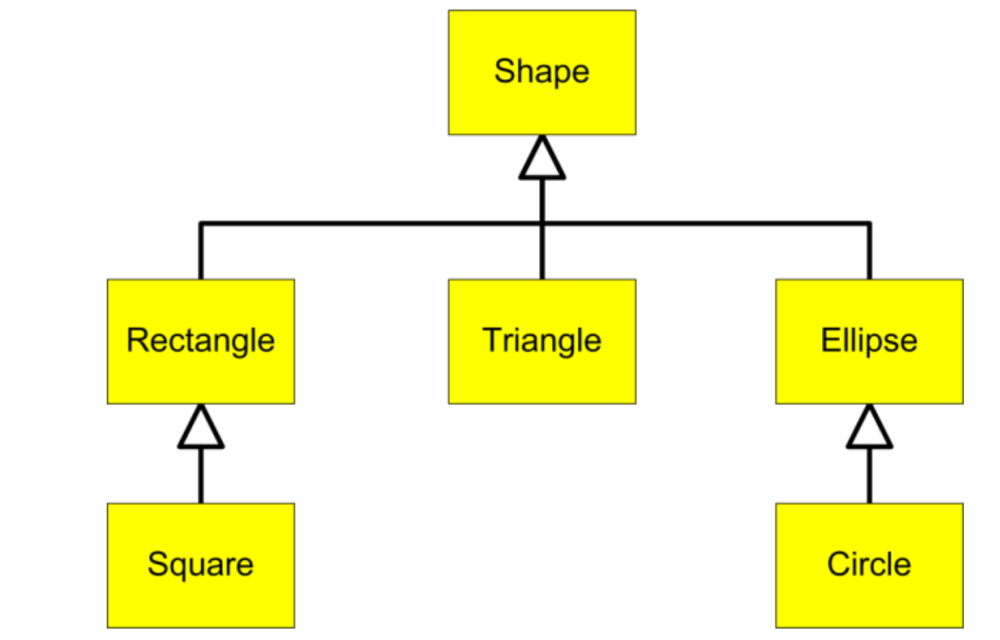

.. qnum::
   :prefix: 10-5-
   :start: 1
   
.. |CodingEx| image:: ../../_static/codingExercise.png
    :width: 30px
    :align: middle
    :alt: coding exercise
    
    
.. |Exercise| image:: ../../_static/exercise.png
    :width: 35
    :align: middle
    :alt: exercise
    
    
.. |Groupwork| image:: ../../_static/groupwork.png
    :width: 35
    :align: middle
    :alt: groupwork
    
Inheritance Hierarchies
===========================

If you have multiple subclasses that inherit from a superclass, you can form an **inheritance hierarchy**. Every subclass is-a or is a kind of the superclass. For example, here is an inheritance hierarchy of Shapes. Square is-a Rectangle and a subclass of Rectangle. Rectangle is-a Shape and a subclass of Shape. In Java, the class **Object** is at the top of hierarchy. Every class in Java inherits from Object and is-an Object. 

    Figure 1: An Inheritance Hierarchy of Shapes

One of the main reasons to use an inheritance hierarchy is that the 
instance variables and methods from a superclass are inherited and can be used in a subclass without rewriting or copying code.

.. shortanswer:: hierarchy1
   :optional:
   
   What variables and methods might be inherited from the superclass Shape in the inheritance hierarchy above?
   
.. shortanswer:: hierarchy2
   :optional:
   
   Can you make a 3 level inheritance hierarchy for living things on Earth?
   
Superclass References
----------------------

A superclass reference variable can hold an object of that superclass or of any of its subclasses. For example, a Shape reference variable can hold a Rectangle or Square object. (This is a type of **polymorphism** which will be defined in the next lesson).

.. code-block:: java 

    // The variables declared of type Shape can hold objects of its subclasses
    Shape s1 = new Shape();
    Shape s2 = new Rectangle();
    Shape s3 = new Square();

Notice that the opposite is not true. You cannot declare a variable of the subclass and put in a superclass object. For example, a Square reference cannot hold a Shape object because not all Shapes are Squares. The code below will give an "Incompatible types: Shape cannot be converted to Square" error (although you could use a type-cast to get it to be a (Square)).

.. code-block:: java 

    // A subclass variable cannot hold the superclass object!
    // A Square is-a Shape, but not all Shapes are Squares.
    // Square q = new Shape(); // ERROR!!
    
    
Why is using a superclass reference for subclass objects useful? Because now, we can write methods with parameters of type Shape or have arrays of type Shape and use them with any of its subclasses as seen in the next sections.

|Exercise| **Check your understanding**

.. mchoice:: qinherRef
   :practice: T
   :answer_a: Person p = new Person();
   :answer_b: Person p = new Student();
   :answer_c: Student s = new Student();
   :answer_d: Student s = new Person();
   :correct: d
   :feedback_a: This declares and creates an object of the same class Person.
   :feedback_b: This is allowed because a Student is-a Person.
   :feedback_c: This declares and creates an object of the same class Student.
   :feedback_d: This is not allowed because a Person is not always a Student. 

   A class Student inherits from the superclass Person. Which of the following assignment statements will give a compiler error?

Superclass Method Parameters 
----------------------------------

Another advantage of an inheritance hierarchy is that we can write methods with parameters of the superclass type and pass in subclass objects to them. For example, the print(Shape) method below could be called with many different Shape subclasses and work for Rectangles, Squares, etc.

.. code-block:: java 

    // This will work with all Shape subclasses (Squares, Rectangles, etc.) too
    public void print(Shape s)
    {
       ...
    }
 
|CodingEx| **Coding Exercise**

Notice that in the Tester class, the print method has a parameter of type Person, but it can be called with Student or Person objects in the main method. Which toString() method is called? It depends on whether a Person or Student is passed in at runtime. What would happen if you commented out the Student toString() method? Which one would be called now?
  
  Which toString() method is called? What would happen if you commented out the Student toString() method? Which one would be called now?
 
      

|Exercise| **Check your understanding**

.. mchoice:: qoo_4
   :practice: T
   :answer_a: V
   :answer_b: IV
   :answer_c: I and II
   :answer_d: I and III
   :answer_e: I only
   :correct: b
   :feedback_a: In fact, all of the reasons listed are valid. Subclasses can reuse object methods written for superclasses without code replication, subclasses can be stored in the same array when the array is declared to be of the parent type, and objects of subclasses can passed as arguments of the superclass type. All of which make writing code more streamlined.
   :feedback_b: All of these are valid reasons to use an inheritance hierarchy.
   :feedback_c: III is also valid. In some cases you might want to store objects of subclasses together in a single array declared to be of the parent type, and inheritance allows for this.
   :feedback_d: II is also valid. In some cases a single method is applicable for a number of subclasses, and inheritance allows you to pass objects of the subclasses to the same method if it takes an argument of the parent type, instead of writing individual methods for each subclass.
   :feedback_e: I and III are also valid, in some cases a single method is applicable for a number of subclasses, and inheritance allows you to pass all the subclasses to the same method instead of writing individual methods for each subclass and you might want to store subclasses together in a single array, and inheritance allows for this.
    
    Which of the following reasons for using an inheritance hierarchy are valid?
    I.   Object methods from a superclass can be used in a subclass without rewriting or copying code.
    II.  Objects from subclasses can be passed as arguments to a method that takes an argument of the parent type.
    III. Objects from subclasses can be stored in the same array of the parent type.
    IV.  All of the above
    V.   None of the above
    

    
Summary
--------

- An **inheritance hierarchy** of subclasses inheriting from superclasses can be formed with Object being the top of the hierarchy.

- When a class S "is-a" class T, T is referred to as a superclass, and S is referred to as a subclass.

- If S is a subclass of T, then a reference of type T can be used to refer to an object of type T or S. This is called polymorphism, defined more in the next lesson.

- Declaring references of type T, when S is a subclass of T, is useful in the declaring formal method parameters of type T, arrays of type T[], and ArrayList<T> of type T so that all the subclasses of T can also be used with these.