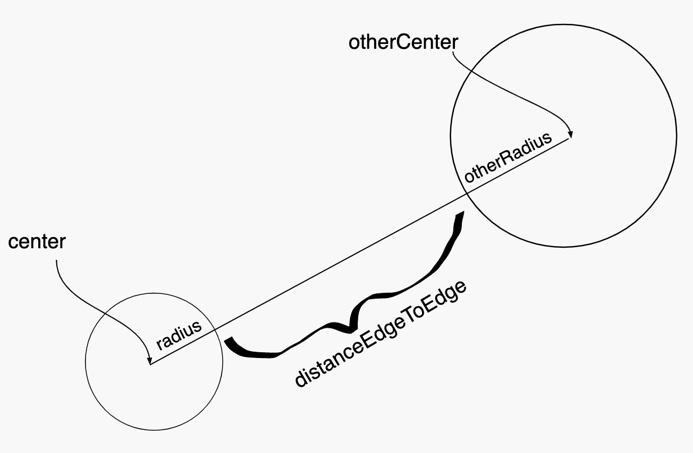

=====================
Module 8
=====================

.. Here is were you specify the content and order of your new book.

.. Each section heading (e.g. "SECTION 1: A Random Section") will be
   a heading in the table of contents. Source files that should be
   generated and included in that section should be placed on individual
   lines, with one line separating the first source filename and the
   :maxdepth: line.

.. Sources can also be included from subfolders of this directory.
   (e.g. "DataStructures/queues.rst").

Exercise : 8.25. Examples of a list
:::::::::::::::::::::::::::::::::::::::::::::::::::

You do not write code in this exercise. Instead, consider each numbered question below and write down some responses that come to mind. You are at this point quite new to lists, so take your time and try to think of the best responses you can.

To record your work here, create and edit a new Java class ``ThinkingAboutLists`` in the ``exercises8`` package of your ``exercises`` folder. You can enter the text in comments there.

1. What are some examples of lists? In the introductory video, I spoke about a list of books that I read this summer and a list of temperature readings. Those might be declared ast ``List<String>`` and ``List<Double>``, respectively. The ``String`` could represent the title of each book I read, and the ``Double`` could represent each temperature reading.

Think of possible applications of the other two types of lists covered in the video:

* ``List<Color>``

* ``List<Account>``

For each of the above, try to find an example where at least one of the following is true:

For each of the above, try to find an example where at least one of the following is true:

* The order of elements in the list is important.

* There can be duplicates in the list.

2. Suppose we spin a `Roulette <https://en.wikipedia.org/wiki/Roulette>`_ wheel some number of times, and we must report the numbers that show on the wheel when it stops. Note that:

* The same number may appear multiple times.

* The order of the numbers' appearance is important.

Thus, we need a ``List<?>``, but what type of element should be in this list?

3. Can you think of a problem where having ``List<Boolean>`` would be useful?

4. Suppose we have some kind of a ``List``. What kinds of operations might we want to perform on that ``List``?

Exercise : 8.33. Using List
:::::::::::::::::::::::::::::::::::::::::::::::::::

Let’s try using the code from the end of the video. If you get stuck, look at the solution video, but only as far as it takes you to get unstuck, then try going forward on your own again.

To get started, open the ``UsingLists`` class in the ``exercises8`` package of the ``exercises`` folder.

Some important points:

* We declare the list using the abstract type ``List``.

* We instantiate it using a concrete type, such as ``LinkedList`` or ``ArrayList``.

For now, use ``LinkedList``.

* IntelliJ will say it doesn’t know what those types are. You have to mouse-over the offensive code and allow IntelliJ to suggest what you should do.

The classes you want are found in ``java.util`` so be sure to choose those.

* The ``List`` needs a type parameter, which in this case should be ``String``.

* Using your list, add the following:

  * ``"open mouth"``

  * ``"insert food"``

  * ``"chew"``

  * ``"chew"``

  * ``"swallow"``

* Print the list and verify that it's right

* Add some more things to the list and print it again

* Delete one thing and print it again

Once you are done, change the implementation from ``LinkedList`` to ``ArrayList``, and verify that you see no difference in the program's behavior (this part is not on the video).

Exercise : 8.35. Investigate the Set ADT
:::::::::::::::::::::::::::::::::::::::::::::::::::

Often in designing or writing software, it helps to use code that others have written. We have done exactly that with the ``List`` interface and its ``LinkedList`` implementation.

In this exercise you will investigate the ``Set`` interface using `Javadoc <https://en.wikipedia.org/wiki/Javadoc>`_ documentation. You will then write code to use the ``Set`` interface via its ``HashSet`` implementation, and observe what happens with the ``eating`` example from the previous exercise.

You will no doubt find some of the documentation confusing, as it refers to concepts we have not studied. Nonetheless, browsing such documentation is commonplace at all levels when searching for code that may be of use as you develop software.

Try to skim over the confusing parts to pick up the essential parts of the documentation:

* What methods does this interface or class offer?

* What parameters do those methods need?

* What kind of return result can be expected?

The methods are listed alphabetically, which does not necessarily cover the most important methods first. Skim to get what you need.

1. Browse `this documentation <https://docs.oracle.com/en/java/javase/13/docs/api/java.base/java/util/Set.html>`_ for the ``Set`` interface.

   * Find methods that resemble those you used for ``List``.

Can you find the Javadoc documentation for the ``List`` interface on your own, using `Google <http://www.google.com/>`_? Such documentation is usually found by searching for the fully qualified class, as: ``java util list``.

2. Remind yourself of the differences between a ``Set`` and a ``List``:

   * Order is important in a ``List``. The elements of a ``Set`` occur in no particular order.

   * A ``List`` can have duplicates. Attempts to add an already present element to a ``Set`` do not succeed.

3. In the `documentation <https://docs.oracle.com/en/java/javase/13/docs/api/java.base/java/util/Set.html>`_, find the list of **All Known Implementing Classes**. All of these implement the ``Set`` interface, but:

   * The method of implementation will vary

   * The performance of the implementation will vary

   * Some implementations may *exceed* the **Set** interface by offering additional functionality.

4. Browse the documentation for ``HashSet``, an implementation of the ``Set`` interface.
   
5. Open the ``UsingSet`` class of the ``exercises8`` package in the ``exercises`` folder.

   * Copy and paste the code from ``UsingList``, but change the type of the collection
     * from List to Set
     * from ``LinkedList`` to ``HashSet``

Exercise : 8.73. List and Set of Point
:::::::::::::::::::::::::::::::::::::::::::::::::::

In this exercise, you use Eclipse to *auto-generate* useful parts of a class. Try this on your own, but as you need help, run the solution video only as far as necessary for you to move forward again on your own.

1. Find and open the ``Point`` class in the ``exercises8`` package of the ``exercises`` folder.
2. Based on the comment you see there concerning *has-a*, declare the instance variables for this class, calling them ``x`` and ``y``.
3. Auto-generate the constructor by choosing ``Source``, then ``Generate Constructor using Fields``, then select ``Constructor`` from the pop-up menu.
4. Choose the fields ``x`` and ``y``, and ``OK`` to generate the constructor.
5. These fields will be *immutable*, so edit the declarations for ``x`` and ``y`` and add the ``final`` attribute. This ensures that the values of ``x`` and ``y`` can be set only by the constructor.
6. Now use Eclipse to generate the *getters* for ``x`` and ``y``.
7. In the ``main()`` method, construct and print a ``Point`` or two and verify that things look good.
   
They should not look so good. When you print a ``Point``, you getan ugly and uninformative ``String``. To get something better, we must override the ``toString()`` method.

8. Use Eclipse similarly to generate a simple ``toString()`` method.

This, and the subsequent work below, is accomplished also via the ``Source`` menu.

9. OK we are ready to make a ``Set`` of some points. Put the following code in the ``main`` method:

::

   Set<Point> set = new HashSet<Point>();
   set.add(new Point(131, 132));
   set.add(new Point(131,132));
   System.out.println("Set has " + set);

| 

1. Recalling that sets should have no duplicates, you the output from the above code should show the set having the same point twice.

2. This is because Java is using its built-in notion of *equality*: are two objects exactly the same object (as in, the same reference in memory)?

3. We need to change this behavior, so read on.

10. Now let's use Eclipse to generate ``hashCode()`` and ``equals(Object other)`` methods.

You must pick the attributes (instance variable names) upon which you wish equality to be based.

11. Rerun your code and make sure that two ``Point`` objects with the same coordinates cannot both be contained in the same set.

**Further exploration**

1. What happens if ``hashCode()`` returns a random integer? Try:

::

   public int hashCode() {
      return (int)(Math.random()*100000);
   }

* What behavior do you see in the set?

* Why do you see that behavior?

The above code makes ``hashCode()`` *inconsistent*, breaking a portion of the contract concerning object equality.

2. What happens if ``hashCode()`` always returns the same result?

::

   public int hashCode() {
      return 0;
   }

* Does this work?

* What impact does the above ``hashCode()`` have on performance?

**Now try lists**

Go back and change the ``Set`` and ``HashSet`` of your code to use ``List`` and ``LinkedList``, respectively.

1. You should see duplicates. But that's OK for lists.

2. Intentionally break ``.equals(Object other)`` by returning ``false`` always.

What aspect of the contract does this break for \`.equals(Object other)?

3. What behavior do you see?

Adding to a list does not consult ``.equals(Other object)``, so you should see no difference.

4. Now ask whether the list ``.contains(new Point(131,132))``.

Nothing should be found in the list with the broken ``.equals(Object other)``.

5. Revert the code back to its proper ``hashCode`` and ``.equals(Object other)``.

Exercise : 8.75. Design StockHolding from a user story
:::::::::::::::::::::::::::::::::::::::::::::::::::::::::::::::::

OK now you are pretty much on your own:

* I will tell you a story.

* You will design an object.

* Create this object from scratch in the ``exercises8`` package of the ``exercises`` folder.

As usual, if stuck, consult portions of the solutions video.

**The story**

A ``StockHolding`` object:

``has-a``

* immutable ``String`` identifying its name (e.g., ``IBM``)

* immutable ``String`` identifying its owner (e.g., ``Ari``)

* number of share (``int``) that can change over time

* price per share (``int``) that can change over time

``and it needs:``

* A constructor

* A ``toString()``

* ``hashCode()`` and ``equals(Object other)``

You should generate the above automatically, not by hand!

Exercise : 8.85. Application of the interface
:::::::::::::::::::::::::::::::::::::::::::::::::::::::::::::::::

Do your work in the ``exercises8`` package of the ``exercises`` folder.

**The story**

Define a ``PersonalProperty`` object:

``has-a``

* immutable ``int`` for its initial value

* immutable ``int`` representing the years since its initial value was established

``and it needs:``

* A constructor that takes in values for the two instance variables

* A method ``int depreciatedValue()`` that returns the value of the property according to the formula:

``initialValue`` * 0.80 \ :sup:`yearsOld`\

* A ``toString()``

**Your task**

After defining the above class, adapt it to implement the ``Valuable`` interface:

::

   public interface Valuable {
      public int getLiquidValue();
   }

Studio 8: Objects, Equality, ADTs, and Collections
:::::::::::::::::::::::::::::::::::::::::::::::::::::::::::::::::

Studio activities should not be started before class! Come to the session and work on the activity with other students!

* `Studio Setup and Procedure`_

* `Overview`_

  * `Part 1; Objects, Equality, and Composition`_

* `Demo`_

.. _Studio Setup and Procedure:

**Studio Setup and Procedure**

* Form a group of 2-3 students and find a TA or instructor to work with.

* All but one member of your group should have this web page open so you can follow along and see the instructions as you work.

* Plan to work on one computer (using Eclipse).

  * Initially, one of you will be in charge of typing at that computer.

  * Throughout the studio you should trade who is in charge of the keyboard.

**READ THE FOLLOWING FULLY BEFORE PROCEEDING**

1. Have **one person** in your group create a new team by `Logo <https://classroom.github.com/g/n3TfYnGC>`_ here and going to the ``OR Create a new team`` box at the bottom of the page. The team name should include the last names of all your group members. For example, if Xia and Smith are working together, the team name should be something like “XiaSmith”.

2. **After the team is created**, all other members of your team should click on the same link and follow the instructions to join the team.

   1. **Be careful to join the right team!** You won’t be able to change teams yourself and will have to contact instructors if there’s a problem.

   2. **Be sure everyone else joins the team!** If grades don’t get entered correctly we will use the team to help verify credit for a particular studio.

3. Finally, one person should import the studio repository into Eclipse, as described in `Assignment 0’s Add the assignment to Eclipse <https://classes.engineering.wustl.edu/2021/fall/cse131//modules/0/assignment#4-add-the-assignment-to-eclipse>`_

   * All team members will have access to the work pushed to GitHub. Be sure to ``Commit and Push`` at the end of the day so everyone can refer back to the work later as needed.

.. _Overview:

**Overview**

.. _Part 1; Objects, Equality, and Composition:

**Part 1; Objects, Equality, and Composition**

Design and implement the classes described based on the story given. Follow the instructions carefully. Don’t rush ahead until you have successfully completed the specified work.

1. Read the following:

   * A ``Date`` has-a month, day, and year. It also has-a field that indicates whether the date is a holiday or not. (To simplify your work you may assume that all months have 31 days)

   * A ``Time`` has-an hour (0 to 23) and a minute (0 to 59). It also has-a field that indicates whether the time should be shown in 12- or 24-hour format (this dictates how ``toString()`` behaves) .

   * You can assume that only legitimate input values are specified for anything your constructor requires.

   * Think carefully about what your constructor for ``Time`` should retain. Assume all times are in 24-hour format.

     * What is the essence of such a Time object?

     * What instance variables are required to capture its essence?

2. Create JavaDoc comments for your constructors that explain the expected parameter values.

3. Now implement ``toString()`` for each of these classes, returning a ``String`` that is appropriately descriptive.

4. Create a few instances and print them out in the ``main()`` method of the each class.

5. We next equip our two classes with the ability to tell whether they do or do not *equal* a given ``Object``.

For each of the two classes, let’s make Eclipse generate the ``equals()`` and ``hashCode()`` methods.

1. While editing each class, go to the ``Source`` menu and select ``Generate hashCode() and equals()...``

2. You are presented with a menu of instance variables to use for ``equals()`` and ``hashCode()``.

This is an important step. Decide *which* of the instance variables (fields) should be used to compare two objects of this kind.

These classes were specified such that **not all** of the fields are relevant for this comparison. Talk this over, make your choices, and then….

1. Click ``Generate``

2. Take a look at the code that is generated. Parts of it may not make sense, but there should be some familiar parts too.

* ``hashCode()`` is a way to assign an integer to a complex object. Hash Codes are used for a variety of important things. One of the requirements for them to work is that any items that are considered equal (via ``equals()``) have the same ``hashCode()`` value. This requirement only goes in the direction stated, so one possible legal implementation is simply:

::

   public int hashCode() {
      return 0;
   }

However, you can see that the code Eclipse generated is much more complicated than that.

For now, imagine that you have before you lots of lockers, each labeled with an integer. Think of ``hashCode()`` as returning an integer that represents the only locker in which this object could be found. Thus, if you want to see if the object exists in all of the lockers, you really need only check one locker.

Convince yourself that if two objects of the same type (for example, ``Date``) equal each other, then their ``hashCode()`` values are the same as computed by the Eclipse-generated code.

* ``equals(Object obj)``: With regard to the code automatically generated for ``equals(Object obj)``, the `contract in Java for equals <https://docs.oracle.com/en/java/javase/13/docs/api/java.base/java/lang/Object.html#equals(java.lang.Object)>`_ includes the following; read over the code and convince yourselves that the code enacts the proper contract:

  * If ``this`` and ``obj`` are physically the same object, then the result should be ``true``.

  * No instantiated object equals the ``null`` reference. The ``this`` reference is always to an actually instantiated object.

  * If ``this`` and ``obj`` are objects of different types, then the answer must be ``false``.

  * If none of the above rules applies, then equality can be based on any consistent comparison of any subset of the objects’ fields.

6. Instantiate some ``Date`` and ``Time`` objects (several of each) and ensure that they compare properly to each other.

Remember to use ``a.equals(b)`` to see if ``a`` and ``b`` equal each other! If you use ``==``, the comparison is restricted to whether the two objects are physically the same: the ``equals(Object obj)`` method is not run for that comparison.

7. Let’s now make some lists and sets of the objects we have created so far. We’ll focus on ``Date``.

   1. In the ``main`` method of each class you should already be creating and comparing instances of your objects.

   2. After you have instantiated 5 objects create a ``List`` of such objects by using the following code:

::
   
    LinkedList<Date> list = new LinkedList<Date>();

The angle bracket notation is used to specify parametric types. It may help to read the above line of code as:

Instantiate a new linked list of Date objects and assign that object to the variable named list.

You may have to use Eclipse suggestions to import the proper classes, which will come from the ``java.util`` package.

8. What can we do with a `LinkedList <https://docs.oracle.com/en/java/javase/13/docs/api/java.base/java/util/LinkedList.html>`_ object? Click on the link in the sentence before this one and check out the API.

Note that in the documentation, ``E`` refers to the type of element in the list you construct. In this running example, that would be a ``Date`` object.

9. Add some of your ``Date`` objects to the ``list`` list and print it out when you are done.

To print it you need only say:

::

   System.out.println(list);

10. Let’s see what happens when we add two ``Date`` objects to the list that ``equal`` each other:

::

   Date d1 = new Date(...stuff your constructor needs);
   Date d2 = new Date(...same info as above, so these will equal each other);
   list.add(d1);
   list.add(d2);
   list.add(d1);
   System.out.println(list);

What do you see? Does the same date appear three times in the list?

11. Let’s do the same thing but this time with a ``HashSet``. After the code you have written so far, add:

::

   HashSet<Date> set = new HashSet<Date>();
   set.add(d1);
   set.add(d2);
   set.add(d1);
   System.out.println(set);

Do you you see multiple occurrences of equal ``Date`` objects in the set?

**Based on your observations, what is the main difference between sets and lists?**

12. **Show your work to a TA.**

The story continues: Create an ``Appointment`` class. An ``Appointment`` has-a ``Date`` and a ``Time``.

1. Design and implement an ``Appointment`` object in the ``src`` folder.

2. Just as you did with ``Date`` and ``Time``, use Eclipse to generate the ``hashCode()`` and ``equals(Object obj)``. You should base these on equality of the contained ``Date`` and ``Time`` references.

3. Read over the code Eclipse generates. Note how it *delegates* equality to the contained objects, in which you have previously defined how you want equality treated for objects of those types.

4. Using the ``main()`` in your ``Appointment`` class, create some instances of ``Appointment`` objects using ``Date`` and ``Time`` objects.

5. In your opinion, what other *has-as* should an ``Appointment`` have?

Design a ``Calendar`` object in terms of a collection of ``Appointments``.

::

   * Should you use a list or a set?
   * What methods should your `Calendar` object offer?

1. Try to implement and test the methods of your ``Calendar`` object.

2. Let’s add code so that a ``Time`` object offers the method ``boolean isEarlierThan(Time other)`` that returns whether ``this`` ``Time`` is earlier than the ``other`` ``Time``, assuming the two occur on the same day.

3. Likewise, a ``Date`` offers the method ``boolean isEarlierThan(Date other)``

Implement and test these two methods.

At this point, if implementation of these methods is difficult, revisit the way you specify and accept information for these classes. You are free to design them to make your life easier.

4. Suppose we would like to offer a method common to both ``Date`` and ``Time`` that indicates whether you are working on the specified date or at the specified time. Create an interface called ``Working`` with the single method:

::

   public boolean amWorking();

5. Make both ``Date`` and ``Time`` implement that interface.

You can be creative in terms of when you decide you are working, but here is a suggestion:

* For ``Time``, assume you are working between 9 AM and 5 PM

* For ``Date``, assume you are working on even-numbered dates

6. Create a list of ``Working`` objects and add up the number of those objects that indicate that you are working.

7. **Show your work to a TA.**

.. _Demo:

**Demo**

**Commit and Push** your work. Be sure that any file you worked on is updated on `GitHub <https://github.com/>`_.

To get participation credit for your work talk to the TA you’ve been working with and complete the demo/review process. Be prepared to show them the work that you have done and answer their questions about it!

*Before leaving check that everyone in your group has a grade recorded in Canvas!*

Assignment 8: Zombies: The Final OBJECTive
:::::::::::::::::::::::::::::::::::::::::::::::::::::::::::::::::

* `Assignment Setup`_
  
* `Zombies... The Final OBJECTive`_
  
* `Files`_

* `Watch this video on Real Time Animation`_

* `Procedure & Recommended Workflow`_

  * `Entity`_
  
    * `Constructor and Instance Variables`_
    
    * `Is Zombie, X, and Y Accessors`_
    
    * `Radius Accessor`_

    * `draw() description`_

    * `Simulation (Update) Support`_

      * `distanceCenterToPoint(xOther, yOther)`_

      * `distanceEdgeToEdge(xOther, yOther, radiusOther)`_

      * `isTouching(xOther, yOther, radiusOther)`_

      * `moveToward(x, y, amount)`_

      * `moveAwayFrom(x, y, amount)`_

      * `Investigate Find Closest`_

      * `update(entities, deltaTime)`_

* `Zombie Simulator`_

  * `Constructor and Instance Variable(s)`_

  * `getEntities()`_

  * `readEntities(ap)`_
  
  * `getZombieCount()`_

  * `getNonzombieCount()`_

  * `draw()`_

  * `update(deltaTime)`_

  * `main(args)`_

* `Revisit Entity update(entities, deltaTime)`_

* `Assignment Requirements`_

* `Submitting your work`_

.. _Assignment Setup:

**Assignment Setup**

To create your repository go `here <https://classroom.github.com/a/DyBPQLgu>`__. Then follow the same accept/import process described in `Assignment 0 <https://classes.engineering.wustl.edu/2021/fall/cse131//modules/0/assignment>`_.

.. _Zombies... The Final OBJECTive:

**Zombies... The Final OBJECTive**

In `Assignment 4 <https://classes.engineering.wustl.edu/2021/fall/cse131//modules/4/assignment>`_ we used the notion of “parallel arrays” to store details of the entities that we wanted to simulate. In `Assignment 5 <https://classes.engineering.wustl.edu/2021/fall/cse131//modules/5/assignment>`_ we created an actual simulation, but in order to make it manageable we refactored the work from Assignment 4 using Methods. Since we had ``boolean`` state (isZombie) and ``double`` state (x and y coordinates), we kept track of our entities in separate arrays. Further, since ,methods can only return a single value, we (somewhat awkwardly) were forced to create arrays and pass them into ``readEntities(ap, areZombies, positions)``. Now that we’ve seen the concept of an actual Abstract Data Type (ADT), it makes more sense to store the individual data in an ``Entity`` class. We can then forgo the arrays for a single ``List<Entity>`` stored in our ZombieSimulator.

In this installment of the zombie saga we will:

* Refactor our code to use an ``Entity`` class.

* Use a collection of ``Entity`` objects (a type of ``List`` rather than an array).

* Rather than having all entities move randomly, we’ll make our ``Zombies`` and ``Nonzombies`` behave somewhat intelligently.

* When a ``Nonzombie`` is touching a ``Zombie`` there’s a chance it will be consumed (one fewer entity) rather than always turn into a ``Zombie``.

.. _Files:

**Files**

Your project includes a number of source files in the ``src`` folder:

* ``assignment8/DrawEntitiesDebugApp.java``: Rudimentary check on your Entity drawing.

* ``assignment8/Entity.java``: The ``Entity`` class. *You will need to complete this file*

* ``assignment8/EntityAndZombieSimulatorTestSuite.java``: Incomplete testing of your Entity and ZombieSimulator classes

* ``assignment8/ZombieSimulator.java``: The ``ZombieSimulator`` class. *You will need to complete this file*

.. _Watch this video on Real Time Animation:

**Watch this video on Real Time Animation**

.. youtube:: nhDt5HVOzVM

In the video above, Prof. Cosgrove explains how to build a real-time animation. Among the topics covered include the ``deltaTime`` parameter which you are often asked to use in your methods.

.. _Procedure & Recommended Workflow:

**Procedure & Recommended Workflow**

Below is a recommended work-flow. You should expect to have to revisit the implementation of some methods as you experiment with different strategies.

.. _Entity:

**Entity**

.. _Constructor and Instance Variables:

**Constructor and Instance Variables**

Your Entity constructor is passed the initial values of for the zombie state (``isZombie``) and the x and y coordinates. You should store these values in instance variables for later use. You should also keep track of a radius for each entity. This is not specified as a parameter to the constructor. The initial radius value is left for you to choose.

**Note**: You should expect to revisit this step when different evasion and/or hunting stratgies call upon further state to be stored.

.. _Is Zombie, X, and Y Accessors:

**Is Zombie, X, and Y Accessors**

* Complete the ``isZombie()``, ``getX()``, and ``getY()`` methods.

* Run ``EntityAndZombieSimulatorTestSuite``. You should pass all cases in ``EntityConstructorTest`` before proceding.

.. _Radius Accessor:

**Radius Accessor**

* Complete ``getRadius()`` method.

* Run ``EntityAndZombieSimulatorTestSuite``. You should pass all cases in ``EntityRadiusTest`` before proceding. **Note**: ``EntityRadiusTest`` is extremely lenient in what it deems passing. Since radius selection is left to you, it merely checks that ``getRadius()`` returns a number ``> 0.0``. As always, take passing unit tests `with a grain of salt <https://en.wikipedia.org/wiki/Grain_of_salt>`_. Especially on this assignment, where success is measured by a compelling simulation.

**Note**: if you are looking for a default radius value to start with, Assignment 5 used ``0.008``.

.. _draw description():

**draw() description**

**Warning**: each instance of ``Entity`` will have its ``draw()`` method called from ``ZombieSimulator``. The ZombieSimulator will be responsible for calling ``StdDraw.clear()`` and ``StdDraw.show()``. Entities should **NOT** call StdDraw.clear() or StdDraw.show() from its draw() method. If an Entity were to StdDraw.clear() in its draw() method it would erase the previously drawn Entities! If an Entity were to StdDraw.show() in its draw() method it would unnecessarily slow things down.

* Entities should be able to draw themselves based on their state. Complete the ``draw()`` method in each class. You can start with how we have drawn them in the past: ``Zombies`` as red dots and ``Nonzombies`` as black dots. Feel free to come up with more creative presentations if you choose.

* Run ``DrawEntitiesDebugApp`` as a Java Program.

  * Feel free to temporarily increase your default radius so you can better check your ``draw()`` method.

  * At some point, ``DrawEntitiesDebugApp`` will prompt you if you want to “Continue to ZombieSimulator?” Expect to return to this debug app later when ``ZombieSimulator`` drawEntities() is completed.

.. youtube:: VvWh35Zj8nM

.. _Simulation (Update) Support:

**Simulation (Update) Support**

.. _distanceCenterToPoint(xOther, yOther):

**distanceCenterToPoint(xOther, yOther)**

.. image:: distanceCenterToPoint.png
  :alt: diagram of what distanceCenterToPoint measures
  :width: 550
  :height: 430
  :align: center

* `Distance on Wolfram MathWorld <https://mathworld.wolfram.com/Distance.html>`_

* **Note**: the method ``distanceCenterToCenter(other)`` has been provided to you. It simply calls ``distanceCenterToPoint(xOther, yOther)`` with the center of the other Entity.

.. _distanceEdgeToEdge(xOther, yOther, radiusOther):

**distanceEdgeToEdge(xOther, yOther, radiusOther)**

* **Question**: How can you leverage your implementation of ``distanceCenterToPoint(xOther, yOther)`` for this method?

* **Question**: How should you use the two radii (the this instance’s radius and the otherRadius) to calculate the edge-to-edge distance?

* **Note**: the method ``distanceEdgeToEdge(other)`` has been provided to you. It simply calls ``distanceEdgeToEdge(xOther, yOther, radiusOther)`` with the center and radius of the other Entity.

.. _isTouching(xOther, yOther, radiusOther):

**isTouching(xOther, yOther, radiusOther)**

* **Question**: How can you leverage your existing code to calculate if the circle centered at (``xOther``, ``yOther``) of ``radius`` overlaps with the bounding circle of this Entity?

* **Note**: the method ``isTouching(other)`` has been provided to you. It simply calls ``isTouching(xOther, yOther, radiusOther)`` with the center and radius of the other Entity.

.. _moveToward(x, y, amount):

**moveToward(x, y, amount)**

* **Note**: This code is mostly provided to you. You should simply need to delete the Runtime exception and uncomment the lines which update the x and y coordinates of this Entity. If you named your instance variables something other than x and y, be sure to update them instead.

::

   public void moveToward(double xOther, double yOther, double amount) {
      double xVector = xOther - getX();
      double yVector = yOther - getY();
      double angle = Math.atan2(yVector, xVector);
      double xAmount = amount * Math.cos(angle);
      double yAmount = amount * Math.sin(angle);
      throw new RuntimeException(
         "\nRemove this RuntimeException and uncomment the lines below.\nIf you named your x and y coordinate instance variables something other than x and y, update the lines to use those instance variables.");
      // this.x += xAmount;
      // this.y += yAmount;
   }

.. youtube:: 5mkiddBiTxM

.. _moveAwayFrom(x, y, amount):

**moveAwayFrom(x, y, amount)**

* **Question**: How can you implement this method leveraging ``moveToward(x, y, amount)``?

.. _Investigate Find Closest:

**Investigate Find Closest**

* A few convenience methods have been provided to you for finding the closest entity (which is not this itself) to this Entity. Variations include finding the closest zombie, the closest nonzombie, and the closest entity (independent of its state of undeadedness). Investigate these so that you know how to utilize them in your ``update(entities, deltaTime)`` method.

**Warning**: each of the find closest methods will return null if no Entity meets the specified constriaints. For example, if there are no remaining nonzombies and findClosestNonzombie(entities) is called ``null`` will be returned. You will need to handle this case gracefully since if you try to call a method on ``null`` a ``NullPointerException`` will be thrown.

.. _update(entities, deltaTime):

**update(entities, deltaTime)**

**ALERT**: a detailed description of the requirements for this method are below in Revisit Entity update(entities, deltaTime)

* When ``update(entities, deltaTime)`` is called on a particular Entity (undoubtedly from the ``ZombieSimulator``), the ``Entity`` should simulate how it (that is: ``this``) fares in this round of the simulation based on its state (that is: the values of its instance variables).

* The ``entities`` parameter holds the other ``Entity`` instances (both zombies and nonzombies) and undoubtedly ``this``. Expect to pass this parameter to one or more of the findClosest methods when deciding how ``this`` should simulate.

* This should be the most compelling and challenging method to implement. To reasonably check its performance you will most likely need to complete ``ZombieSimulator`` first.

* Expect to return to this method when you have reached ``ZombieSimulator``’s ``update(deltaTime) method``.

**Repeated Warning**: each of the find closest methods will return ``null`` if no Entity meets the specified constraints. For example, if there are no remaining nonzombies and findClosestNonzombie(entities) is called ``null`` will be returned. You will need to handle this case gracefully since if you try to call a method on ``null`` a ``NullPointerException`` will be thrown.

**Warning**: remember to focus on the simulation of the ``this`` instance of ``Entity``. You should not concern yourself here with updating all of the ``entities``. You will undoubtedly inspect them via the findClosest methods, of course. However, keep in mind that it will be ``ZombieSimulator``’s responsibility to call update for each of its non-consumed entities.

**Spring 2021 Warning:** An exception to the “focus on the simulation of the ``this`` instance of ``Entity``” advice is that you will need to update the radius of another ``Entity`` instance if it consumes ``this`` instance.

**ALERT**: a detailed description of the requirements for this method are below in the Revisit Entity update(entities, deltaTime) section

.. _Zombie Simulator:

**Zombie Simulator**

.. _Constructor and Instance Variable(s):

**Constructor and Instance Variable(s)**

* The ZombieSimulator’s default constructor (a constructor with no given parameters) should initialize an instance variable with an empty List of Entities.

.. _getEntities():

**getEntities()**

* Returns the current list of entities.

.. _readEntities(ap):

**readEntities(ap)**

* reads a complete zombie simulation file as described in Assignment 4. Each read Entity should be added to this instance’s List of entities.

.. _getZombieCount():

**getZombieCount()**

* Returns the number of Entities in the current list of entities which are zombies.

.. _getNonzombieCount():

**getNonzombieCount()**

* **Question**: How can you implement this method leveraging ``getZombieCount()``?

.. _draw():

**draw()**

* A bare bones implementation has been provided to you. Feel free to come up with more creative presentations if you choose.

* Run ``DrawEntitiesDebugApp`` as a Java Program.

  * Feel free to temporarily increase your default radius so you can better check your ``draw()`` method.

  * Both the Entity and Zombie Simulator draw methods should look good at this point.

.. _update(deltaTime):

**update(deltaTime)**

* Updating a ZombieSimulator largely defers to its active (not yet consumed) Entities to each update. Put another way, each of the active entities should have its update method called. Each Entity will need the complete list of active entities passed to it, so that it can properly simulate its update. The ``deltaTime`` parameter should simply be passed along unchanged to each Entity.

* Calling ``update(entities, deltaTime)`` on an Entity will return whether it is to be active for the next round of the simulation (``true`` if active, ``false`` if consumed). While it is possible to `remove <https://docs.oracle.com/javase/8/docs/api/java/util/Iterator.html#remove-->`_ elements from a List while `iterating <https://docs.oracle.com/javase/8/docs/api/java/util/List.html#iterator-->`_ over it, it is more approachable to (and highly encouraged that you) simply create a new list of the not-consumed entities, and assign it to be the new active entities for the next round.

.. _main(args):

**main(args)**

* A bare bones implementation of a real-time simulation has been provided to you. Investigate this method and make any changes you need to improve your ZombieSimulator.

.. _Revisit Entity update(entities, deltaTime):

**Revisit Entity update(entities, deltaTime)**

**Repeated Warning**: each of the find closest methods will return ``null`` if no Entity meets the specified constriaints. For example, if there are no remaining nonzombies and findClosestNonzombie(entities) is called ``null`` will be returned. You will need to handle this case gracefully since if you try to call a method on ``null`` a ``NullPointerException`` will be thrown.

* After completing all the ``NotYetImplemented`` items in ``ZombieSimulator`` and ``Entity`` and passing all the unit tests you should be in a good position to build a compelling simulation. This will require that you program your entities to do something interesting.

* Perhaps, start with the random motion that you used in Lab 5.

* The method will be passed a list of all current entities (this allows an entity to try to make a rational decision based on all other entities, like running away from a zombie).

* The method should return ``true`` if this Entity should remain active (zombie or nonzombie) for the next round of the simulation, ``false`` if consumed.

* Now that we have a working simulation it’s time to make it more realistic. You should develop different, but rational strategies to update both zombies and nonzombies.

* Here are some requirements:

  * When a nonzombie touches a zombie it should there is a random chance that it will be consumed by the zombie.

    * 80% of the time the nonzombie should change its state to zombie at the same location and with the same size.

    * 20% of the time it is consumed by the zombie that is touching it (the closest if many are). The zombie that consumes it will increase in radius by 20% of the nonzombie’s radius up to a reasonable maximum size (e.g. 0.02).

  * Zombies are hungry. There should be circumstances where they intentionally (not randomly) move toward nonzombies.

  * Nonzombies don’t want to be infected. There should be circumstances where they move in a way that reduces their chance of becoming a zombie. They could move such that they try to avoid populated areas, or avoid zombies, or they could believe there’s safety in numbers and try to approach other nonzombies.

  * ``Entity`` movement should be fluid. They should never appear at unusual locations. (Moving an ``Entity`` by less than 1 radius usually achieves this effect)

  * You are encouraged to do more elaborate approaches or minor variations on the above to see how they impact the simulation (try to have fun running experiments).

.. _Assignment Requirements:

**Assignment Requirements**

Partial credit is possible and will be based on the number of unit tests that are passed and the degree to which you complete the required update strategies. For full credit:

* All unit tests should pass

* The ``ZombieSimulator`` should run.

  * It should repeatedly update entities

  * Your zombies should move, try to consume nonzombies, and occasionally increase in size after consuming a nonzombie up to a maximum size.

  * Nonzombies should be consumed by zombies after about 20% of run-ins and turn into zombies the other 80% of the time.

  * Your nonzombies should move and have some reasonable approach to survival (not just random motion all the time)

  * Animation should be reasonably smooth (nothing should jump to new locations on the screen)

  * As before, all entities must stay within the visible window (the unit square from (0,0) to (1,1))

Here’s an example run of one approach. Here nonzombies flee from other nonzombies (they think they will be safe in isolated areas). Zombies can “smell” nonzombies and relentlessly pursue the closest one:

.. raw:: html

  

    <video controls src="zombieObjectives1.mp4"></video>
  

.. _Submitting your work:

**Submitting your work**

To submit your work come to office hours or class on an “Assignment day” and sign up for a demo via `wustl-cse.help <https://wustl-cse.help/>`_.

